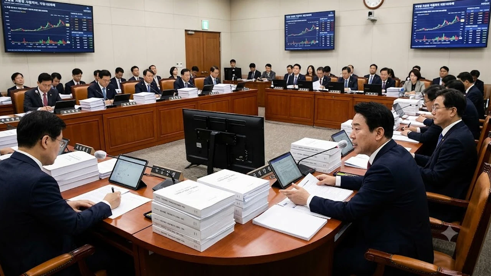

2026년 10월 국회 국정감사장이 열리자마자 투자자들의 이목이 쏠린 쟁점은 단연 **가상자산 과세 유예** 여부입니다. 당초 예정된 일정대로 2027년 1월 1일부터 코인 매매 차익에 대해 22% 소득세를 매길지, 아니면 추가 연기안을 통과시킬지를 두고 여야가 정면충돌했습니다. 온체인 거래 증빙 인프라가 미흡한 상황에서 성급하게 과세를 강행하면 2030 청년층의 자산 형성을 가로막는다는 반발과 소득 있는 곳에 세금 있다는 조세 원칙론이 팽팽하게 맞서는 국면입니다.

## 2026 국감 격돌: 가상자산 과세 유예 vs 원안 시행 전말

### 여야 국감 쟁점: 3차 유예 법안과 야당 강행론의 충돌
국회 재정경제기획위원회 국정감사에서 국민의힘은 가상자산 소득세 시행 시점을 2028년 이후로 미루는 소득세법 개정안을 당론 수준으로 꺼내 들었습니다. 이미 두 차례 미뤄진 법안을 재차 유예하려는 배경에는 과세 인프라가 여전히 온전치 못하다는 현실적 판단이 깔려 있습니다. 

반면 더불어민주당은 이미 확정된 사안을 3차례나 유예하는 행위는 조세 형평성을 무너뜨리는 포퓰리즘이라며 2027년 1월 원안 시행을 고수했습니다. 의석 구조상 야당 동의 없이는 개정안 통과가 불가능해 시장 참여자들의 불안감이 극에 달했습니다.

### 정부 공식 입장: 기재부·금융위의 과세 인프라 준비 실태
기획재정부와 금융위원회는 행정적 준비 자체는 일정표대로 진행 중이라고 답변했으나 현장의 허점을 완전히 지우지 못했습니다. 국감장에서는 탈중앙화 거래소(DEX) 및 개인 콜드월렛 간 거래를 국세청 전산망에 실시간 연계할 전산망 표준화 작업이 60% 수준에 머물러 있다는 사실이 드러났습니다.

> "취득가액 입증 체계가 갖춰지지 않은 채 세금부터 징수하면 납세자와 과세당국 간의 행정소송 대란을 피할 수 없다."

이처럼 전산망 결함을 근거로 정부 실무진 내부에서도 징수 유예가 현실적 대안이라는 기류가 흘러나왔지만, 정책 신뢰도 훼손이라는 부담 탓에 명확한 결론을 내리지 못하고 있습니다.

### 해외 주요국 가상자산 과세 모델과의 정밀 비교
미국은 가상자산을 자본자산으로 분류해 1년 이상 보유할 경우 0~20% 우대 세율을 적용하고 연간 3,000달러까지 손실공제를 허용합니다. 독일은 1년 이상 장기 보유한 코인에 대해 매매 차익 전액을 비과세 처리해 장기 보유를 유도합니다. 

이와 달리 한국의 개정안은 보유 기간 구분 없이 기타소득으로 묶어 단일세율 20%(지방세 포함 22%)를 부과하고 손실이월 공제조차 인정하지 않는 구조입니다. 글로벌 스탠더드와 동떨어진 징벌적 세제라는 지적이 쏟아지는 이유입니다.

## 코인 세금 계산 시뮬레이션과 숨겨진 함정

### 250만 원 기본공제 적용 시 실질 세부담 비교 분석
현행 소득세법 원안이 적용될 경우 연간 양도차익에서 기본공제 250만 원을 차감한 뒤 22%를 납부해야 합니다. 금융투자소득세에 검토되었던 5,000만 원 공제 한도와 비교하면 지나치게 좁은 그물망입니다.

- 연간 순이익 1,000만 원 발생 시: (1,000만 원 - 250만 원) × 22% = **165만 원 납부**
- 연간 순이익 5,000만 원 발생 시: (5,000만 원 - 250만 원) × 22% = **1,045만 원 납부**
- 연간 순이익 1억 원 발생 시: (1억 원 - 250만 원) × 22% = **2,145만 원 납부**

수익률이 높아질수록 수익의 5분의 1 이상이 고스란히 세금으로 빠져나가 복리 수익률을 치명적으로 갉아먹습니다.

### 에어드랍·스테이킹·해외거래소 온체인 취득가액 산정 난제
가장 뼈아픈 문제는 과거 매입 단가를 입증하기 어려운 장외 거래 내역입니다. 바이낸스나 바이비트 같은 해외 거래소에서 사들인 자산을 업비트나 빗썸으로 보낼 때 취득가액 입증 서류를 국세청 기준에 맞춰 제출하지 못하면, 거래소 입고 시점 시가를 취득가로 잡거나 극단적으로는 취득가액을 0원으로 간주당할 위험이 큽니다.

네트워크 예치로 받은 스테이킹 보상이나 프로젝트 에어드랍 토큰의 경우 매수 원가 자체가 0원이므로 수령 시점 시가 전체가 소득으로 잡혀 막대한 과세 대상액으로 둔갑합니다.

### 손실이월 공제 미적용에 따른 손익 왜곡 리스크
현행안의 가장 불합리한 맹점은 손실이월 공제 배제입니다. 주식 시장에서는 과거 5년간 발생한 손실을 당해 연도 수익에서 차감해주지만, 코인 과세안에는 이 완충 장치가 빠져 있습니다.

- 2026년에 8,000만 원 손실을 기록하고 2027년에 5,000만 원을 복구한 경우
- 2년 누적 기준으로는 여전히 3,000만 원 원금 손실 상태
- 그러나 2027년 단일 연도 수익 5,000만 원에 대해 1,045만 원의 세금 고지서 발행

실제 통장은 마이너스 상태인데도 세금을 강제로 토해내야 하는 구조적 모순이 발생합니다.

## 투자자 실전 가이드: 과세 확정 시 대비 포트폴리오 전략

### 2026년 연말 전 분할 매도 및 수익 실현 타이밍 잡기
과세가 확정될 경우 가장 확실한 방어책은 법 시행일 전 미실현 수익을 확정 짓는 방식입니다. 의제취득가액 제도가 도입되어 시행 전날(2026년 12월 31일) 기준 종가와 실제 매입가 중 높은 금액을 취득가로 인정해주더라도, 변동성 장세에서는 미리 수익을 실현해 현금 비중을 높이는 편이 안전합니다.

상승 탄력이 붙은 알트코인은 연말 고점 구간에서 분할 매도하여 비과세 구간 안에서 차익을 챙겨두는 절세 플랜을 선제적으로 가동해야 합니다.

### 국내외 원화마켓 거래소 데이터 일원화 및 거래내역 증빙법
해외 거래소와 개인 지갑에 흩어져 있는 자산은 가급적 국내 원화마켓 거래소로 일원화해 매수 내역을 트래블룰 시스템과 연동시켜 두어야 합니다. 메타마스크나 렛저 등 개인 지갑에서 전송된 자산은 블록체인 익스플로러(이더스캔, 솔스캔 등)의 트랜잭션 해시와 거래소 체결 내역 PDF를 내려받아 보관해야 합니다.

취득 증빙이 불가능한 자산은 입고 시 소명 불능으로 분류되어 원금 전체에 세금이 매겨질 수 있으므로, 과거 입출금 기록을 엑셀로 정리해두는 선제 조치가 요구됩니다.

### 비과세 대체 자산 배분을 통한 세금 방어 포트폴리오 구축
가상자산 단일 종목에 집중된 자산군은 세금 리스크에 무방비로 노출됩니다. 변동성 장세와 세금 부담을 줄이기 위해 달러 자산이나 안전자산으로 포트폴리오를 다각화하는 전략이 유효합니다. 글로벌 거시경제 변동성을 점검할 때는 [원달러 환율 1410원 급락? 바뀐 전략 3가지](/posts/economy/won-dollar-1410-drop-strategy-2026/) 글을 참고하여 환차익 비과세 포인트를 함께 확인해두면 헤지 효과를 극대화할 수 있습니다. 

단기 유동성을 확보하면서 과세 불확실성을 피하려면 금 현물이나 미국 배당 자산으로 이익금을 분산 이전하는 리밸런싱이 최선의 선택지입니다.

## 과세 리스크 속 2026년 하반기 시장 전망

### 제도권 진입에 따른 단기 유동성 유출과 중장기 호재 요인
과세안이 원안대로 확정되면 단기적으로 국내 거래소의 원화 예치금이 해외 P2P 시장이나 장외거래(OTC), 해외 거래소로 대거 이탈하는 유동성 경색이 나타날 가능성이 큽니다. 매도 물량이 12월 말에 쏟아지는 김치 프리미엄 급락 현상도 배제할 수 없습니다.

반면 합법적 과세 대상 자산으로 인정받는다는 뜻은 가상자산이 법률상 금융 상품의 지위를 획득함을 뜻합니다. 법인 투자 허용, 비트코인 현물 ETF 승인 등 기관 자금 유입의 법적 명분이 확보되어 중장기적으로는 시장 건전성과 가격 하방 지지력을 단단하게 다지는 계기가 됩니다.

### 과세 유예 여부에 따른 가상자산 시장 시나리오별 대응법
연말 국회 본회의 예산안 처리 시점(12월 2일 법정기한)까지 시장은 두 가지 갈림길을 마주합니다.

- **유예 확정 시나리오:** 조세 저항에 밀려 2028년으로 유예가 결정될 경우, 억눌렸던 유동성이 단기 랠리를 촉발하며 알트코인 중심의 강력한 반등 장세 전개
- **원안 강행 시나리오:** 2027년 1월 시행이 확정될 경우, 연말 절세 매도 폭탄으로 단기 급락세 불가피하므로 11월 중순부터 비트코인 비중을 80% 이상으로 높이고 스테이블코인 확보 집중

국회 세법 심사 일정에 촉각을 곤두세우며 시나리오별 대응 행동 요령을 사전에 수립해두어야 합니다. 급변하는 금융 시장과 세제 개편 속에서 안정적인 자산 운용 전략을 세우려면 [자산배분 기본서 쿠팡에서 보기](https://www.coupang.com/np/search?q=%EC%9E%AC%ED%85%8C%ED%81%AC%20ETF&sourceType=affiliate&trackingCode=AF8691300)를 통해 장기 포트폴리오 관리 팁을 참고하는 것도 좋은 방안입니다.

#가상자산과세 #가상자산소득세 #코인세금 #가상자산과세유예 #비트코인세금계산 #2026국정감사 #업비트과세기준 #코인기본공제