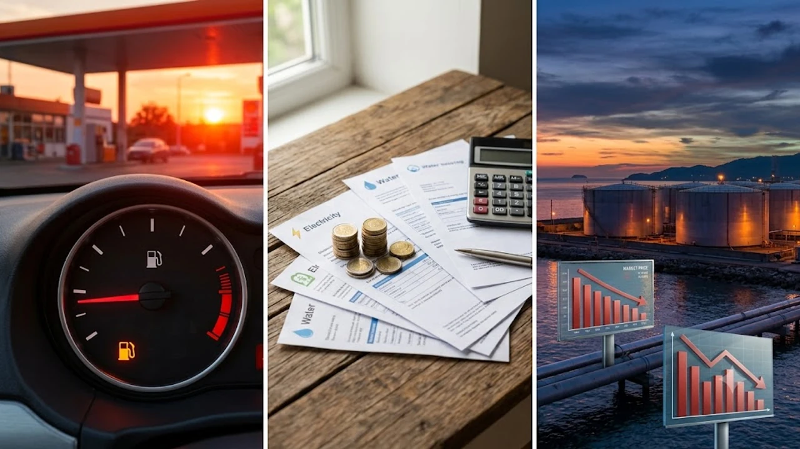

2026년 급등하는 국제 유가와 함께 생활 물가가 치솟으며 가계 부담이 극에 달했습니다. **고유가 절약** 전략은 이제 선택이 아닌 생존을 위한 필수이며, 밑 빠진 독처럼 새어 나가는 돈을 막는 숨은 비결을 찾는 것이 시급합니다.

## 2026년 고유가 상황 분석: 과거와 무엇이 다른가?

### 국제유가 급등이 가계에 미치는 타격
과거의 유가 상승이 주유비 걱정에서 멈췄다면, 2026년 현재는 물류비와 공공요금의 연쇄 상승을 부릅니다. 한국 경제 구조상 국제 유가가 10% 오르면 소비자 물가는 0.2\~0.3%p 밀려 올라가며, 이는 즉각적으로 식탁 물가와 외식비를 타격합니다. 우리가 체감하는 물가는 수치보다 훨씬 더 무겁게 다가옵니다.

### 유류세 인하 정책 변화와 실질 체감 물가
정부의 유류세 인하 정책은 조삼모사라는 비판 속에 2026년 들어 점진적인 환원 수순을 밟고 있습니다. 인하 폭이 축소될 때마다 주유소 가격표는 즉각 반응하며, 이는 월평균 교통비 예산을 15% 이상 초과하게 만드는 주범입니다.

### 에너지 효율 중심의 소비 패턴
이제는 저렴한 상품을 찾는 '가성비'를 넘어, 단위당 에너지 소비가 적은 제품을 고르는 '에너지 효율성'이 기준입니다. 냉난방 효율이 입증된 가전으로의 교체나, 이동 경로를 0.1km라도 줄이는 정밀한 이동 전략만이 살아남는 시대입니다.

## 고유가 시대에 반드시 버려야 할 숨은 지출 3가지

### 자동차 유지비: 과도한 운행 vs 대중교통의 경제성
자가용 출퇴근은 고유가 시대 가장 큰 자산 누수 지점입니다. 보험료, 세금, 감가상각비를 제외하고 순수 연료비와 주차비만 계산해 봐도, 주 5일 운행 시 대중교통 대비 월 20만 원 이상의 격차가 벌어집니다. 꼭 차를 움직여야 할 이유가 없다면, 과감하게 차를 세워두는 결단이 필요합니다.

### 배달 및 외식비: 고물가 속 외식 비중의 함정
배달비 3,000\~5,000원은 단순히 수수료가 아니라 기름값과 인건비가 겹겹이 쌓인 비용입니다. 집에서 직접 식재료를 손질해 조리하는 비중을 높이는 것만으로도 가계부 지출의 20%를 즉시 되찾을 수 있습니다. [관련 글 보기](/posts/economy/)

### 구독 서비스: 쓰지 않는 좀비 비용 해지
구독 경제는 편리하지만, 유가가 오르는 시기에는 가장 먼저 쳐내야 할 비용입니다. 매월 자동으로 빠져나가는 1만 원 내외의 서비스 3\~4개만 해지해도 연간 40\~50만 원의 여유 자금이 생깁니다. 결제 내역을 샅샅이 뒤져 쓰지 않는 항목을 지우는 행위가 절약의 첫 단추입니다.

## 실전 절약 루틴: 직접 해보니 효과적이었던 방법

### 매주 1회 무지출 데이
일주일 중 하루를 정해 단 1원도 소비하지 않는 무지출 데이는 소비 절제력을 키우는 최고의 훈련입니다. 냉장고 구석에 방치된 식재료로 끼니를 때우고 외부 활동을 억제하면, 본능적인 소비 욕구를 억누르는 통제력이 생깁니다. 성취감이 쌓일수록 절약은 즐거운 놀이가 됩니다.

### 지역화폐와 주유 할인 카드의 조합
주유는 단일 카드가 아닌, 지역화폐(캐시백 7\~10%)와 주유 전용 신용카드를 중첩해 사용합니다. 특정 카드사 실적을 채운 뒤 지역화폐로 상품권을 구매해 주유비로 결제하면 리터당 150원 이상의 절감 효과를 볼 수 있습니다.

> "작은 지출을 소홀히 하지 않는 태도가 고유가 시대를 버티는 가장 강력한 무기입니다."

### 가정 내 에너지 소비 습관
조명 밝기 조절, 멀티탭 전원 차단, 냉장고 적정 온도 유지는 수치상 미미해 보이나 1년 단위로 합산하면 큰 금액이 됩니다. 에어컨 가동 시 선풍기를 병행하는 것만으로도 전력 소모를 20% 덜어낼 수 있습니다.

## 스마트한 가계부 튜토리얼

### 소비 패턴의 데이터 시각화
앱이나 시트를 활용해 지난 3개월간 지출을 고정비와 변동비로 가릅니다. 교통비와 식비 비중이 전체의 50%를 넘는다면 경고등이 켜진 것입니다. 시각화된 데이터는 돈이 어디로 새는지 날카롭게 보여주어 행동 교정을 유도합니다.

### 변동비 분류와 비상금 예산 수립
변동비 중 '조절 가능한 지출'과 '불가피한 지출'을 나눕니다. 고유가 시기에는 변동비의 10%를 '강제 비상금'으로 설정해 별도 계좌에 예치합니다. 이는 갑작스러운 물가 상승이나 차량 수리비 등 돌발 상황을 막는 안전장치입니다.

### 5% 더 저축하는 자동이체 설정
급여일 직후 월급의 5%를 자동으로 저축 계좌로 보냅니다. 남은 돈으로 사는 것이 아니라, 저축을 떼어낸 뒤 남은 돈으로 생활하는 법칙을 세우는 튜토리얼입니다. 이 5%의 차이가 1년 뒤, 유가 변동에도 흔들리지 않는 재무 체력을 만듭니다.

#고유가 #절약 #재테크 #가계부 #인플레이션 #물가상승 #경제공부 #슬기로운소비생활 #에너지절약 #자산관리