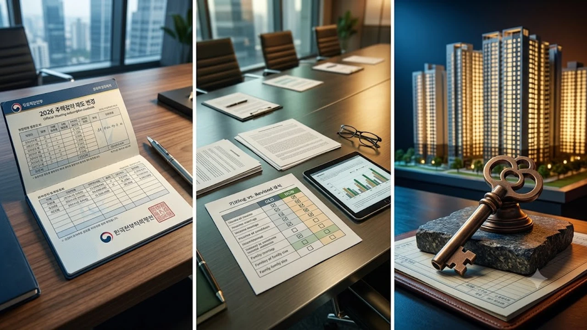

2026 청약제도 개편 세부 지침이 구체화되면서 내 집 마련을 준비하는 실수요자들의 셈법이 한층 복잡해졌다. 이번 규정 손질은 신혼부부 특별공급 배정 확대와 주택청약종합저축 인정 기준 조정을 포함해 실질적인 당첨 커트라인 지형을 뒤흔들고 있다. 고금리와 분양가 상승 기조 속에서 가점 계산기를 두드리는 청약 대기자라면 달라진 기준표를 빈틈없이 확인해야 한다.

## 2026년 가을 청약제도 개편, 무엇이 달라졌나

### 공급 물량 및 신혼·청년 배정 비율 확대
공공분양뿐 아니라 수도권 민간 사전청약 취소 사업장 대체 물량에서 신혼부부와 생애최초 배정 몫이 명확하게 늘어났다. 전체 물량 중 청년·신혼 특공 비중이 이전 대비 약 5%p 상향 조정되면서 30대 무주택 실수요자의 진입 문턱이 낮아진 구조다. 반면 일반공급 비율은 상대적으로 압축되어 40·50대 장기 무주택 세대의 가점 경쟁은 이전보다 치열해지는 양극화가 나타난다.

### 소득 요건 완화와 맞벌이 기준 현실화
맞벌이 가구의 소득 상한선이 도시근로자 월평균 소득의 최대 200% 수준까지 폭넓게 인정된다. 기존에는 연봉 1억 원을 조금만 넘겨도 특공 신청 자격에서 탈락했으나, 개편 규정은 대기업 맞벌이 부부의 현실적인 연봉 수준을 청약 자격 요건에 반영했다. 자녀 출산 가구에 대한 소득 공제 혜택도 신설되어 자녀가 둘 이상인 맞벌이 가정의 문턱이 대폭 낮아졌다.

### 무주택 기간 산정 및 부양가족 가점 기준 변경
부양가족 가점 산정 시 위장전입을 방지하기 위한 직계존속 동거 기준 요건이 3년 이상 실제 거주로 엄격해졌다. 반면 청약 신청자 본인과 배우자의 무주택 기간 합산 제도가 안착하면서, 혼인 신고 전 각자 보유했던 무주택 기간 손실에 대한 불이익은 완전히 해소되었다.

## 기존 규정 vs 개편안 1:1 비교분석

### 특별공급 자격 요건의 명암
과거에는 소득 기준이 지나치게 빡빡해 대기업 맞벌이 직장인이 제도적으로 배제되는 역차별 논란이 잦았다. 이번 개편은 이들을 제도권 안으로 끌어들였으나, 결과적으로 소득 상한선 완화가 경쟁률 폭등을 초래하는 부작용도 낳았다.

> **개편 포인트:** 소득 요건 완화는 곧 경쟁자의 급증을 뜻하므로, 단순 자격 충족에 안주하지 말고 추첨제 배정 비율(30%)을 노리는 세부 전략이 필수적이다.

### 일반공급 가점 커트라인 변화 추이
특공 물량이 늘어난 대가로 일반공급 가점 커트라인은 서울 및 수도권 핵심지 기준 최소 69점 이상으로 상향 평준화되는 추세다. 통장 가입 기간 15년 만점(17점), 무주택 기간 15년 만점(32점)을 기본으로 깔고 4인 가구 기준 부양가족 점수(20점)를 채워야만 당첨 안정권에 진입한다. 대출 환경과 유동성 흐름을 읽는 안목도 청약 전략의 한 축을 차지하는 만큼, [금리 동결! 2026 고금리 버티는 숨은 생존법](/posts/economy/us-cpi-shock-fomc-hawkish-strategy-2026/)을 참고해 자금 조달 리스크를 먼저 점검할 필요가 있다.

### 미혼 청년과 다자녀 가구 간의 유불리 점검
단독 세대주 미혼 청년에게 열려 있는 전용 59㎡ 이하 추첨 물량 경쟁은 이전보다 가열되었다. 반면 다자녀 특공은 2자녀 가구부터 기본 배점을 부여받아 진입 장벽이 낮아졌으나, 3자녀 이상 전통적 다자녀 가구의 우선 배점 우위는 여전히 유지되는 양상이다.

## 청약통장 유형별 장단점 및 갈아타기 팁

### 주택청약종합저축 납입 인정액 상향의 실익
매월 청약통장 월 납입 인정 한도가 기존 10만 원에서 25만 원으로 크게 오른 뒤, 공공분양 당첨 합격선이 가파르게 상승했다. 과거 인정금액 1,500만 원 선에서 당첨권에 들던 단지들이 이제는 월 25만 원 증액 납입자들의 누적액 상승으로 인해 합격 기준선이 가파르게 올라서고 있다. 공공분양을 최우선 목표로 둔다면 매월 25만 원씩 최대치로 납입액을 증액 설정하는 것이 불가피하다.

### 청년 주택드림 청약통장 전환 시 득과 실
만 19세 이상 34세 이하 청년이라면 최대 연 4.5% 금리와 당첨 후 최저 2%대 분양가 전용 대출(청년주택드림대출)이 연계되는 전용 통장으로 전환하는 편이 무조건 유리하다. 기존 통장의 납입 회차와 인정 금액이 100% 승계되므로 망설일 이유가 없다. 다만 본인 명의 무주택 상태를 유지해야 전환 혜택이 적용된다는 조건은 반드시 기억해야 한다.

### 구축 급매 매수와 신규 분양 청약의 비용 비교
분양가 상한제 적용 단지라도 최근 공사비 인상분이 고스란히 반영되어 평당 분양가가 역대 최고치를 갱신하고 있다.
- 신규 분양: 계약금 10~20% 현금 동원력 필수, 입주 시점 잔금 대출 스트레스 DSR 적용
- 구축 급매: 역세권 입지 즉시 확보 가능, 가격 협상 여지 존재
무조건 청약 통장만 붙들고 있기보다는 인근 5~10년 차 준신축 아파트 실거래가와 분양가를 정밀하게 대조해야 실수를 줄일 수 있다.

## 당첨 확률 높이는 실전 청약 튜토리얼

### 개편 규정 기준 본인 가점 정확히 계산하기
청약홈에 접속하여 주민등록등본상 세대원 전원의 주택 소유 이력 조회를 선행한다. 부모님이 만 60세 이상 주택을 소유한 경우 무주택으로 인정받는 조항, 소형·저가주택 1호 소유 시 민영주택 일반공급에서 주택 보유로 보지 않는 기준 완화 항목을 누락 없이 적용해 본인의 진짜 점수를 확인한다.

### 공공분양 vs 민간분양 목표 타깃 설정법
통장 총 납입 인정 금액이 1,800만 원 미만이라면 서울·과천·성남 등 핵심지 공공분양 일반공급은 사실상 승산이 낮다. 이 경우 과감하게 민간분양 전용 85㎡ 초과 추첨제 물량이나 60㎡ 이하 소형 평형 가점·추첨 병행 트랙으로 방향을 틀어야 당첨 확률을 끌어올릴 수 있다.

### 청약홈 사전 검증 기능 활용 및 필수 체크리스트
부적격 당첨으로 인한 통장 사용 제한(최대 1년)을 방지하기 위해 특별공급 접수 3일 전 청약홈 '사전 자격 확인' 메뉴를 반드시 거친다.
- 과거 5년 이내 당첨 이력 확인(동일 세대원 전원 포함)
- 해당 지역 거주 요건 충족 기간(수도권 핵심지 보통 1~2년 연속 거주)
- 소득 증빙 서류(근로소득원천징수영수증 상 총급여액 기준 일치 여부)
- 자산 기준(부동산·자동차 가액 상한 초과 여부)

청약 당첨 이후의 자금 흐름 관리와 효율적인 분산 운용 전략을 수립하고 싶다면 [관련상품 쿠팡에서 보기](https://www.coupang.com/np/search?q=%EC%9E%AC%ED%85%8C%ED%81%AC%20ETF&sourceType=affiliate&trackingCode=AF8691300)를 통해 실물 자산 포트폴리오 서적을 참고할 수 있다.

#청약제도개편 #2026청약 #신혼부부특별공급 #청약홈가점계산 #청년주택드림청약통장 #공공분양납입인정액 #내집마련전략