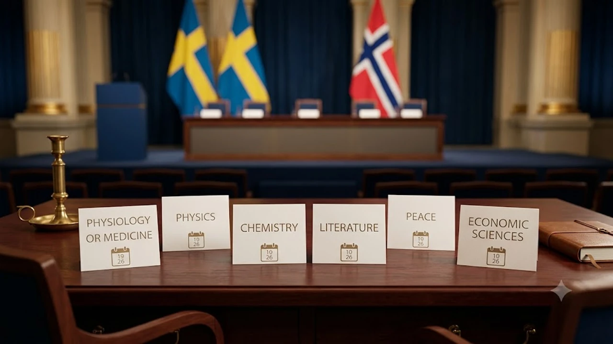

매년 10월 첫째 주가 되면 전 세계 과학계와 경제학계의 시선이 스웨덴 스톡홀름으로 쏠린다. 이번 주 막을 올린 **2026 노벨상 발표**는 한 해 동안 인류 지식의 최전선을 확장한 연구자들을 조명하는 글로벌 학술 축제다. 올해 역시 생리의학상을 시작으로 물리학, 화학, 문학, 평화상, 그리고 경제학상까지 연이어 수상자가 공개될 예정이라 지식 애호가들의 기대감이 그 어느 때보다 높다.

## 2026 노벨상 주간 시작, 전체 발표 일정 한눈에 보기

### 생리의학상부터 경제학상까지 날짜별 발표 타임라인
노벨상 시상 주간은 전통적으로 생리의학상으로 포문을 연다. 올해 역시 10월 첫째 주 월요일 생리의학상 발표를 시작으로 화요일 물리학상, 수요일 화학상이 차례대로 베일을 벗는다. 이어 목요일에는 문학상, 금요일에는 노르웨이 오슬로에서 평화상이 발표되며, 차주 월요일 스웨덴 중앙은행이 제정한 경제학상으로 대장정의 마침표를 찍는다.

### 스웨덴 현지 시간과 한국 시간 시차 계산 및 생중계 채널
스톡홀름 현지 시각 오전 11시 30분 전후는 한국 시간으로 늦은 오후 6시 30분경에 해당한다. 퇴근길 스마트폰을 통해 수상자 호명 순간을 실시간으로 지켜보려는 이들이 많다. 심사위원회의 최종 투표가 끝나는 시점에 따라 발표 시각이 수십 분가량 지연되기도 하므로 실시간 스트리밍 대기 창을 켜두는 방식이 가장 확실하다.

### 올해 심사에서 주목받는 주요 글로벌 연구 테마
최근 글로벌 학술계의 패러다임은 이론적 발견을 넘어 인류 생존 문제 해결로 이동하는 추세다. 기후변화 대응 에너지 신소재, 미세 단백질 접힘 예측 모델, 질병 조기 스크리닝 기술 등 실질적인 파급력을 갖춘 테마들이 강력한 지지를 얻고 있다.

## 분야별 유력 후보군과 2026년 심사 기준의 장단점

### 기초과학 분야: 오랜 검증 거친 연구 vs 신흥 바이오 기술
기초과학 분과는 보통 20~30년에 걸친 재현성과 상용화 검증을 요구해 왔다. 그러나 팬데믹 이후 기술 혁신 속도가 급격히 빨라지면서 개발된 지 10년 안팎의 신기술이 파격적으로 선정되는 사례가 늘었다. 유전자 가위 파생 기법이나 분자 표적 치료제처럼 임상에서 증명된 성과들이 유력 후보군으로 손꼽힌다.

### 평화상·문학상: 지정학적 이슈 반영 여부에 따른 파급력과 논쟁
평화상과 문학상은 당대 인류가 직면한 갈등을 가장 선명하게 투영하는 거울이다. 분쟁 지역의 인권 옹호 단체나 표현의 자유를 수호한 문인들이 집중 거론되며, 선정 결과에 따라 외교적 파장과 거센 찬반 논쟁이 뒤따르기도 한다. 

### 노벨 경제학상: 최신 정책 연계 모델의 강점과 한계
거시 경제의 불확실성이 커진 현시점에서는 금융 안정성 모델이나 불평등 완화 정책을 다룬 실증 경제학자들이 주목받는다. 이론적 우아함보다는 현실 통화정책과 재정정책에 미친 기여도가 평가 척도의 핵심으로 작용하는 양상이다. 글로벌 금융 시장의 흐름과 금리 변화가 실물 경제에 미치는 영향이 궁금하다면 [경제 전체 글 보기](/posts/economy/)에서 관련 맥락을 함께 짚어볼 수 있다.

## 생중계 시청 튜토리얼과 공식 결과 가장 빠르게 확인하는 법

### 노벨재단 공식 웹사이트 및 유튜브 실시간 스트리밍 접속 가이드
가장 빠르고 왜곡 없는 수신 경로는 노벨재단 공식 플랫폼이다. 공식 웹페이지(nobelprize.org)와 유튜브 채널은 발표 10분 전부터 대기 화면을 송출하며 현장 음성을 끊김 없이 전달한다. 

> **실시간 시청 팁:** 공식 유튜브 알림을 켜두면 스톡홀름 현지 스튜디오의 브리핑 시작과 동시에 모바일 알림을 받아볼 수 있다.

### 수상자 발표 직후 기자회견 및 심사평 공식 문서 다운로드 단계
발표 직후 프레스센터에서는 5~10분 분량의 공식 보도자료(Press Release)와 심층 학술 배경 자료(Advanced Information)를 배포한다. 연구의 구체적 의의와 핵심 논문 출처가 영문 PDF로 제공되므로 전문 연구자들에게 유용한 1차 사료가 된다.

### 국내 연구진 연관성 실시간 확인을 위한 학술 데이터베이스 활용 팁
수상자의 공동 저자나 인용 관계를 추적하려면 구글 스칼라(Google Scholar)나 웹오브사이언스(Web of Science)를 활용하는 것이 효과적이다. 수상 소식이 뜨는 즉시 대표 논문의 피인용 지수와 국내 연구진의 공저 여부를 빠르게 교차 검증할 수 있다.

## 과거 수상 패턴과 올해 후보작의 비교분석

### 최근 5개년 수상 트렌드와 2026년 후보군 간의 주제 유사도 분석
지난 5년간의 기록을 살펴보면 단일 분과의 순수 이론보다는 학제 간 융합 연구의 약진이 두드러졌다. 생물학과 컴퓨터과학의 결합, 물리학 기반의 첨단 나노 소재 연구가 대표적이다. 올해 후보작들 역시 단일 전공의 틀을 벗어나 경계를 넘나드는 연구들이 최상위 리스트를 채우고 있다.

### 단독 수상 비중 감소와 다인 공동 수상 트렌드의 비교
현대 과학 연구는 거대 자본과 다국적 연구팀이 투입되는 '빅 사이언스' 형태로 진화했다. 과거처럼 단독 수상자가 배출되는 경우는 극히 드물며, 2~3명의 연구자가 공로를 나누어 수상하는 분할 방식이 확고한 표준으로 자리 잡았다.

### 아시아권 연구자 및 차세대 과학자들의 진입 가능성 비교
오랜 기간 서구권 명문 연구소들이 독점하던 수상 지형도 서서히 변화하고 있다. 아시아 유수 연구기관의 공격적인 R&D 투자와 차세대 연구자들의 피인용 지수 급증은 이번 심사에서도 무시할 수 없는 변수로 꼽힌다. 

지적 호기심을 넓히고 세계 경제의 패러다임 변화를 이해하는 데 유용한 도서나 자료를 찾는다면 [관련상품 쿠팡에서 보기](https://www.coupang.com/np/search?q=%EB%85%B8%EB%B2%A8%EC%83%81+%EA%B2%BD%EC%A0%9C%ED%95%99%EC%83%81+%EB%8F%84%EC%84%9C&sourceType=affiliate&trackingCode=AF8691300)를 참고해볼 만하다.

#2026노벨상 #노벨상발표일정 #노벨생리의학상 #노벨물리학상 #노벨화학상 #노벨문학상 #노벨평화상 #노벨경제학상