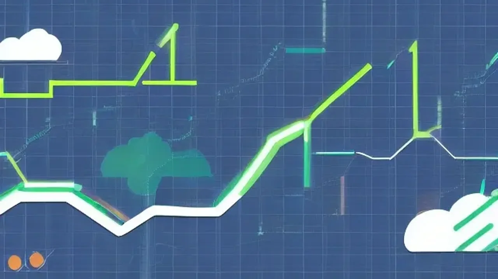

2026년 하반기를 관통하는 핵심 투자 키워드는 단연 현금 비중 확대와 자금의 효율적 배치입니다. 글로벌 자산 시장의 방향성이 엇갈리고 변동성이 커지는 국면에서, 매일 확정적인 이자를 챙길 수 있는 **파킹형 ETF**는 이제 선택이 아닌 생존 무기로 자리 잡았습니다. 섣부른 추격 매수 대신 안전하게 자산을 대기시키며 최적의 기회를 엿보는 구체적인 행동 지침과 실전 운용 노하우를 파헤칩니다.

## 2026년, 왜 지금 대기 자산에 주목해야 할까?
### 거시 경제 변동성과 현금의 진짜 가치
물가 지표와 금리 향방이 엇갈리는 현시점에 위험 자산 100% 보유는 시한폭탄과 같습니다. 현금은 단순한 관망이 아니라, 위기 발생 시 우량 자산을 바닥에서 쓸어 담는 **'총알'**이자 가장 훌륭한 안전마진입니다. 

### 은행 파킹통장 vs 증권사 파킹형 ETF 구조적 차이
시중 은행 파킹통장은 예금자보호법이 적용되나 최고 우대금리 조건을 맞추기 까다롭습니다. 반면 증권 계좌의 파킹 상품은 시장 기준 금리를 직관적으로 추종하며, **단 하루만 보유해도 이자가 원금에 가산**되는 일복리 구조를 지닙니다. 복잡한 자금 이체 없이 주식 매도 대금을 즉시 재투자할 수 있어 자금 회전율 면에서 압도적입니다.

### 배당금 및 부동산 잔금 등 '쉬는 돈'의 기회비용 분석
> "투자의 첫 번째 원칙은 돈을 잃지 않는 것이고, 두 번째 원칙은 첫 번째 원칙을 잊지 않는 것이다." — 워런 버핏

수개월 뒤 치러야 할 잔금이나 배당락 이후 입금된 현금을 연 0.1% 수준의 일반 통장에 방치하는 것은 매일 점심값을 길에 버리는 격입니다. 연 3.5% 금리 가정 시, 1억 원을 한 달만 묶어두어도 약 30만 원 상당의 세전 수익이 발생하므로 기회비용을 철저히 차단해야 합니다.

## 대표적인 파킹형 ETF 3종 전격 해부

### CD금리 연동형 ETF: 흔들리지 않는 안정성
양도성예금증서(CD) 91일물 금리를 기초지수로 삼는 상품은 금융투자협회 고시 금리를 벤치마크로 추종합니다. 차트를 보면 매일 우상향하는 선형 구조를 띠며, 시중 금리가 마이너스에 진입하지 않는 한 자본 손실 위험이 극히 제한적입니다. 

### KOFR 금리 연동형: 초단기 이자의 복리 효과 극대화
한국무위험지표금리(KOFR) 추종 상품은 익일물 국채와 통안증권 담보 환매조건부채권(RP) 금리를 실시간 반영합니다. **매일 발생하는 이자가 원금에 더해져 복리로 굴러가는 구조**가 핵심입니다. 국가 무위험 지표를 활용하므로 극단적인 금융 위기 발생 시에도 원금 보존 확률이 가장 높습니다.

### 각 상품별 운용 보수와 숨은 수수료 체크포인트
표면 수익률이 높아도 보수가 비싸면 실질 수익은 갉아먹힙니다.
- **총보수(TER):** 자산운용사에 지불하는 수수료. 연 0.02% \~ 0.05% 선이 합리적.
- **기타비용:** 펀드 결산, 예탁, 회계 감사 비용 등 숨은 지출. 투자설명서 확인 필수.
- **호가 스프레드:** 매수·매도 호가 간격. 거래 대금이 풍부한 대형 운용사 상품을 선택해 매매 손실을 줄이는 전략이 필요.

## 실전! 대기 자산 200% 활용 꿀팁
### 부동산 갭투자 등 목돈 잔금 대기 시의 파킹 활용법
기존 거주지를 3월 초에 매도하고, 다음 투자처인 갭투자 아파트의 최종 잔금일인 4월 말까지 약 50일간 수억 원의 여윳돈이 붕 뜨는 상황을 가정해 봅시다. 이 목돈을 단 한 달 반만 파킹 상품에 예치해도 최소 수십만 원의 확정 이자를 방어할 수 있습니다. 굴리는 금액 단위가 클수록 이 짧은 공백기를 활용하는 전략이 전체 가계 현금흐름에 막대한 차이를 만듭니다.

### 배당주 매수 타이밍을 기다리며 멘탈을 지키는 전략
눈여겨보던 우량 고배당주가 목표가에 도달할 때까지 현금을 쥐고 버티는 일은 고역입니다. 이때 남은 예수금을 파킹 상품에 묻어두면 대기 시간 자체가 수익으로 환산됩니다. 조급한 뇌동매매를 완벽히 차단하고, 매일 이자를 받으며 폭락장을 느긋하게 기다리는 심리적 방어막을 세울 수 있습니다.

[관련 글 보기](/posts/economy/)

### 하락장에서 현금 비중 조절이 가져다준 진짜 수익 방어 효과
포트폴리오의 20\~30%를 현금성 대기 자산으로 묶어두면 전체 계좌의 변동성을 극적으로 낮출 수 있습니다. 찐 폭락장이 도래했을 때 이 파킹 자금을 즉각 허물어 반토막 난 우량 주식을 바닥에서 줍는 전술적 재원으로 투입하는 것이 핵심 노하우입니다.

## 내 계좌에 파킹형 ETF 담는 방법
### 증권사 앱(MTS)에서 종목 검색부터 매수까지 3단계
- 사용 중인 증권사 MTS 앱의 주식 검색창으로 이동.
- 'CD금리', 'KOFR' 키워드를 검색해 시가총액과 거래량 최상위권 종목 선별.
- 일반 주식처럼 현재가나 지정가로 매수 주문 체결 (정규장 09:00\~15:30 자유 매매).

### ISA 및 연금저축계좌를 활용한 필수 절세 세팅법
일반 위탁 계좌의 매매차익(이자 수익)은 15.4% 배당소득세 과세 대상입니다. 절세 혜택을 극대화하려면 **중개형 ISA**나 **연금저축펀드**를 활용해야 합니다. 중개형 ISA는 순수익 최대 200만 원(서민형 400만 원) 비과세 후 9.9% 분리과세가 적용되며, 연금저축펀드는 과세가 이연되어 향후 연금 수령 시 저율(3.3\~5.5%) 과세 혜택을 누릴 수 있습니다.

### 매도 타이밍 잡기: 즉시 현금화 시 반드시 알아야 할 점
주식 시장 개장 중 언제든 전량 매도할 수 있으나, 실제 예수금으로 정산되어 출금하기까지는 **영업일 기준 D+2일**이 소요됩니다. 급한 부동산 잔금을 치러야 한다면 최소 2영업일 전에 매도해야 결제 지연을 막을 수 있습니다. 자금의 출구 스케줄을 미리 캘린더에 기록해두는 습관이 요구됩니다.

#파킹형ETF #대기자산 #현금비중 #CD금리 #KOFR #안전마진 #중개형ISA #연금저축펀드 #자산배분