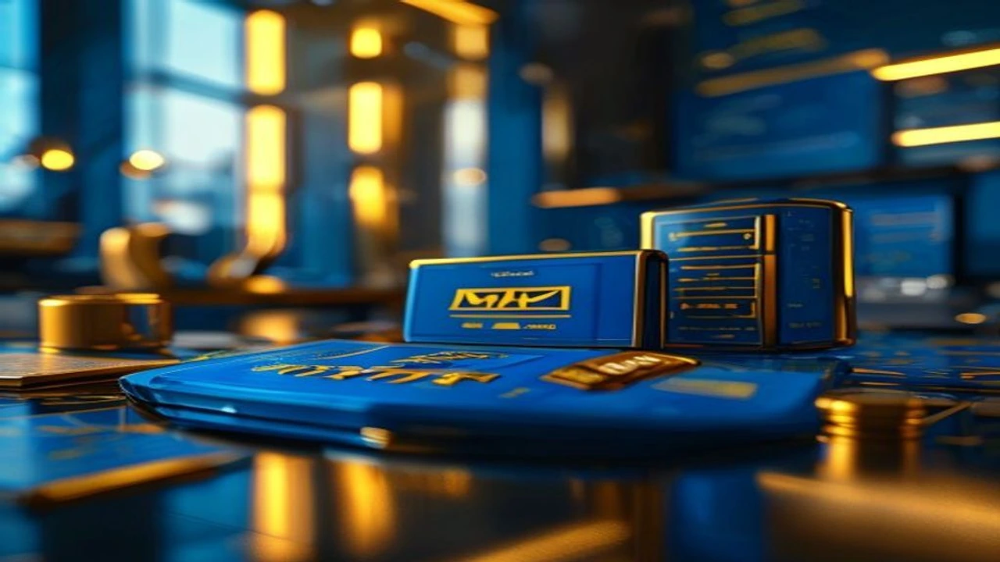

글로벌 테크 시장을 뒤흔든 메타발 AI 거품론의 확산으로 국내 반도체 시장의 불확실성이 그 어느 때보다 커진 시점입니다. 투자자들 사이에서 고점 신호라는 경고와 일시적 조정이라는 반론이 팽팽하게 맞서면서, 향후 **하반기 주가 전망**에 대한 정밀한 분석이 요구되고 있습니다. 사상 최대 수출 실적 이면에 숨겨진 변동성 장세에서 살아남기 위한 핵심 투자 나침반을 제시합니다.

## 메타발 AI 거품론의 실체와 글로벌 반도체 시장의 지각변동

### 3분기 글로벌 빅테크 AI 투자 둔화 시그널 분석
최근 메타(Meta)가 AI 데이터센터의 유휴 자원을 외부에 판매하는 클라우드 임대 사업에 진출하겠다고 밝히면서 시장은 커다란 충격을 받았습니다. 이는 빅테크 기업들이 천문학적인 비용을 투입해 구축한 AI 인프라에서 당장 뚜렷한 수익 모델을 창출하지 못하고 있음을 자인한 꼴이기 때문입니다. 실제로 실리콘밸리 벤처캐피털들을 중심으로 AI 인프라 투자 규모 대비 매출 회수 속도가 지나치게 느리다는 지적이 잇따르며 테크 진영 전반의 자금줄이 경색될 조짐을 보이고 있습니다.

### 엔비디아 독주 브레이크가 국내 증시에 미치는 영향
글로벌 AI 반도체 시장의 90% 이상을 장악하던 엔비디아의 주가 조정 주기가 길어짐에 따라, 국내 반도체 양대 산맥의 주가 동조화(Coupling) 현상도 심각한 시험대에 올랐습니다. 엔비디아의 차세대 칩 출하 지연 루머나 빅테크의 칩 주문량 조절 소식은 곧바로 한국의 메모리 공급망 전체를 흔드는 부메랑으로 돌아옵니다. 엔비디아 밸류체인에 진입한 기업과 그렇지 못한 기업 사이의 주가 양극화가 심화되는 이유가 바로 여기에 있습니다.

### 피크아웃 우려 vs 사상 최대 수출액의 괴리
한국 관세청이 발표한 월간 반도체 수출액이 사상 처음으로 1000억 달러를 돌파했음에도 주가는 오히려 힘을 쓰지 못하는 기이한 현상이 발생했습니다. 주식시장은 항상 현재가 아닌 6개월에서 1년 뒤의 미래를 선반영하기 때문입니다. 정점을 찍은 실적 지표가 오히려 '앞으로는 내려갈 일만 남았다'는 피크아웃(Peak-out) 심리를 자극하면서, 역대급 호황이라는 뉴스 속에서 기관과 외국인은 차익 실현 매물을 쏟아내는 역설적인 상황이 연출됩니다.

## 삼성전자 vs SK하이닉스: 하반기 주가 전망 및 펀더멘털 비교

### 삼성전자의 HBM 시장 지각 변동과 반격의 조건
삼성전자의 향후 향방은 엔비디아를 향한 HBM3E 제품의 최종 퀄 테스트 승인 시점에 모든 것이 걸려 있습니다. 그동안 고대역폭 메모리 시장에서 경쟁사에 주도권을 내주며 밸류에이션 저평가를 받아왔지만, 하반기 대량 공급 승인이 가시화될 경우 주가는 강력한 스프링보드를 얻게 됩니다. 아울러 수년째 적자의 늪에서 벗어나지 못했던 파운드리(위탁생산) 부문이 선단 공정 수율 안정화를 통해 흑자 전환에 성공하느냐가 주가 전고점 돌파의 핵심 열쇠입니다.

### SK하이닉스의 HBM 독점력 유지 가능성과 밸류에이션 리스크
SK하이닉스는 5세대 HBM 시장에서 독점적 지위를 유지하며 상반기 어닝 서프라이즈를 견인했습니다. 그러나 독주 체제가 영원할 수 없다는 점이 가장 큰 리스크 요인으로 꼽힙니다. 경쟁사들의 추격으로 공급 과잉 우려가 고개를 들고 있으며, 이미 주가가 역사적 신고가 부근까지 상승해 있어 조그만 악재에도 매물이 쏟아지는 높은 변동성에 노출되어