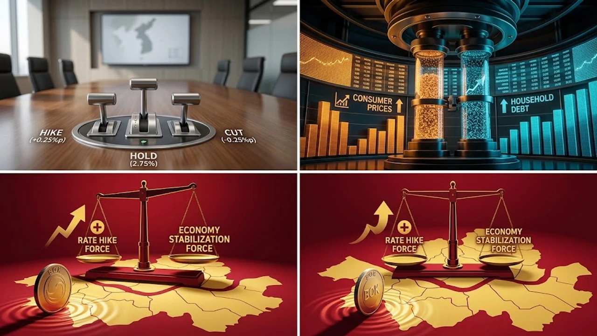

2026년 8월 한국은행 금융통화위원회를 앞두고 채권시장과 대출자들의 시선이 온통 한국은행 본관으로 쏠리고 있습니다. 이번 **8월 한은 기준금리** 결정 회의는 연이은 물가 상승 압력과 내수 경기 둔화 우려가 정면으로 충돌하는 분수령으로 꼽힙니다. 통화정책 방향성에 따라 가계 대출이자 부담과 예적금 수익률이 즉각 갈리는 만큼, 금통위의 최종 선택과 시나리오별 파급력을 면밀히 따져봐야 합니다.

## 8월 금통위 기준금리 결정 시나리오 전격 비교

### 25bp 연속 인상 시나리오와 주요 근거
금융투자협회와 채권 전문가 서베이에 따르면, 시장의 60% 이상이 현행 2.75%에서 3.00%로 25bp(0.25%p) 인상하는 시나리오를 점치고 있습니다. 무엇보다 2분기 깜짝 실질 국내총생산(GDP) 성장률과 끈적한 서비스 물가 상승세가 추가 긴축의 명분을 뒷받침합니다. 한은 입장에서는 기대인플레이션 심리를 확실하게 잡고 자산시장 과열을 통제하려는 유인이 여전히 강합니다.

### 경기 방어를 위한 전격 동결 시나리오와 배경
반면 30%대 중반의 전문가들은 금리 동결 결정을 전망합니다. 최근 발표된 8월 소비자심리지수(CCSI)가 4개월 만에 104.5로 하락 반전하며 내수 회복세에 급제동이 걸렸기 때문입니다. 급격한 금리 인상이 한계 자영업자와 취약차주의 연체율을 폭등시킬 수 있다는 금융안정 리스크도 동결론에 힘을 싣는 핵심 변수입니다.

### 채권 및 단기자금 시장의 선반영 확률 분석
국고채 3년물과 CD 91일물 금리는 이미 25bp 인상 가능성을 상당 부분 가격에 반영했습니다. 머니마켓펀드(MMF)와 종합자산관리계좌(CMA)로 자금이 이동하면서 단기 채권형 상품의 수익률이 먼저 반응하는 양상입니다. 시장은 이번 결정 자체보다 향후 통화정책방향 결정문과 총재 기자회견에서 나올 포워드 가이던스에 더 집중하고 있습니다.

## 연속 인상 가능성을 밀어붙이는 2대 거시 지표

### 2분기 깜짝 경제성장률과 경기 회복 속도
한국은행이 발표한 2분기 실질 GDP 속보치는 반도체와 IT 중심의 견고한 수출 증가세에 힘입어 잠재성장률을 웃돌았습니다. 거시 건전성 지표가 양호하다는 데이터는 중앙은행이 경기 침체 부담을 덜고 물가 안정에 정책 화력을 집중할 수 있는 든든한 방패막이가 됩니다.

### 외식·서비스 중심의 끈적한 근원 인플레이션 압력
농축수산물 가격 불안에 더해 외식 및 개인서비스 물가가 전년 동월 대비 3%대 안팎을 유지하며 끈질긴 하방 경직성을 보입니다. 기원적 요인을 제외한 근원물가지수가 쉽게 꺾이지 않으면서, 통화 긴축을 조기에 멈출 경우 2차 파급 효과로 인플레이션이 재점화될 위험이 상존합니다.

### 주요국 통화정책 차별화와 외환시장 변동성
미국 연방준비제도(Fed)의 매파적 긴축 기조 장기화로 한미 금리 역전 폭이 200bp 수준에서 유지되는 점도 큰 부담입니다. 내외 금리차 확대는 환율 상승 압력과 외국인 자본 유출 우려를 자극할 수 있어, 통화당국이 독자적으로 완화 조치를 취하기 어려운 대외 환경을 만듭니다.

> 외환시장과 글로벌 긴축 흐름의 연계 구조는 [금리 동결! 2026 고금리 버티는 숨은 생존법](/posts/economy/us-cpi-shock-fomc-hawkish-strategy-2026/) 글에서 분석한 거시경제 메커니즘과 정확히 궤를 같이합니다.

## 금융소비자가 직면할 대출 및 자산 영향 장단점

### 변동금리 차주의 이자 상환 부담 가중
기준금리가 3.00%대로 진입하면 코픽스(COFIX) 연동 주택담보대출과 신용대출 변동금리가 즉각 상승 압력을 받습니다. 대출 잔액 4억 원을 보유한 차주를 기준으로 연 0.25%p 금리 인상은 연간 100만 원, 월 8만 원이 넘는 순이자 비용 증가로 이어집니다.

- 변동금리 차주는 고정금리(혼합형) 대환 대출 조건을 재산정할 필요가 있습니다.
- 상환 능력이 취약한 다중채무자는 원리금 상환 유예나 저금리 정책금융 전환을 적극 검토해야 합니다.

### 파킹통장 및 정기예금 금리 상승에 따른 무위험 수익
반면 현금성 자산을 보유한 자산가와 예금 생활자에게는 긍정적인 신호입니다. 시중은행과 저축은행이 수신 경쟁을 펼치면서 정기예금 기본금리가 연 3%대 중후반까지 상향 조정되고, 하루만 맡겨도 이자가 붙는 파킹통장 수익률도 동시에 뜁니다.

### 자산시장 유동성 축소와 부동산 거래 절벽 리스크
대출 문턱이 높아지고 이자 부담이 커지면 수도권 아파트 매매시장과 경매시장의 자금 유입이 둔화됩니다. 스트레스 DSR(총부채원리금상환비율) 규제와 맞물려 레버리지를 활용한 공격적 투자가 위축되고, 거래량이 줄어드는 관망세가 짙어질 수밖에 없습니다.

## 8월 금통위 이후 현명한 금융 자산 포트폴리오 재편

### 고금리 예적금 풍차돌리기와 단기채 ETF 배분
확정금리를 제공하는 정기예금 만기를 3개월, 6개월, 1년 단위로 분산하는 풍차돌리기 전략이 효과적입니다. 만기 도래 시점에 금리 수준을 보고 재예치 여부를 유연하게 결정할 수 있으며, 국고채 1년 이하 단기채권 ETF를 편입해 자본 손실 없이 이자 수익을 극대화하는 방식도 유리합니다.

### 고정금리 갈아타기 실익 계산과 대환대출 플랫폼 활용
금융당국의 온라인 대환대출 인프라를 통해 현재 적용받는 가산금리와 우대금리 조건을 점검해야 합니다. 잔여 대출 기간이 3년 이상 남았다면 중도상환수수료 면제 시점을 확인한 뒤 3%대 초중반 고정금리 혼합형 상품으로 전환하는 편이 변동성 방어에 적합합니다.

### 외화 분산 및 배당주 중심의 인컴형 자산 세팅
원·달러 환율이 박스권 상단에서 움직이는 국면에서는 달러화 자산과 분기 배당주 비중을 유지하는 전략이 권장됩니다. 고금리 환경에서도 안정적인 현금흐름을 창출하는 금융 지주사 및 고배당 ETF는 주가 방어력과 배당 수익률 측면에서 우수한 성과를 기대하게 만듭니다.

[재테크 도서 쿠팡에서 보기](https://www.coupang.com/np/search?q=%EC%9E%AC%ED%85%8C%ED%81%AC%20ETF&sourceType=affiliate&trackingCode=AF8691300)

#8월한은기준금리 #기준금리인상 #한국은행금통위 #주택담보대출금리 #코픽스금리 #예적금금리비교 #고금리재테크 #금융자산관리