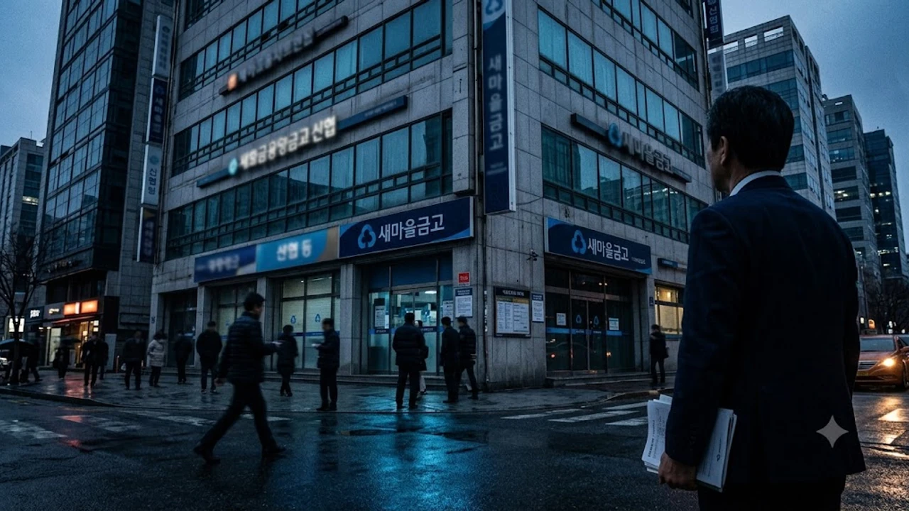

2026년 국회 정무위원회 국정감사에서 상호금융권 건전성 지표가 공개되자마자 금융소비자들의 긴장감이 고조되고 있다. 이번 감사 결과는 새마을금고 신협 자본잠식 예금자보호 체계에 실질적인 의문 부호를 던졌으며, 상호금융 부실채권 증가와 맞물려 2금융권 예적금 가입자들의 예치금 이동 움직임까지 촉발했다. 금융당국이 단순한 자산 매각 지원을 넘어 근본적인 구조조정을 직접 언급한 만큼, 내 돈이 묶인 조합의 경영 건전성을 즉시 파악해야 하는 시점이다.

## 2026 국감에서 드러난 상호금융 적자 현황

### 개별 단위조합 50% 적자 전환의 실태
국회 정무위원회 금융위원회 국정감사에서 공개된 자료에 따르면, 전국 신협과 새마을금고 개별 조합 중 절반가량이 올해 당기순손실을 냈다. 2024년부터 누적된 부동산 프로젝트파이낸싱(PF) 및 브릿지론 대출 부실이 본격적인 대손충당금 폭탄으로 돌아온 결과다. 수익을 내지 못하는 조합이 급증하면서 출자배당은커녕 조합원이 납입한 출자금 원금마저 위협받는 단위 조합 수가 속출했다.

### 연체율 폭등과 자본잠식 조합의 급증
부동산 담보 가치 하락과 고금리 장기화는 대출 연체율을 직격했다. 감사 지적 사항을 보면 일부 부실 조합의 연체율은 이미 두 자릿수를 훌륭히 넘어섰으며, 손실을 보전해야 할 고유 자본이 바닥나 완전 또는 부분 자본잠식 상태에 빠진 조합이 수십 곳에 달했다. 손실 흡수 능력을 나타내는 순자본비율이 금융감독원 권고 기준치(신협 기준 2% 미만 등 경영개선권고 요건) 아래로 추락한 곳이 집중 질타를 받았다.

### 금융위원장의 강력한 구조 개편 방침
국감장에 선 금융위원장은 상호금융권 위기 관리 대응과 관련해 "단순히 부실채권을 캠코에 넘겨 수치를 가리는 땜질식 처방을 끝내겠다"고 공언했다. 조합 간 합병, 강력한 자산 매각 권고, 경영 부실 조합에 대한 단계적 영업 정지 및 라이선스 재검토를 포함한 전면적 구조 개편을 시사했다. 이는 정부 차원의 무조건적 구제금융을 기대하기 어렵다는 시장 신호로 해석된다.

## 자본잠식과 예금자보호 한도의 현실적 한계

### 예금자보호 5천만 원 적용 범위와 함정
상호금융기관의 예금은 정부 공공기관인 예금보험공사가 아니라, 각 중앙회(새마을금고중앙회, 신협중앙회)가 자체 적립한 예금자보호준비금을 통해 원리금 5,000만 원까지 보장받는다. 그러나 이 한도는 '동일 법인(단위 조합 1곳)' 기준이다. 본점과 지점을 합산해 5,000만 원까지만 적용되므로, 같은 조합의 여러 지점에 쪼개어 가입했더라도 법인이 같다면 초과 금액은 보호받지 못한다.

### 출자금 통장의 원금 손실 구조
많은 금융소비자가 비과세 혜택(1인당 1,000만 원 한도)을 노리고 가입하는 **출자금 통장은 예금자보호 대상에서 완전히 제외**된다. 조합이 자본잠식에 빠지거나 파산 절차를 밟을 경우, 출자금은 조합 채무를 변제하는 데 가장 먼저 투입되는 자기자본 성격이다. 조합 손실률에 따라 원금이 0원으로 수렴할 수 있으며, 탈퇴하더라도 결산 총회 이후 감액된 금액만 환급받는다.

### 이자율 정산 기준과 지급 지연 리스크
원리금 5,000만 원을 보호받는 과정에서도 기회비용 손실은 불가피하다. 영업정지나 파산 결정이 내려지면 약정 금리 대신 중앙회가 정한 시중은행 1년 만기 정기예금 수준의 대위변제 이율이 적용된다. 또한 실제 지급 개시까지 2~3개월 이상 서류 심사와 현장 실사가 진행되는 동안 유동성이 묶여 급전 마련에 차질을 빚게 된다. 안전 자산 분산 포트폴리오 관리를 위해 [경제 전체 글 보기](/posts/economy/)에서 거시 경제 흐름을 함께 짚어보는 것이 유익하다.

## 내 거래 조합 건전성 직접 확인하는 3단계

> 금융당국의 공시 발표를 기다리지 않고 본인이 거래 중인 조합의 분기별 경영공시를 직접 열람해 위험 신호를 포착해야 한다.

### 정기 경영공시 확인 경로
새마을금고 홈페이지(새마을금고 위치안내 → 경영공시) 또는 신협 홈페이지(신협안내 → 신협경영공시)에 접속하면 단위 조합별 결산 보고서를 무료로 내려받을 수 있다. 6개월 단위로 올라오는 공시 보고서 중 가장 최근 분기의 대차대조표와 손익계산서를 확인해야 한다.

- **순자본비율**: 최소 4~5% 이상을 유지하고 있는지 확인 (2% 미만은 부실 우려)
- **당기순손실 규모**: 2개 반기 연속 대규모 적자를 기록 중인지 체크
- **고정이하여신비율**: 전체 대출 중 연체 3개월 이상 부실채권 비율이 8%를 넘는지 확인

### 경영실태평가 등급 점검
공시 서류의 '경영실태평가' 항목을 반드시 살펴야 한다. 자본적정성, 자산건전성, 수익성, 유동성을 종합해 1등급(우수)부터 5등급(위험)까지 분류한다. 만약 거점 조합이 3등급(보통) 이하로 떨어졌거나 4등급(취약)을 받았다면 금융당국의 경영개선권고 대상이므로 자금 분산을 검토해야 마땅하다.

### BIS 비율 유사 지표와 유동성 비율 분석
상호금융권에서는 수신 잔액 대비 즉시 현금화가 가능한 자산의 비율을 뜻하는 **유동성 비율(100% 이상 유지 권고)**이 생명선이다. 대규모 예금 인출(뱅크런) 우려가 불거졌을 때 유동성 비율이 80% 밑으로 떨어진 조합은 지급 준비 여력이 부족해 즉각적인 영업 타격을 받는다.

## 예금자 대응 요령과 안전한 분산 배치법

### 5천만 원 분산 예치 설계
한 조합당 원금과 소정의 이자를 합산해 4,700만~4,800만 원 선으로 분할 예치하는 방식이 기본이다. 이때 동일 행정구역에 있더라도 법인 등록번호가 다른 별개의 '독립 채산제' 단위 조합으로 나누어 예치해야 각각 5,000만 원 한도를 보장받는다.

### 금리 차이보다 원금 안전성 우선
단위 조합이 시중 1금융권 은행보다 0.5~1.0%p 높은 특판 금리를 제시한다면, 이는 수신 유치가 급박한 고위험 조합의 역마진 조달일 가능성을 의심해야 한다. 불확실성이 해소될 때까지는 자본잠식 우려가 있는 조합의 만기 예금을 회수해 1금융권 파킹통장이나 우량 금융채, 단기 국채로 이동시키는 편이 합리적이다.

### 채권형 자산과 배당형 투자 포트폴리오 전환
예적금 금리 하락기와 2금융권 크레딧 리스크가 겹친 국면에서는 안전한 유동성 확보와 변동성 관리가 핵심이다. 금융자산 다각화를 계획 중이라면 관련 도서와 분석 자료를 참고해 리스크 관리 역량을 키워두길 권한다.
[관련상품 쿠팡에서 보기](https://www.coupang.com/np/search?q=%EC%9E%AC%ED%85%8C%ED%81%AC%20ETF&sourceType=affiliate&trackingCode=AF8691300)

#새마을금고적자 #신협자본잠식 #상호금융국정감사 #예금자보호한도 #출자금통장손실 #경영공시확인법 #2금융권부실 #금융소비자보호