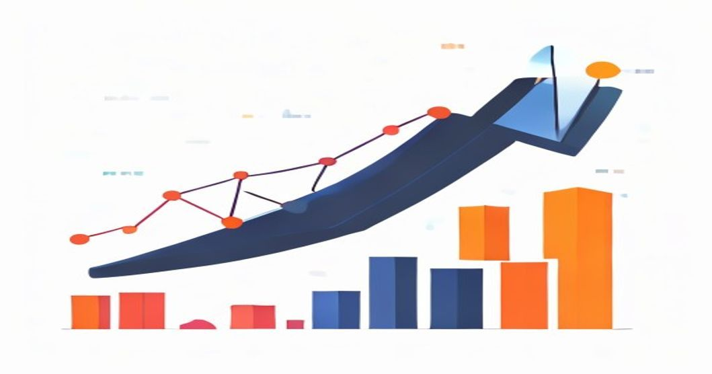
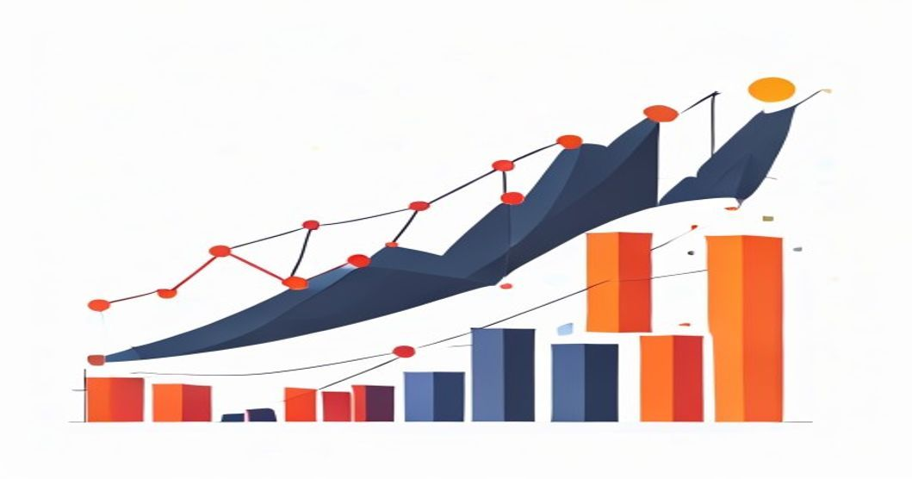

최근 국내 증시가 역사적인 랠리를 펼치면서 투자자들 사이에서 코스피 8000 돌파 가능성에 대한 논쟁이 뜨겁습니다. 인공지능(AI) 반도체 수요 폭발이 이끄는 이번 상승장이 과연 지속 가능한 구조적 성장일지, 아니면 단기 과열에 불과할지 명확한 진단이 필요한 시점입니다.

## 코스피 8000포인트 돌파 가능성 진단: 낙관론 vs 신중론

### AI 반도체 밸류에이션으로 본 '이유 있는 랠리'

이번 상승장은 과거의 유동성 장세와 확연히 다릅니다. 엔비디아가 촉발한 글로벌 AI 인프라 투자 붐은 실질적인 기업 이익으로 증명되고 있습니다. 특히 한국의 핵심 반도체 기업들이 생산하는 HBM3E 및 HBM4의 주문이 최소 1년 치 이상 선반영되었다는 점이 이를 뒷받침합니다. 주가수익비율(PER) 측면에서 보더라도 과거 호황기 고점과 비교해 여전히 주가가 이익 성장세를 따라가는 가성비 구간에 머물러 있다는 분석이 지배적입니다. 매크로 환경의 급변이 없는 한, 기업들의 강력한 펀더멘털이 지수를 견인하는 단단한 주춧돌 역할을 수행합니다.

### 역사적 고점 부담감과 단기 과열을 경고하는 지표들

반면 지수가 단기간에 급등한 만큼 기술적 조정 가능성을 경고하는 목소리도 만만치 않습니다. 일각에서는 상대강도지수(RSI)가 과매수 구간인 75를 넘어섰다는 점을 지적합니다. 과거 코스피가 급격한 랠리를 펼친 이후에는 예외 없이 대규모 차익 실현 매물이 출현하며 10\~15% 수준의 건전한 조정기를 거쳤습니다. 고금리 기조의 장기화 가능성과 글로벌 지정학적 리스크가 완전히 해소되지 않은 상황에서, 밸류에이션 부담이 가중되면 외국인 자금이 순식간에 이탈할 위험성도 상존합니다.

### 외국인·기관 순매수 추이로 보는 향후 자금 유입 경로

주가의 향방을 결정짓는 핵심 열쇠는 수급에 있습니다. 최근 3개월간 외국인 투자자들은 유가증권시장에서 수조 원 규모의 순매수를 기록하며 지수 상승을 주도했습니다. 반면 국내 기관 투자자들은 리스크 관리 차원에서 분할 매도 포지션을 취하며 상단 저항선을 형성하는 모양새입니다. 향후 글로벌 자산운용사들이 신흥국 패시브 자금 비중을 확대할 때 코스피가 가장 큰 수혜를 입을 수 있으므로, 매일 발표되는 외국인 순매수 상위 종목의 변화를 면밀히 추적해야 합니다.

## 반도체 대형주 직접 투자 vs 코스피200 ETF 간접 투자

### 삼성전자·SK하이닉스 집중 투자 시 기대수익과 리스크

반도체 대장주에 직접 투자하는 방식은 시장 초과 수익률을 달성하는 가장 확실한 방법입니다. HBM 공급망에서 독점적 지위를 확보한 기업의 경우, 지수 상승률의 2배에서 3배에 달하는 폭발적인 주가 상승을 기대할 수 있습니다.

- **장점**: 업황 호조의 수혜를 고스란히 누리며 단기간에 높은 자본 이득 획득 가능
- **단점**: 특정 기업의 수율 문제나 경영진의 전략적 판단 미스로 인한 개별 리스크 노출

수익률 극대화를 추구하는 공격적인 성향의 투자자에게 적합하지만, 자산의 상당 부분을 한두 종목에 올인하는 방식은 변동성을 고스란히 감내해야 하는 부담이 따릅니다.

### 지수 추종 ETF(코스피200, 레버리지) 투자의 안정성과 한계

종목 선정의 어려움을 겪거나 개별 기업 리스크를 피하고 싶다면 코스피200 지수를 추종하는 상장지수펀드(ETF)가 대안이 됩니다.

- **안정적인 분산 투자**: 반도체뿐만 아니라 바이오, 자동차, 이차전지 등 대한민국의 핵심 우량 기업 200개에 분산 투자하는 효과를 냅니다.
- **낮은 변동성**: 특정 종목이 하락하더라도 다른 섹터가 이를 방어해주므로 마음 편한 투자가 가능합니다.

다만 시장 평균 수익률만을 추구하기 때문에 상한선이 제한적이며, 지수가 정체 흐름을 보일 경우 지루한 횡보장을 견뎌야 한다는 한계가 명확합니다. 단기 차익을 노리고 레버리지 상품에 진입할 경우 변동성 잠식 현상으로 인해 장기 보유 시 손실이 커질 수 있음을 유의해야 합니다.

### 내 투자 성향에 맞는 최적의 포트폴리오 비중 선택법

결국 정답은 본인의 자금 성격과 리스크 수용 성향에 맞춘 비중 조절에 있습니다. 은퇴 자금이나 주택 마련 자금처럼 안정성이 최우선인 자산은 코스피200 ETF나 배당성향이 높은 대형주 위주로 70% 이상 채우는 전략이 유리합니다. 반면 여유 자금을 활용해 공격적인 수익을 원한다면 AI 반도체 밸류체인 핵심 종목에 50% 이상을 배정하고, 나머지를 지수 추종 상품으로 묶어 자산의 하방 경직성을 확보하는 바벨 전략을 추천합니다.

## 포모(FOMO)를 이겨내고 코스피 랠리에 올라탄 실전 경험담

### 최고점 터치 순간, 추격 매수의 유혹과 평정심 유지법

연일 사상 최고가를 갱신한다는 뉴스 속보가 도배될 때, 투자자 무리에서 나만 낙오되는 듯한 강한 소외감인 '포모(FOMO)' 증후군이 찾아왔습니다. 당장 시장가로 매수 주문을 넣고 싶은 충동이 강하게 일었지만, 과거 고점 추격 매수로 큰 손실을 보았던 경험을 떠올리며 호흡을 가다듬었습니다. 주가가 가파르게 오를 때 추격 매수하는 행위는 뇌동매매로 이어지기 십상입니다. 아무리 좋은 호재가 상존하더라도 시장은 반드시 숨 고르기 과정을 거친다는 진리를 되새기며 원칙을 고수했습니다.

### 분할 매수 원칙으로 변동성 장세를 방어한 실제 사례

예상대로 지수가 단기 고점을 찍고 밀리기 시작했을 때 비로소 준비해 둔 자금을 집행하기 시작했습니다. 전체 투자금을 한 번에 투입하지 않고 4회에 걸쳐 나누어 매수하는 방식을 취했습니다.

- **1차 매수**: 전고점 대비 5% 조정이 나온 시점에서 자금의 25% 투입
- **2차 매수**: 주요 이동평균선인 20일선 지지를 확인하며 추가 25% 투입
- **3차 매수**: 예상치 못한 대외 악재로 지수가 일시적 과매도 구간에 진입했을 때 30% 투입

이러한 분할 매수 전략 덕분에 주가 변동성에 따른 심리적 흔들림을 원천 차단했고, 평균 매입 단가를 시장 평균보다 유리하게 형성하는 이점을 누렸습니다.

### 수익 실현(익절) 타이밍을 잡기 위해 설정한 나만의 기준

매수보다 어려운 것이 매도라는 말처럼, 익절 타이밍을 설정하는 일은 철저한 계량화가 필수적입니다. 감정에 치우쳐 "조금만 더"를 외치다 수익을 반납했던 과오를 되풀이하지 않기 위해 target 익절선을 명확히 수립했습니다. 보유 종목이 목표 수익률 20%에 도달할 때마다 전체 물량의 3분의 1씩 기계적으로 분할 매도하여 현금을 확보합니다. 나머지 물량은 추세가 완전히 꺾이기 전까지 보유하며 수익을 극대화하되, 평단가를 위협하는 지점에는 확실한 익절(Trailing Stop) 기준을 적용해 이미 확보한 수익을 방어합니다.

## 변동성 장세에서 살아남는 3단계 자산 배분 가이드

### 1단계: 투자 가용 자금 확인 및 목표 수익률 설정하기

성공적인 자산 배분의 출발점은 현재 내가 운용할 수 있는 자산의 성격을 명확히 규정하는 일입니다. 6개월 이내에 사용해야 하는 전세보증금이나 생활비는 아무리 시장 전망이 좋아도 주식 시장에 투입해서는 안 됩니다. 최소 3년 이상 전혀 손댈 필요가 없는 순수 여유 자금만을 투자 자금으로 확정합니다. 그다음, 연간 목표 수익률을 지나치게 비현실적인 수치가 아닌, 시장 성장률에 알파를 더한 수준으로 현실성 있게 설정해야 무리한 레버리지 사용이나 투기성 종목 진입을 막을 수 있습니다.

### 2단계: 하락장을 방어하는 자산(달러, 채권) 분산 배치하기

주식 시장의 호황이 영원할 수는 없기에, 자산의 일정 부분은 주식과 역의 상관관계를 가지는 안전자산에 강제로 배분해야 합니다. 대표적인 자산이 바로 달러와 미국 국채입니다. 코스피 시장이 급락할 때 원·달러 환율은 상승하는 경향이 있으므로, 자산의 20% 내외를 미국 달러 표시 자산이나 단기 국채 ETF에 묶어두면 증시 폭락 시 전체 자산의 손실률을 획기적으로 방어합니다. 이는 하락장에서 멘탈을 유지하고, 싼 가격에 주식을 추가 매수할 수 있는 강력한 실탄 역할을 수행합니다.

### 3단계: 적립식 자동 매수를 통한 평균 매입 단가 낮추기

마켓 타이밍을 완벽하게 맞출 수 있는 인간은 존재하지 않습니다. 따라서 매월 특정 날짜에 정해진 금액만큼 주식을 기계적으로 매입하는 달러 코스트 에버리지(DCA) 전략을 시스템화해야 합니다. 주가가 높을 때는 적은 수량의 주식을 사고, 주가가 폭락했을 때는 자동으로 많은 수량의 주식을 매입하게 되므로 시간이 흐를수록 평균 매입 단가가 하향 평준화되는 효과를 경험하게 됩니다. 증권사의 자동 적립식 매수 서비스를 신청해 두고 시장의 소음에 귀를 닫는 것이 최종 승자가 되는 지름길입니다.

[관련 글 보기](/posts/economy/)

#코스피8000 #반도체투자 #코스피전망 #2026재테크 #자산배분전략 #ETF투자법 #주식분할매수 #삼성전자주가 #재테크노하우 #FOMO극복
