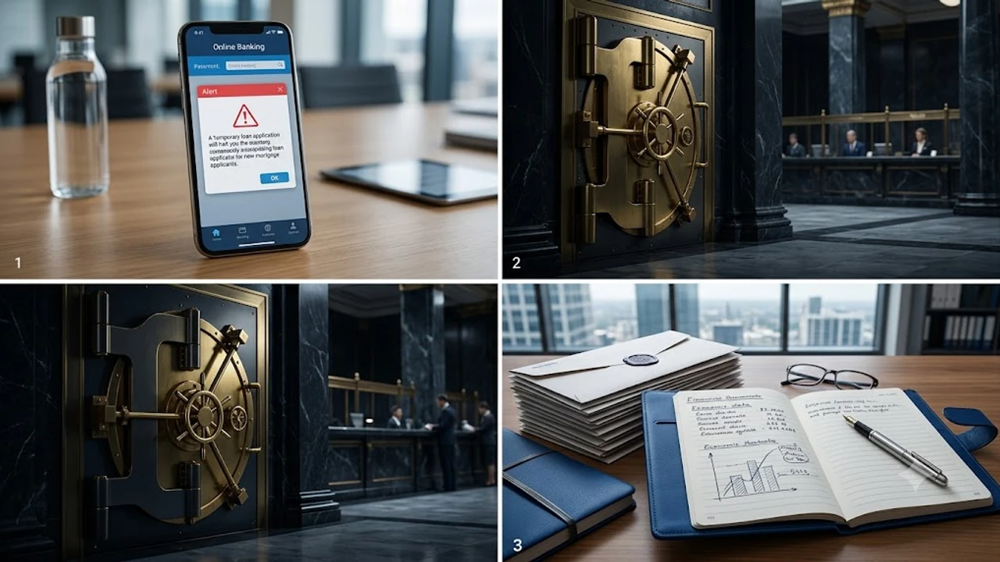

금융당국의 가계부채 억제 압박이 거세지면서 주요 시중은행 창구가 굳게 닫히는 **은행 대출 중단** 사태가 눈앞의 현실로 닥쳤습니다. 가계대출 총량 한도를 거의 소진한 금융권이 비대면 대환대출 인프라를 차단하고 신용대출 한도 축소를 전격 단행해 시장 전반에 대출 절벽이 번졌습니다. 가을 이사철을 코앞에 두고 잔금 마련에 비상이 걸린 차주들은 꽉 막힌 자금줄을 뚫어낼 현실적인 우회로를 빠르게 확보해야 합니다.


## 금융권 대출 중단 및 한도 축소 현황

### 비대면 주담대 및 갈아타기 접수 셧다운
KB국민은행, 신한은행, 우리은행 등 대형 시중은행은 플랫폼을 통한 온라인 주택담보대출 갈아타기 접수 창구를 일제히 걸어 잠갔습니다. 신규 주담대 역시 다주택자는 물론 수도권 1주택자의 갈아타기 목적 주택 구입 자금 접수를 전면 거절하는 기조가 뚜렷합니다.

- **갈아타기 플랫폼 접수 불가**: 카카오페이, 토스, 네이버페이 등 대환대출 인프라를 통한 비대면 접수 일시 정지
- **1주택자 처분 조건부 주담대 중단**: 기존 주택을 처분하겠다는 각서를 제출해도 신규 대출 취급을 거부
- **생활안정자금 연간 한도 축소**: 물건별 한도를 연간 1억 원 이하로 일괄 제한

### 신용대출 및 마이너스통장 연봉 내 제한 조치
직장인들이 비상 자금이나 주택 보증금 보조 수단으로 활용하던 신용대출도 칼바람을 맞았습니다. 주요 은행은 차주의 연간 환산 소득 범위 안으로 신용대출 한도를 강하게 묶기 시작했습니다.

> 기존에 연봉의 120~150% 수준까지 나오던 마이너스통장 한도가 100% 이내, 일부 은행의 경우 50~80% 수준까지 가파르게 깎여나갔습니다.

### 가계대출 총량 관리 강화가 부른 도미노 규제
한 은행이 한도를 닫으면 대출 수요가 즉각 인근 은행으로 몰리는 이른바 풍선효과가 일어납니다. 특정 시중은행이 접수를 멈추자 타 은행들도 잔여 한도 소진을 막으려 릴레이 방식으로 가산금리를 올리거나 취급을 멈추고 있습니다.

## 1금융권 대출 문턱이 급격히 높아진 이유


### 금융당국 부채 관리 압박과 분기 말 소진율 초과
금융감독원은 2026년 가계대출 증가율을 경상성장률 이내로 묶어두겠다는 정책 목표를 강력히 밀어붙였습니다. 시중은행들이 상반기에 연간 목표치의 상당 부분을 채워버리자, 3분기 말 시점에 연간 총량 가이드라인을 넘기지 않도록 기습적인 대출 총량 통제에 돌입했습니다.

### 스트레스 DSR 확대 적용 이후 풍선효과 차단
스트레스 DSR 2단계가 적용되면서 차주들의 주담대 한도가 줄어들자, 부족한 자금을 신용대출로 메우려는 움직임이 포착되었습니다. 당국은 이를 규제 우회 경로로 규정하고 주담대뿐 아니라 신용대출, 집단대출, 전세대출까지 핀셋 규제를 촘촘히 뻗쳤습니다. 거시적인 유동성 긴축 국면에서 자산 시장의 충격을 피하려면 고금리 환경에 맞춘 부채 리스크 관리가 선행되어야 합니다. 과거 거시 지표 변화 속에서 유동성 리스크를 짚어본 [금리 동결! 2026 고금리 버티는 숨은 생존법](/posts/economy/us-cpi-shock-fomc-hawkish-strategy-2026/)을 함께 읽어두면 시장의 큰 물줄기를 읽는 데 도움이 됩니다.

### 갈아타기·다주택자 대상 규제 타깃 집중
투기성 대출을 차단한다는 명분으로 2주택 이상 보유자는 시중은행 전세자금대출과 주담대 신규 신청이 완전히 차단되었습니다. 단순 실수요자인 1주택 갈아타기 수요자까지 일괄 규제에 묶이면서 현장의 혼란이 극에 달했습니다.

## 실수요자가 즉시 체감하는 주요 걸림돌과 리스크

### 이사 잔금 및 전세금 반환 일정 차질
수도권 아파트 매매 계약을 체결하고 10월 초 잔금 납부를 앞둔 매수인들이 직접적인 타격을 입었습니다. 이미 가계약을 맺고 은행 창구 상담을 진행 중이던 건조차 정식 사전 접수 번호가 발급되지 않았다면 심사가 멈춰 잔금 미지급 사태가 벌어지고 있습니다.

- **전세보증금 반환 차질**: 세입자 퇴거를 앞두고 임대인이 생활안정자금 대출을 받지 못해 보증금을 돌려주지 못하는 분쟁 급증
- **청약 당첨자 잔금대출 애로**: 입주를 앞둔 신축 아파트 단지의 집단대출 한도 축소로 수분양자의 연체율 상승 위험 노출

### 신규 신용대출 한도 급감에 따른 자금 공백
주택 매입 자금 외에도 자영업자 운영 자금이나 급전이 필요한 차주들의 유동성에 경고등이 켜졌습니다. 한도거래(마통) 연장 심사 과정에서 원금 일부 상환을 요구받거나 금리가 연 6%대 중후반으로 튀어 올라 이자 부담이 급증했습니다.

### 온라인 금리 비교 플랫폼 무력화
핀테크 앱을 통해 최저 금리 은행을 찾아 갈아타던 시스템도 제 기능을 잃었습니다. 시스템상 금리 조회가 되더라도 실제 심사 단계를 누르면 '해당 금융사의 내부 한도 소진으로 접수가 불가합니다'라는 팝업창만 마주하게 됩니다.

## 대출 절벽 속 실수요자를 위한 현실적 대안

### 한도 여력 남아있는 틈새 금융사 확인법
5대 시중은행(KB·신한·하나·우리·NH) 창구가 닫혔다면 지방은행(부산·대구·광주)이나 인터넷전문은행의 잔여 쿼터를 실시간으로 점검해야 합니다.

- **지방은행 수도권 여신센터 공략**: 지방은행의 수도권 영업점은 시중은행 대비 총량 여유가 남아 있어 심사 승인 가능성이 상대적으로 열려 있습니다.
- **인터넷전문은행 일일 오픈 쿼터 공략**: 인터넷은행의 하루 접수 쿼터는 매일 오전 6시 혹은 자정에 초기화되므로, 열리는 즉시 선착순 접수를 끝내는 것이 안전합니다.

### 정책 모기지 조건 충족 여부 재검토
시중은행 자체 재원이 아닌 주택도시기금 재원의 정책 금융 상품은 은행권 자체 규제 대상에서 제외됩니다.

- **디딤돌·버팀목 대출**: 무주택 세대주 요건, 부부합산 소득 요건(신혼부부 8,500만 원 이하 등), 주택 평가액(5억 원 이하) 기준에 부합하는지 재확인합니다.
- **신생아 특례대출**: 2년 내 출산 가구라면 소득 기준이 대폭 완화되므로 시중 대출 대신 정부 정책 상품으로 우회해야 합니다.

### 2금융권 활용 시 DSR 관리 및 금리 비교
1금융권 대출이 전면 차단된 상태에서 잔금일이 촉박하다면 보험사 주택담보대출이 유력한 선택지입니다.

> 보험사는 ```markdown
요청하신 출력 형식을 준비했습니다. 구체적으로 작성할 주제나 내용(원고 초안, 기획안, 포스팅 주제 등)을 알려주시면 해당 지침에 맞춰 코드블록 안에 마크다운 본문을 완성해 드리겠습니다.