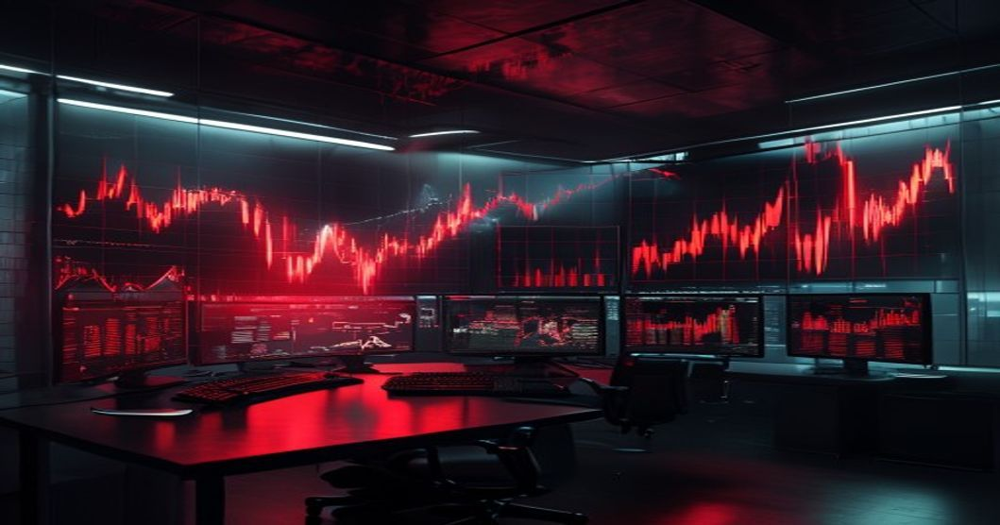

최근 뉴스 헤드라인을 보면 한숨부터 나옵니다. 2026년 5월 현재 외환시장이 요동치며 원달러 환율 1500원 벽이 마침내 깨졌기 때문입니다. 해외 직구를 즐기거나 해외 여행을 계획하던 분들은 벌써부터 결제 창을 닫고 있다는 소리가 들립니다. 단순한 일시적 출렁임으로 치부하기에는 우리 지갑에 미치는 타격이 꽤나 묵직합니다. 도대체 무엇이 원화 가치를 이토록 끌어내리고 있을까요?

## 고환율 쇼크 도래! 원달러 환율 1500원 선 무너진 진짜 이유

### 이란 분쟁 장기화와 호르무즈 해협의 불확실성

글로벌 금융시장을 흔드는 가장 큰 주범은 중동 지역의 군사적 긴장감입니다. 호르무즈 해협의 물류 병목 현상이 지속되면서 국제 유가가 배럴당 100달러 안팎을 고공행진하고 있습니다. 에너지를 전량 수입에 의존하는 한국 입장에서는 수입 대금으로 지불해야 할 달러 수요가 폭발할 수밖에 없는 구조입니다. 결국 시장에 달러가 귀해지니 환율 1500원 돌파라는 성적표를 마주하게 된 셈입니다.

### 미국 연준의 고금리 장기화 기조

미국 내부의 인플레이션 압력이 다시 고개를 들면서 미 연방준비제도(Fed)가 금리 인하 카드를 쉽사리 꺼내지 못하고 있습니다. 달러를 쥐고만 있어도 높은 이자를 주다 보니, 전 세계 투자 자금이 안전자산인 달러로 쏠리는 현상이 심화되었습니다. 한국 자본시장에서도 외국인 투자자들이 주식을 매도하고 달러로 환전해 빠져나가는 흐름이 관측되면서 원화 약세를 더욱 부채질하고 있습니다.

## 수입 물가 비상! 우리 일상에 미치는 직접적인 타격

원화 가치가 떨어지면 단순히 해외여행 비용만 오르는 게 아닙니다. 우리가 매일 먹고 마시고 소비하는 모든 영역에 도미노처럼 가격 상승 압박이 가해집니다. 이미 대형마트의 수입 과일이나 가공식품 코너에 가보면 체감 물가가 확 올랐다는 것을 알 수 있습니다.

### 장바구니 물가와 기름값의 고공행진

원유와 곡물 수입 가격이 뛰면 제조업체들은 제품 가격을 올릴 수밖에 없습니다. 주유소의 휘발유 가격은 이미 리터당 앞자리가 바뀌었고, 외식 물가 역시 가파르게 오르고 있습니다. 월급은 그대로인데 숨만 쉬어도 나가는 고정비가 늘어나다 보니 서민들의 실질 소득이 감소하는 효과를 낳고 있습니다.

### 수입 원자재 부담으로 인한 기업 실적 악화

반도체나 자동차 같은 일부 수출 기업들은 고환율로 인해 장부상 이익이 늘어나는 것처럼 보이지만, 내면을 들여다보면 꼭 그렇지만도 않습니다. 배터리 소재나 화학 원료 등 해외에서 사 와야 하는 필수 원자재 가격이 동시에 뛰기 때문입니다. 중소 제조업체들은 마진율이 급격히 떨어지며 경영난을 호소하는 사례가 늘고 있습니다.

## 위기를 기회로 바꾸는 고환율 시대 생존 재테크 전략

외환 시장의 변동성이 극에 달했을 때 가만히 앉아서 소나기를 맞을 수는 없습니다. 자산의 일부를 리밸런싱하여 리스크를 방어하고, 오히려 수익의 기회로 삼는 영리한 대처가 필요한 시점입니다.

### 달러 자산 분산 투자와 외화 발행어음 활용

전체 자산을 원화로만 가지고 있는 것은 고환율 국면에서 자산 가치 하락을 그대로 방치하는 것과 같습니다. 지금이라도 소액씩 달러를 적립식으로 매수하거나, 증권사의 달러 발행어음 같은 고금리 외화 상품에 묻어두는 방법을 추천합니다. 환차익과 함께 안정적인 이자 수익을 동시에 거둘 수 있어 훌륭한 헤지 수단이 됩니다.

### 미국 주식 및 글로벌 배당 ETF 선별 투자

환율 1500원 대에서 미국 주식을 신규 매수하기가 부담스러울 수 있지만, 달러 가치 상승의 수혜를 직접적으로 누리는 우량 기업이나 월배당 ETF는 여전히 매력적입니다. 주가 상승에 따른 수익뿐만 아니라 배당금 자체가 달러로 들어오기 때문에 원화로 환전했을 때 체감하는 현금 흐름이 훨씬 쏠쏠합니다.

### 원자재 관련 펀드 및 금 금융상품 주목

인플레이션과 지정학적 위기가 겹칠 때는 실물 자산의 가치가 빛을 발합니다. 대표적인 안전자산인 금(Gold)이나 원유, 천연가스 관련 상장지수펀드(ETF)에 포트폴리오 일부를 배분해 두면, 시장이 흔들릴 때 전체 자산의 변동성을 낮춰주는 든든한 버팀목 역할을 해줍니다.

## 한국은행의 딜레마와 향후 금융시장 관전 포인트

앞으로 환율이 더 오를지, 아니면 다시 안정을 찾을지는 통화 당국의 손에 달려 있습니다. 하지만 한국은행의 고민은 깊어만 가고 있습니다. 경기 회복세가 온전치 않은 상황에서 환율을 잡겠다고 무작정 금리를 올리기는 어렵기 때문입니다. 현명한 자산 관리를 위해서는 [서울 아파트 시장 전망](/posts/kr-realestate/seoul-apartment-timing-2026/)과 대출 금리 리스크를 함께 점검하면서 거시적인 흐름을 읽어내야 합니다. 가계부채 부담이 한계에 다다른 상황에서 기준금리 카드를 만지는 정부의 움직임을 예리하게 주시해야 하는 이유입니다.

### 환율 방어를 위한 구두 개입과 미세조정

외환 당국은 시장의 투기적 수요를 억제하기 위해 연일 구두 개입성 발언을 내놓고 있습니다. 보유한 외환보유고를 활용해 시장에 달러를 풀며 속도 조절에 나서고 있지만, 거대한 글로벌 자금의 흐름을 완전히 거스르기에는 역부족인 모습입니다. 앞으로 발표될 외환보유액 감소 추이를 살펴보면 당국의 방어 의지를 읽을 수 있습니다.

### 하반기 수출 경기 반등 여부가 핵심 키

결국 원화 가치가 제자리를 찾으려면 우리가 물건을 많이 팔아서 달러를 벌어와야 합니다. 다행히 반도체와 IT 기기를 중심으로 한 수출 지표는 견조한 흐름을 유지하고 있습니다. 하반기 무역수지 흑자 폭이 본격적으로 확대된다면 외환 수급에 숨통이 트이면서 1500원 선 아래로 안착할 가능성도 열려 있습니다. 위기 속에서도 냉정하게 시장을 바라보며 내 자산을 지키는 영리한 재테크 행동이 필요한 때입니다.

#환율1500원 #고환율시대 #재테크전략 #달러투자 #미국주식 #인플레이션 #수입물가 #한국경제전망