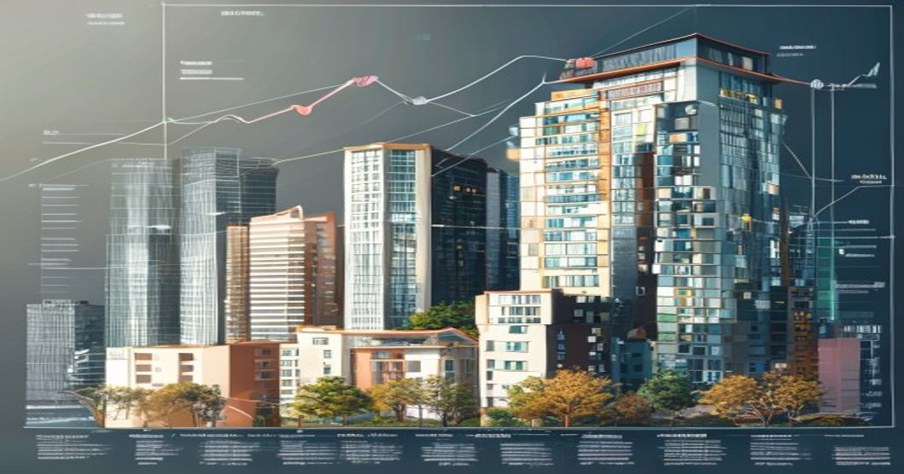

반도체 수출 호조로 거시경제 지표는 올라가는데 왜 내 통장은 점점 얇아질까요? 그 답의 절반은 **가계부채**에 있습니다. 2026년 현재 한국의 가계부채 총액은 GDP 대비 세계 최고 수준을 유지하고 있고, 금리 변동과 부동산 시장의 불확실성이 겹치면서 서민 경제를 압박하고 있어요. 숫자 너머에 있는 구조적 문제를 직접 짚어볼게요.

## 가계부채가 위험한 수준에 도달한 이유

### GDP 대비 100%를 넘어선 부채 비율

한국의 가계부채는 GDP 대비 비율에서 주요 선진국 가운데 최상위권에 속합니다. 2020년대 초반 저금리 기조 속에서 부동산과 주식에 동시에 올라탄 '영끌·빚투' 열풍이 부채 규모를 단기간에 폭발적으로 키웠어요. 그 후유증이 2026년에도 여전히 현재진행형입니다.

### 주택담보대출과 전세자금대출의 이중 압박

전체 가계부채 중 주택 관련 대출이 차지하는 비중이 60%를 넘습니다. 집값이 오를 때는 레버리지로 작동했던 이 구조가, 금리가 오르고 집값이 정체되는 국면에서는 고스란히 가계 부담으로 돌아왔어요. 특히 전세 대출을 끼고 살다가 역전세를 맞은 가구들의 재정 압박이 심각합니다.

### 자영업자 부채의 폭탄 뇌관

코로나19 시기에 생존을 위해 빌린 대출이 만기 연장과 이자 유예가 끝나면서 수면 위로 올라오고 있습니다. 자영업자 대출 연체율 상승은 개인 파산을 넘어 2금융권과 카드사의 건전성 문제로 이어질 수 있어요.

## 금리와 부동산이 만드는 이중 압박 구조

### 한국은행의 딜레마 — 내리기도 올리기도 어렵다

경기 부양을 위해 금리를 내리면 가계부채가 더 늘어납니다. 반대로 물가 안정을 위해 금리를 유지하면 가계의 이자 부담이 유지되죠. 한국은행이 2026년 통화 정책에서 갈팡질팡할 수밖에 없는 근본 이유입니다.

### 집값이 내려도 문제, 올라도 문제

집값이 하락하면 담보 가치가 줄어 추가 담보를 요구받는 마진콜 상황이 생깁니다. 반대로 집값이 오르면 실수요자의 내 집 마련 문턱이 더 높아지고, 전세가도 함께 올라 무주택 서민의 주거 부담이 커져요. 어느 방향이든 서민에게 유리한 시나리오가 없는 구조입니다.

### DSR 규제와 대출 한도 축소의 영향

총부채원리금상환비율(DSR) 규제 강화로 신규 대출 접근이 어려워졌습니다. 표면적으로는 가계부채 증가를 억제하는 효과가 있지만, 실제로는 급전이 필요한 취약 계층이 고금리 사금융으로 밀려나는 부작용도 발생하고 있어요.

## 개인이 지금 당장 할 수 있는 현실적 대응

### 고정금리 전환 타이밍 점검

변동금리 대출을 유지하고 있다면 고정금리 전환 비용과 향후 금리 변동 시나리오를 반드시 비교해봐야 합니다. 은행 고정금리와 인터넷은행·저축은행 금리를 함께 비교해 0.5%포인트라도 낮출 여지가 있는지 확인하세요.

### 비상금 6개월치 원칙의 재확인

경기 불확실성이 높은 시기일수록 월 생활비의 6개월치를 즉시 인출 가능한 예금에 묶어두는 원칙이 중요합니다. 투자 수익률에 집착하다 유동성 위기를 맞는 경우가 늘고 있어요.

### 부채 우선순위 재조정 — 이자율 높은 것부터

여러 대출이 있다면 상환 우선순위를 이자율 기준으로 재정렬하세요. 카드론, 신용대출, 주담대 순으로 고금리 부채를 먼저 줄이는 것이 수학적으로 가장 유리합니다.

## 2026년 하반기 가계경제 전망과 시나리오

### 낙관 시나리오 — 금리 인하 + 부동산 연착륙

하반기에 한국은행이 기준금리를 한 차례 이상 인하하고, 수도권 부동산 가격이 완만하게 안정된다면 가계부채 리스크는 일정 부분 완화될 수 있습니다. 수출 호조로 법인세 수입이 늘어 재정 여력이 생기는 시나리오예요.

### 비관 시나리오 — 미국발 고금리 장기화

미 연준이 예상보다 금리 인하를 늦추면 한국도 따라갈 수밖에 없습니다. 이 경우 가계 이자 부담이 내년까지 이어지고, 자영업자 연체율 상승이 금융 시스템 리스크로 번질 가능성이 있어요.

[2026년 한국 부동산 시장 전망](/posts/kr-realestate/)에서 지역별 집값 흐름을 함께 살펴보면 자산 포트폴리오 전략을 세우는 데 도움이 됩니다. 불확실한 경제 환경일수록 레버리지를 줄이고 현금 흐름을 확보하는 것이 장기적으로 가장 안전한 전략이에요.

#가계부채 #한국경제2026 #금리전망 #부동산대출 #재테크 #DSR #경제트렌드
