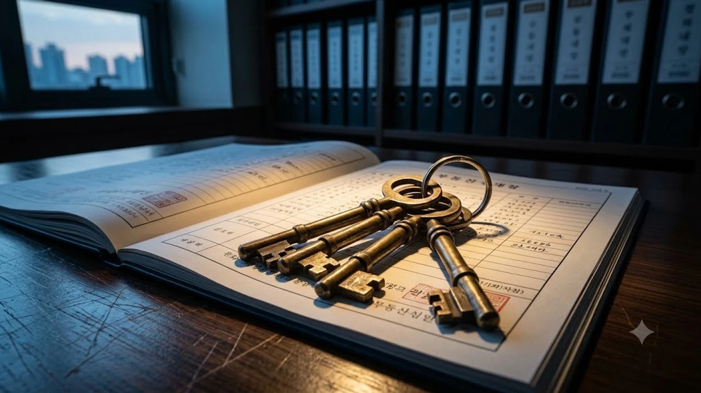

한국주택금융공사(HF)의 전세자금보증 대위변제 미회수 채권 잔액이 2조 원 돌파를 눈앞에 두며 세입자들의 불안이 커지고 있다. 임대인이 보증금을 돌려주지 않아 공공기관이 대신 갚아준 뒤 청구하는 **전세보증 구상채권** 규모가 눈덩이처럼 불어나면서 서민 주거 안전판 자체에 균열이 가고 있다는 지적이다. 전세사고 급증과 회수율 급락이 맞물린 현재 상황에서 세입자가 챙겨야 할 핵심 리스크를 짚어본다.

## 전세보증 구상채권 2조 원 육박, 공공 보증망 흔들리나

### 5년 새 3배 급증한 사고 금액과 1조 9,200억 원의 미회수금
국회 정무위원회 제출 자료에 따르면 주택금융공사가 집주인 대신 갚아준 전세자금보증 사고액은 최근 5년 사이 3배 이상 폭증했다. 현재 회수하지 못한 채권 잔액만 1조 9,205억 원에 달한다. 빌라와 다세대주택 밀집 지역을 중심으로 역전세와 전세사기 여파가 이어지며 공공기관의 재정 건전성에 비상이 걸렸다.

### 회수율 7%대 추락… 공공기관 대위변제 여력의 한계 도달
대위변제 이후 채무자로부터 돈을 회수한 비율은 7% 안팎에 머물러 있다. 100억 원을 대신 갚아주고 겨우 7억 원 남짓 회수하는 셈이다. 이러한 재정 악화는 보증기관의 기본 재원을 갉아먹으며 향후 추가 보증 공급 여력을 제약하는 부메랑으로 돌아온다.

### 2026년 하반기 전세 시장에 미칠 연쇄 부실 파장
보증기관 손실이 누적되면 제도적 문턱이 급격히 높아진다. 이미 가계부채 관리와 맞물려 유동성 축소가 진행 중인 금융 환경에서 전세보증 공급 축소는 전세 수요 둔화와 비아파트 전세 기피 현상을 한층 심화시키는 촉매가 된다.

## 떼인 돈 못 받는 주택금융공사, 왜 회수가 안 될까?

### 악성 임대인 은닉 자산 추적의 법적·제도적 한계
악성 임대인들은 바지선장 명의를 내세우거나 신용불량 상태로 진입해 집행 대상 재산을 빼돌리는 수법을 쓴다. 현행 법 체계에서는 차명 자산이나 현금 흐름을 실시간으로 추적해 압류하기까지 긴 소송 절차와 행정적 장벽이 가로막혀 있다.

### 담보 가치 하락과 경매 유찰 장기화로 인한 회수 지연
부실이 터진 전세 매물 대다수는 감정가보다 시세가 낮아진 깡통주택이다. 법원 경매로 넘어가도 2~3회 이상 유찰되며 낙찰가가 보증금의 절반 수준까지 떨어지는 경우가 흔하다. 

> 경매가 지연될수록 보증기관은 배당을 받지 못하고, 배당을 받더라도 원금 손실이 확정되어 장기 미회수 채권으로 쌓이게 된다.

### HUG(주택도시보증공사)와 HF(주택금융공사) 부실 구조 비교
HUG가 전세보증금반환보증 위주로 집주인 직접 리스크에 노출되어 있다면, HF는 은행의 전세대출에 보증을 서는 구조다. 따라서 HF의 구상채권 문제는 차주인 세입자의 파산과 집주인의 무자력이 얽혀 회수 난도가 훨씬 높다. 부동산 및 거시경제 변동성이 심화되는 국면에서는 [경제 전체 글 보기](/posts/economy/)를 통해 금융 시장 전반의 자금 흐름을 읽는 안목이 요구된다.

## 전세대출 차주와 세입자가 당장 겪게 될 현실적 변화

### 전세대출 보증 심사 강화 및 가입 요건 상향 전망
기관 손실을 방어하기 위해 공공보증 가입 심사가 엄격해질 수밖에 없다. 공시가격 반영 비율을 낮추거나 보증 한도를 축소해 고위험 매물의 시장 유입을 차단하는 조치가 가속화될 조짐이다.

### 보증료 인상과 대위변제 지연에 따른 세입자 이중고
건전성 방어 조치는 결국 세입자의 부담 증가로 이어진다.
- 전세대출 실행 시 납부하는 보증료율 인상 압박
- 사고 발생 후 대위변제 심사 장기화로 인한 이사 계획 차질
- 보증 요건 미달로 1금융권 전세대출 거절 사례 증가

### 전세사고 발생 시 세입자가 즉시 대처해야 할 필수 절차
만기 후 보증금이 반환되지 않는다면 계약 해지 의사를 명확히 통보하고 즉시 임차권등기명령을 신청해야 한다. 은행 대출 상환 독촉에 노출되기 전에 보증기관 사고 접수 요건과 필요 서류를 사전 확인해 공백을 줄여야 한다.

## 보증금 안전하게 지키는 3가지 자산 방어 전략

### 계약 전 등기부등본 및 선순위 권리관계 실시간 검증법
등기부등본 갑구의 가압류·신탁 여부와 을구의 근저당권을 반드시 확인해야 한다. 공인중개사의 구두 설명에만 의존하지 말고, 잔금 당일까지 등기 변동 여부를 열람해 선순위 권리 발생을 차단해야 한다.

### 전세보증금반환보증 가입 불가 매물 판별과 대안 모색
공시가격 대비 전세가율이 기준치를 넘어서 보증보험 가입이 거절되는 매물은 처음부터 배제해야 한다. 보증 가입이 불가능한 주택이라면 전세 대신 반전세나 월세로 전환해 위험 노출액 자체를 최소화하는 선택이 현실적이다.

### 확정일자·임차권등기명령 활용한 보증금 회수 골든타임 확보
이사 당일 전입신고와 확정일자를 마쳐 대항력과 우선변제권을 확보하는 기본 수칙은 필수다. 계약 종료 후 보증금을 돌려받지 못한 상태에서 다른 곳으로 주소지를 옮겨야 한다면 임차권등기가 완료된 것을 확인한 뒤 전출해야 우선순위를 지킬 수 있다.

[관련상품 쿠팡에서 보기](https://www.coupang.com/np/search?q=%EB%B6%80%EB%8F%99%EC%82%B0%20%EC%A0%84%EC%84%B8%20%EA%B6%8C%EB%A6%AC%EB%B6%84%EC%84%9D&sourceType=affiliate&trackingCode=AF8691300)

#전세보증구상채권 #주택금융공사 #전세대출규제 #보증사고 #대위변제 #임차권등기명령 #깡통전세