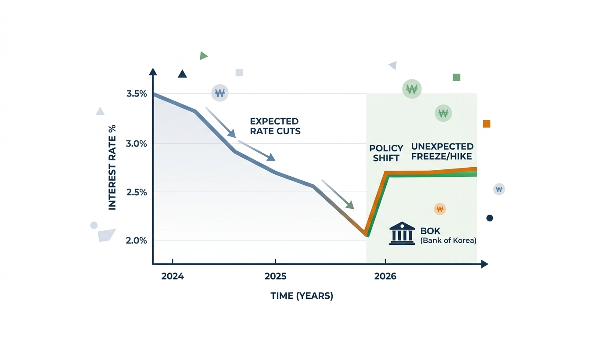

여러분, 2026년 한국 금리 인하 전망에 대한 기대감이 흔들리고 있다는 소식, 혹시 들으셨나요? 고금리 기조가 지속될 가능성이 커지면서 주식 부동산 영향까지, 우리 자산 시장과 생활 전반에 미칠 파장이 심상치 않습니다. 과연 2026년 한국 경제는 어떤 변곡점을 맞이할지, 함께 깊이 파헤쳐 볼게요.

## 2026년 한국 금리, '인하'는 옛말? 동결 또는 인상 가능성 분석

지금까지 많은 분이 2026년에는 기준금리가 내려갈 것이라고 예상했을 겁니다. 하지만 현재 분위기는 사뭇 다릅니다. 한국은행은 연 2.5% 수준에서 금리를 동결하거나, 심지어 하반기에는 인상 가능성까지 조심스럽게 논의하는 상황입니다. 왜 시장의 기대와는 다른 흐름이 나타나는 걸까요?

### 시장의 금리 인하 기대, 왜 꺾였나?

금리 인하를 기대했던 시장의 시선이 바뀐 데에는 여러 복합적인 요인이 작용합니다. 가장 큰 이유는 **물가 상승 압력**입니다. 국제유가가 급등하고 원화 약세, 즉 고환율이 지속되면서 수입 물가가 오르고, 이는 결국 소비자 물가 상승으로 이어지게 됩니다. 한국은행으로서는 물가 안정을 최우선 과제로 삼을 수밖에 없으므로, 금리를 내리기가 쉽지 않은 거죠.

여기에 **가계부채** 문제도 발목을 잡습니다. 역대 최대치를 경신한 가계부채는 금리 인하의 큰 제약 요인이 됩니다. 정부가 대출 규제를 강화하는 것도 이러한 배경에서입니다. 고금리 상황에서 대출 규제까지 더해지니, 실수요자들이 내 집 마련을 하기가 더 어려워지고, 부동산 거래량도 위축될 수 있습니다.

### 한국은행의 고민: 물가 vs. 성장 vs. 가계부채

한국은행은 물가 안정, 경제 성장, 가계부채라는 세 가지 축 사이에서 균형을 잡아야 하는 어려운 상황에 놓여 있습니다. 한편으로는 AI 관련 투자 확대에 따른 반도체 수출 호조에 힘입어 2026년 한국 경제가 예상보다 견조한 성장세를 보일 것이라는 긍정적인 전망도 있습니다. **수출이 잘 되면 경제 활력이 생기지만, 이는 다시 물가 상승 압력으로 이어질 수 있어요.**

*   **물가 안정:** 국제유가, 고환율로 인한 물가 상승 압력 지속
*   **경제 성장:** 반도체 수출 호조로 인한 견조한 성장세 기대
*   **가계부채:** 역대 최대치 경신, 대출 규제로 인한 금리 인하 제약

이처럼 엇갈리는 지표들 속에서 한국은행이 어떤 결정을 내릴지 관심이 쏠릴 수밖에 없습니다.

### 고금리 기조가 지속될 때, 우리 삶에 미치는 영향

만약 고금리 기조가 예상보다 길어진다면, 우리 개인의 삶에는 어떤 변화가 찾아올까요? 가장 먼저 **대출 이자 부담**이 가중될 겁니다. 변동금리 대출을 받은 분들이라면 매달 나가는 이자가 더 늘어나 가계 경제에 큰 압박을 받을 수 있어요. 저 역시 지인들의 이야기를 들어보면, "월급은 그대로인데 이자만 늘어나 숨통이 조여온다"는 하소연을 자주 듣습니다.

또한, 물가 상승으로 인해 **실질 구매력**이 약화될 수 있습니다. 월급은 오르지 않는데 장바구니 물가는 계속 오르니, 결국 돈의 가치가 떨어지는 것과 같은 효과를 체감하게 되는 거죠. 자산 시장에서는 '초양극화' 현상이 심화되면서, 자산을 보유한 사람과 그렇지 않은 사람 간의 격차가 더욱 커질 수 있다는 점도 염두에 두셔야 합니다.

## 반도체 훈풍 속 2026년 한국 주식시장, 기회와 리스크는?

금리 동결 또는 인상 기조에도 불구하고 2026년 한국 주식시장은 비교적 긍정적인 흐름을 이어갈 것이라는 전망이 우세합니다. 하지만 기회 뒤에는 언제나 리스크가 숨어있죠. 투자자로서 어떤 점을 기대하고, 어떤 점을 경계해야 할까요?

### '밸류업'과 AI 열풍, 주식 시장의 긍정적 시그널

2026년 한국 주식시장은 여러 호재에 힘입어 전반적으로 긍정적인 흐름을 보일 것으로 예상됩니다. 가장 큰 요인은 **반도체 업황 호조**입니다. AI 관련 투자 확대가 전 세계적으로 이어지면서 반도체 수요가 폭발적으로 늘고 있고, 이는 국내 반도체 기업들의 실적 개선으로 직결될 거예요.

여기에 정부의 **'기업 밸류업 프로그램'**에 대한 기대감도 주식 시장에 긍정적인 영향을 미치고 있습니다. 기업 가치를 높이고 주주 환원을 강화하려는 정책 방향은 투자자들에게 매력적인 요소로 작용할 수 있습니다. 이미 시장에서는 저평가된 우량 기업들이 재평가될 것이라는 기대감이 형성되어 있습니다.

### 'AI 버블론'과 금리 인상, 투자자가 경계해야 할 위험 요소

하지만 낙관론만 펼치기엔 아직 이릅니다. 주식 시장에는 항상 예상치 못한 위험이 도사리고 있어요. 특히 경계해야 할 것은 **'AI 버블론' 확산 가능성**입니다. 만약 미국 AI 관련 기업들의 실적이 기대에 미치지 못하거나, 기술 혁신 속도가 둔화된다면 현재의 AI 관련 주식들의 고평가 논란이 불거질 수 있습니다. 과거 IT 버블처럼 거품이 꺼질 수도 있다는 우려도 나옵니다.

또한, 한국은행이 금리를 인상할 경우 **채권 평가 손실**이 발생할 수 있다는 점도 리스크 요인입니다. 금리가 오르면 채권 가격은 떨어지는 경향이 있기 때문에, 채권 시장의 불안정성이 주식 시장으로 전이될 가능성도 배제할 수 없습니다.

### 개미 투자자가 체감하는 시장의 온도: 기대와 불안

저처럼 평범한 개미 투자자들에게 2026년 주식 시장은 기대와 불안이 교차하는 공간이 될 겁니다. 한편으로는 반도체와 밸류업 정책이라는 강력한 테마에 편승해 수익을 내고 싶은 마음이 클 거예요. 하지만 동시에 금리 인상 가능성, 그리고 'AI 버블'이 언제 터질지 모른다는 불안감도 떨쳐내기 어렵습니다.

> "주변을 보면, 반도체 주식으로 크게 수익을 봤다는 이야기도 들리지만, 한편으로는 테마주에 잘못 투자했다가 손실을 본 사례도 적지 않아요. 신중한 접근이 필요한 시기라고 생각합니다."

이처럼 개인 투자자들은 시장의 큰 흐름을 읽으면서도, 개별 기업의 가치와 위험 요소를 꼼꼼히 따져보는 지혜가 필요합니다.

## '초양극화' 심화되는 2026년 한국 부동산 시장, 내 집 마련의 꿈은?

고금리 기조와 대출 규제 속에서도 한국 부동산 시장은 2026년에 '초양극화' 현상이 심화될 것으로 예상됩니다. 내 집 마련을 꿈꾸는 실수요자들에게는 더욱 어려운 시장이 될 수 있어요.

### 수도권 핵심 지역은 강세, 비핵심 지역은 침체?

2026년 한국 부동산 시장의 가장 두드러진 특징은 **'초양극화'**입니다. **수도권, 특히 서울 핵심 지역은 입지 경쟁력과 공급 부족 우려로 인해 강세가 지속될 것으로 전망됩니다.** 좋은 입지에 대한 수요는 여전히 견고하며, 신규 공급이 부족하다는 인식이 가격을 떠받칠 가능성이 높아요.

반면, **비핵심 지역은 대출 규제와 고금리 부담으로 인해 어려움을 겪을 것으로 예상됩니다.** 상대적으로 수요가 적고 가격 민감도가 높은 지역들은 금리 부담이 커지면 매수 심리가 위축될 수밖에 없어요. 결국, "똘똘한 한 채"라는 말이 현실화되면서 지역 간 가격 격차가 더욱 벌어질 수 있습니다.

### 고금리, 대출 규제 속 3040세대의 선택과 인플레이션 헤지

이러한 상황 속에서 3040세대의 내 집 마련은 더욱 복잡한 양상을 띨 수 있습니다. 대출 규제가 강화되고 고금리가 지속되면서 은행권 대출 문턱은 높아졌지만, 일부 3040세대는 **비은행권 대출을 통해 수도권 주택 구매를 시도하는 경향도 나타나고 있습니다.** 이는 인플레이션 우려에 따른 실물 자산 선호 심리가 작용한 결과로 해석할 수 있어요. 돈의 가치가 떨어질 바에야 실물 자산을 보유하려는 심리가 강해진 거죠.

하지만 비은행권 대출은 이자 부담이 더 클 수 있다는 점을 간과해서는 안 됩니다. 장기적인 관점에서 상환 계획을 면밀히 세우지 않으면 큰 부담으로 돌아올 수 있어요.

### 부동산 시장의 양극화, 실수요자와 투자자의 엇갈린 경험

부동산 시장의 양극화는 실수요자와 투자자에게 매우 엇갈린 경험을 안겨줄 겁니다. 실수요자 중에서도 핵심 지역에 진입하려는 사람들은 여전히 높은 진입 장벽에 좌절감을 느낄 수 있어요. 반면, 이미 핵심 지역에 자산을 보유한 투자자들은 자산 가치 상승을 경험하며 상대적인 이득을 볼 수 있습니다.

> "제 주변에도 서울 핵심지에 집을 가진 친구는 '그래도 집값이 버텨줘서 다행이다'라고 하는데, 수도권 외곽에 집을 사려던 친구는 '계속 오르는 금리 때문에 계획을 접었다'고 하더라고요. 같은 부동산 시장인데도 체감하는 온도는 정말 다르죠."

이처럼 부동산 시장의 양극화는 자산 격차를 심화시키고, 사회 전반의 불평등을 가속화하는 요인이 될 수 있습니다.

## '3고(高)' 시대, 한국 독자들이 준비해야 할 자산 관리 전략

고금리, 고물가, 고환율이라는 '3고' 시대가 2026년에도 이어질 것으로 예상되면서, 우리 모두 현명한 자산 관리 전략을 세우는 것이 그 어느 때보다 중요해졌습니다. 나의 자산을 어떻게 지키고 불려나갈 수 있을까요?

### 높아진 대출 이자와 물가, 실질 구매력 저하에 대비하는 법

고금리 상황에서는 **대출 관리가 최우선**입니다. 변동금리 대출을 보유하고 있다면, 고정금리 대출로 전환하거나, 상환 계획을 재조정하는 방법을 고려해볼 수 있습니다. 불필요한 대출을 줄이고, 이자 부담을 최소화하는 것이 중요해요.

물가 상승으로 인한 실질 구매력 저하에 대비하기 위해서는 **재정 건전성을 확보**해야 합니다. 불필요한 지출을 줄이고, 비상 자금을 충분히 확보하는 것이 중요하죠. 예금이나 적금 같은 안정적인 자산에 일부 자금을 배분하여 예측 불가능한 상황에 대비하는 것도 좋은 방법입니다.

### 자산 시장 양극화 시대, 현명한 자산 배분과 정부 정책 이해의 중요성

자산 시장의 초양극화가 심화되는 시기에는 **현명한 자산 배분**이 더욱 중요합니다. 특정 자산에만 올인하기보다는, 주식, 채권, 부동산, 현금 등 다양한 자산에 분산 투자하여 위험을 줄이는 것이 좋습니다. 특히, 정부의 가계부채, 물가, 성장 정책에 대한 이해는 자산 관리 전략을 세우는 데 필수적입니다. 정책의 방향을 정확히 파악해야 시장의 흐름을 예측하고 적절하게 대응할 수 있어요. [정부의 최신 경제 정책 분석](/posts/economy/)을 참고해 보시면, 정부의 의도를 파악하는 데 도움이 될 거예요.

### 불확실한 경제 상황 속, 나의 자산은 어떻게 지켜야 할까?

불확실성이 커지는 시기에는 **보수적인 접근**이 필요합니다. 무리한 투자를 지양하고, 내가 감당할 수 있는 범위 내에서 투자를 결정해야 합니다. 또한, **꾸준한 학습과 정보 습득**은 필수입니다. 경제 뉴스를 꾸준히 확인하고, 전문가들의 분석을 참고하며 나만의 투자 원칙을 세워야 합니다.

저 역시 이러한 불확실한 시기에는 '내가 아는 것에 투자한다'는 원칙을 지키려 노력합니다. 잘 모르는 분야에 섣불리 뛰어들기보다는, 시간을 들여 공부하고 확신이 들었을 때 움직이는 것이 장기적으로는 더 좋은 결과를 가져다주더라고요. 여러분도 자신만의 기준을 세우고, 꾸준히 실천해 나간다면 어떤 상황에서도 자산을 지키고 성장시킬 수 있을 겁니다.

**함께 읽으면 좋은 글**
- [코스닥 상장폐지 강화 진짜 당할까? 영향 분석](/posts/economy/kosdaq-delisting-criteria-tightening-impact-2026/)
- [2분기 GDP 깜짝 성장! 기준금리 또 올릴까?](/posts/economy/2026-q2-gdp-surprise-growth-rate-hike-outlook/)

#2026년한국금리 #금리인하전망 #주식시장영향 #부동산시장영향 #가계부채 #물가상승 #자산관리전략 #경제전망 #한국은행금리 #AI버블론 #부동산양극화