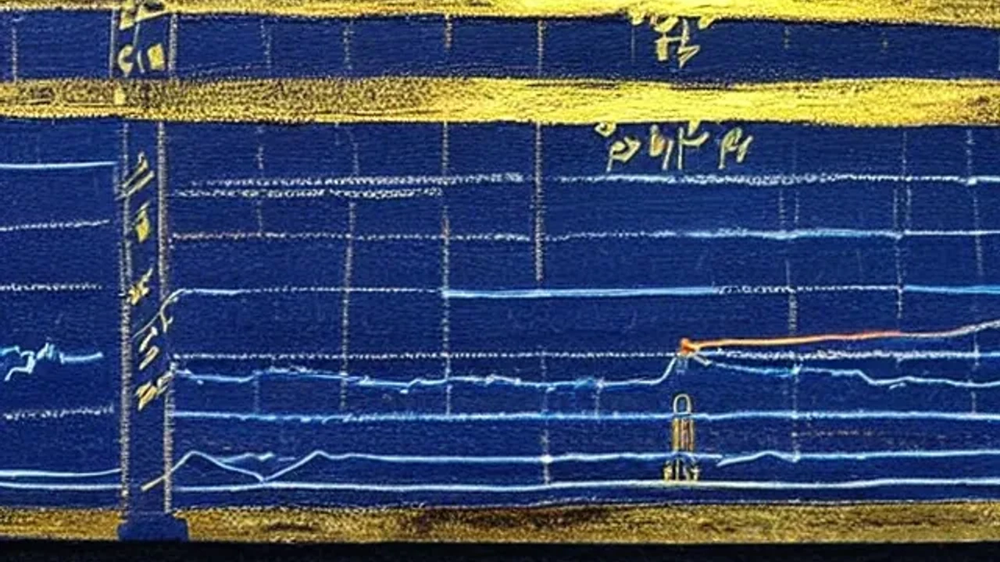

2026년 하반기 국내 재테크 시장의 최대 화두는 단연 국민연금 제도 개편입니다. 정부가 고령층의 경제 활동을 장려하기 위해 **노령연금 감액 기준**을 기존보다 대폭 상향 조정하면서 은퇴 자산가들과 현업 고령 근로자들의 셈법이 분주해졌습니다. 이번 조치는 숙련된 인력의 은퇴를 늦추는 동시에, 그동안 꼭꼭 닫혀 있던 시니어 계층의 강력한 소비력을 깨우는 촉매제로 작용하고 있습니다.

## 노령연금 감액 기준 상향의 핵심 내용

### 기존 319만 원 vs 바뀐 519만 원 주요 차이점
국민연금 공단이 확정한 이번 개정안의 핵심은 일하는 고령자가 연금을 전액 수령할 수 있는 소득의 문턱을 파격적으로 높인 점입니다. 종전에는 근로소득과 사업소득을 합산한 금액이 월 319만 원을 넘어서면 연금 수령액이 즉각 깎였습니다. 반면 올해부터는 월 소득 **519만 원**까지 연금이 단 1원도 감액되지 않고 100% 지급됩니다. 고령 근로자가 현업을 유지하더라도 연금 손실에 대한 페널티 없이 안정적인 현금 흐름을 확보할 수 있게 되었습니다.

### 소득 구간별 연금 삭감 비율 및 한도 시뮬레이션
월 소득이 기준선인 519만 원을 초과하더라도 예전보다 훨씬 완만한 감액 공식이 적용됩니다. 초과 소득액에 따라 구간별로 5%에서 최대 50%까지 누진 감액되지만, 아무리 소득이 높아도 본인 노령연금 원액의 50%를 초과하여 삭감할 수 없다는 상한선은 그대로 유지됩니다. 만약 월 소득이 600만 원인 은퇴 근로자라면, 과거에는 수십만 원에 달하는 연금이 일괄 삭감되었으나 현재는 초과분인 81만 원에 대해서만 미미한 수준의 감액이 적용되어 통장에 찍히는 실수령액이 획기적으로 늘어납니다.

### 이번 법 개정이 고령층 노동 시장에 미치는 파급 효과
그동안 시니어 노동 시장에서는 연금이 깎이는 것을 막으려고 일부러 근무 시간을 줄이거나 다운 계약을 맺는 '연금 난민' 편법이 횡행했습니다. 보건복지부의 최근 동향 조사 결과에 따르면, 실제로 감액 기준선 바로 밑으로 소득을 맞추던 고령 근로자의 비율이 전년 동기 대비 40% 이상 급감했습니다. 족쇄가 풀리자마자 숙련된 시니어 인력들이 전문직 및 관리직 시장에 대거 잔류하기 시작하면서 기업들의 고질적인 구인난에도 숨통이 트이는 모양새입니다.

## 일할수록 이득 은퇴 후 소득 활동 시 주의사항

### 감액 기준에 포함되는 소득 종류와 제외되는 자산 소득 구분하기
가장 흔히 저지르는 실수는 모든 종류의 수입이 감액 기준에 잡힌다고 오해하는 것입니다. 노령연금을 깎는 기준이 되는 소득은 오직 **근로소득**과 **사업소득** 두 가지만 해당합니다. 여기에서 근로소득은 총급여에서 근로소득공제액을 뺀 금액이며, 사업소득은 총수입에서 필요경비를 차감한 순소득을 뜻합니다. 이와 달리 개인이 보유한 부동산 임대 수입이나 주식 배당금, 은행 이자 같은 금융 및 자산 소득은 아무리 많아도 연금 감액에 전혀 영향을 주지 않습니다.

### 연금 수령액을 지키면서 부업 및 프리랜서 수입 유지하는 방법
프리랜서나 개인 사업자로 활동하는 시니어라면 소득 신고 방식을 전략적으로 짤 필요가 있습니다. 종합소득세 신고 시 업무용 차량 유지비, 사무실 임차료, 소모품비 등 **필요경비**를 누락 없이 증빙하여 장부에 반영하면 공식적인 사업소득 금액 자체를 낮출 수 있습니다. 이를 활용하면 실제 쥐는 가처분 소득은 높게 가져가면서도 국민연금 공단상의 소득 지표를 519만 원 이하로 조절하여 연금을 온전히 보전하는 합리적인 재테크가 가능합니다.

### 실수령액을 극대화하는 국민연금 공단 모의 계산기 활용법
개인별로 가입 기간과 기존 납부액이 제각각이므로 정확한 득실을 따지려면 국민연금 앱이나 홈페이지의 모의 계산 탭을 반드시 거쳐야 합니다. 본인의 예상 세전 급여나 사업 수입을 대입하면 감액 구간 진입 여부와 최종 매월 수령할 실지급액을 원 단위까지 미리 시뮬레이션할 수 있습니다. 섣불리 소득 활동을 접기 전에 이 계산기를 통해 손익분기점을 확인하는 과정이 선행되어야 은퇴 자산의 손실을 막아냅니다.

[관련 글 보기](/posts/economy/)

## 돈 버는 시니어 그랜드 제너레이션 소비 특징

### 직접 경험한 5060 세대의 변화된 소비 패턴
> "과거의 시니어들은 자녀에게 재산을 물려주기 위해 무조건 지갑을 닫았지만, 지금의 5060은 자신들의 건강과 여가를 위해 지출을 아끼지 않습니다." - 시니어 마케팅 연구소 트렌드 리포트

자식 세대 지원에 올인하던 과거의 실버 세대와 달리, 현재 시장을 주도하는 1960년대생 중심의 '그랜드 제너레이션(GG)'은 탄탄한 자산과 고정 소득을 무기로 소비 시장의 전면에 나섰습니다. 이들은 은퇴 후에도 경제 활동을 지속하며 확보한 재정적 맷집을 바탕으로 자기계발과 웰빙 라이프에 아낌없는 투자를 감행합니다.

### 백화점 문화센터와 프리미엄 웰니스 시장을 점령한 GG 세대의 위력
실제 서울 시내 주요 백화점의 분기별 매출 데이터를 보면, 평일 낮 시간대 문화센터 강좌와 수입 패션 매장 매출의 65% 이상이 55세 이상 소비자의 지갑에서 나옵니다. 단순히 앓는 소리 하며 영양제를 사 먹는 수준을 넘어, 개인 맞춤형 기능의학 검사나 프리미엄 스파, 시니어 전용 피트니스 클럽 등 이른바 **웰니스(Wellness) 산업**에 지출하는 비용이 매년 가파르게 치솟고 있습니다. 안정적인 연금에 근로 수입까지 뒷받침되기에 가능한 소비 기행입니다.

### 은퇴 자산가들이 지갑을 여는 차별화된 실버 서비스 트렌드
그랜드 제너레이션은 어설픈 가성비 제품보다 자신들의 품격을 높여주고 신체적 변화를 섬세하게 케어해 주는 고품질 서비스에 기꺼이 비용을 지불합니다. 가전 업계에서는 시니어 전용 직관적 UI를 탑재한 프리미엄 라인을 출시해 쏠쏠한 재미를 보고 있으며, 여행 업계 역시 단순 패키지가 아닌 전문 가이드와 의료진이 동행하는 크루즈 및 힐링 투어 상품을 경쟁적으로 내놓으며 이들의 두둑한 지갑을 공략하고 있습니다.

## 연금 감액 제도의 장단점과 향후 전망

### 고령층 근로 의욕 고취와 가계 소득 증대라는 긍정적 측면
이번 규제 완화는 일하는 노인에게 가해지던 역차별적 페널티를 걷어냈다는 점에서 사회적으로 환영받는 분위기입니다. 고령층의 소득이 늘어나면 자연스럽게 민간 소비가 살아나고 소득세를 내는 주체가 유지되므로 국가 재정 측면에서도 선순환 구조를 그리기 유리합니다. 은퇴자들이 사회적 단절감을 극복하고 경제적 자립을 유지함으로써 노인 빈곤율을 실질적으로 낮추는 지표적 성과도 기대됩니다.

### 국민연금 기금 고갈 속도 가속화 및 세대 갈등 우려의 이면
- **재정 부담 가중:** 감액 대상자가 줄어든다는 것은 결과적으로 국민연금 공단이 지급해야 할 연금 총액이 늘어남을 뜻하므로, 기금 고갈 시점을 오히려 앞당길 수 있다는 우려가 나옵니다.
- **청년층의 반발:** 고령층이 일자리와 연금을 동시에 독식하는 구조로 비춰질 수 있어, 연금 재정 부담을 고스란히 짊어져야 하는 2030 청년 세대와의 형평성 논란 및 세대 갈등의 불씨가 여전히 남아 있습니다.

### 100세 시대 초고령 사회에 걸맞은 추가적인 연금 개혁 시나리오 예측
향후 대한민국이 초고령 사회로 깊숙이 진입함에 따라 연금 제도는 끊임없는 수정 보완 단계를 거칠 수밖에 없습니다. 전문가들은 단순히 감액 기준 금액을 올리는 임시방편을 넘어, 궁극적으로는 연금 수급 개시 연령을 점진적으로 늦추거나 소득 활동을 하는 동안 연금 수령을 자발적으로 미루면 추후 더 높은 가산율을 적용해 주는 '연기연금 제도'의 인센티브를 훨씬 넓히는 방향으로 제도의 틀이 바뀔 것으로 내다보고 있습니다.

#노령연금감액기준 #국민연금개편 #그랜드제너레이션 #시니어소비트렌드 #은퇴후소득 #2026국민연금 #연금실수령액 #고령화경제 #노후자산관리