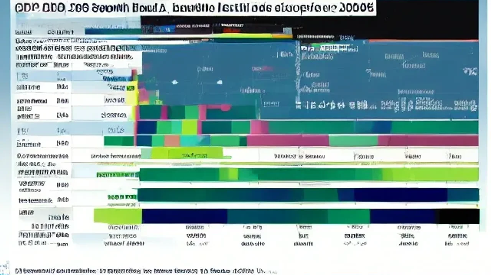

글로벌 경제의 불확실성이 커지는 가운데 최근 발표된 OECD 경고 메시지는 한국 시장 전반에 거대한 경종을 울리고 있습니다. 많은 이들이 눈앞의 반도체 수출 실적에 환호할 때, 구조적 침체의 그늘은 더욱 깊어지고 있어 철저한 대비가 필요한 시점입니다. 단기 호황의 착시에서 벗어나 내 자산을 지킬 실전 전략을 구축해야만 다가올 장기 저성장 국면에서 살아남을 수 있습니다.

## OECD 경고의 실체: 반도체 호황 뒤에 숨은 부도 수표

### 올해 성장률 상향과 내년 잠재성장률 하락의 모순
OECD는 최신 경제전망 보고서를 통해 올해 한국의 실질 국내총생산(GDP) 성장률 전망치를 기존보다 높은 2.6%로 조정했습니다. 이는 G20 선진국 중에서도 눈에 띄는 수정폭이지만, 동시에 내년도 한국의 잠재성장률이 사상 처음으로 **1.5% 선을 밑돌 것**이라는 어두운 지표를 함께 내놓았습니다. 잠재성장률이란 한 국가가 가진 노동, 자본, 자원을 모두 동원해 물가 상승을 자극하지 않고 달성할 수 있는 최대 성장 능력을 뜻합니다. 올해 당장 눈에 보이는 2.6%라는 숫자는 인공지능(AI) 열풍에 탄 반도체 착시일 뿐, 대한민국 경제의 기초 체력 자체가 급격히 무너지고 있다는 강력한 방증입니다.

### 미·중 갈등과 저출생·고령화가 대한민국 성장 엔진에 미친 영향
성장 엔진이 식어가는 가장 큰 원인은 노동력 공급의 절벽과 글로벌 공급망의 재편입니다. 통계청의 인구동향 조사에 따르면 한국의 합계출산율은 매년 역대 최저치를 경신하고 있으며, 이는 생산가능인구(15~64세)의 직접적인 감소로 이어집니다. 노동 투입이 줄어드는데 이를 상쇄할 자본 투자나 생산성 향상도 더디기만 합니다. 게다가 미·중 패권 경쟁으로 인해 대중국 수출 의존도가 높았던 제조 기업들이 공급망을 다변화하는 과정에서 막대한 전환 비용을 지출하고 있습니다. 과거처럼 중국이라는 거대 시장을 배후에 두고 독점적 이익을 누리던 시대가 완전히 막을 내렸음을 의미합니다.

### 역대 정부별 잠재성장률 추이와 현재 위치 비교
대한민국의 잠재성장률은 과거 2000년대 초반만 해도 5% 안팎을 유지했으나, 고착화된 규제와 신성장 동력 부재로 인해 매 정권마다 계단식으로 하락했습니다. 2010년대 3% 안팎을 지나 코로나19 팬데믹 시기를 거치며 2%대 초반으로 내려앉았고, 마침내 1.5% 붕괴라는 심리적 마지노선에 도달한 상황입니다. 
> "잠재성장률 1.5% 미만은 영국, 일본 등 이미 성장이 멈춘 초고령화 성숙 경제국들이 겪는 현상입니다. 한국은 이들보다 자산 축적 기간이 훨씬 짧음에도 불구하고 하락 속도가 가파르다는 점이 치명적입니다." - 국책연구기관 동향 분석

---

## 잠재성장률 1.5% 하회가 내 지갑에 미치는 치명적인 장단점

### 장점? 저성장 고착화가 가져올 저금리 기조 회귀 가능성
잠재성장률이 떨어진다는 것은 경제의 구조적 기초 체력이 약해졌음을 뜻하므로, 중앙은행인 한국은행이 장기적으로 고금리를 유지하기 어렵게 만듭니다. 경기 부양을 위해 기준금리를 다시 낮추거나 최소한 상단을 제약하는 압력으로 작용하게 됩니다. 기존 고금리 상황에서 대출 이자 부담에 시달리던 한계 차주들이나 기술주 투자자들에게는 금리 하향 안정화라는 일시적인 숨통이 트일 여지가 있습니다. 자본 조달 비용이 낮아지면 특정 배당 자산이나 고정 금리형 상품의 매력도가 상대적으로 부각되기도 합니다.

### 단점 1: 국내 기업 이익 체력 저하와 내수 시장의 장기 침체
가장 무서운 본질은 내수 시장의 공멸입니다. 잠재성장률 하락은 실질 임금 성장 정체로 이어지고, 이는 가계의 소비 여력을 극도로 위축시킵니다. 자영업자와 중소기업은 물론, 내수 비중이 높은 대기업들까지 만성적인 매출 부진에 시달릴 수밖에 없습니다. 
- **내수 기업의 한계**: 매출 정체 -> 구조조정 및 고용 축소 -> 소비 위축의 악순환
- **자산 가치 디스카운트**: 한국 시장 자체의 매력도가 떨어져 외국인 자금이 이탈하고 국내 증시가 만성적인 저평가(코리아 디스카운트)에 갇힐 위험 가중

### 단점 2: 국민연금 고갈 속도 가속화와 세수 부족 가시화
경제 규모 자체가 정체되면 정부가 거둬들이는 세수 규모도 급감합니다. 반면 고령화로 인해 지출해야 할 복지 예산과 건강보험, 국민연금 지출은 기하급수적으로 늘어납니다. 국회예산정책처의 장기 재정 전망에 따르면, 경제성장률 하락세가 이대로 굳어질 경우 국민연금 기금 고갈 시점은 당초 예상보다 수년 이상 앞당겨질 가능성이 큽니다. 이는 곧 미래 세대의 세금 부담 급증을 의미하며, 세후 가처분 소득을 더욱 줄여 국내 자산 시장의 활력을 앗아가는 부메랑으로 돌아옵니다.

---

## '한국 리스크' 돌파구: 자산가들이 조용히 실행 중인 해외 대피소 튜토리얼

### 1단계: 원화 자산 방어와 달러 및 미국 장기채 분할 매수 타이밍 잡기
성장률이 정체된 국가의 화폐 가치는 장기적으로 하락 압력을 받게 됩니다. 자산가들이 원화 자산 일변도에서 벗어나 기축통화인 달러화 자산으로 포트폴리오를 빠르게 리밸런싱하는 이유입니다.
1. **매월 고정 환전**: 환율 변동성을 상쇄하기 위해 매달 일정 금액을 미 달러(USD)로 환전합니다.
2. **미국 장기 국채 매입**: 금리 상단이 제한되는 저성장 국면을 대비해 미국 20년물 이상 장기 국채 ETF(예: TLT)를 분할 매수하여 자본 이득과 이자 수익을 동시에 확보합니다.

### 2단계: 코스피 의존도 낮추기 – 미국 성장주 및 글로벌 고배당 ETF 리밸런싱
국내 주식 시장의 만성적 박스권 횡보에 대응하려면 글로벌 시장으로 눈을 돌려야 합니다. 전 세계에서 유일하게 파괴적 혁신을 지속하는 미국 빅테크 기업과 달러 기준 배당을 꾸준히 늘려주는 고배당 자산에 분산 투자하는 구조를 만듭니다. [관련 글 보기](/posts/economy/)
- **혁신 자산 배치**: 인공지능, 자율주행, 바이오 등 글로벌 메가 트렌드를 주도하는 미국 핵심 성장주 비중 확대
- **현금 흐름 확보**: 환차익과 분기·월배당을 동시에 노릴 수 있는 미국 배당성장 ETF(예: SCHD)를 활용해 원화 가치 하락 방어

### 3단계: 엔저를 활용한 일본 핵심 부동산 및 실물 자산 헤지 방법
역사적 저점을 지나고 있는 엔화 가치를 활용해 아시아 내 안정적인 대체 자산을 확보하는 것도 훌륭한 헤지 수단입니다. 일본 도쿄 중심가의 상업용 리츠(REITs)나 핵심 지역의 소형 아파트 등은 엔화 반등 시 환차익과 함께 안정적인 월세 수익을 안겨줍니다. 원화와 달러, 엔화로 자산을 3분할하는 전략은 한국 거시 경제의 하방 리스크가 현실화될 때 자산 전체가 무너지는 재앙을 완벽하게 막아주는 안전판 역할을 수행합니다.

---

## 실제로 겪어본 저성장 국면의 투자 실패담과 2026년의 생존 교훈

### "반도체 올인했다가..." 사이클 정점에서 물린 개미들의 흔한 실수
많은 개인 투자자들이 착시 효과에 속아 실패를 경험합니다. "한국 반도체가 세계 최고라니 주가도 계속 오르겠지"라는 안이한 생각으로 특정 대형주나 레버리지 상품에 자산을 몰아넣는 행위가 대표적입니다. 사이클 산업은 업황이 정점을 찍고 내려올 때 하락 폭이 상상을 초월합니다. 국가 전반의 기초 체력이 부실한 상태에서는 반도체가 잠시 흔들릴 때 증시 전체가 받는 충격이 몇 배로 증폭됩니다. 분산되지 않은 집중 투자가 저성장 국면에서 얼마나 치명적인지 뼈아프게 깨달아야 합니다.

### 부동산 '갭투자'와 '영끌'이 잠재성장률 저하 시기 가장 위험한 이유
과거 고성장·인구 팽창기에는 부동산을 사두기만 하면 우상향 공식이 성립했습니다. 하지만 잠재성장률 1.5% 이하는 인구 감소와 생산성 정체가 본격화됨을 뜻하며, 이는 부동산 시장의 패러다임을 통째로 바꿉니다.
> "실거주 목적이 아닌 과도한 부채를 낀 갭투자는 전세가 하락과 매수세 실종이라는 이중고에 직면하기 쉽습니다. 인구가 줄어드는 지방이나 외곽 지역의 자산부터 빠르게 녹아내릴 것입니다."

대출 금리가 소폭 낮아지더라도 자산 자체의 절대적 수요가 사라지면 환금성이 극도로 악화되어 자산가치가 묶이는 최악의 결과를 초래합니다.

### 현금 비중 30%가 주는 심리적 안정감과 위기를 기회로 바꾼 순간들
자산 관리에서 가장 훌륭한 무기는 언제든 동원할 수 있는 현금 흐름입니다. 시장이 공포에 질려 우량 자산을 헐값에 던질 때, 준비된 현금이 없는 투자자는 강제로 청산당하거나 손가락만 빨아야 합니다. 전체 자산의 최소 30%를 언제든 현금화할 수 있는 고금리 파킹통장이나 단기 CMA, 달러 현금으로 보유하는 원칙을 고수해야 합니다. OECD의 경고는 공포에 질려 투자를 포기하라는 의미가 아니라, 낡은 투자 방식을 버리고 글로벌 관점에서 자산을 전면 재배치하라는 가장 명확한 신호입니다.

#OECD경고 #잠재성장률 #한국경제위기 #자산배분 #달러투자 #미국주식 #부동산전망 #재테크전략 #2026년경제