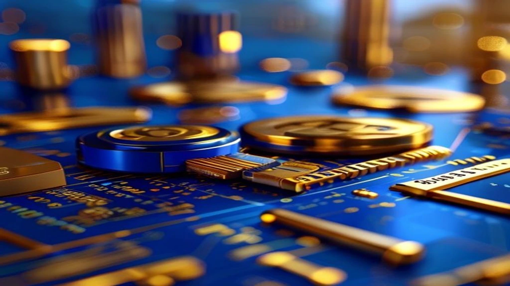
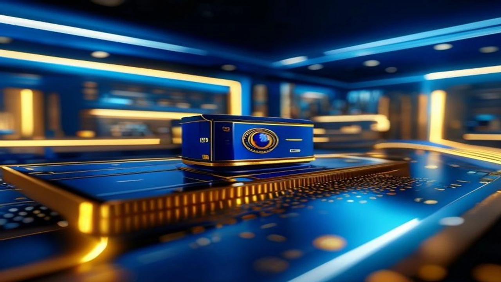

2026년 7월 25일 미국 샌프란시스코 현지에서 **삼성전자 브로드컴 2나노** 파운드리 및 첨단 메모리 대규모 업무협약(MOU) 체결 소식이 연이어 타전됐습니다. 이번 빅딜은 고대역폭메모리(HBM) 공급망을 넘어 차세대 AI 반도체 생태계 전반을 아우르는 판도 변화의 신호탄입니다.

## 삼성전자-브로드컴 292조 원 파운드리 빅딜 체결 현황

### 브로드컴이 선택한 삼성전자 2나노 턴키 솔루션
삼성전자 파운드리사업부는 미국 샌프란시스코 더 미드웨이에서 브로드컴과 2030년까지 총 2,000억 달러(한화 약 292조 원) 규모의 전략적 파트너십을 체결했습니다. 핵심은 단선적 부품 납품을 벗어났다는 점에 있습니다. 삼성은 2나노미터(㎚) 최선단 파운드리 공정, HBM4·HBM4E 차세대 메모리, 2.5D·3D 첨단 패키징을 하나로 묶은 **'턴키(Turnkey, 일괄 공급) 솔루션'**을 브로드컴에 직결시킵니다.

### 메모리·파운드리·패키징 수주가 지닌 파급력
팹리스 기업이 개별 공정을 각기 다른 제조사에 이원화할 때 발생하는 병목 현상과 수율 손실은 치명적입니다. 반면 삼성전자는 설계 초기 최적화부터 칩 생산, 패키징, 최종 출하까지 전 과정을 한 울타리 안에서 처리합니다. 브로드컴의 맞춤형 주문형 반도체(ASIC) 개발 기간을 단축하고 전력 효율을 끌어올릴 핵심 카드입니다.

### TSMC 단독 체제 균열과 파운드리 시장 재편 전망
글로벌 빅테크의 AI 반도체 물량을 독식하던 대만 TSMC 중심 구도에 수직 균열이 생겼습니다. 수율 난항과 적자 누적으로 숨죽이던 삼성전자 파운드리 사업부가 반격의 고지를 점령함과 동시에, 평택캠퍼스 등 국내 핵심 라인의 가동률도 함께 솟구칠 전기를 맞았습니다.

## 브로드컴이 TSMC 대신 삼성 2나노를 선택한 진짜 이유

### TSMC 케파(생산능력) 부족 및 테일러 공장 양산 시점의 이점
TSMC의 최선단 공정 생산 라인은 이미 엔비디아와 애플의 사전 주문으로 만차 상태입니다. 구글 TPU 등 빅테크 ASIC을 수주받아 설계하는 브로드컴 입장에선 빈 적재 공간을 신속히 확보하는 것이 생존 과제였습니다. 삼성전자의 평택 팹과 미국 테일러 공장의 양산 준비 시점이 브로드컴의 출격 로드맵과 매끄럽게 맞물렸습니다.

### HBM4와 2나노 공정을 결합한 올인원 공급망 경쟁력
고성능 AI 가속기를 구현하려면 최첨단 로직 칩과 고대역폭 메모리의 정밀한 맞물림이 필수입니다. 삼성전자는 세계 최초 HBM4E 12단 샘플 출하 성과를 바탕으로 메모리와 2나노 라인을 한 단지 안에서 물리적으로 결합했습니다.

> "AI 시대 반도체 패러다임은 단일 칩의 절대 성능을 넘어, 메모리와 파운드리 및 패키징의 유기적 융합으로 이동했습니다."

### 비용 절감과 납기 단축을 노린 글로벌 빅테크의 셈법
고환율과 원자재 가격 상승 압박 속에서 빅테크의 원가 절감은 선택이 아닌 필수입니다. [환율 1540원 돌파! 달러 투자 지금 할까? 핵심만 정리](/posts/economy/won-dollar-1540-fx-investment/) 사례에서 드러나듯 외환 변동성이 상존하는 환경에서, 단일 공정 체인 구축을 통한 납기 단축과 단가 절감은 브로드컴에 대체 불가능한 수였습니다.

## 주가 및 반도체 테마주 수혜 가능성과 한계점

### 삼성전자 주가 모멘텀과 파운드리 부문 흑자전환 가능성
292조 원이라는 압도적 수치는 삼성전자 DS(반도체) 부문의 장기 실적 불확실성을 가시는 유효타로 작용합니다. 파운드리 부문이 안고 있던 고질적 적자 구조를 깨뜨리고 턴어라운드를 달성할 시점이 당겨졌다는 평가가 지배적입니다.

### MOU 체결 단계의 불확실성과 실제 양산 매출 반영 시기
냉정한 시선도 유지해야 합니다. 이번 파트너십은 5년에 걸친 업무협약(MOU) 성격이 포함되어 있어 본계약 체결 과정의 세부 물량 수율 검증 단계가 남아있습니다. 재무제표 상 실제 매출로 인식되기까지는 시차가 존재합니다.

### 관련 반도체 장비 및 가공 테마주 영향 분석
수혜의 온기는 삼성전자 단일 종목에 머물지 않습니다. 2나노 공정에 투입되는 극자외선(EUV) 노광 장비 부품사, 첨단 패키징(2.5D/3D) 관련 OSAT 기업, HBM 검사 장비 제조사 등 국내 반도체 밸류체인 전반으로 자금이 유입될 공산이 큽니다.

## 초보 투자자가 알아야 할 대응 가이드 및 전략

### 호재 기사 속 단기 급등 시 추격 매수 주의점
대형 호재가 언론을 도배할 때 흔히 저지르는 실수가 당일 갭상승 구간에서의 뇌동매수입니다. 거시경제적 불확실성이 상존하는 만큼 단기 재료 소진에 따른 기술적 눌림목 형성 가능성을 상시 염두에 두어야 합니다. 거시 리스크 관리에 관한 안목은 [금리 동결! 2026 고금리 버티는 숨은 생존법](/posts/economy/us-cpi-shock-fomc-hawkish-strategy-2026/)에서 구체적으로 확인 가능합니다.

### 분할 매수 타이밍과 외국인·기관 수급 확인 방법
* **수급 분석:** 외국인과 기관의 동반 순매수세가 최소 3~5일 이상 유지되는지 관찰
* **분할 접근:** 일시적 오버슈팅 이후 20일 이동평균선 부근으로 숨고르기가 진행될 때 분할 진입
* **체크리스트:** 평택 라인 가동률 지표와 HBM4 최종 양산 승인 뉴스 트래킹

### 장기적 관점에서의 반도체 포트폴리오 재구성 전략
AI 반도체 생태계는 일회성 테마가 아닌 10년 주기 구조적 성장 축입니다. 메모리와 파운드리를 모두 품은 종합 반도체 기업(IDM)의 독보적 가치가 재조명받는 시점인 만큼, 단기 차익을 노리기보다 적립식 분할 투자로 호흡을 길게 가져가는 편이 유리합니다.

#삼성전자 #브로드컴 #2나노공정 #파운드리수주 #HBM4 #반도체테마주 #주식투자전략