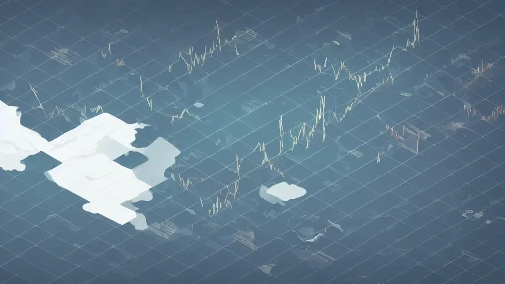

인공지능(AI) 반도체 광풍을 타고 국내 증시에서 **SK하이닉스 ETF** 상품으로 향하는 투자자들의 자금 줄기가 매섭게 몰아치고 있습니다. 단일 종목을 추종하는 선물 및 레버리지 시장의 거래대금이 무려 40조 원을 돌파하면서 시장의 탐욕과 공포가 극에 달한 시점입니다. 과연 지금 이 타이밍에 진입해도 안전할지, 아니면 고점에 물려 장기간 고통받을 상투를 잡는 것인지 매매 데이터와 구조적 결함을 날카롭게 파헤쳐야 합니다.

## 단일 종목 ETF 열풍과 SK하이닉스 40조 쏠림 현상

### 일반 주식 투자 vs 단일 종목 레버리지 ETF 차이점
보통 SK하이닉스 주식을 매수하는 행위는 기업의 미래 가치와 우상향에 판돈을 거는 장기 전술입니다. 반면 단일 종목 레버리지 ETF는 해당 주식의 하루 등락률을 1.5배에서 2배까지 그대로 복제하도록 설계된 고위험 파생상품입니다. 자산운용사가 구성한 장내 파생상품과 스왑 계약을 기반으로 움직이므로, 주가의 방향성을 맞췄을 때의 전리품은 극대화되지만 예측이 틀렸을 때 계좌가 박살 나는 속도 역시 두 배 빠릅니다.

### 왜 자금이 SK하이닉스 선물 시장으로만 급격히 쏠릴까?
엔비디아의 차세대 AI 칩 공급망에서 대체 불가능한 위치를 차지한 국내 반도체 대장주의 독점력 때문입니다. 5세대 고대역폭메모리(HBM3E)의 대규모 양산 및 엔비디아 퀄테스트 통과 소식이 전해질 때마다, 일반 코스피 지수 추종 상품의 지루한 수익률에 지친 공격적 자금이 한꺼번에 쏟아져 들어옵니다. 단기간에 확실한 주가 모멘텀을 가진 특정 우량주에 레버리지를 일으켜 극단적인 자본 효율성을 쥐어짜려는 개인 투자자들의 투기적 심리가 맞물린 결과입니다.

### 엔비디아 공급망 리스크가 국내 반도체 ETF에 미치는 영향
미국 나스닥 시장의 테크 빅테크 기업, 특히 엔비디아의 주가 변동은 다음 날 아침 한국 증시의 관련 ETF 가격을 곧바로 결정짓는 절대적인 변수입니다. 젠슨 황 CEO의 발언 한마디나 엔비디아의 분기 실적 가이드라인에 따라 국내 단일 종목 ETF는 시초가부터 5% 이상의 갭상승 또는 갭하락을 연출합니다. 이는 국내 기업 고유의 재무제표 외에도 글로벌 공급망의 지정학적 리스크와 거시 경제 통화 정책에 이중으로 뺨을 맞는 구조를 형성합니다.

## 폭발적인 수익률 뒤에 숨은 치명적인 변동성 위험성

### 하루 만에 -10%? 단일 종목 ETF의 구조적 한계와 단점
단일 종목 추종 상품의 가장 치명적인 아킬레스건은 바로 **음의 복리 효과(Vol Drag)**에 있습니다. 기초자산인 주가가 매일 상승과 하락을 무한 반복하며 제자리를 맴돌 때, 레버리지 상품의 순자산가치(NAV)는 소리 소문 없이 녹아내립니다. 

> 기초자산이 첫날 10% 하락하고 다음 날 11.1% 상승하면 본전이 되지만, 2배 레버리지 상품은 첫날 20% 하락 후 둘째 날 22.2% 상승해도 원래 가격의 97.7% 수준에 머물며 원금이 손실됩니다.

이러한 수학적 맹점 때문에 장기 보유를 외치는 가치 투자자들에게는 치명적인 독약이 됩니다.

### 하락장에서도 수익 내는 인버스 ETF의 양날의 검
주가 하락 시 배수의 수익을 올리는 인버스 상품은 매력적인 방패처럼 보이지만, 매매 타이밍을 1분 1초 단위로 맞추어야 하는 초고난도 영역입니다. 반도체 사이클의 단기 고점을 예측하고 인버스에 진입했다가, 예상치 못한 외인의 대량 바스켓 매수세가 유입되면 순식간에 강제 청산에 가까운 손실률을 기록하게 됩니다. 하락 추세가 지속되더라도 중간중간 발생하는 기술적 반등(데드캣 바운스) 과정에서 레버리지 인버스 상품의 가치는 처참하게 훼손됩니다.

### 변동성 완화 장치(VI) 발동 시 개인이 입을 수 있는 타격
장중 주가가 미친 듯이 요동치면 한국거래소는 시장 진정을 위해 변동성 완화 장치(VI)를 발동하고 2분간 단일가 매매로 강제 전환합니다. 문제는 이 시점에 파생상품인 ETF의 괴리율이 비정상적으로 벌어질 위험이 크다는 점입니다. 유동성공급자(LP)가 제대로 호가를 대지 못하는 혼란 속에서 패닉 셀로 시장가 주문을 던질 경우, 이론가보다 훨씬 낮은 최악의 가격에 체결되어 막대한 금전적 손실을 고스란히 떠안게 됩니다.

## 내가 직접 겪어본 반도체 고변동성 상품 매매 후기

### 포모(FOMO) 증후군으로 진입했다가 겪은 아찔한 마이너스 순간
주변에서 반도체 레버리지 상품으로 며칠 만에 수천만 원을 벌었다는 인증 글을 보고 포모(FOMO)에 눈이 멀어 급하게 추격 매수를 감행한 적이 있습니다. 진입한 당일 오후, 미 증시 선물 급락과 함께 국내 반도체 대형주들이 일제히 차익 실현 매물을 쏟아내며 계좌 손실률이 한 시간 만에 마이너스 두 자릿수로 내려앉았습니다. 철저한 분할 매수 계획 없이 시장의 광풍에 휩쓸려 들어간 투자가 얼마나 무모한지 계좌가 찢어지며 깨달은 순간이었습니다.

### 욕심을 버리니 보였다: 분할 매도 타이밍 잡는 나만의 기준
쓰라린 깡통의 기억을 겪은 이후 고변동성 상품을 다룰 때는 수익률 목표치를 극단적으로 낮추고 철저한 기계적 분할 매도를 적용합니다. 매수 후 5% 수익이 발생할 때마다 보유 물량의 25%씩을 무조건 청산하여 현금을 쥐는 원칙입니다. 주가가 추가로 더 폭등하더라도 내 영역이 아님을 인정하고, 확보한 현금으로 다음 진입 타이밍을 노리는 것이 계좌를 우상향시키는 유일한 생존 공식이었습니다.

[관련 글 보기](/posts/economy/)

### 커뮤니티(팍스넷/디시) 맹신 금지, 데이터만 보고 진입해야 하는 이유
주식 리딩방이나 리테일 커뮤니티에 올라오는 "지금이 풀매수 기회", "반도체 30만 원 확정" 등의 감정적인 선동 글은 계좌를 갉아먹는 주범입니다. 거래소 웹사이트에서 매일 공시하는 LP 괴리율, 일별 거래대금 추이, 그리고 외국인과 기관의 선물 선물 순매수 포지션 같은 객관적인 수치 자료만 확인해야 합니다. 시장의 소음을 완벽히 차단하고 오직 데이터의 변화에만 집중할 때 비로소 심리적 안정을 유지하며 원칙 매매를 이어갈 수 있습니다.

## 초보 투자자를 위한 안전한 반도체 ETF 실전 매매 튜토리얼

### 증권사 앱에서 단일 종목 레버리지 거래 신청 및 교육 이수하기
국내 증시에서 레버리지 및 인버스 ETF를 거래하려면 금융투자협회에서 제공하는 사전 온라인 교육을 의무적으로 이수해야 합니다. 교육 과정을 완료한 후 발급받은 이수증 번호를 이용 중인 증권사 모바일 트레이딩 시스템(MTS)에 등록합니다. 더불어 계좌의 예수금 외에 기본 예탁금(기본 1,000만 원, 투자 성향 레벨에 따라 차등 적용) 조건을 충족해야 비로소 첫 주문을 넣을 수 있는 권한이 생깁니다.

### 손절선(Stop-Loss) 자동 주문 설정으로 자산 방어하는 법
변동성이 날뛰는 단일 종목 파생 상품은 실시간으로 호가창을 모니터링할 수 없다면 반드시 HTS/MTS의 자동 감시 주문(Stop-Loss) 기능을 걸어두어야 합니다. 매수 직후 본인의 감당 가능한 최대 손실 범위(예: 매수가 대비 -3%)를 지정하고, 해당 가격 터치 시 즉시 시장가로 매도 주문이 나가도록 세팅합니다. 이는 예상치 못한 돌발 악재로 시장이 하한가로 고꾸라질 때 내 소중한 투자 원금이 통째로 증발하는 파산을 막아주는 유일한 생존 로프입니다.

### 적립식 자산 배분 전략으로 변동성 지수를 평단가로 방어하기
거액의 자금을 한 번에 밀어 넣는 몰빵 투자는 고변동성 시장에서 자살 행위나 다름없습니다. 전체 투자 가용 자산을 최소 5회 이상으로 쪼개어, 정해진 날짜나 특정 이평선 지지선에 도달할 때마다 기계적으로 나누어 담는 적립식 접근이 자산을 지킵니다. 주가가 하락할 때는 더 많은 수량의 증권을 매수하게 되어 결과적으로 평균 매입 단가가 낮아지는 달러 코스트 에버리징(Dollar Cost Averaging) 효과를 극대화할 수 있으며, 변동성 자체를 내 편으로 만드는 무기가 됩니다.

#SK하이닉스 #SK하이닉스ETF #반도체ETF #단일종목ETF #레버리지투자 #변동성완화장치 #재테크성공 #주식초보가이드 #투자위험관리 #반도체선물