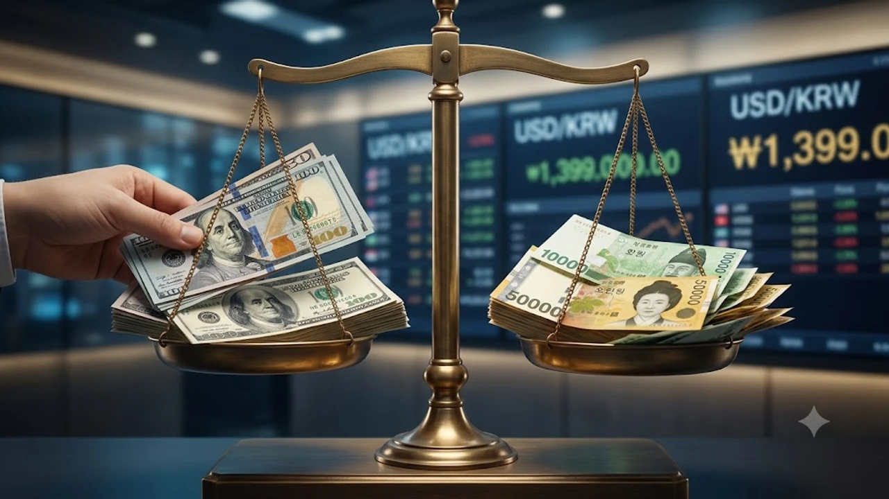

원달러 환율 1300원대 진입이 11개월 만에 가시화되면서 외환 시장과 자산 시장 전반에 큰 파장이 일고 있습니다. 장기간 이어진 고환율 기조 속에서 달러 강세에 베팅했던 투자자들은 급격한 환율 하락과 원화 가치 상승 국면을 맞아 포트폴리오 재편을 서두르는 분위기입니다.

## 11개월 만에 1300원대 진입한 원/달러 환율의 배경

### 미국 금리 인하 기대감과 달러 약세 전환
미국 연방준비제도(Fed)의 긴축 사이클 종료 신호와 함께 주요 거시 지표가 둔화세를 가리키자 글로벌 달러 인덱스가 빠르게 하락했습니다. 시장 참여자들의 무게 중심이 금리 인하 쪽으로 이동하면서, 그동안 안전자산 프리미엄을 누리던 달러화의 독주 체제가 힘을 잃었습니다.

### 반도체 수출 호조에 따른 대규모 네고 물량 유입
국내 주력 수출 품목인 메모리 반도체를 중심으로 수출 실적이 가파르게 개선되면서 외환시장에 달러 공급이 쏟아졌습니다. 수출 대금을 원화로 바꾸려는 기업들의 네고(달러 매도) 물량이 쏟아져 환율 하단을 강하게 압박했습니다. 과거 [원달러 환율 1410원 급락? 바뀐 전략 3가지](/posts/economy/won-dollar-1410-drop-strategy-2026/) 시점과 비교했을 때 경상수지 흑자 폭이 구조적으로 커진 점이 원화 강세에 탄력을 붙였습니다.

### 과거 1400원 고점 국면과의 결정적 차이점
이전 1,400원 돌파 국면이 지정학적 불안과 물가 충격에 기인한 방어적 고환율이었다면, 이번 하락세는 펀더멘털 개선과 대외 금리차 축소 기대가 맞물린 결과입니다. 단순히 일시적 수급 쏠림이 아니라 중장기 환율 밴드 자체가 하향 이동하고 있음을 시사합니다.

## 원화 강세 국면, 개인 투자자에게 미치는 실질적 영향

### 해외 직구 및 해외여행 환전 비용 절감 효과
환율이 1,400원 선 밑으로 떨어지면 해외 결제 및 현지 통화 환전 시 체감 비용이 즉각 낮아집니다. 동일한 1,000달러 결제 기준으로 환전 수수료와 카드사 청구 금액이 수만 원 이상 절감되어 직구족과 출국자들의 실질 구매력이 회복됩니다.

### 미국 주식 및 외화 자산 보유자의 환차손 리스크
미국 지수나 개별 종목의 주가가 상승하더라도 원화 환산 평가액은 환율 하락분만큼 깎여 나가는 '환차손'이 발생합니다. 원/달러 환율이 5% 하락하면 주가가 5% 올라도 계좌 수익률은 본전에 머무르므로 자산 평가액 방어가 핵심 과제로 떠오릅니다.

### 국내 증시 및 외국인 수급 개선에 미치는 긍정적 신호
원화 가치가 상승하면 국내 증시에 진입하는 외국인 투자자 입장에서 환차익을 기대할 수 있습니다. 코스피·코스닥 시장으로 외국인 순매수가 강하게 유입되면서 대형 수출주뿐만 아니라 내수주 전반의 유동성이 개선되는 선순환이 형성됩니다.

## 달러 예금과 미국 주식, 지금 팔아야 할까?

### 보유 달러 분할 매도 vs 유지 판단 기준
평단가가 1,350원 이하인 장기 투자자라면 공포에 휩쓸려 전량 매도하기보다 포트폴리오의 외화 비중을 조절하는 선에서 접근하는 편이 유리합니다. 반면 1,420원 이상 고점에서 진입한 단기 차익 목적의 자금이라면 기술적 반등 구간마다 20~30%씩 쪼개어 매도하는 분할 정리가 현명합니다.

> **환테크 핵심 원칙:** 환율의 바닥과 꼭지점은 예측의 영역이 아니므로, 몰빵 환전 대신 3~4회에 걸친 분할 체결로 평단가를 관리해야 안전합니다.

### 환노출(UH) ETF vs 환헤지(H) ETF 수익률 비교
미국 S&P500이나 나스닥100 지수를 추종하는 국내 상장 ETF를 고를 때 상품명 뒤에 붙은 표기를 철저히 확인해야 합니다.

- **환노출(UH) 상품:** 환율 하락 시 지수 상승분 일부가 환차손으로 상쇄되므로, 달러 약세 국면에서는 상대적으로 불리합니다.
- **환헤지(H) 상품:** 환율 변동을 헤지해 순수 기초자산의 등락률만 반영하므로 원화 강세장에서 방어력이 뛰어납니다.

과거 [환율 1540원 돌파! 달러 투자 지금 할까? 핵심만 정리](/posts/economy/won-dollar-1540-fx-investment/) 국면에서 환노출 상품이 유리했다면, 지금처럼 하방 압력이 강한 장세에서는 환헤지 상품의 비중을 단계적으로 늘리는 전략이 적합합니다.

### 저점 분할 매수를 노리는 외화 자산 포트폴리오 전략
달러는 여전히 글로벌 기축통화이자 위기 발생 시 안전자산 역할을 수행합니다. 1,300원대 중후반까지 하락한 국면은 고점 대비 달러를 저렴하게 사 모을 수 있는 기회가 될 수 있으므로, 매월 일정 금액을 분할 환전하여 미국 배당 ETF나 우량 채권으로 매수하는 구조를 설계할 수 있습니다.

## 환율 변동성 속에서 자산을 지키는 실전 환테크 가이드

### 주요 은행 환전 우대율 90% 이상 챙기는 법
모바일 뱅킹 앱을 활용하면 주요 통화(USD, JPY, EUR)에 대해 기본 90% 환율 우대(Spread 할인)를 적용받을 수 있습니다. 외화 가상계좌나 외화 통장을 개설한 뒤 목표 환율을 미리 설정해 두는 '자동 환전 기능'을 걸어두면 불필요한 고점 매수를 원천 차단할 수 있습니다.

### 증권사 외화 RP 및 단기 금융상품 활용 팁
쉬고 있는 달러 현금을 그냥 계좌에 묶어두는 것은 기회비용 손실입니다. 

- **수시입출식 외화 RP:** 하루만 맡겨도 연 4%대 안팎의 외화 이자를 지급하며 언제든 매매가 가능합니다.
- **약정식 외화 RP:** 30일~90일 단위로 자금을 묶어둘 경우 더 높은 확정 금리를 제공받습니다.
- **외화 MMF:** 초단기 우량 채권에 분산 투자하여 안정성과 유동성을 동시에 확보합니다.

### 추가 하락과 반등에 대비한 단계별 대응 수칙
환율이 1,380원 선을 일시적으로 하회하더라도 미국의 돌발 물가 지표나 지정학적 변수로 언제든 기술적 반등이 발생할 수 있습니다. 따라서 전액을 한 번에 원화로 환전하거나 달러로 바꾸는 극단적 포지션 대신, 1,380원·1,360원 등 주요 지지선마다 자금을 배분해 진입과 청산을 병행하는 원칙을 고수해야 합니다.

#원달러환율 #환율전망 #환테크 #달러투자 #미국주식환노출 #외화예금 #환헤지ETF