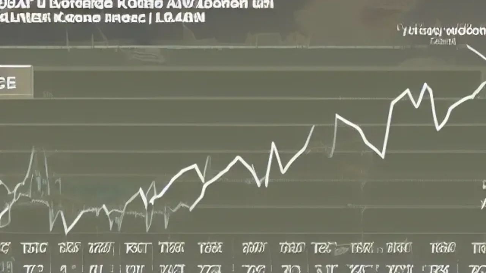
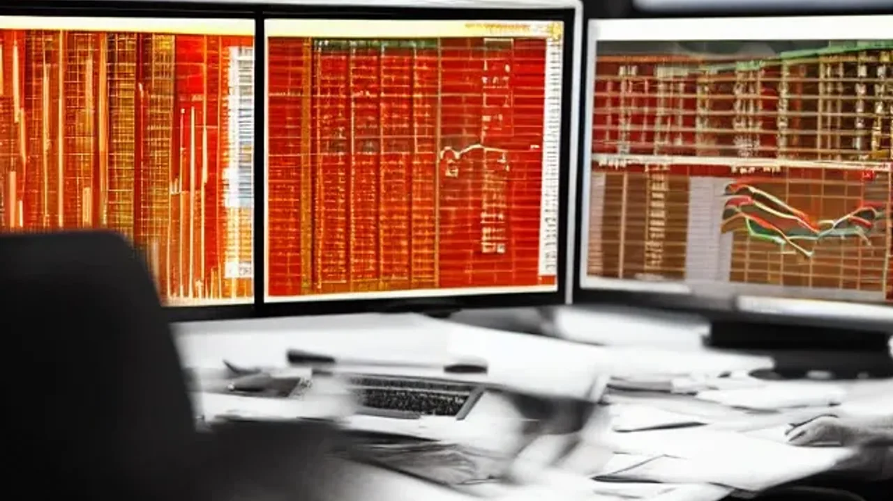

**환율 1540원 돌파**라는 전례 없는 금융 격변기를 맞이하면서 자산 시장 전체가 마비 증세를 보이고 있습니다. 원화 가치 급락으로 자산이 녹아내리는 공포 속에서, 지금이라도 안전 자산인 달러를 쥐어야 할지 시장의 눈치싸움이 치열합니다. 오늘 시장 흐름을 날카롭게 해부하고 실전에서 살아남을 수 있는 구체적인 달러 투자 타이밍을 핵심만 정리하여 공유합니다.

## 환율 1540원 돌파, 왜 지금 자산 시장이 흔들릴까?

### 금융위기 이후 최고치 찍은 원·달러 환율 배경
외환시장에서 원·달러 환율이 1,540원선을 넘어선 배후에는 글로벌 거시경제의 악재가 도미노처럼 엮여 있습니다. 미국 빅테크 기업들의 실적 둔화 우려와 대미 관세 장벽 강화 기조가 달러 인덱스를 강하게 밀어 올린 탓입니다. 여기에 중동 지역의 지정학적 리스크가 재점화되면서 안전 자산인 달러화로 전 세계 자금이 흡수되는 현상이 가속화되었습니다.

### 외국인 자금 이탈과 국내 증시 매도 폭탄의 상관관계
환율이 임계점을 넘어서면 국내 증시에 진입한 외국인 투자자들은 자산 가치 하락과 환차손을 동시에 겪게 됩니다. 
* **설상가상**: 코스피 시장에서 하루 만에 수조 원대 매물 폭탄이 쏟아지며 프로그램 매도호가 일시효력정지(사이드카)가 발동되는 사태로 이어졌습니다.
* **악순환의 고리**: 외국인의 주식 매도는 곧 원화를 팔고 달러를 바꾸는 수요를 자극하여 환율을 다시 끌어올리는 악순환의 기폭제가 됩니다.

### 정부의 긴급 구두개입, 과연 약효가 있을까?
기획재정부와 한국은행 등 외환당국이 긴급 시장상황점검회의를 소집하고 "시장 쏠림 현상을 예의주시하고 있으며 필요한 경우 단호한 조치를 취하겠다"는 구두개입 메시지를 던졌습니다. 하지만 과거 사례를 추적해 보면 구두개입은 일시적인 매도세를 진정시키는 미봉책에 불과했습니다. 거시적인 달러 강세 흐름 자체를 뒤바꾸기에는 역부족이라는 것이 시장의 냉정한 진단입니다.

## 달러 투자 지금 할까? 전문가들이 말하는 장단점

### 지금 사도 안 늦었다? 추가 상승 시나리오와 기대 수익
일부 자산관리 전문가들은 환율의 상단이 1,600원선까지 열려 있다는 시나리오를 제시합니다. 미국의 고금리 장기화 기조와 한국의 수출 경기 둔화가 겹칠 경우, 현재 가격도 고점이 아닐 수 있다는 분석입니다. 이 관점에서는 지금 달러를 확보하더라도 향후 환차익과 함께 자산 방어 효과를 톡톡히 누릴 수 있다는 장점이 존재합니다.

### 상고하저 가능성, 최고점에서 물릴 수 있는 위험 요인
반면 현재의 환율 급등이 과도한 공포심이 만들어낸 '오버슈팅(과열 연출)'이라는 지적도 팽팽합니다. 하반기 글로벌 공급망이 안정되고 미국 연방준비제도의 통화정책 기조가 전환되면 환율이 순식간에 1,400원대 초반으로 급락할 위험이 있습니다. 최고점 부근에서 추격 매수를 감행했다가 장기간 자금이 묶이고 손실을 볼 가능성을 배제하기 어렵습니다.

> **과거 환율 급등기 사례로 보는 자산 방어 성공 패턴**
> 1997년 외환위기나 2008년 금융위기 당시, 환율이 폭등하는 시점에 자산의 일정 비율을 달러로 기계적 분산해 둔 투자자들은 국내 자산(부동산, 주식) 가치가 폭락했을 때 달러를 매도해 초저가 매수 기회를 잡았습니다. 달러 투자는 단순한 수익 목적이 아닌, 위기 시 가치가 폭등하는 '보험'으로 접근하는 통찰이 요구됩니다.

## 소액으로 바로 시작하는 실전 달러 헤지 방법 3가지

### 환전 우대율 100% 받고 외화 예금 통장 개설하는 법
시중은행이나 모바일 앱 기반 인터넷은행을 활용하면 환전 수수료를 최대 100%까지 아끼면서 외화 예금을 개설할 수 있습니다. 
- 단기 자금 예치에 유리하며, 원화로 원할 때 언제든 즉시 환전이 가능합니다.
- 외화 예금의 가장 큰 매력은 환차익에 대해 비과세 혜택이 적용된다는 사실입니다. 단, 은행별로 하루 환전 한도나 출금 수수료 조건이 다르므로 미리 체크해야 효율적입니다.

### 주식 계좌로 간단하게 매수하는 달러 ETF
앱을 통한 환전 과정이 번거롭다면 국내 증시에 상장된 미국달러선물 ETF를 매수하는 방법이 효과적입니다.
* **선택지**: 환율 상승에 정방향으로 연동되는 기본 ETF부터 변동성을 극대화한 레버리지 상품까지 주식 사듯 1주 단위로 손쉽게 거래할 수 있습니다. 
* **주의**: 환율이 하락세로 돌아서면 손실이 고스란히 발생하므로 철저하게 분할 매수로 접근해야 안전합니다.

### 미국 배당주 투자를 통한 환차익과 배당금 동시 공략
가장 권장하는 전략은 고배당 미국 ETF나 매월 배당을 주는 리츠(REITs) 주식을 달러로 직접 매수하는 방식입니다. 환율이 오르면 보유한 주식의 원화 환산 가치가 상승해 환차익을 얻고, 매달 들어오는 달러 배당금으로 고환율 시기에 추가 수익을 창출하는 이중 헤지가 완성됩니다.

[관련 글 보기](/posts/economy/)

## 위기를 기회로 만든 실제 자산 배분 포트폴리오 후기

### 원화 자산 일변도에서 달러 자산 30%로 분산한 결과
전체 투자 자산의 100%를 국내 주식과 원화 예금으로만 보유했던 과거 방식에서 탈피해, 자산의 30%를 달러 자산으로 포트폴리오 리밸런싱을 단행했습니다. 이번 국내 증시 폭락장 속에서도 달러 가치 상승분이 원화 주식의 평가손실을 상쇄해 주면서 전체 자산의 방어력을 굳건히 유지하는 경험을 했습니다.

### 환율 변동성 장세에서 멘탈을 지켜준 분할 매수 원칙
환율이 1,500원을 넘어설 때 일시불로 전액을 환전하고 싶은 유혹이 강하게 들었지만, 매주 정해진 요일에 일정 금액만 환전하는 분할 매수 원칙을 고수했습니다. 결과적으로 고점 매수에 대한 심리적 압박감에서 벗어날 수 있었고, 시장 변동성에 일희일비하지 않는 안정적인 투자 페이스를 유지하는 원동력이 되었습니다.

### 초보 투자자가 가장 흔하게 저지르는 환전 수수료 실수담
달러 투자를 처음 시작할 때 흔히 저지르는 실수가 바로 일반 은행 창구에서 높은 수수료를 지불하고 실물 달러 지폐로 환전하는 행위입니다. 실물 지폐는 보관이 불편할 뿐 아니라 매실 때와 파실 때 수수료율 차이가 커 가만히 앉아서 자산이 깎여 나갑니다. 반드시 모바일 앱의 우대 환전 기능을 이용하거나 증권사의 실시간 환전 시스템을 거쳐 전산상으로 매매해야 비용 누수를 막을 수 있습니다.

**함께 읽으면 좋은 글**
- [2026 금리 인하, 자산 버블 진짜 대처법](/posts/economy/global-rate-cuts-asset-bubble-2026/)
- [2분기 GDP 깜짝 성장! 기준금리 또 올릴까?](/posts/economy/2026-q2-gdp-surprise-growth-rate-hike-outlook/)

#환율1540원돌파 #달러투자 #외환시장 #재테크전략 #자산배분 #환차익 #달러외화예금 #미국주식 #경제트렌드