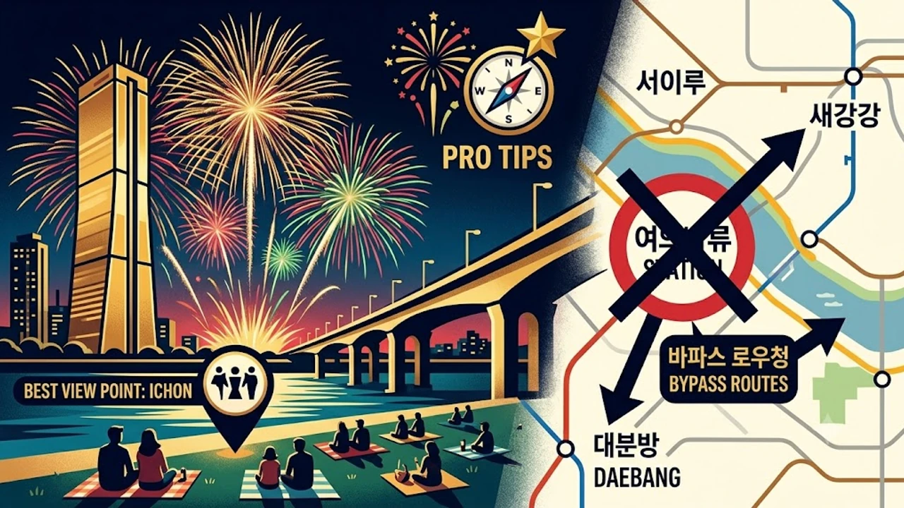

오늘(10월 3일) 드디어 서울 밤하늘을 불꽃이 뒤덮는 날인데, 다들 제대로 자리 잡을 계획은 세웠어? **2026 서울세계불꽃축제 명당**을 찾겠다고 무작정 여의도로 돌진했다가는 불꽃은커녕 사람들 뒤통수만 구경하다 탈진하기 십상이야. 인파에 치이지 않고 불꽃 쇼를 제대로 즐길 수 있는 관람 스팟과 실시간 교통 대처 꿀팁을 솔직하게 풀어줄게.

## 2026 여의도 불꽃축제 관람 포인트별 장단점

### 여의도 한강공원 vs 이촌 한강공원 명당 비교
여의도 한강공원 멀티플라자는 사운드와 조명, 초대형 불꽃을 정면에서 체감하는 1열 구역이지만, 정오만 지나도 은박 돗자리로 빈틈 하나 안 남아. 솔직히 말해줄게. 화장실 왕복에만 40분이 걸리는 생고생을 피하고 싶다면 강 건너편 **이촌 한강공원**이 훨씬 영리한 선택이야. 음악이 웅장하게 울려 퍼지는 맛은 덜해도 63빌딩을 등지고 터지는 거대한 와이드 불꽃을 파노라마로 눈에 담기엔 여기가 독보적이거든. 잔디밭 경사가 완만해서 앞사람 머리에 시야가 가로막힐 일도 적어.

### 노량진 수산시장 주차타워와 사육신공원 시야 차이
흙먼지 날리는 바닥에 주저앉기 싫은 사람들에게 훌륭한 대안이 바로 노량진 수산시장 4층 야외 주차장이야. 원효대교 쪽 발사대와 거리는 약간 떨어져 있지만 시야를 방해하는 고층 빌딩이 없어 불꽃 상단 궤적이 깔끔하게 잡혀. 무엇보다 실내 매점과 수세식 화장실을 이용할 수 있다는 게 엄청난 강점이지. 반면 사육신공원은 언덕 숲길 사이로 불꽃을 내려다보는 운치가 빼어나지만, 나무 잔가지가 많아 가림 없는 명당 틈새가 좁아. 오후 3시만 넘어도 삼각대를 세운 사진가들로 꽉 차버리니 일찍 움직여야 해.

### 한강대교·원효대교 도보 관람 구역 특징
다리 위에서 머리 위로 쏟아지는 불꽃을 직관하는 쾌감은 굉장하지만 함정이 숨어 있어. 한강대교 북단 보행로는 시야가 훤히 트여 불꽃의 잔상이 강물 위에 붉게 번지는 장면이 압권이야. 하지만 본격적인 통제가 걸리면 안전 요원들이 압사 위험을 막으려고 보행자를 쉼 없이 밀어내. 난간에 멈춰 서서 사진을 찍으려다 제지당하기 십상이니, 다리 위는 '자리를 펴는 곳'이 아니라 '천천히 걸어가며 눈에 담는 스팟'으로 접근해야 뒤탈이 없어.

## 대중교통 통제 구역 및 실시간 우회 동선

### 여의동로 전면 통제 시간과 5호선 여의나루역 무정차 통과 기준
오후 2시부터 마포대교 남단에서 63빌딩 앞까지 뻗은 여의동로는 버스를 포함한 모든 일반 차량이 전면 차단돼. 지하철을 탈 생각이라면 5호선 여의나루역은 머릿속에서 아예 지워버려. 승강장 밀집도가 조금만 치솟아도 열차는 안내 방송과 함께 무정차로 통과해 버리거든. 인파에 밀려 역사 안에 갇히는 불상사를 겪기 싫다면 여의나루역 탑승 시도는 접어두는 게 좋아.

### 9호선 샛강역·신반포역 대체 이동 경로
여의도로 꼭 진입해야 한다면 9호선 **샛강역**이나 1호선 **대방역**을 이용해 걸어 들어가는 동선이 답이야. 한강 둔치까지 15분에서 20분 정도 발품을 팔아야 하지만, 옴짝달싹 못 하는 지하철 압사 위험 없이 쾌적하게 빠져나올 수 있어. 이촌 방면으로 갈 거라면 4호선 이촌역 대신 경의중앙선 서빙고역이나 신반포 쪽에서 한강 나들목을 타고 건너오는 우회로를 타야 출구 앞 병목 현상에 갇히지 않아.

### 귀가 인파 분산용 심야 버스 및 임시 운행 지하철 노선
행사가 막을 내리는 밤 8시 40분부터 10시까지는 행사장 반경 모든 도로와 역사가 마비돼. 이때 곧바로 지하철역으로 돌진하면 1시간 동안 제자리걸음만 걷게 돼. 차라리 행사장 뒤편 빌딩 숲 골목 카페에서 몸을 녹이거나 [연예이슈 전체 글 보기](/posts/entertainment/)를 읽으며 혼잡이 잦아들길 기다리는 편이 백배 나아. 서울시가 자정까지 지하철 증편과 임시 시내버스를 집중 배차하니까, 30분만 출발을 늦춰도 여유롭게 앉아서 집으로 향할 수 있어.

## 인파 속에서 살아남는 불꽃놀이 필수 준비물 5가지

### 보온 의류와 접이식 매트 실사용 기준
10월 초 한강 강바람은 해가 지는 순간 체감 온도를 얼어붙게 만들어. 낮에는 반소매로 버텼더라도 저녁이 되면 찬 기운이 뼛속까지 파고들거든.
- **경량 패딩 또는 두툼한 플리스 담요**: 3시간 이상 야외 바닥에 버티려면 체온 유지가 최우선이야.
- **도톰한 발포 폼 돗자리**: 얇은 은박 돗자리는 한강 흙바닥에서 올라오는 습기와 냉기를 전혀 쳐내지 못해. 휴대용 접이식 방석을 덧대는 게 요령이야.

### 통신 지연 대비 오프라인 지도 및 결제 수단 준비
수십만 인파가 좁은 강변에 몰리면 기지국 트래픽 과부하로 LTE와 5G 데이터 통신이 먹통이 돼. 동행과 메신저가 끊겨 미아가 되는 일이 흔해.
- 모바일 뱅킹 송금이 멈출 수 있으니 **비상용 만 원짜리 지폐 몇 장**을 꼭 주머니에 넣어둬.
- 흩어졌을 때 다시 만날 장소를 지상 조형물이나 편의점 번호 같은 랜드마크로 미리 정해두고, 약속 장소 지도를 오프라인 이미지로 캡처해두는 기지가 필요해.

### 보조배터리 용량 및 편의점 품절 전 챙겨야 할 간식
축제 현장에서 스마트폰 배터리가 방전되면 귀가길 모바일 교통카드 태그조차 못 하고 길을 잃어버려. 10,000mAh 이상 보조배터리는 챙겨야 든든해.
- 여의도 일대 편의점 진열대는 오후 3시면 생수, 초콜릿, 삼각김밥이 싹 비워져.
- 보온병에 담은 온수와 핑거푸드 간식은 반드시 출발 전 동네 마트에서 넉넉하게 챙겨 가방에 넣어 가야 해.

## 자리 선점부터 퇴장까지 단계별 실전 가이드

### 오후 2시 이전 도착자 명당 선점 절차
명당에 돗자리를 펴고 온전한 시야를 확보하려면 늦어도 오후 1시 반에는 현장에 도착해야 해. 잔디밭 한복판을 헤매지 말고 경사면 상단이나 가로수가 시야를 가리지 않는 틈을 빠르게 확인하고 짐을 풀어.

> "바람 방향을 확인하지 않고 연기가 날아오는 쪽에 자리를 잡으면, 1시간 내내 화약 연기만 마시다 끝난다."

당일 풍향 예보를 확인해서 바람을 등지거나 측면에서 바라보는 자리를 고르는 게 불꽃 쇼를 선명하게 감상하는 핵심 팁이야.

### 메인 연출 시작 전 화장실 이용 및 자리 유지 요령
오후 5시가 넘어가면 행사장 내 이동식 간이 화장실 대기 줄이 100미터를 훌쩍 넘어가.
- 오후 4시 반 전후로 화장실을 미리 다녀오고 물 섭취량을 조절해.
- 일행과 번갈아 자리를 지키되, 돗자리 위에 무거운 가방을 올려두어 강바람에 날리지 않도록 눌러둬.
- 자리를 비운 틈을 타 돗자리를 밀고 들어오는 얌체족을 막으려면 짐을 네 귀퉁이에 분산 배치해 두는 게 요령이야.

### 종료 직후 혼잡을 피하는 30분 퇴장 대기 전략
마지막 그랜드 피날레가 터지고 불꽃이 잦아들자마자 출구로 내달리는 건 최악의 선택이야. 병목 현상 때문에 나들목 좁은 계단에서 오도 가도 못하고 깔릴 위험이 크거든. 피날레가 끝나면 돗자리에 차분히 앉아 쓰레기를 정리하면서 최소 30분간 여운을 즐기며 대기해. 현장 통제 요원이 주 동선을 확보하고 1차 인파가 빠져나간 뒤 천천히 걸어 나오는 게 체력도 지키고 훨씬 안전해. 찬 바닥에서 길어지는 대기 시간에 대비해 휴대용 보온 방석을 챙겨두면 쾌적하게 버틸 수 있어.
[캠핑용 보온 방석 쿠팡에서 보기](https://www.coupang.com/np/search?q=%EC%BA%A0%ED%95%91%EC%9A%A9%EB%B3%B4%EC%98%A8%EB%B0%A9%EC%84%9D&sourceType=affiliate&trackingCode=AF8691300)

#2026서울세계불꽃축제 #여의도불꽃축제 #불꽃축제명당 #이촌한강공원 #불꽃놀이준비물 #여의도교통통제 #노량진수산시장명당 #한강데이트코스