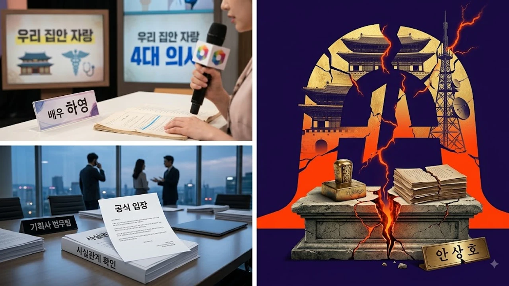

배우 하영이 방송에서 4대째 의사 집안이라는 남다른 족보를 자랑했다가, 증조부의 일제강점기 친일 행적 의혹이 터지면서 온라인이 그야말로 뒤집어졌어. 처음엔 소속사 비스터스엔터테인먼트가 "온라인에 퍼진 소문은 전부 사실무근"이라며 법적 대응까지 운운하더니, 불과 하루 만에 말을 싹 뒤집고 꼬리를 내렸지 뭐야. 대체 무슨 일 때문에 하루 사이에 여론판이 이렇게 180도 바뀐 건지, 배우 하영 증조부 친일 논란 전말을 핵심만 딱 짚어볼게.

## 배우 하영 가족사 발언과 증조부 친일 의혹의 시작

### 하영의 방송 중 4대째 의사 집안 언급 계기
사건의 발단은 KBS2 예능 *옥탑방의 문제아들* 방송분이었어. 방송에 나온 하영은 "증조할아버지가 일본에서 양의학을 배워와 한국에서 개원하신 최초의 의사였다"며 할아버지, 아버지, 언니까지 모두 의사로 재직 중인 **4대째 의사 집안**이라고 공개했지. 방송 자막에도 '고종 황제 치료'라는 타이틀이 박히면서 대중의 부러움을 샀어.

### 인터넷 커뮤니티를 통한 증조부 안상호 인물 추적
방송이 나간 직후 누리꾼들의 추적이 시작됐어. '한국인 최초로 일본 의사 자격증을 취득한 의사'라는 독보적인 조건 덕분에 증조부의 실명이 근대 의사 **안상호(1872~1927)** 선생이라는 사실이 금방 밝혀졌지. 그런데 이 인물의 과거 행적을 파헤치다 보니 예상치 못한 기록들이 쏟아져 나오기 시작한 거야.

### 광복절을 앞두고 불거진 친일 행적 논란의 파장
하필 시기마저 광복절 직전이라 민감도가 폭발할 수밖에 없었지. 1918년 조선총독부 기관지 *매일신보*에 실린 안상호의 인터뷰 기사가 발굴됐는데, "나는 일본인과 다름없다"며 조선 옷을 입지 않는 생활양식을 과시하거나 일제 강점기 친일 단체 활동에 참여했다는 지적이 이어지면서 커뮤니티는 제대로 타올랐어.

## 소속사의 '사실무근' 강경 대응과 반나절 만의 공식입장

### 1차 해명문: "동명이인 및 사실무근" 강력 부인
논란이 일자 소속사 비스터스엔터테인먼트는 언론을 통해 "증조부가 안상호 선생인 것은 맞지만, 인터넷에서 제기된 친일 의혹은 전혀 사실무근"이라고 칼 같이 반박했어. 명예훼손 대응까지 시사하며 강경한 태도를 유지했지. 

### 네티즌들의 역사 기록 추적과 대정친목회 평의원 명단 발견
하지만 네티즌들은 여기서 멈추지 않고 한국민족문화대백과사전과 당시 사료를 더 파헤쳤어. 그 결과 1916년 서울에서 결성된 대표적 친일 단체 **'대정실업친목회'**의 평의원 명단에서 안상호라는 이름 석 자가 또렷하게 찍힌 기록을 찾아내 공유해 버렸지.

### 언론 보도 확산에 따른 대중의 거센 비판 기류
성급하게 "사실무근"이라며 쉴드를 치던 소속사의 태도는 기름을 부은 꼴이 됐어. 제대로 된 역사적 검증도 없이 대중을 거짓말쟁이로 모느냐는 비난이 폭주했고, 각종 연예 매체들도 일제히 관련 보도를 쏟아냈지. [연예이슈 전체 글 보기](/posts/entertainment/)에서 다루는 수많은 사건 중에서도 이렇게 신속하게 사료가 증명된 케이스는 드물 정도야.

## 하루 만에 인정 및 사과, 입장을 번복한 결정적 이유

### 대정친목회 평의원 추가 기록 확인과 오류 인정
결국 소속사 측은 빼도 박도 못하는 명확한 사료 기록을 확인하고 손을 들었어. 자신들이 섣부르게 "사실무근"이라고 발표했던 1차 해명이 명백한 조사 부족과 판단 오류였음을 인정한 거지. 입장 번복의 결정적 계기는 사료 데이터베이스에 남아있는 '친일 단체 평의원 명단' 그 자체였어.

> "증조부 안상호 선생이 일제강점기 친일 단체인 대정친목회 평의원으로 활동한 기록을 확인했습니다. 성급한 1차 대응으로 혼란을 드려 진심으로 사과드립니다."
> — 소속사 비스터스엔터테인먼트 2차 공식 입장문 중

### 소속사 비스터스엔터테인먼트의 2차 공식 사과문 분석
하루 만에 낸 사과문에서 소속사는 "배우 본인도 증조부의 구체적인 역사적 행적까지는 알지 못했다"며 집안 자랑을 하려다 벌어진 일임을 고개 숙여 사과했어. 당초 민족문제연구소의 *친일인명사전*에는 등재되지 않았다가 사료 기록이 추가 확인되면서 낭패를 본 셈이지.

### 검증 부실 비판에 대한 소속사와 배우의 대응 방식
결국 **'자체 검증 없이 무조건 부정부터 하고 본 미숙한 리스크 관리'**와 **'명백히 남아있는 친일 단체 참석 기록'**이라는 2가지 이유 때문에 소속사는 하루 만에 백기를 들 수밖에 없었던 거야. 배우 하영 역시 이번 일로 이미지에 큰 타격을 입게 됐지.

## 연예인 집안 역사성 논란이 대중에게 미치는 영향

### 과거 발언으로 시작된 연예계 역사성 검증 실태
요즘은 예능이나 인터뷰에서 족보나 조상 자랑을 함부로 했다간 뼈도 못 추리는 시대야. 대중의 역사 인식 수준이 높아졌고 인터넷을 통한 사료 접근성이 워낙 좋다 보니, 몇 십 년 전 신문 기사까지 1시간 만에 털리는 세상이거든.

### 대중의 대처 요구 수준과 소속사 위기관리의 중요성
이번 사건의 진짜 핵심은 연좌제 그 자체보다 **'소속사의 오만한 거짓 해명'**에 있어. 처음부터 "역사적 사실 관계를 정확히 확인하겠다"고 팩트 체킹을 먼저 했다면 이렇게까지 매를 벌지는 않았을 텐데 말이지. 연예 기획사들의 위기관리 능력이 얼마나 허술한지 보여주는 대표적인 사례로 남게 됐어.

### 향후 배우 하영의 활동 및 여론의 향방 전망
넷플릭스 신작 주연을 맡으며 한창 상승세를 타던 하영 입장에서는 그야말로 악재를 만난 격이야. 역사학계 일각에서 "단순 단체 가입만으로 과도한 악플을 달거나 연좌제를 적용하는 것은 신중해야 한다"는 의견을 내놓기도 했지만, 일단 당분간 냉랭한 여론을 피하긴 어려워 보여.

**함께 읽으면 좋은 글**
- [영케이 YOUNGEST 컴백! 진짜 주목할 핵심 3가지](/posts/entertainment/young-k-youngest-comeback-album-analysis-2026/)
- [월드컵 충격패 안정환 분노 폭발 진짜 이유 3가지](/posts/entertainment/world-cup-ahn-jung-hwan-furious-reaction-2026/)

#배우하영 #하영증조부 #안상호친일 #비스터스엔터테인먼트 #대정친목회 #하영옥탑방의문제아들 #연예인친일논란 #하영공식입장