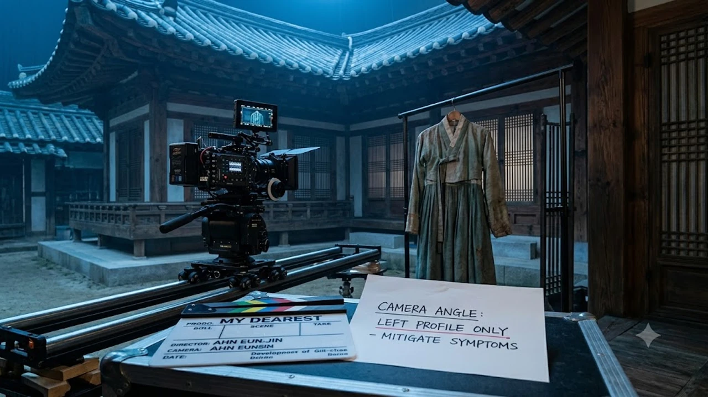

배우 안은진이 드라마 촬영 도중 겪었던 안면마비 투병 사실을 털어놓으며 많은 이들에게 충격을 안겼어. 화려한 스포트라이트 뒤에서 구안와사 증상과 싸우며 카메라 앞에 서야 했던 진짜 속사정이 드디어 밝혀진 거지. 솔직히 말해줄게, 연기력 논란 뒤에 이런 피눈물 나는 사연이 숨어있을 줄 누가 알았겠어?

## 안은진 안면마비 고백이 대중에게 큰 울림을 준 이유

### '요정재형' 토크에서 드러난 솔직한 투병 심경
유튜브 채널 '요정재형'에 나온 안은진의 모습은 그야말로 담담함 그 자체였어. 병을 앓았던 순간을 비장하게 포장하지 않고 덤덤하게 풀어냈는데, 오히려 그 쿨한 태도가 보는 사람들의 가슴을 더 먹먹하게 만들었지. "몸이 완전히 굳어버리는 느낌이었다"며 당시의 공포를 전하는데, 단순히 몸이 아픈 걸 떠나 평생 갈고닦은 연기 인생 자체가 그대로 멈춰 설 수 있다는 공포가 생생히 느껴졌거든.

### 전성기 직전 찾아온 갑작스러운 건강 위기
'슬기로운 의사생활' 추민하 캐릭터로 안방극장에 확실하게 눈도장을 찍고, 원톱 주연급으로 날아오르려던 가장 결정적인 순간에 안면신경마비가 찾아왔어. 배우에게 표정 근육은 캐릭터의 영혼을 전달하는 유일한 무기잖아. 그 무기가 통째로 마비돼 굳어버렸으니 머릿속이 새하얘지는 건 당연했지. 

> "한쪽 눈이 잘 감기지 않고 입꼬리가 올라가지 않는데, 다음 날 아침이면 당장 카메라 앞에 서야 했어요."

이 한마디에 당시 그가 홀로 삼켜야 했던 극심한 심리적 압박감이 고스란히 묻어나. 

### 동료 배우들과 제작진의 숨은 배려와 대처
절체절명의 순간에도 촬영을 포기하지 않고 버텨낸 배경에는 현장 동료들의 묵직한 배려가 있었어. 감독과 촬영 감독은 마비 증세가 도드라지지 않도록 카메라 앵글을 계산해 프레임을 짰고, 상대 배우들도 그의 호흡에 맞춰 묵묵히 기다려줬지. 혼자 감당하기엔 버거운 벼랑 끝 위기였지만, 현장의 배려가 안은진을 단단하게 지탱해 준 셈이야.

## '나쁜엄마'와 '연인' 촬영 당시 숨겨졌던 비하인드

### 한쪽 얼굴만 클로즈업해야 했던 불가피한 촬영 현장
JTBC 드라마 '나쁜엄마'를 찍을 당시 안은진은 얼굴의 반쪽 위주로 앵글을 잡고 촬영을 강행했어. 얼굴 한쪽 근육의 반응 속도가 온전치 못하다 보니 조명 각도와 동선을 철저하게 제한할 수밖에 없었던 거지. 모니터를 확인할 때마다 본인 뜻대로 움직이지 않는 입꼬리를 보며 얼마나 피가 말랐을지 짐작조차 안 가.

### 방영 초반 미스캐스팅 악플을 묵묵히 버텨낸 과정
진짜 가혹했던 건 바로 뒤이어 들어간 MBC 대작 사극 '연인'이었어. 초반 회차가 전파를 타자마자 온라인 커뮤니티에는 "사극 톤과 안 어울린다", "표정이 굳어있어 어색하다"는 식의 날카로운 칼날들이 꽂혔지. 하지만 안은진은 몸이 아프다는 사실을 굳이 방패막이로 내세우지 않았어. 

- 방영 초반 쏟아진 표정 연기와 비주얼을 향한 날 선 지적
- 아픈 티를 내며 핑계 대지 않고 연기로 뚫어내겠다는 결단
- 서너 시간 쪽잠을 쪼개가며 병원 치료와 밤샘 촬영을 병행한 악바리 근성

이 가혹한 통증과 마음고생을 안으로만 삼킨 채 오로지 제자리에서 대본을 붙들었던 거야.

### 길채 캐릭터로 연기력 논란을 완벽히 반전시킨 계기
하지만 회차가 거듭될수록 '유길채'라는 인물이 겪는 참혹한 피란길의 고통과 안은진의 절절한 눈빛이 폭발적인 시너지를 냈어. 철부지 애기씨에서 주체적으로 운명을 개척하는 강인한 여인으로 거듭나는 과정을 실감 나게 그려내며 시청자들을 완전히 빨아들인 거지. 결국 대중은 비난을 거두고 찬사를 보냈고, 연말 연기대상 최우수연기상 트로피를 품에 안으며 자신의 존재 가치를 실력으로 증명해 냈어. 더 생생한 방송가 뒷이야기가 궁금하다면 [연예이슈 전체 글 보기](/posts/entertainment/)에서 색다른 흐름을 만나볼 수 있어.

## 연예계 잇따른 안면신경마비(구안와사) 위험 신호

### 극심한 스트레스와 수면 부족이 부르는 발병 패턴
구안와사는 신체 면역력이 바닥으로 곤두박질칠 때 바이러스 침투나 신경 염증으로 불시에 덮쳐와. 특히 계절을 가리지 않는 야외 밤샘 촬영과 쪽잠이 밥 먹듯 반복되는 촬영 현장은 면역 체계가 무너지기 가장 쉬운 환경이지. 안은진뿐만 아니라 수많은 베테랑 방송인들 역시 살인적인 다이어트와 수면 부족, 무대 압박감이 한꺼번에 겹칠 때 비슷한 신경 이상을 호소하곤 해.

### 초기 골든타임 치료의 중요성과 후유증 관리
안면신경 손상은 증상이 나타난 직후 72시간 골든타임 안에 고용량 처치와 집중 치료를 받느냐에 따라 회복 속도가 천차만별로 갈려. 타이밍을 놓치면 얼굴 비대칭이나 근육 경련 같은 후유증이 길게 남을 위험이 높거든. 빡빡한 스케줄 속에서도 병원을 필사적으로 오가며 재활을 포기하지 않았던 안은진의 독기가 결국 후유증 없는 회복을 이끌어낸 셈이지.

### 바쁜 촬영 스케줄 속 스타들의 건강 관리 딜레마
수백억 원의 제작비와 수많은 스태프의 생계가 걸려 있는 드라마 판에서 주연 배우 한 명이 아프다고 촬영을 올스톱하기는 현실적으로 불가능해. 링거 바늘을 꽂고 현장에 복귀하는 게 암묵적인 프로의 미덕처럼 소비되는 환경 속에서, 배우들의 건강권은 늘 살얼음판을 걷고 있어. 화려한 스포트라이트 뒤편에 가려진 현장의 고질적인 과부하 문제를 다시금 짚어봐야 할 이유야.

## 논란을 실력으로 증명한 안은진의 향후 행보

### 시청자의 호평을 이끌어낸 진정성 있는 태도
이번 고백이 대중에게 깊은 울림을 준 이유는 명확해. 비판을 피하려고 내민 면죄부성 변명이 아니라, 모든 위기를 실력으로 당당하게 부수고 난 뒤에야 담담하게 꺼내놓은 극복기이기 때문이지. 아픔을 앞세워 동정을 구하기보다 카메라 앞에서 연기로 납득시킨 태도에 대중은 열광하고 있어.

### 차기작 선택과 연기 스펙트럼의 확장 가능성
지옥 같은 한계를 버텨내고 살아남은 배우는 표정의 농도부터 깊어질 수밖에 없어. 절망과 회복의 궤적을 온몸으로 통과한 만큼 안은진이 품어낼 수 있는 감정의 진폭은 이전보다 훨씬 넓고 짙어졌지. 장르와 시대를 가리지 않고 자신만의 영역을 탄탄히 다져온 필모그래피는 앞으로 마주할 캐릭터들에도 단단한 뼈대가 되어줄 거야.

### 위기를 딛고 대체 불가 주연으로 자리 잡은 비결
얼굴 근육이 굳어가는 절체절명의 위기 앞에서도 꺾이지 않았던 근성, 그리고 쏟아지는 혹평을 온몸으로 받아내며 끝내 연기력 하나로 뒤집어버린 뚝심이 지금의 그를 만들었어. 이제 안은진은 어떤 돌발 변수가 닥쳐도 제 몫을 해내며 극 전체를 든든하게 장악하는 진짜 주연 배우로 자리 잡았지. 일상 속 누적된 피로를 풀어주고 굳은 근육을 달래는 데 보탬이 되는 [온열 찜질기 쿠팡에서 보기](https://www.coupang.com/np/search?q=%EC%98%A8%EC%97%B4%EC%B0%9C%EC%A7%88%EA%B8%B0&sourceType=affiliate&trackingCode=AF8691300)도 함께 둘러보는 걸 추천해.

#안은진 #안은진안면마비 #구안와사투병 #요정재형안은진 #드라마연인 #나쁜엄마비하인드 #안은진연기력