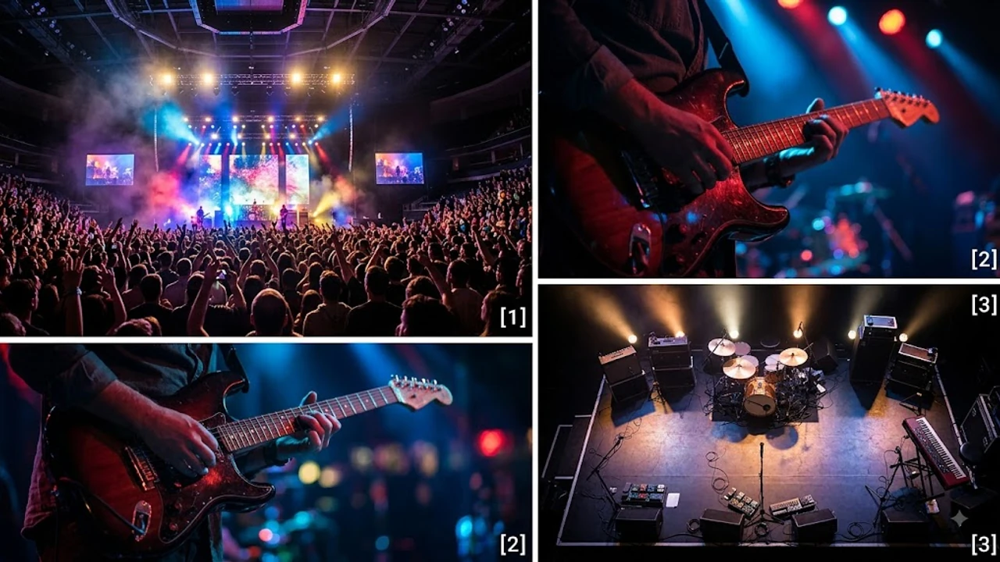

4년 4개월 만에 드디어 그들이 돌아왔어. 2026년 8월 데뷔 20주년을 맞이해 전격 공개된 **빅뱅 BiiiG 컴백** 소식에 지금 전 세계 K-팝 판이 들썩이고 있거든. 지드래곤, 태양, 대성 3인 체제로 재편된 이후 처음으로 선보이는 신곡이라 기대감이 진짜 미쳤다고밖에 설명이 안 돼.

## 4년 4개월 만의 기습 컴백, 신곡 'BiiiG' 주요 정보

### 3인 체제 재편 후 첫 공식 음원 발매일과 의미
음원 공개일은 오는 **8월 19일 오후 6시**야. 2022년 발매한 '봄여름가을겨울 (Still Life)' 이후 무려 4년 4개월 만에 내놓는 신곡이지. 이번 싱글 타이틀 'BiiiG'는 팀명 BIGBANG의 정체성을 직관적으로 담아내면서도, 알파벳 'i' 세 개를 연속 배치해 3인 체제의 새로운 출발을 센스 있게 연출했어. 솔직히 멤버 변화로 우려가 많았던 게 사실인데, 이렇게 정면 돌파를 선언할 줄은 몰랐지.

### 지드래곤·태양·대성의 프로듀싱 참여 비하인드
리더 지드래곤이 메인 프로듀싱을 맡았고 태양과 대성이 작사, 작곡진에 이름을 올렸어. 작업실에서 밤을 새우며 수십 번 트랙을 갈아엎었다는 후문이야.

> "지난 20년의 역사를 서사적으로 풀기보다는, 지금 셋이서 보여줄 수 있는 가장 에너제틱한 사운드를 만드는데 집중했다"

지드래곤이 사석에서 남긴 이 한마디만 봐도 이번 곡이 얼마나 이들의 자부심으로 차 있는지 느껴지지 않아?

### 음원 차트 및 글로벌 K-팝 시장 예상 파급력
발매 소식이 전해지자마자 멜론, 지니, 벅스 등 국내 주요 음원 플랫폼의 검색 순위 1위를 싹쓸이했어. 스포티파이와 빌보드에서도 주목하는 분위기야. 최근 [영케이 YOUNGEST 컴백! 진짜 주목할 핵심 3가지](/posts/entertainment/young-k-youngest-comeback-album-analysis-2026/) 사례처럼 솔로 아티스트들의 활약도 뜨거웠지만, 레전드 그룹의 20주년 컴백이 가져올 파급력은 차원이 다를 수밖에 없어.

## 20주년 기념 월드투어 'XX : COSMOS' 일정 및 티켓팅

### 고양종합운동장 첫 공연 일정과 좌석 배치
월드투어의 포문을 여는 첫 서울(경기) 공연은 **8월 21일부터 23일까지 사흘간 고양종합운동장 주경기장**에서 열려. 야외 아레나급 무대 장치와 대형 LED 스크린이 동원된다고 해. 좌석표가 공개되자마자 시야제한석까지 시끄러울 정도로 팬들의 반응이 폭발적이었어.

### 해외 투어 도시 라인업 및 티켓 예매 일정
고양 공연을 시작으로 도쿄돔, 오사카 교세라돔, 방콕, 자카르타, 그리고 미주 5개 도시와 유럽까지 이어지는 대규모 스케줄이야. 티켓 예매는 팬클럽 선예매와 일반 예매로 나뉘어 진행되는데, 서버 마비는 이미 예견된 수순이나 다름없어.

### 팬덤(VIP) 피켓팅 성공을 위한 필수 체크리스트
이번 콘서트 예매를 노린다면 이건 반드시 챙겨야 해.
- 예매처 Interpark의 본인 인증 사전 완료
- 서버시계(엔키트 등) 0.1초 단위 설정
- 결제 수단은 무통장 입금 또는 간편결제(카카오페이/네이버페이) 우선 선택

## 빅뱅의 지난 20년과 3인 체제 신곡의 음악적 변주

### '봄여름가을겨울' 이후 음악적 변화와 방향성
'봄여름가을겨울'이 지난날을 돌아보는 서정적인 밴드 사운드였다면, 이번 'BiiiG'는 트렌디한 힙합 트랩 베이스에 강렬한 신스 사운드가 결합된 곡이야. 슬픈 감성을 털어내고 다시 바닥을 흔드는 빅뱅 특유의 묵직한 에너지를 전면에 내세웠지.

### 멤버별 개인 활동에서 3인 그룹 활동으로의 전환
솔로 콘서트, 예능, 글로벌 패션 위크에서 각자 독보적인 입지를 다진 셋이 한 무대에 모였을 때 나오는 합은 감히 대체 불가능이야. 태양의 독보적인 R&B 보컬, 대성의 시원한 록 스타일 하이톤, 거기에 지드래곤의 유니크한 래핑이 더해지면 진짜 "말 다 했지" 소리가 절로 나와.

### 과거 히트곡 연출과 신곡 무대의 시너지 기대
셋트리스트에 '거짓말', 'HARU HARU', 'BANG BANG BANG', 'FANTASTIC BABY' 같은 메가 히트곡들이 3인 버전으로 재편곡되어 들어간다는 소식이야. 과거의 명곡과 신곡 'BiiiG'가 이어지는 연출은 올드 팬들에게 미친 듯한 쾌감을 선사할 게 분명해.

## 이번 컴백을 둘러싼 대중과 팬들의 반응 비교

### 국내외 음원 스트리밍 플랫폼 사전 반응
유튜브에 공개된 15초짜리 티저 영상은 공개 6시간 만에 조회수 500만 회를 돌파했어. 댓글창은 한국어뿐만 아니라 영어, 일본어, 스페인어, 아랍어까지 온갖 언어로 도배됐지. "왕의 귀환이다", "이 조합을 다시 볼 줄 몰랐다"는 반응이 대반수를 차지하고 있어.

### 주요 온라인 커뮤니티 및 SNS 화제성 분석
X(구 트위터) 실시간 트렌드와 각종 커뮤니티 게시판은 컴백 소식으로 완전히 도배됐어. 
- "진짜 20주년에 신곡 내줄 줄은 몰랐다"
- "3명이서 무대 채우는 성량이랑 아우라가 감당 될까? 대단하다"
- "티켓팅 광탈하면 울 것 같다"

어떤 신조어나 감정적인 평가 속에서도 이들의 음악적 파괴력만큼은 아무도 부정하지 못하는 분위기야.

### 향후 20주년 추가 프로젝트 및 신규 앨범 가능성
이번 싱글 'BiiiG'는 끝이 아니라 시작일 뿐이야. 소속사 측에 따르면 이번 월드투어 일정에 맞춰 연말 정규 앨범 프로젝트까지 기획 중이라고 해. 20년이라는 긴 시간을 견뎌내고 다시 무대 위에 선 이들이 과연 K-팝 역사에 또 어떤 굵직한 족적을 남길지, 솔직히 기대 안 하고는 못 배기겠어.

**함께 읽으면 좋은 글**
- [월드컵 충격패 안정환 분노 폭발 진짜 이유 3가지](/posts/entertainment/world-cup-ahn-jung-hwan-furious-reaction-2026/)
- [나나 자택 침입범, 징역 7년 불복? 진짜 속사정 완전 정리](/posts/entertainment/nana-home-intruder-appeal-2026/)

#빅뱅 #빅뱅컴백 #빅뱅20주년 #지드래곤 #태양 #대성 #BiiiG #빅뱅콘서트 #월드투어 #KPOP