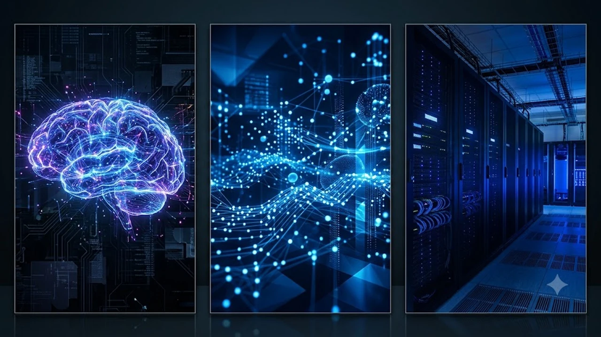

드디어 기다리던 **BTS 완전체 컴백** 소식이 터졌어. 군백기를 완전히 끝내고 일곱 멤버가 다시 한 무대에 서는 그림, 솔직히 상상만 해도 소름 돋지 않아? 전 세계 팬들이 손꼽아 기다려온 만큼 이번 복귀는 단순한 앨범 발매 수준을 넘어 글로벌 음악 시장 판도를 뒤흔들 대형 이벤트야.

## BTS 2026 완전체 컴백 공식화와 월드투어 로드맵
### 하이브 공식 발표로 확인된 글로벌 스타디움 일정
하이브와 빅히트 뮤직이 공식 타임라인을 확정 짓자마자 전 세계 스타디움 대관 경쟁이 불붙었어. 서울 잠실 주경기장을 시작으로 북미와 유럽의 초대형 돔 구장까지 동선이 짜였지. 7명이 동시에 오르는 월드투어 무대는 과거 '러브 유어셀프' 시리즈 이상의 메가 스케일로 기획되는 중이야.

### 전원 군 복무 종료 후 첫 무대 개최지 분석
복무를 마친 멤버들이 첫인사를 건넬 장소는 역시 서울이야. 팬들과 오랜만에 호흡을 맞추는 복귀 쇼케이스는 온·오프라인 동시 스트리밍으로 전 세계 아미를 한자리에 묶을 예정이지. 국내외 대규모 인원이 한꺼번에 몰릴 것이 뻔해서 현장 안전 통제 인력만 수천 명이 투입된다고 해.

### 하반기 발매 예정 정규 앨범 타이틀곡 콘셉트
이번 정규 앨범의 메인 테마는 성숙과 연대야. 20대 초중반의 혈기와 성장을 노래하던 소년들이 각자의 자리에서 깊이를 더해 돌아온 만큼, 메시지의 무게감부터 달라졌어. 멤버 전원이 작사·작곡 크레딧에 고르게 이름을 올리며 팀 고유의 정체성을 전면에 내세웠지.

## 4년 만의 귀환이 K팝 음반 시장에 미칠 파급력

### 선주문량 신기록 경신 가능성과 실물 앨범 트렌드
선주문 창이 열리자마자 전 세계 유통망에 과부하가 걸렸어. 피지컬 음반 시장이 주춤하던 시기였음에도 예약 개시 하루 만에 자체 최다 기록을 가볍게 갈아치웠지. 단순한 소장용 굿즈를 넘어 하나의 예술적 아카이브로 앨범 패키지를 구성한 전략이 제대로 먹혀들었어.

### 빌보드 핫 100 차트 재진입 전략과 스트리밍 지표
스포티파이, 애플뮤직 같은 글로벌 플랫폼 역시 발칵 뒤집혔지. 솔로 아티스트로서도 빌보드 정상을 밟아본 이들이라 단체 음원 파급력은 배 이상이야. 발매 첫 주 핫 100 최상위권 직행은 기본이고, 라디오 에어플레이 수치까지 안정적으로 확보하려는 세밀한 프로모션이 가동 중이야. 아이돌 씬의 솔로·그룹 병행 흐름이 궁금하다면 [성한빈 솔로 데뷔, 진짜 통할까?](/posts/entertainment/sung-han-bin-solo-debut-analysis-2026/) 글에서도 시장 흐름을 엿볼 수 있어.

### 국내외 음원 플랫폼 트래픽 집중 및 서버 대응 현황
국내 멜론, 지니는 물론 해외 스트리밍 서버까지 비상 대응 체제에 돌입했어. 동시 접속자가 폭증하면서 트래픽 병목 현상이 생길 정도였지. 실시간 차트 줄세우기는 떼어 놓은 당상이고, 과거 명곡들까지 역주행하며 음원 플랫폼 전체가 보랏빛으로 물들었어.

## 솔로 활동 성과가 완전체 시너지로 이어지는 방식
### 7인 7색 개별 음악 활동의 음악적 스펙트럼 확장
랩, 알앤비, 팝, 록까지 각자 솔로 활동을 거치며 쌓은 내공이 장난 아니야. 일곱 명이 각자 다른 장르의 정점을 찍고 돌아왔으니 합쳤을 때 나오는 음악적 스펙트럼이 상상 이상이지. 혼자서도 스타디움을 채우던 베테랑들이 뭉쳤으니 무대 완성도는 말 다 했지.

> "각자의 길에서 증명해낸 음악적 성취는 팀이라는 거대한 그릇 안에서 가장 폭발적인 형태로 융합된다."

### 빌보드 1위 경험을 녹여낸 자체 프로듀싱 협업 구조
예전에는 외부 프로듀서와의 협업 비중이 컸다면, 이제는 멤버들이 사운드의 방향키를 완전히 쥐고 흔들어. 해외 톱 프로듀서들과 1:1로 소통하며 쌓은 감각이 곡 작업에 고스란히 반영됐어. 보컬 라인과 래퍼 라인의 유기적인 트랙 배치는 이전보다 훨씬 정교해졌지.

### 글로벌 팬덤 아미(ARMY)의 결집도와 유입층 변화
공백기 동안 흩어지기는커녕 팬덤은 더 단단해졌어. 솔로 활동을 통해 새롭게 유입된 라이트 팬층까지 완전체 컴백에 흡수되면서 파이가 훨씬 커졌지. 북미, 남미, 아시아를 가리지 않고 전 세대를 아우르는 독보적인 팬덤 결집력을 보여주는 중이야.

## 티켓팅 대란 대비 팬클럽 예매 가이드 및 관전 팁
### 위버스 멤버십 인증 및 선예매 오픈 일정 체크
피 튀기는 티켓팅 전쟁에서 살아남으려면 위버스 멤버십 사전 인증은 기본 중의 기본이야. 예매 오픈 당일에는 서버 접속 자체가 마비될 수 있으니 미리 본인 인증을 끝내둬야 해. 결제 수단도 오류를 줄이기 위해 간편 결제 등록을 점검해 두는 게 좋아.

- **사전 인증 기간:** 예매 개시 3일 전까지 필수 완료
- **좌석 선점 원칙:** 결제 창 진입 즉시 이중 결제 방지 모드 유지
- **동시 접속 제한:** 계정당 기기 1대 원칙 철저 준수

### 부정 예매 차단 시스템 도입에 따른 신분 확인 절차
매크로나 암표를 근절하기 위해 본인 확인 절차가 역대급으로 까다로워졌어. 모바일 신분증과 현장 안면 인식 시스템이 병행 도입되면서 대리 티켓팅은 완전히 막혔다고 봐야 해. 티켓 양도는 원천 차단되니 무조건 본인 명의로만 도전해야 해.

### 스타디움 공연장별 시야 분석 및 추천 좌석 구역
돌출 무대 동선과 360도 무대 연출이 예고된 만큼 굳이 그라운드 중앙만 고집할 필요는 없어. 스타디움 1층 사이드 구역이 전체적인 퍼포먼스와 연출을 한눈에 담기에 훨씬 쾌적해. 현장 응원봉의 화려한 조명 연출까지 제대로 즐기려면 [공연 필수 아이템 아미밤 쿠팡에서 보기](https://www.coupang.com/np/search?q=%EB%B0%A9%ED%83%84%EC%86%8C%EB%85%84%EB%8B%A8%EC%9D%91%EC%9B%90%EB%B4%89&sourceType=affiliate&trackingCode=AF8691300)를 미리 챙겨서 완벽하게 준비해 두자.

#BTS #BTS완전체 #방탄소년단컴백 #방탄소년단월드투어 #BTS콘서트 #아미밤 #하이브 #빅히트뮤직