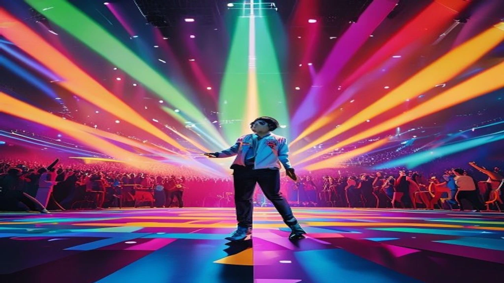
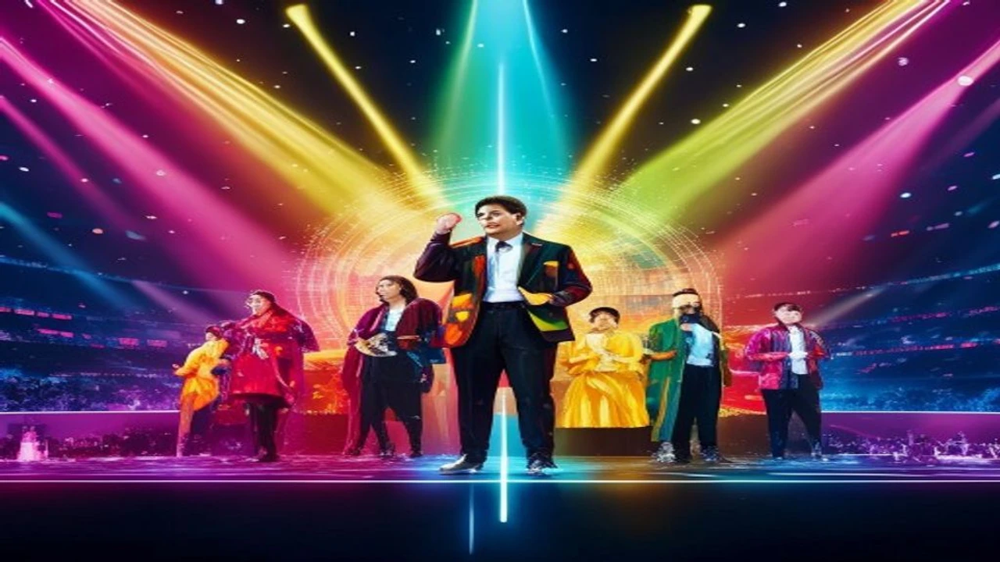

2026년 선거철이 다가오면서 미디어가 주목하는 가장 뜨거운 화두는 단연 **연예인 정치색** 검열과 관련된 해프닝입니다. 대중의 시선이 집중되는 시기인 만큼, 스타들의 작은 행동 하나가 거대한 여론의 소용돌이를 만들어내기도 합니다. 이번 글에서는 최근 연예계에서 불거진 착장 논란과 포즈 오해의 실태를 파헤치고, 왜 유독 올해 이러한 현상이 심화되었는지 그 내막을 완전 정리합니다.

## 유독 심해진 연예인 정치색 검열 배경

### 과거 선거철 해프닝과 올해 논란의 강도 차이
과거 선거철에는 투표소에 특정 색상의 점퍼를 입고 나타나거나 투표 인증샷에 손가락으로 기호를 표시하는 눈에 보이는 행위가 주로 문제가 되었습니다. 반면 올해는 일상 예능 프로그램 출연 화면이나 몇 달 전에 촬영을 마친 유튜브 영상까지 소급 적용하여 진영 논리의 잣대를 들이대는 양상입니다. 대중이 체감하는 피로감과 연예인들이 느끼는 압박감의 강도가 예년에 비해 몇 배 이상 강력해진 이유입니다.

### 소셜 미디어 실시간 확산이 불러온 억측 나비효과
인스타그램, 엑스(구 트위터), 틱톡 등 숏폼 중심의 플랫폼은 맥락을 잘라낸 마녀사냥에 최적화된 구조를 띱니다. 한 연예인이 무심코 올린 사진 한 장이 단 10분 만에 특정 정치 성향을 대변하는 증거로 둔갑하여 수십만 명에게 퍼져나갑니다. 
> "악의적인 짜깁기 숏폼 영상 하나가 수년 동안 쌓아온 스타의 청정한 이미지를 단숨에 무너뜨리는 무기가 되었다"는 업계 관계자의 전언은 현재의 심각성을 고스란히 보여줍니다.

### 팬덤 간의 정치적 대립이 연예계로 번지는 메커니즘
아이돌 팬덤 간의 세력 싸움이 고도화되면서, 상대 그룹을 비방하기 위한 수단으로 정치적 프레임을 악용하는 사례가 늘었습니다. 타 그룹 멤버의 과거 착장을 샅샅이 뒤져 특정 정당의 상징색과 매칭한 뒤 커뮤니티에 조직적으로 유포하는 방식입니다. 이는 순수한 대중적 공분이라기보다 팬덤 간의 알력 다툼이 정치라는 가장 자극적인 소재를 빌려 표출된 기형적인 현상에 가깝습니다.

## 진짜 억울한 연예계 옷차림 및 포즈 논란 사례

### "옷 색깔이 하필..." 사전투표소 환복 및 삭제 소동
최근 대세 가수로 꼽히는 이영지는 사전투표를 위해 투표소를 찾았다가 예상치 못한 암초를 만났습니다. 착용한 일상복의 색상이 특정 정당을 연상시킨다는 네티즌들의 날카로운 지적이 일자, 불필요한 오해를 차단하기 위해 빛의 속도로 게시물을 내리거나 다른 옷으로 갈아입는 해프닝을 겪었습니다. 걸그룹 프로미스나인의 백지헌 역시 비슷한 착장 오해로 인해 SNS 피드를 급히 수정하며 가슴을 쓸어내려야 했습니다.

### V자 포즈와 특정 숫자 손가락 모양이 부른 오해
손가락 모양은 선거철 셀럽들이 가장 기피하는 1순위 행동입니다. 사진 촬영 시 흔하게 사용하는 '브이(V)' 포즈는 기호 2번을 지지한다는 오해를 받기 십상이며, 손가락으로 하트를 만들거나 최고라는 의미로 엄지를 치켜세우는 동작 역시 기호 1번 혹은 특정 숫자를 연상시킨다는 비난에 직면합니다. 이 때문에 최근 포토월에 서는 배우들은 손가락을 모두 편 채 차렷 자세를 유지하거나 주먹을 쥔 채 포즈를 취하는 진풍경을 연출합니다.

### 일상 아이템까지 검열당한 대세 스타들의 눈물
단순한 의류를 넘어 텀블러의 색상, 스마트폰 케이스의 디자인, 심지어 SNS에 올린 이모티콘의 종류까지 검열의 대상이 됩니다. 한 유명 아이돌 멤버는 자기가 좋아하는 브랜드의 파란색 텀블러를 들고 퇴근하다가 특정 정치 성향을 드러냈다는 악플 세례를 받았습니다. 아무런 정치적 의도가 없는 개인의 취향 영역까지 진영 논리로 해석하는 대중의 과도한 몰입이 낳은 결과물입니다.

[관련 글 보기](/posts/entertainment/)

## 정치색 논란이 이미지와 광고 계약에 미치는 명과 암

### 치명적인 타격과 위약금 리스크
엔터테인먼트 산업에서 연예인의 이미지는 곧 자산입니다. 특히 대중 전체를 타깃으로 삼는 가전, 금융, 자동차 등의 브랜드 광고 모델인 경우 정치적 논란에 휘말리는 순간 브랜드 가치에 치명적인 타격을 입습니다. 광고 계약서 내의 '품위유지 의무 위반' 조항이 발동되면, 수억 원에서 수십억 원에 달하는 막대한 위약금을 물어내야 하는 법적 리스크가 상존합니다.

### 의외의 반전인 억까 여론 형성 시의 동정표
모든 논란이 악재로만 작용하는 것은 아닙니다. 지나치게 억지스러운 비난(이른바 '억까')이라는 사실이 명백해지면, 오히려 중도 성향의 대중이 연예인을 옹호하며 든든한 방어막을 형성해 줍니다. 
* 과도한 마녀사냥에 대한 반발심 작용
* 팬덤의 화력 집중으로 인한 앨범 및 굿즈 매출 상승
* 억울한 피해자 이미지를 통한 대중적 인지도 확산

### 대중의 피로감 증폭과 연예계 전반의 위축 효과
이러한 소모적인 공방이 지속될수록 콘텐츠를 소비하는 일반 대중의 피로감은 극에 달합니다. 연예 기획사들은 리스크를 줄이기 위해 소속 아티스트의 SNS 활동을 전면 통제하거나 예능 프로그램에서의 발언을 극도로 제한하는 방어적인 스탠스를 취합니다. 결과적으로 연예계 전반의 창작 가치와 자유로운 소통 분위기가 크게 위축되는 부작용을 낳습니다.

## 선거철 대중의 오해를 피하기 위한 셀럽들의 대처 가이드

### 선거 당일 및 사전투표 기간 무채색 코디법
가장 확실한 예방법은 시각적 요소를 원천 차단하는 코디네이션 전략입니다. 선거 기간 전후로 공식 석상이나 투표소에 나타날 때는 빨간색, 파란색, 노란색 등 정당을 상징하는 원색을 무조건 배제해야 합니다. 흰색, 검은색, 회색 등 논란의 여지가 없는 무채색 의상을 선택하는 것이 기획사 스타일리스트들의 철칙으로 자리 잡았습니다.

### 손가락 포즈 대신 안전한 포토타임 공식
사진 촬영 시 손가락 오해를 막기 위한 표준 행동 지침이 필요합니다. 
- 손가락을 모두 모아 가볍게 쥔 '주먹 꽉' 포즈
- 양손을 가지런히 모으는 공수 자세
- 손가락을 쓰지 않고 볼을 밀어 올리는 볼하트 (단, 손가락 개수가 보이지 않게 밀착)
이러한 가이드라인은 촬영 중 발생할 수 있는 찰나의 오해를 방지하는 훌륭한 방패가 됩니다.

### 논란 발생 시 골든타임 내 초고속 해명 프로토콜
만약 억울한 루머가 퍼지기 시작했다면 초기 대응 속도가 생명입니다. 감정적인 대처나 장문의 변명 대신, 해당 의상이나 소품을 착용한 가치 중립적인 이유(예: 협찬 브랜드의 고유 디자인 등)를 객관적인 증거와 함께 명확히 밝혀야 합니다. 오해가 확산되기 전인 '골든타임 2시간' 이내에 깔끔한 공식 입장을 배포하는 것이 논란을 조기에 진화하는 핵심 비결입니다.

#연예인정치색 #선거철연예인 #투표인증샷 #착장논란 #아이돌검열 #연예계이슈 #스타SNS논란 #아이돌착장 #연예인루머