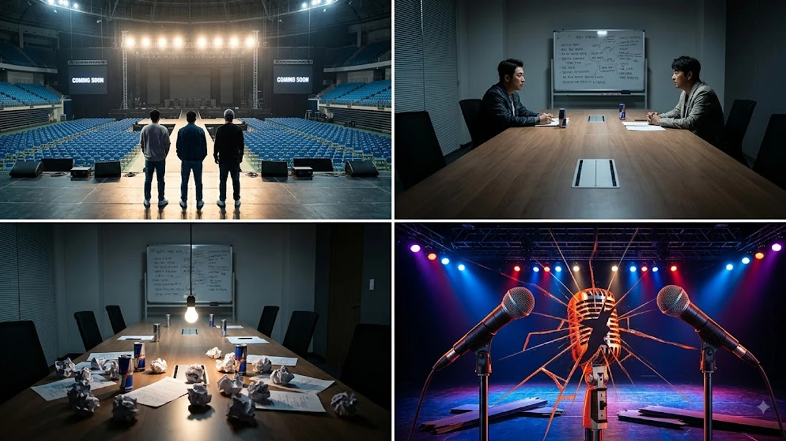

15년 만에 가요계로 돌아온다던 악동들이 시작부터 삐걱거리고 있어. **DJ DOC 컴백** 소식이 전해지자마자 반나절 만에 불화설이 다시 터져 나오며 완전체 복귀가 불투명해졌는데, 과연 세 사람 사이에 대체 무슨 일이 벌어진 건지 솔직하게 짚어볼게.

## DJ DOC 15년 만의 완전체 컴백 선언과 엇갈린 입장

### 이하늘의 복귀 공식화 발표 내용
이하늘은 최근 한 유튜브 채널과 인터뷰를 통해 2026년 하반기 DJ DOC의 신곡 발매와 대규모 콘서트 계획을 직접 밝혔어. 데뷔 30주년을 넘긴 시점에서 팬들을 위한 정규 8집 프로젝트를 가동하고 있으며, 오랜 공백을 끝내고 다시 무대에 서겠다는 강한 의지를 내비쳤지. 1990년대와 2000년대를 풍미한 레전드 힙합 그룹의 부활 소식에 대중의 이목이 단숨에 집중됐어.

### 김창열 측 "논의된 바 없다" 즉각 반박
하지만 반전은 하루도 안 걸려 터져 나왔어. 김창열 측 관계자가 단독 보도를 통해 "컴백이나 앨범 발매와 관련해 사전에 어떤 이야기도 나눈 적이 없다"며 전면 부인하고 나섰거든. 이하늘의 단독 발언일 뿐, 세 멤버 간의 사전 조율이나 기획사 단위의 실무 계약은 전혀 진행되지 않았다는 뜻이야. 당사자 간 기초적인 소통조차 없었던 상황이 드러나면서 기대감은 순식간에 혼란으로 바뀌었지.

### 정재용의 중재 시도와 현재 상황
중간에 낀 멤버 정재용의 행보도 주목받고 있어. 정재용은 평소 두 사람 사이를 중재하며 팀의 명맥을 잇기 위해 꾸준히 노력해왔지만, 이번 입장 차이에 대해서는 극도로 말을 아끼는 분위기야. 양측의 감정 대립이 여전히 팽팽한 상태에서 섣불리 나섰다가 자칫 불씨를 더 키울 수 있다는 판단 때문이지.

## 이하늘과 김창열 갈등이 반복되는 결정적 이유 3가지

### 과거 게스트하우스 사업 분쟁과 감정의 골
두 사람의 갈등 뿌리는 결코 얕지 않아. 지난 2021년 제주도 게스트하우스 펜션 사업 투자금을 둘러싸고 벌어진 다툼이 대표적이야. 리모델링 공사 대금 부담과 지분 문제를 놓고 서로의 주장이 극명하게 엇갈렸고, 이는 단순한 동업자 갈등을 넘어 30년 지기 우정에 돌이키기 힘든 균열을 냈어.

### 故 이현배 추모 이후 좁혀지지 않은 입장 차
이하늘의 친동생이자 그룹 45RPM의 멤버였던 고(故) 이현배의 비보 당시, 이하늘이 SNS 라이브 방송을 통해 김창열을 직접 지목하며 두 사람의 관계는 완전히 틀어졌어. 장례식장에서 마주 앉아 짧은 대화를 나누긴 했으나, 이후에도 실질적인 화해나 오랜 앙금은 풀리지 않은 채 겉돌았던 셈이지.

> "비즈니스는 계약서로 풀 수 있어도, 사람 사이에 쌓인 감정의 상처는 시간만으로 해결되지 않는다."

### 음원 수익 배분 및 계약 주체에 대한 시각차
과거 발표한 수많은 히트곡들의 저작권 및 음원 인접권 정산 문제, 그리고 앞으로 제작될 신보의 유통사 선정과 계약금 배분 방식에서도 의견 차가 뚜렷해. 팀 단위의 프로젝트를 진행하려면 법적 주체와 정산 체계가 깔끔하게 정리되어야 하는데, 기본 신뢰가 흔들린 상태에서는 계약서 한 장조차 도장을 찍기 어려운 것이 냉정한 현실이야.

## 과거 해체 위기 극복 사례와 2026년 복귀 가능성 비교

### 2000년대 주요 갈등 봉합 과정 분석
사실 DJ DOC는 데뷔 이래 수없이 많은 부침과 팀 내 갈등을 겪어왔어. 2000년 5집 'The Life... Doc Blues'나 2010년 7집 '풍류'를 낼 때도 불화설과 팀 위기설이 돌았지만, 그때마다 음악과 무대를 향한 열정 하나로 뭉쳐 음원 차트를 뒤흔들었지. 서로 치열하게 부딪치다가도 무대 위에선 흠잡을 데 없는 호흡을 자랑하던 이들이었어.

### 현재 상황에서 완전체 활동이 더 어려운 이유
- **금전적 이해관계의 고착화**: 단순한 성격 차이를 넘어 사업 투자금 등 재정적 문제가 복잡하게 얽힘
- **가족사로 얽힌 감정적 트라우마**: 마주 앉아 대화조차 나누기 버거운 심리적 거리감
- **대중의 피로도 누적**: 반복되는 불화 소식과 거친 공방에 대한 대중의 식상함

과거 가요계 복귀 소식들이 팬들에게 큰 울림을 주었던 [영케이 YOUNGEST 컴백! 진짜 주목할 핵심 3가지](/posts/entertainment/young-k-youngest-comeback-album-analysis-2026/) 사례와 비교해봐도, DJ DOC는 음악적 기대감보다 멤버 간의 잡음이 먼저 부각되는 뼈아픈 상황에 놓여 있어.

### 2인 체제 또는 솔로 활동 전환 가능성 점검
결국 김창열의 합류가 끝내 불발된다면 이하늘과 정재용 중심의 2인 체제 공연이나, 각자의 개인 활동으로 선회할 공산이 커. 하지만 팬들이 기억하는 'DJ DOC'라는 고유 브랜드 파워는 세 사람이 한 무대에 섰을 때 나오기 때문에 반쪽짜리 활동은 화제성이 떨어질 수밖에 없어.

## 향후 DJ DOC 활동 시나리오와 팬들의 반응

### 콘서트 및 신곡 발표 일정 연기 불가피성
당초 거론되던 2026년 하반기 복귀 스케줄은 사실상 무기한 연기 수순을 밟을 것으로 보여. 신곡 녹음과 연습, 공연장 대관까지 수개월의 준비 기간이 필수적인데, 멤버 간의 사전 계약조차 없는 상태에서 일정을 밀어붙이는 건 현실적으로 불가능하니까.

### 가요계 및 네티즌 여론의 엇갈린 반응
온라인 커뮤니티와 팬들의 반응은 극명하게 갈리고 있어. "추억 속 명곡들을 다시 무대에서 듣고 싶다", "어떻게든 앙금을 털고 멋지게 마무리했으면 좋겠다"는 응원이 있는 반면, "또다시 시작된 일방적 발표냐", "차라리 좋은 추억으로 남아달라"며 피로감을 호소하는 반응도 만만치 않아. 더 많은 연예계 핫이슈 흐름이 궁금하다면 [연예이슈 전체 글 보기](/posts/entertainment/)를 참고해봐.

### 향후 공식 입장 발표 관전 포인트
결국 공은 다시 두 사람에게 넘어갔어. 이하늘이 어떤 추가 입장을 내놓을지, 아니면 김창열이 대화 테이블에 앉을지가 핵심이야. 이번에도 대화의 물꼬를 트지 못한다면 DJ DOC의 완전체 무대는 영영 역사 속으로 사라질지도 몰라.

#DJDOC컴백 #이하늘 #김창열 #정재용 #DJDOC불화 #DJDOC해체 #가요계이슈 #연예계뉴스