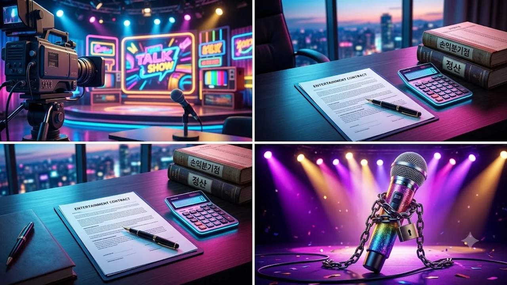

지상파 음악방송 1위까지 찍은 걸그룹 메인보컬이 데뷔 7년 차까지 통장에 찍힌 정산금이 0원이었다면 믿어져? 박지원 7년 수입 0원 고백이 전파를 타자마자 K-팝 팬덤은 물론이고 대중들까지 발칵 뒤집혔어. 화려한 스포트라이트 뒤에 꽁꽁 숨겨져 있던 아이돌 정산 시스템과 손익분기점의 가혹한 현실이 날것 그대로 까발려진 셈이지.

## 박지원 7년 수입 0원 고백, 무슨 일 있었나

### '아는 형님' 방송서 털어놓은 솔직한 생활고
JTBC 간판 예능 '아는 형님'에 나온 프로미스나인 박지원의 입에서 나온 말은 그야말로 충격 그 자체였어. 활동 내내 부모님께 손을 벌려 용돈을 타 썼고, 7년이라는 긴 시간 동안 손에 쥔 개인 정산금이 단 1원도 없었다는 사실을 덤덤하게 털어놨거든.

> "7년 차가 될 때까지 손에 쥔 정산금이 없어서 엄마한테 용돈 받아 생활했어요."

이 짧고 묵직한 한마디에 현장 스튜디오는 순식간에 얼어붙었어. 무대 위에서 늘 상큼하게 에너지를 뿜어내던 메인보컬이 뒤에서는 통장 잔고 0원이라는 극심한 현실과 싸우고 있었다는 게 드러난 순간이었지.

### 1위 걸그룹 메인보컬도 피하지 못한 정산 현실
프로미스나인은 멜론 TOP 100 상위권은 물론 지상파 음방 1위 트로피까지 들어 올린 엄연한 흥행 걸그룹이야. 박지원은 팀의 간판 보컬로서 킬링 파트 고음을 도맡았고 각종 OST와 예능에서도 맹활약하며 인지도를 탄탄히 쌓았잖아.

* **음악방송 1위 달성:** 대중성과 코어 팬덤을 모두 입증한 전성기
* **각종 축제 및 대형 페스티벌 섭외 1순위:** 전국 대학 축제와 콘서트 무대 올킬
* **독보적인 보컬 역량:** 솔로 음원 발매 및 피처링 섭외 쇄도

이렇게 겉만 보면 억대 정산받으며 꽃길만 걷는 줄 알았는데, 정작 개인 통장은 깡통이었다는 사실이 대중에게 엄청난 배신감과 괴리감을 준 거야.

### 팬들과 대중이 충격받은 진짜 핵심 포인트
이슈의 핵심은 중소 기획사 무명 돌이 아니라, 대형 서바이벌 방송 출신에 든든한 레이블 지원을 받던 팀조차 이 지경이었다는 점이야. 앨범을 수십만 장 팔아치우고 길거리에 노래가 울려 퍼져도, 정작 멤버 개인 주머니로는 돈 한 푼 안 들어오는 기형적인 엔터 수익 배분 구조가 적나라하게 까발려졌기 때문이지.

## K-팝 아이돌 정산 구조와 손익분기점의 비밀

### 데뷔 전 트레이닝 비용과 제작비 회수 시스템
도대체 왜 이런 일이 생기는 걸까? 원인은 바로 **손익분기점(BEP)** 덫에 있어. 기획사는 연습생 시절 들어간 보컬·댄스 레슨비, 숙소 월세, 식대는 기본이고 데뷔 앨범 프로듀싱, 뮤직비디오 억대 촬영비, 헤어·메이크업·의상비까지 몽땅 '투자금'이라는 이름의 '아티스트 빚'으로 묶어둬.

- **직접 제작비:** 앨범 곡 수급, 고화질 뮤직비디오, 안무 시안비 (기본 수억 원 단위)
- **간접 진행비:** 음악방송 프로모션, 차량 렌트, 현장 전담 스태프 인건비
- **트레이닝 누적비:** 데뷔 전 수년간 차곡차곡 쌓인 연습생 유지 비용

활동으로 벌어들인 총매출에서 이 천문학적인 비용을 100% 털어내기 전까지는 멤버들에게 단 1원도 배당되지 않는 구조야.

### 음원 차트 1위와 실제 멤버별 정산액의 간극
스트리밍 1위를 찍어도 아티스트 손에 떨어지는 돈은 쥐꼬리 수준이야. 음원 매출은 플랫폼(멜론, 스포티파이 등), 유통사, 저작권자가 먼저 뭉텅이로 떼어간 뒤 남은 몫을 기획사와 멤버가 나누고, 그마저도 멤버 수대로 N분의 1을 하거든.

다인원 그룹일수록 흑자 전환까지 걸리는 시간은 끝도 없이 늘어날 수밖에 없어. 대규모 해외 투어나 단독 콘서트, 굵직한 CF를 줄줄이 찍지 않는 이상 일반 앨범 활동만으로는 적자를 벗어나기 힘든 게 K-팝 바닥의 냉혹한 현실이지. 앨범 제작과 아티스트의 치열한 고민을 다룬 [영케이 YOUNGEST 컴백! 진짜 주목할 핵심 3가지](/posts/entertainment/young-k-youngest-comeback-album-analysis-2026/) 이야기처럼, 각자의 자리에서 생존을 위해 발버둥 치는 이유가 다 있는 법이야.

### 타 소속사 및 동세대 아이돌과의 정산 방식 비교
일부 초대형 기획사는 연습생 시절 비용을 회사 자체 투자금으로 털어내서 데뷔 첫해부터 흑자 정산을 해주기도 해. 반면 대다수 기획사는 여전히 '선투자금 100% 회수 후 정산' 룰을 고수하지. 이 시스템 격차 때문에 누구는 데뷔 1년 만에 정산금으로 한강뷰 아파트를 사고, 누구는 7년 내내 엄마 용돈을 받아 쓰는 극단적인 양극화가 벌어지는 거야.

## 7년 차 징크스와 프로미스나인의 향후 행보

### 계약 만료 시점과 재계약 전후 달라진 상황
공정위 표준전속계약서 기준인 7년은 모든 아이돌에게 생사가 갈리는 구간이야. '마의 7년'을 버티지 못하고 투자금만 빚으로 남긴 채 소리소문없이 사라지는 팀이 수두룩하거든.

천만다행으로 박지원을 포함한 프로미스나인 멤버들은 7년 차 턱걸이 시점에 누적 제작비를 전부 청산하고 마침내 흑자 정산에 올라탔어. 늦게나마 피땀 흘린 대가를 쥐었지만, 청춘을 갈아 넣은 7년의 세월을 돌아보면 마냥 손뼉 칠 수만은 없는 노릇이지.

### 개인 활동 및 음원 수익 배분 구조의 변화
계약 갱신 시점부터는 아티스트의 입지가 180도 달라져.

* 단체 활동보다 단가가 센 개인 활동(OST 가창, 단독 예능, 브랜드 앰버서더) 정산 비율 대폭 상향
* 직접 작사·작곡 크레딧을 올려 제작비 공제 없는 순수 저작권료 수익 파이프라인 구축
* 고수익 해외 단독 팬미팅 및 콘서트 위주 활동 전환

박지원 역시 독보적인 가창력과 음색을 앞세워 솔로 보컬리스트로서 활동 영역을 단단하게 넓혀가고 있어.

### 장기 활동을 이어가는 걸그룹들의 생존 방식
단순히 예쁜 비주얼과 콘셉트만으로는 7년을 넘겨 살아남을 수 없어. 멤버 각자가 대체 불가능한 실력과 캐릭터를 확보하고, 단단한 멘탈과 유대감으로 뭉치는 것만이 롱런을 보장하는 진짜 무기야.

## K-팝 시장의 구조적 문제점과 개선 방안

### 기획사 선투자 비용 투명성 강화 필요성
정산 분쟁이 터질 때마다 항상 도마 위에 오르는 건 깜깜이 정산서야. 영수증 증빙 하나 없이 뭉뚱그려 청구되는 진행비 때문에 아티스트가 얼마를 벌었고 빚이 얼마나 남았는지조차 모른 채 끌려가는 관행은 당장 뜯어고쳐야 해.

### 아티스트 기본 생활 보장 및 최저 수익선 논의
전속 계약에 묶여 알바나 다른 부업조차 뛸 수 없는데, 수년간 수입이 0원이라면 정상적인 생활이 불가능하잖아. 기본 품위 유지비나 최소한의 생계비를 보장해 주는 제도적 완충 장치가 절실해.

### 건강한 K-팝 생태계를 위해 바뀌어야 할 3가지
K-팝이 글로벌 메인스트림으로 우뚝 선 지금, 무대 뒤에서 땀 흘리는 청춘들의 노동 가치를 제대로 챙겨주는 성숙한 시스템이 마련돼야 해.

1. **정산 내역 실시간 전산 확인 시스템 의무화:** 신뢰할 수 있는 데이터 기반 정산
2. **불필요한 초기 프로모션 거품 빼기:** 실속형 콘텐츠 제작 위주 체질 개선
3. **표준전속계약서 정산 조항 강화:** 정산 주기 단축 및 정산표 열람권 보장

이런 구조적 혁신이 자리 잡아야 제2, 제3의 박지원 같은 안타까운 고백이 되풀이되지 않을 거야. [아이돌 앨범 보관용 수납함 쿠팡에서 보기](https://www.coupang.com/np/search?q=%EC%95%A8%EB%B2%94%EC%88%98%EB%82%A9%ED%95%A8&sourceType=affiliate&trackingCode=AF8691300)

#박지원 #프로미스나인 #아이돌정산 #손익분기점 #아는형님 #걸그룹수입 #KPOP이슈 #연예계비하인드 #아이돌생활고