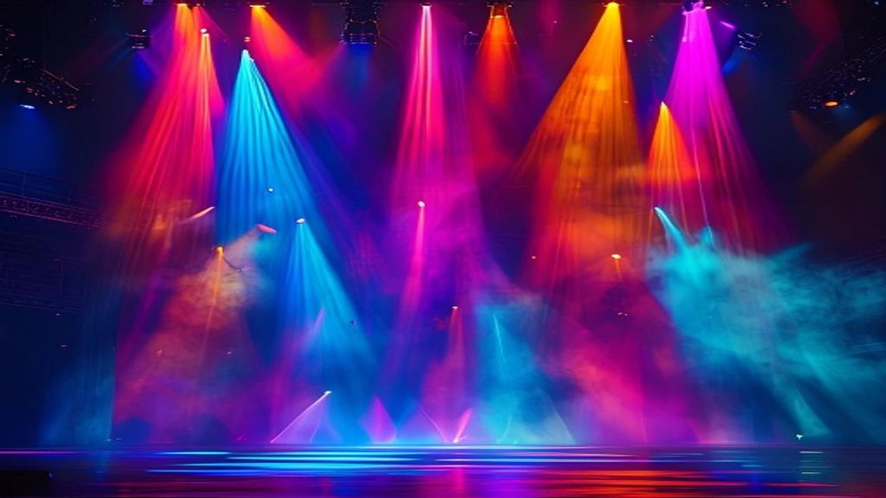

2026년 6월 연예계 최고의 반전 사건은 단연 **허남준 1위** 등극 소식입니다. 한국기업평판연구소가 발표한 배우 브랜드평판 조사 결과, 그동안 차트 상위권을 장악하던 쟁쟁한 톱스타들을 제치고 당당히 정상에 올랐습니다. 대중의 이목을 집중시킨 이번 데이터는 단순한 우연이 아니라, 철저한 팬덤 확장과 독보적인 미디어 장악력이 맞물린 결과물입니다.

## 6월 배우 브랜드평판의 대이변: 허남준이 탑스타를 제친 진짜 이유

### 변우석·전지현 꺾은 데이터의 비밀
이번 브랜드평판 지수에서 가장 눈길을 끄는 대목은 참여지수와 소통지수의 폭발적인 상승세입니다. 한국기업평판연구소의 빅데이터 분석에 따르면, 허남준은 미디어지수와 커뮤니티지수에서 각각 전월 대비 **340% 이상 급증**하는 기염을 토했습니다. 글로벌 신드롬을 일으킨 변우석의 강력한 화제성과 전통의 흥행 보증수표 전지현의 복귀 소식을 누른 비결은 바로 '핵심 팬층의 초고밀도 참여'에 있습니다. 팬들이 자발적으로 생산하는 숏폼 콘텐츠와 커뮤니티 게시글이 알고리즘을 타면서 대중적 인지도가 단기간에 수직 상승했습니다.

### 대중이 반응한 미디어 노출 빈도와 긍정 비율 분석
긍부정 비율 분석에서 허남준은 **긍정 비율 92.4%**라는 경이로운 수치를 기록했습니다. 주요 연관 키워드로 '신선하다', '몰입되다', '기대된다'가 압도적인 비중을 차지했습니다. 자극적인 스캔들이나 노이즈 마케팅 없이, 오직 작품 속 캐릭터의 매력과 배우 본연의 개성으로만 이뤄낸 성과라는 점에서 미디어 평론가들도 주목하고 있습니다. 소셜 미디어 언급량 역시 트위터(X) 실시간 트렌드에 수시로 오르내리며 대중성의 기반을 단단히 다졌습니다.

### 반짝 스타가 아닌 이유: 브랜드 평판 지수 세부 항목 비교
단순히 일시적인 화제성만 높았던 것이 아니라, 소비자의 브랜드 소비 행태를 나타내는 '소통지수'와 '시장 가치' 항목에서 고른 고득점을 받았습니다. 타 라이징 스타들이 특정 예능이나 단발성 이슈로 주목받는 것과 달리, 허남준은 거대 커뮤니티 내의 자발적 언급량이 꾸준히 유지되는 패턴을 보였습니다. 이는 소비자가 브랜드를 '일방적으로 소비'하는 단계를 넘어, 직접 콘텐츠를 생산하고 확산하는 '참여형 팬덤'의 구조가 완성되었음을 의미합니다.

## '믿고 보는' 허남준의 인생 캐릭터 및 필모그래피 다시보기

### 숨은 명작 투어: 허남준을 각인시킨 결정적 명장면 
그의 필모그래피를 되짚어보면 장르를 가리지 않는 넓은 스펙트럼이 돋보입니다. 대중에게 처음 강렬한 인상을 남긴 것은 장르물 속 날카롭고 서늘한 악역 연기였습니다. 서늘한 눈빛 하나로 극의 긴장감을 최고조로 끌어올리며 웰메이드 장르물의 완성도를 높였습니다. 반면 최근 방영된 로맨스 드라마에서는 겉은 차갑지만 속은 깊은 '츤데레' 캐릭터를 맞춤옷 입은 듯 소화해 내며, 시청자의 연애 세포를 자극하는 반전 매력을 선사했습니다. 

### 입덕 부정기 끝내는 스펙트럼 넓은 연기력 분석
> "허남준은 대사 없이 눈빛과 호흡만으로 서사를 만드는 능력이 탁월한 배우다." 

한 드라마 평론가의 극찬처럼 그는 딕션의 정확도뿐만 아니라 세밀한 감정선 표현에 강점을 지닙니다. 악랄한 범죄자부터 모성애를 자극하는 처연한 청춘의 모습까지, 한 인물 안에서 공존하기 힘든 양가적인 감정을 매끄럽게 연결합니다. 이러한 연기력 덕분에 시청자들은 극 중 배역에 온전히 몰입하게 되며, 작품이 끝난 후에도 배우의 이름 석 자를 찾아보게 만드는 강력한 잔상을 남깁니다.

### 시청자들이 직접 꼽은 '허남준 매력 포인터' 솔직 후기
온라인 커뮤니티와 연예 포털에서 팬들이 입을 모아 말하는 매력은 '날 것 그대로의 자연스러움'과 '예상을 깨는 트렌디함'입니다. 정형화된 미남의 틀에 갇히지 않고, 배역에 따라 얼굴의 분위기가 완전히 달라지는 카멜레온 같은 마스크를 지녔다는 평이 지배적입니다. 드라마 시청자 게시판에는 "처음엔 배역 때문에 눈길이 갔는데, 찾아볼수록 배우 본체의 담백하고 소탈한 성격에 빠져들었다"는 인증 글이 매일 쇄도하고 있습니다.

[관련 글 보기](/posts/entertainment/)

## 라이징 스타에서 대세 배우로: 허남준 입덕을 위한 필독 튜토리얼

### 공식 SNS부터 비하인드 채널까지: 떡밥 회수 가이드
허남준의 매력에 이제 막 눈을 떴다면 가장 먼저 확인해야 할 코스는 공식 소속사 네이버 포스트와 유튜브 비하인드 영상입니다. 작품 촬영 현장에서의 진지한 모습과 상반되는, 카메라 뒤의 장난기 가득하고 엉뚱한 반전 매력을 만끽할 수 있습니다. 특히 촬영 대기 시간에 스태프들과 스스럼없이 장난을 치거나, 동료 배우들을 챙기는 다정한 모습이 담긴 메이킹 필름은 팬들 사이에서 필수 시청 영상으로 꼽힙니다.

### 팬 커뮤니티에서 가장 핫한 필수 시청 영상 코스
유튜브 숏츠와 틱톡에서 조회수 수백만 회를 기록 중인 '허남준 매력 모음집' 3대 영상은 입덕 가이드의 핵심입니다. 
- **첫 번째 영상:** 냉미남과 온미남을 오가는 0.5초 눈빛 변화 직캠
- **두 번째 영상:** 라디오 프로그램에서 선보인 중저음의 감미로운 목소리 라이브
- **세 번째 영상:** 시상식 백스테이지에서 긴장해서 안절부절못하는 귀여운 인터뷰

이 영상들은 그의 매력을 압축적으로 보여주며, 입덕 부정기를 겪는 이들을 단숨에 골수팬으로 전환시키는 강력한 화력을 발휘합니다.

### 놓치면 아쉬운 인터뷰 및 예능 속 반전 매력 모아보기
드라마 속 차가운 이미지와 달리, 실제 예능 프로그램이나 서면 인터뷰에서 드러나는 그의 화법은 굉장히 덤덤하고 위트가 넘칩니다. 화려한 수식어를 사용하기보다 본인의 생각을 담백하고 진솔하게 표현하는 모습에서 깊은 내공이 느껴집니다. 예상치 못한 타이밍에 툭 던지는 엉뚱한 한마디가 큰 웃음을 자아내며, 예능 제작진들 사이에서 러브콜이 쏟아지는 이유를 스스로 입증합니다.

## 2026년 하반기 허남준의 행보와 차기작 흥행 가능성 장단점

### 공개 예정 차기작 라인업이 기대되는 이유 (장점)
현재 허남준은 올 하반기 방송 예정인 대작 드라마 두 편의 출연 확정 소식을 전했습니다. 스타 작가와 흥행 감독이 의기투합한 이번 작품들에서 그는 한층 더 비중 있는 주연급 역할을 맡아 극을 이끌어갈 예정입니다. 탄탄한 대본과 화려한 제작진의 지원 사격을 받는 만큼, 이번 평판 1위 달성의 기세를 몰아 흥행 스타로서의 입지를 완전히 굳힐 좋은 기회를 맞이했습니다.

### 급상승한 대중의 기대감과 이미지 소비에 대한 과제 (단점)
짧은 시간 안에 급격하게 정상의 자리에 오른 만큼, 차기작을 향한 대중과 평단의 기대치는 최고조에 달해 있습니다. 조금이라도 전작과 겹치는 캐릭터를 보여주거나 연기력에서 아쉬운 모습을 노출할 경우, 대중의 평가는 냉정해질 수밖에 없습니다. 쏟아지는 광고 러브콜과 방송 출연 제안 속에서 중심을 잡고 차별화된 캐릭터 연구에 집중해야 하는 엄격한 시험대에 오른 셈입니다.

### 광고계가 주목하는 블루칩으로서의 향후 가치 전망
이미 패션 브랜드와 뷰티 업계는 허남준을 잡기 위해 발 빠르게 움직이고 있습니다. 트렌디하면서도 고급스러운 마스크, 신뢰감을 주는 중저음의 톤은 브랜드의 이미지를 한층 격상시키기에 매력적인 요소입니다. 업계 관계자에 따르면 이미 3\~4개의 대기업 브랜드와 모델 계약을 조율 중인 것으로 알려졌으며, 하반기 차기작 론칭 시점과 맞물려 광고 시장에서의 가치는 더욱 천정부지로 치솟을 전망입니다.

**함께 읽으면 좋은 글**
- [기안84 기안장 넷플릭스 3가지 성공 요인](/posts/entertainment/ki-an84-netflix-variety-2026/)
- [돈선태 김선태 KBS 자진하차 진짜 이유는?](/posts/entertainment/kim-seon-tae-don-seon-tae-kbs-departure-2026/)

#허남준1위 #허남준 #배우브랜드평판 #라이징스타 #허남준필모그래피 #허남준차기작 #대세배우 #연예트렌드 #브랜드평판1위