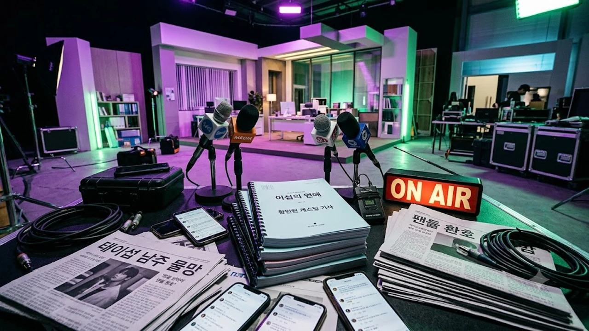

웹소설 원작 드라마 **이섭의 연애 황민현 캐스팅** 소식이 전해지자마자 온라인 커뮤니티가 완전히 뒤집혔어. 독보적인 비주얼의 재벌 3세 캐릭터와 찰떡 싱크로율을 자랑한다는 반응이 쏟아지는 가운데, 이번 작품이 그의 차기작으로 최종 확정될지 팬들의 관심이 온통 쏠리는 중이야. 로맨스 웹툰 독자들까지 들썩이게 만든 이번 소식의 핵심 팩트를 하나씩 짚어줄게.

## 이섭의 연애 캐스팅 소식에 드라마 팬들 난리 난 배경

### 네이버 시리즈 메가 히트 웹소설의 파급력
원작 소설은 플랫폼 내 현대 로맨스 부문에서 장기간 1위를 굳건히 지켜낸 검증된 IP야. 재벌가 후계자 태이섭과 평범하지만 당찬 엘리트 사원 강민경의 팽팽한 사내 로맨스를 다뤄서 연재 당시에도 회차마다 댓글 화력이 엄청났거든. 웹툰화에 이어 드라마 제작 소식이 들려오자 팬들은 가상 캐스팅 1순위로 손꼽히던 남주 자리에 과연 누가 앉을지 숨죽이고 지켜보던 상황이었어.

### 소속사 입장과 현재 제작 조율 단계
제작사 측에서 러브콜을 보낸 뒤 소속사는 "제안을 받고 긍정적으로 검토 중인 작품 중 하나"라는 공식 피셜을 내놓았어. 연예계 관행상 '긍정 검토' 단계는 세부 조율과 촬영 스케줄 협의가 순조롭게 오가는 상태를 뜻하는 경우가 많잖아? 특별한 변수가 생기지 않는 한 남자 주인공 '태이섭' 역으로 브라운관에 나설 가능성이 아주 높다는 관측이 지배적이야.

### 전작으로 입증한 황민현의 탄탄한 연기 필모그래피
아이돌 활동을 거쳐 안방극장에 성공적으로 안착한 황민현은 이미 탄탄한 커리어를 다져왔어. 전작 판타지 활극과 청춘 멜로물에서 안정적인 발성과 서늘하면서도 깊은 눈빛을 증명하며 연기돌 꼬리표를 시원하게 떼어냈지. 차분함 속에 남모를 결핍을 지닌 재벌 3세 역할을 소화하기에 이만한 피지컬과 마스크를 찾기 힘들다는 평이 쏟아지는 이유야. 연예계 전반의 화젯거리가 궁금하다면 [연예이슈 전체 글 보기](/posts/entertainment/)를 참고해 봐.

## 원작 싱크로율 200% 외모와 피지컬 매칭 분석

### 태이섭 캐릭터의 서사와 비주얼 조건
원작 속 태이섭은 국내 굴지의 대기업 TK그룹 후계자야. 겉으로는 빈틈없고 차가운 완벽주의자처럼 보이지만, 내면에는 인정받지 못할까 봐 전전긍긍하는 불안감과 짙은 고독을 숨긴 입체적인 인물이지.
- 신장 180cm 이상의 늘씬하고 각 잡힌 수트 핏
- 냉미남과 온미남을 오가는 날렵한 이목구비
- 완벽한 겉모습 뒤에 감춰진 지독한 순애보

이 조건들이 맞아떨어져야만 원작 특유의 아슬아슬한 텐션이 살아나는데, 황민현의 실제 이미지와 완벽히 맞아떨어져.

### 수트 핏과 냉미남 무드가 주는 파괴력
공식 석상이나 화보에서 입증된 칼각 턱선과 맑은 피부는 '대기업 후계자' 수트 핏의 정석 그 자체야. 화려한 펜트하우스나 사옥 집무실에서 서늘한 표정으로 결재 서류를 넘기는 장면을 떠올려 보면, 웹툰 삽화가 현실로 튀어나왔다고 해도 믿을 정도지.

### 원작 팬들의 실시간 반응과 커뮤니티 온도
캐스팅 단독 기사가 뜨자마자 SNS 실시간 트렌드와 대형 커뮤니티에는 열띤 글들이 줄을 이었어.
> "태이섭이 실존한다면 딱 저 얼굴이다."
> "웹툰 작가님이 그림 그릴 때 황민현 비주얼을 참고한 게 틀림없다."

이런 열광적인 반응이 쏟아지는 걸 보면 원작 팬덤의 까다로운 눈높이도 단숨에 통과한 셈이야.

## 황민현이 그려낼 태이섭의 매력 포인트

### 오만함 뒤에 숨겨진 순정남의 반전미
태이섭의 핵심 매력은 완벽해 보이는 겉모습과 달리, 사랑 앞에서는 여지없이 흔들리고 안달 내는 반전미에 있어. 여주인공 강민경의 무심한 한마디에 혼자 밤새 끙끙 앓고 질투심에 불타오르는 집착마저 사랑스럽게 표현해야 하거든. 냉랭한 낯빛 뒤에 감춰둔 소년 같은 맹목성을 어떻게 풀어낼지가 최대 관전 포인트야.

### 사내 로맨스 장르가 주는 아슬아슬한 긴장감
드라마의 주 무대는 숨 막히는 대기업 본사 사옥이야. 결재 서류를 주고받는 짧은 찰나, 탕비실과 엘리베이터 안에서 오가는 시선 처리가 심박수를 가파르게 끌어올려야 해. 황민현 특유의 나지막한 중저음 보이스와 또렷한 딕션은 오피스물 특유의 전문적인 대사를 주고받을 때도 강한 몰입감을 선사할 거야.

### 여주인공 '강민경' 캐스팅과의 케미 기대감
강민경 역은 일 잘하고 똑 부러지는 성격으로 태이섭의 멘탈을 쥐락펴락하는 능력자 캐릭터야. 상대 배우와의 키 차이나 눈빛이 부딪칠 때 터져 나오는 불꽃이 작품 성패를 좌우하겠지. 20대 실력파 여배우들이 가상 캐스팅 물망에 오르내리면서 둘이 완성할 사내 케미스트리를 향한 관심은 최고조에 달했어.

## 방송 편성 시기와 흥행 전망

### 제작 일정과 방영 플랫폼 현황
현재 프리 프로덕션 단계를 조율 중인 만큼, 캐스팅 작업이 마무리되면 글로벌 OTT 플랫폼이나 주요 방송사 편성이 점쳐져. K-로맨스물이 해외 스트리밍 플랫폼에서 여전히 막강한 파워를 자랑하는 만큼 글로벌 팬덤 유입도 거셀 전망이야.

### 황민현의 차기작 티켓 파워
국내외를 아우르는 탄탄한 코어 팬덤과 대중적인 호감도를 두루 갖췄다는 점은 투자 배급사 입장에서도 든든한 카드야. 무대와 브라운관을 넘나들며 쌓은 스타성이 인기 사내 로맨스 장르와 만났을 때 뿜어낼 시너지는 기대 이상일 테니까.

### 드라마 방영 전 원작 정주행 꿀팁
웹툰과 소설을 먼저 섭렵하면 원작의 디테일한 감정선이 영상으로 어떻게 각색됐는지 뜯어보는 재미가 쏠쏠해. 스마트폰이나 태블릿으로 회차를 넘기다 보면 서너 시간은 순식간에 지나가니까, 손목 부담을 줄여주는 전용 거치대를 세팅해 두고 달리는 게 좋아.

[원작 정주행 필수템 태블릿 거치대 쿠팡에서 보기](https://www.coupang.com/np/search?q=%ED%83%9C%EB%81%8C%EB%A6%BF%EA%B1%B0%EC%B9%98%EB%8C%80&sourceType=affiliate&trackingCode=AF8691300)

#황민현 #이섭의연애 #태이섭 #황민현드라마 #이섭의연애캐스팅 #사내로맨스 #웹소설드라마 #황민현차기작 #로맨스드라마