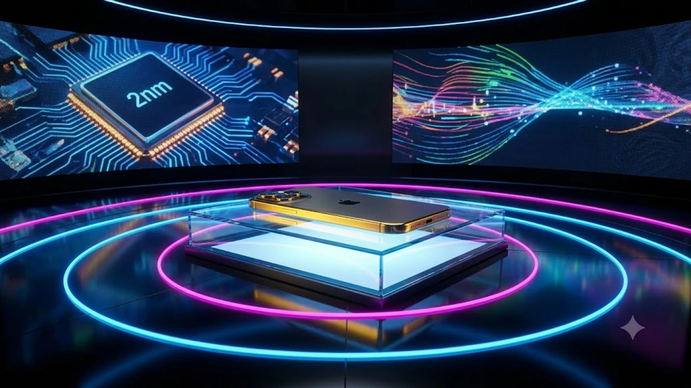

애플이 드디어 칼을 갈고 **아이폰18**을 정식으로 공개했어. 역대급 카메라 업그레이드와 2nm 공정 기반 차세대 칩셋 소식이 쏟아져 나오면서 사전예약 일정에 다들 눈에 불을 켜고 있더라고. 디자인부터 배터리 타임까지 체감 변화가 확실한 신제품의 알짜배기 포인트를 솔직하게 털어놓을게.

## 2026 애플 이벤트 총정리: 아이폰18 주요 공개 내용

### 공개일 직후 확인된 라인업과 공식 스펙 변화
이번 발표에서 라인업은 기본형, 플러스, 프로, 프로 맥스 총 4종 체제를 그대로 유지했어. 화면을 켜자마자 디스플레이 상단 펀치홀 영역이 눈에 띄게 줄어든 게 체감돼.
- 기본형 화면 주사율 드디어 120Hz 프로모션(ProMotion) 전면 도입
- 전체 무게 전작 대비 평균 7g 경량화 달성
- 티타늄 프레임 공정 개선으로 스크래치 내구성 대폭 강화

> "단순한 넘버링 교체가 아니라 기본형과 프로의 체감 성능 격차를 좁힌 역대급 세대교체"라는 테크 커뮤니티 평이 지배적이야.

### A20 칩셋 탑재와 온디바이스 AI 기능 고도화
TSMC 최신 2나노미터(nm) 파운드리 공정에서 뽑아낸 **A20 프로 칩**이 실물로 베일을 벗었어. 신경망 처리 장치(NPU) 코어가 이전 세대보다 40% 빨라지면서 인터넷 연결 없이도 기기 자체에서 실시간 이미지 편집과 통화 동시통역을 끝내버려. 전력 소모율은 전작보다 18% 줄어서 발열 걱정도 한시름 덜었지.

### 디스플레이 베젤 축소 및 배터리 수명 개선 수치
물리 베젤 두께가 1.1mm 수준까지 얇아져서 기기를 손에 쥐었을 때 화면만 둥둥 떠 있는 느낌을 줘.
- 프로 맥스 기준 연속 동영상 재생 시간 최대 33시간 달성
- 고밀도 실리콘 음극재 적용으로 배터리 물리 용량 4,950mAh 확보
- 야외 최대 밝기 2,600니트(nits) 지원으로 직사광선 아래 시인성 극대화

## 아이폰18 사전예약 및 국내 출시 일정

### 1차 출시국 포함 여부와 통신사별 예약 시작 시점
한국이 당당하게 1차 출시국 리스트에 이름을 올렸어.
- 공식 사전예약 시작: 2026년 9월 11일(금) 오전 9시 전산 오픈
- 매장 정식 개통 및 수령: 2026년 9월 18일(금)부터 일괄 진행
통신 3사 모두 첫날 물량을 잡으려는 대기 수요가 몰리는 상황이라 첫 타임 퀵 배송을 노린다면 알람 설정은 필수야. 연예계 스타들도 벌써부터 SNS에 기기 교체 인증을 예고하고 있는데, 셀럽 트렌드가 궁금하다면 [연예이슈 전체 글 보기](/posts/entertainment/)를 참고해 봐.

### 자급제 모델 사전예약 할인 혜택 및 카드사 조건
주요 오픈마켓 자급제 사전예약 경쟁은 오픈 직후 빠르게 마감될 가능성이 높아.
- 주요 카드사(국민·신한·삼성) 즉시 할인율: 5~8% 선착순 적용
- 무이자 할부 혜택: 결제 금액 100만 원 이상 시 최장 16개월 지원
- 애플케어플러스(AppleCare+) 동시 구매 시 10% 추가 할인 프로모션 진행

### 통신사 공시지원금과 선택약정 요금 비교
초기 개통은 무조건 선택약정 25% 요금할인을 고르는 게 이득이야. 번호이동 기준으로도 통신사 공시지원금 상한선이 20만 원대 초반에 묶여 있거든. 10만 원대 고가 5G 무제한 요금제를 6개월간 유지하는 페널티를 고려하면 자급제 단말기에 알뜰폰 LTE 결합이나 선택약정 24개월을 거는 쪽이 유지비 면에서 40만 원 이상 아끼는 셈이지.

## 이전 모델(아이폰16·아이폰17) 대비 바뀐 핵심 3가지

### 온디바이스 카메라 시스템과 물리 셔터 고도화
기기 측면 정전식 햅틱 셔터 버튼의 감도 단계가 세분화됐어.
- 반셔터를 누르면 피사체 눈동자 자동 AF 고정
- 손가락을 좌우로 쓸어 넘기면 0.1배율 단위로 무단 줌(Zoom) 제어
- 잠망경 폴디드 줌 렌즈 화소수가 4,800만 화소로 전면 개편되어 10배 광학 줌 화질 보장

### 기본형과 프로 라인업 간 성능 급 나누기 현황
매번 아쉬움을 샀던 급 나누기 패턴이 이번엔 꽤 합리적으로 바뀌었어.

| 비교 항목 | 아이폰18 기본형 | 아이폰18 프로 |
| :--- | :--- | :--- |
| 두뇌(AP) | A20 바이오닉 | A20 프로 |
| 디스플레이 | 120Hz 프로모션 지원 | 120Hz LTPO 상시표시(AOD) |
| 후면 카메라 | 듀얼 (메인 48MP + 초광각) | 트리플 (망원 48작성할 주제나 원문 내용을 알려주시면 요청하신 형식의 마크다운 코드블록으로 바로 변환해 드리겠습니다. 어떤 내용을 작성할까요?