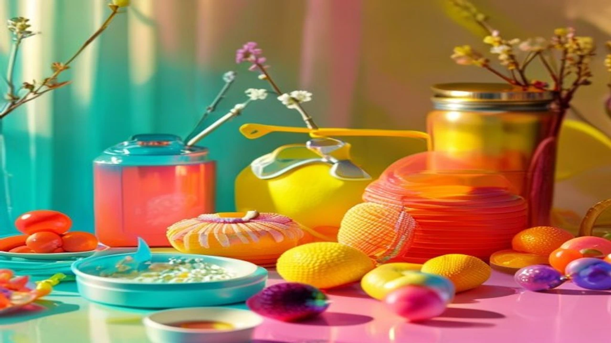
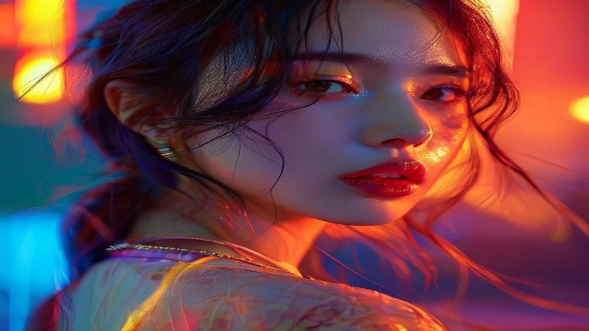

솔직히 처음에 이 소식 들었을 때 눈을 의심했어. 연예계 대표 예쁜 커플이었던 **아이유 이종석 결별** 소식이 전해지면서 지금 인터넷 커뮤니티가 완전히 뒤집어졌거든. 4년이라는 시간 동안 조용히, 하지만 예쁘게 만남을 이어왔던 두 탑스타의 장수 연애가 끝났다는 팩트에 다들 "이게 진짜야?"라며 허탈해하는 분위기야. 

## 아이유 이종석 4년 열애 마침표, 공식 입장과 팩트 체크

### EDAM 엔터테인먼트와 하이지음스튜디오의 공식 발표 내용
양측 소속사는 이번 결별설이 터지자마자 빠르게 입장을 정리했어. 아이유 측 소속사인 EDAM 엔터테인먼트와 이종석 측 하이지음스튜디오는 거의 동시에 공식 입장을 냈지. 내용을 요약하면 **"두 사람이 최근 연인 관계를 정리하고 좋은 동료로 남기로 했다"**는 거야. 탑스타들의 이별 멘트가 늘 그렇듯 심플하지만, 서로의 앞날을 응원한다는 깔끔한 마무리가 돋보이더라고. 

### 7월 11일 최초 보도부터 공식 인정까지의 타임라인
사건의 발단은 지난 7월 11일 한 연예 매체의 단독 보도였어. 측근의 말을 인용해서 두 사람이 최근 만남이 뜸해졌고, 결국 각자의 길을 가기로 정리했다는 기사가 떴지. 처음엔 팬들도 가짜뉴스라고 생각하며 넘기려 했는데, 불과 몇 시간 만에 소속사에서 팩트로 인정하면서 상황이 종결됐어. 주말 내내 연예 뉴스 메인을 장식할 정도로 파급력이 어마어마했지.

### 루머와 팩트 구분하기: 찌라시가 아닌 진짜 결별 계기
항상 이런 거물급 커플이 헤어지면 말도 안 되는 루머나 찌라시가 돌기 마련이잖아? 뭐 누가 바람을 폈네, 불화가 있었네 하는 소설들이 유튜브나 커뮤니티에 실시간으로 올라오던데 이거 전부 헛소리야. 양측 관계자들 교차 검증에 따르면, 특별한 트러블이 있어서 헤어진 게 아니라 정말 자연스럽게 관계가 소원해진 게 팩트라고 해. 괜한 억측으로 상처 주는 일은 없어야지.

## 팬들이 추측하는 아이유 이종석 결별 진짜 이유 3가지

### 바쁜 해외 스케줄과 서로 다른 작품 활동 시기
솔직히 말해줄게. 몸이 멀어지면 마음도 멀어진다는 말, 연예인들이라고 다를까? 아이유는 글로벌 투어와 새 프로젝트 준비로 눈코 뜰 새 없이 바빴고, 이종석 역시 차기작 촬영과 해외 팬미팅 일정으로 스케줄이 꽉 차 있었어. 둘 다 대한민국에서 가장 바쁜 일정을 소화하는 인물들인데, 얼굴 한 번 제대로 볼 시간이 없었을 게 뻔하지. 연애 유지 능력을 아무리 발휘하고 싶어도 물리적인 시간이 안 받쳐주면 답이 없어.

### 과거 인터뷰와 공식 석상에서 포착된 미묘한 심경 변화
매의 눈을 가진 네티즌들은 이미 몇 달 전부터 이별 시그널을 감지하고 있었더라고. 올해 초 두 사람의 인터뷰를 보면 서로에 대한 직접적인 언급을 은근히 피하는 기색이 역력했어. 예전에는 "그 친구 덕분에 의지가 된다" 같은 달달한 멘트를 툭툭 던지곤 했는데, 최근 들어서는 오직 일과 연기에 대한 이야기만 집중했지. 이때부터 이미 관계 정리에 들어갔던 게 아닐까 하는 추측이 나오는 중이야.

### 공개 열애가 두 탑스타에게 주었던 현실적인 부담감
일거수일투족이 생중계되는 탑스타 커플의 삶이란 게 상상 이상으로 피로했을 거야. 어디를 가든 수식어가 따라붙으니 말 다 했지. 심지어 얼마 전 떴던 [손예진 현빈 가족 여행, 진짜 소름 돋는 패션 정보 완전 정리](/posts/entertainment/son-ye-jin-hyun-bin-family-trip-2026/) 글처럼 다른 톱스타 커플들과 끊임없이 비교당하는 것도 스트레스였을 걸? 이런 대중의 과도한 관심이 결국 두 사람에게 큰 부담감으로 작용했을 가능성이 아주 높아.

## 과거 열애설부터 결별까지, 두 사람의 4년 발자취 정리

### SBS 인기가요 MC 인연부터 연인 발전까지의 비하인드
두 사람의 인연은 무려 10년도 더 전인 SBS 인기가요 MC 시절로 거슬러 올라가. 당시 이종석이 무대 의상 콘셉트 때문에 "아이유가 조금 얄미웠다"고 고백했던 일화는 지금 봐도 너무 귀여운 흑역사지. 그렇게 투닥거리던 동료였던 두 사람이 오랜 시간 친한 친구로 지내다가 연인으로 발전했다는 스토리 자체가 한 편의 드라마 같았어.

### "그 친구" 언급으로 시작된 2022년 말의 공개 연애 시작
그러다 연애의 시작을 알린 게 바로 2022년 연말 이종석의 연기대상 수상소감이었지. > "그분께 이 자리를 빌려 꼭 하고 싶은 말이 있었다, 항상 그렇게 멋져 고맙고 내가 아주 오랫동안 많이 좋아했다고 말하고 싶다"던 그 로맨틱한 고백, 기억나? 직후 크리스마스 일본 나고야 데이트가 포착되면서 두 사람은 쿨하게 열애를 인정했고, 전 세계 팬들의 엄청난 축하를 받았어.

### 서로에게 영감을 주었던 아티스트로서의 시너지와 남은 흔적
4년이라는 만남 동안 두 사람은 서로에게 참 좋은 긍정적 영향을 줬어. 아이유는 노래 가사에 은유적으로 사랑의 감정을 녹여냈고, 이종석은 인성적으로 한층 더 성숙해진 모습을 보여줬지. 비록 연인 관계는 끝났지만, 서로의 리즈 시절을 함께 빛내준 서사는 팬들의 기억 속에 오래도록 예쁜 추억으로 남을 것 같아.

## 결별 이후 아이유와 이종석의 향후 활동 및 작품 행보

### 아티스트 아이유의 새 앨범 및 차기작 준비 현황
이별의 아픔은 뒤로하고, 국힙 원탑이자 솔로 퀸인 아이유는 본업에 완전히 몰두할 예정이야. 현재 하반기 발매를 목표로 새 앨범 작업에 박차를 가하고 있다는 소식이 들리는데, 이번 이별의 감정이 또 어떤 명곡으로 탄생할지 대중의 기대감이 장난 아니야. 위기를 기회로 만드는 천재 아티스트답게 음악으로 팬들을 위로해 줄 거라 믿어.

### 배우 이종석의 글로벌 복귀작 및 향후 연기 변신 전망
이종석 역시 연기 활동에 올인할 계획이야. 그동안 멜로와 장르물을 넘나들며 믿고 보는 배우로 자리 잡았는데, 이번 일을 겪고 더 깊어진 감정선으로 카메라 앞에 서지 않을까 싶어. 현재 글로벌 OTT 플랫폼의 대작 출연을 검토 중이라는데, 한층 묵직해진 연기 톤으로 돌아올 그의 컴백이 벌써 기다려져.

### 이별의 아픔을 딛고 각자의 자리에서 보여줄 프로페셔널한 행보
연애는 끝났지만 이들의 인생은 계속되니까. 팬들이 슬퍼하는 만큼 본인들도 마음이 허하겠지만, 워낙 멘탈이 강하고 프로페셔널한 두 사람이니 금방 털고 일어날 거야. 이제 연인이 아닌 연예계 동료로서 서로의 길을 묵묵히 응원해 줄 두 사람의 쿨한 앞날을 격하게 응원해 보려고 해. 연예계 핫이슈를 더 보고 싶다면 [연예이슈 전체 글 보기](/posts/entertainment/)를 참고해 봐.

#아이유 #이종석 #아이유이종석결별 #연예계결별 #이종석수상소감 #탑스타커플 #아이유차기작 #이종석복귀 #디스패치 #공개연애종료