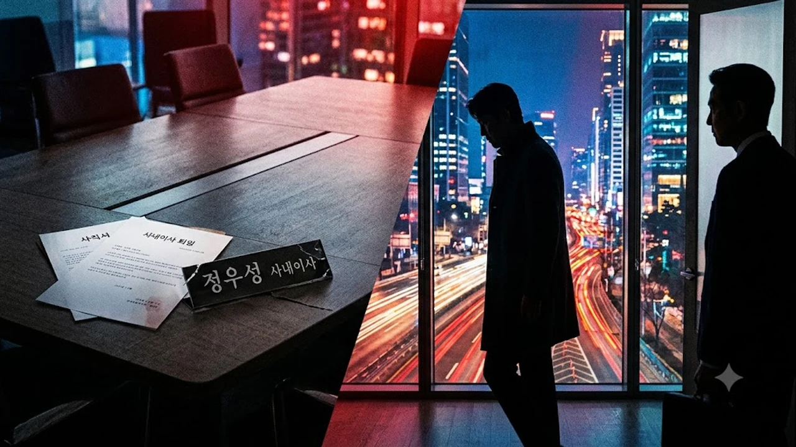

배우 정우성이 설립 초기부터 10년 가까이 이끌어온 아티스트컴퍼니의 사내이사직에서 물러났다는 소식이 전해지면서 연예계가 발칵 뒤집혔어. 팬들 사이에서는 **정우성 사내이사 사임** 배경을 두고 파경설부터 독립 레이블 설립설까지 온갖 루머가 도는 중인데, 핵심 쟁점과 지배구조 변화를 팩트 위주로 짚어볼게.


## 정우성 아티스트컴퍼니 사내이사 중도 사임 배경

### 임기 만료 6개월 전 결정된 사임 공시 전말
금융감독원 전자공시시스템과 법인 등기부 확인 결과, 정우성은 정기 주주총회가 아닌 시점에 사내이사직 중도 사임을 공식화했어. 보통 임기가 6개월 안팎으로 남은 상황에서 중도 퇴진하는 건 기업 내부적으로 긴급한 조직 개편이나 전문경영인 체제 도입이 맞물려 있을 때 나타나는 전형적인 패턴이지. "단순 임기 만료"로 보기 어려운 시점이라 대중의 시선이 쏠릴 수밖에 없었어.

### 설립 10년 차 기획사 지배구조 변화 포인트
2016년 두 사람이 손잡고 세운 아티스트컴퍼니는 어느덧 설립 10년 차 종합 엔터테인먼트 기업으로 덩치가 커졌어. 초창기에는 두 간판스타가 직접 발로 뛰며 실무를 챙겼지만, 사옥 매입과 콘텐츠 제작사 합병을 거치면서 전문 경영진의 권한이 대폭 커졌지. 이번 등기 변경은 실무 권한을```markdown
배우 정우성이 10년 가까이 동업해 온 아티스트컴퍼니 사내이사직에서 전격 사임했다는 소식이 전해지면서 업계가 술렁이고 있어. 뜬금없는 파경설부터 레이블 독립설까지 온갖 추측이 쏟아지는 가운데, 이번 **정우성 사내이사 사임** 건의 진짜 내막과 지배구조 개편 배경을 핵심만 알기 쉽게 정리해 줄게.


## 정우성 아티스트컴퍼니 사내이사 중도 사임 배경

### 임기 만료 6개월 전 결정된 사임 공시 전말
금융감독원 전자공시시스템과 법인 등기부 확인 결과, 정우성은 정기 주주총회가 아닌 시점에 사내이사직 중도 사임을 공식화했어. 보통 임기가 6개월 안팎으로 남은 상황에서 중도 퇴진하는 건 기업 내부적으로 긴급한 조직 개편이나 전문경영인 체제 도입이 맞물려 있을 때 나타나는 전형적인 패턴이지. "단순 임기 만료"로 보기 어려운 시점이라 대중의 시선이 쏠릴 수밖에 없었어.

### 설립 10년 차 기획사 지배구조 변화 포인트
2016년 두 사람이 손잡고 세운 아티스트컴퍼니는 어느덧 설립 10년 차 종합 엔터테인먼트 기업으로 덩치가 커졌어. 초창기에는 두 간판스타가 직접 발로 뛰며 실무를 챙겼지만, 사옥 매입과 콘텐츠 제작사 합병을 거치면서 전문 경영진의 권한이 대폭 커졌지. 이번 등기 변경은 실무 권한을 투자 유치와 재무 관리를 전담하는 전문 이사회에 완전히 넘기는 과정에서 나온 첫 단추로 읽혀.

### 이정재와의 공동 경영 체제 변화 여부
제일 관심이 쏠린 대목은 "청담부부 결별 아니냐"는 의혹이었지. 결론부터 말하면 두 사람의 파트너십에는 균열이 없어.

> "소속 아티스트로서의 전속계약은 확고하며, 이정재 배우와의 공동 지분 구조 역시 유지된다."

소속사 관계자의 선 긋기처럼, 이번 결정은 우정의 문제가 아니라 경영과 예술 활동의 선을 명확히 긋는 작업이야.

## 이번 사임 결정을 둘러싼 3가지 핵심 관전 포인트


### 배우 본업 집중 및 연출 프로젝트 전념 설
가장 현실적인 카드는 차기작 연출과 연기 병행을 위한 '행정 부담 덜기'야. 정우성은 장편 영화 연출작을 선보인 이후 꾸준히 메가폰을 잡으려는 의지를 드러내 왔어. 영화감독은 시나리오 각색부터 후반 작업까지 수개월 동안 현장에 갇혀 지내야 하는 자리라 상법상 사내이사의 법적 책임과 의결권 행사를 병행하기가 물리적으로 불가능하거든.

### 경영권 정리와 신규 투자 유치 목적 가능성
엔터테인먼트 기업이 대규모 프리IPO 투자를 유치하거나 콘텐츠 펀드를 결성할 때, 창업자 배우가 직접 등기임원으로 이름을 올리고 있으면 심사 요건이 까다로워져. 주주 리스크를 줄이고 대형 사모펀드나 글로벌 플랫폼과의 제휴를 맺기 위해 '배우는 아티스트로, 경영은 전문인에게'라는 거버넌스 투명화 작업을 거친 셈이지.

### 소속 배우 유지와 아티스트컴퍼니 공식 입장
현장에서는 소속 배우 라인업 이탈 우려도 나왔지만, 정우성은 여전히 소속 1호 배우로서 간판 역할을 이어가고 있어. 회사 지분을 그대로 쥔 주요 주주 자격은 내려놓지 않았기 때문에, 등기이사 명단에서만 빠졌을 뿐 회사에 미치는 실질적 영향력은 여전하다고 봐야 해.

## 연예계 공동 설립 기획사의 경영권 분리 사례 분석

### 지분 유지형 전문경영인 체제 전환 모델
국내 대형 매니지먼트 업계에서 창업 스타가 등기이사직을 내려놓고 대주주 겸 대표 아티스트로 남는 건 이제 낯선 풍경이 아니야.
- **주요 사례 1**: 배용준의 키이스트 (초기 경영 참여 후 전문경영인 체제 전환)
- **주요 사례 2**: 박진영의 JYP (사내이사 및 CCO로 창작에만 집중, 대표이사는 전문경영인)
- **주요 사례 3**: 싸이의 피네이션 (공동 대표 체제에서 제작·기획 본부 체계로 개편)

엔터 업계 소식이 궁금하다면 [연예이슈 전체 글 보기](/posts/entertainment/)를 함께 확인해 봐.

### 과거 스타 설립 기획사 이사직 사임 전례 비교
과거 사례들을 뜯어보면 스타가 등기이사직을 쥐고 있을 때 회사 송사나 경영 악화로 법적 분쟁에 휘말려 이미지 타격을 입은 경우가 꽤 있었어. 상법상 등기이사는 회사의 채무나 배임 이슈에서 자유로울 수 없기 때문에, 브랜드 가치가 곧 자산인 톱스타 입장에서는 등기직 유지가 리스크 그 자체였지. 정우성 역시 이런 잠재적 법적 위험을 털어내고 아티스트로서의 보호막을 친 셈이야.

### 단순 경영 분리와 독립 법인 설립 시나리오 대조
일각에서는 1인 기획사를 차리기 위한 전조가 아니냐고 묻지만, 아티스트컴퍼니 지분을 매각하지 않는 이상 독립 레이블 설립은 실익이 없어. 두터운 배우 라인업과 제작 역량을 갖춘 둥지를 두고 굳이 리스크를 안고 나갈 이유가 없지. 이번 행보는 '독립'이 아니라 철저한 '역할 분담'에 가까워.

## 정우성 사임 이슈가 소속사와 업계에 미칠 영향

### 아티스트컴퍼니 소속 아티스트 라인업 영향도
현재 아티스트컴퍼니에는 안성기, 염정아, 박소담, 임지연 등 충무로를 주름잡는 베테랑부터 라이징 스타들이 대거 포진해 있어. 창립자의 이사직 사임이 행여 소속 배우들의 재계약에 영향을 주지 않을까 싶겠지만, 현장 실무 라인은 이미 전문 매니지먼트 팀이 단단하게 굴리고 있어서 동요는 거의 감지되지 않아.

### 향후 정우성 차기작 및 글로벌 활동 전개 방향
오히려 팬들 입장에서는 환영할 뉴스야. 서류 결재와 이사회 출석에 뺏기던 시간을 시나리오 검토와 캐릭터 빌드업에 온전히 쏟아부을 수 있게 됐으니까. 특히 글로벌 OTT 플랫폼과의 협업 프로젝트나 해외 페스티벌 출품작 준비에 더욱 속도가 붙을 전망이야.

### 대중과 팬들이 주목해야 할 체크리스트
- **지분 변동 공시**: 정우성이 보유한 아티스트컴퍼니 지분에 변동이 생기는지 여부
- **신임 이사진 프로필**: 투자사나 대형 제작사 출신 인물이 새롭게 영입되는지 체크
- **차기 연출작 발표**: 연기 복귀작 외에 직접 메가폰을 잡는 신작 크랭크인 시점

현장 촬영과 연기 활동에 다시 온몸을 던질 배우의 차기 행보에 관심이 있다면, 영화 감상 환경을 업그레이드해 줄 홈시네마 기기를 둘러보는 것도 좋은 방법이야.

[홈시네마 빔프로젝터 쿠팡에서 보기](https://www.coupang.com/np/search?q=%EB%B9%94%ED%94%84%EB%A1%9C%EC%A0%9D%ED%84%B0&sourceType=affiliate&trackingCode=AF8691300)

#정우성 #아티스트컴퍼니 #이정재 #사내이사사임 #연예계이슈 #엔터테인먼트 #지배구조개편 #연예뉴스