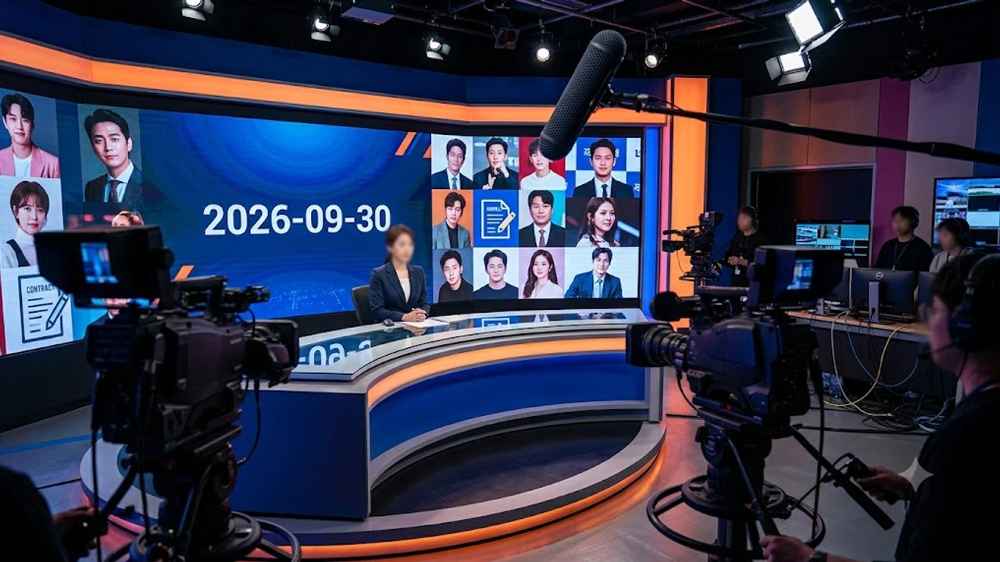

요즘 커뮤니티 타임라인을 통째로 불태우고 있는 연예계 핵심 이슈, 다들 실시간으로 따라가고 있어? 하루가 멀다 하고 터져 나오는 연예 뉴스 속보 때문에 도대체 어디서부터 어디까지가 진짜 팩트인지 헷갈리는 사람이 한둘이 아닐 거야. 겉으로 드러난 자극적인 말폭탄 속에 숨겨진 진짜 내막이 뭔지 하나씩 풀어줄게.

## 연예계 긴급 이슈 발생 배경과 초기 전개

### 사건 발단과 최초 보도 내용
처음 기사가 떴을 때만 해도 "또 흔한 낚시성 폭로겠지" 하고 넘긴 사람이 태반이었어. 하지만 자정을 기점으로 특정 온라인 매체에서 계약서 사본과 녹취록 일부를 기습 공개하면서 판이 순식간에 뒤집혔지. 단순한 불화설 수준을 넘어서서 수억 원대 위약금과 계약 미이행 논란이 정면으로 얽혀 있다는 게 밝혀졌거든.

### 온라인 커뮤니티 및 SNS 확산 경로
보도가 나간 지 불과 30분 만에 X(옛 트위터) 실시간 트렌드와 대형 커뮤니티 인기글 게시판이 완전히 도배됐어. 
- 단편적인 캡처본이 무차별적으로 재가공되며 알고리즘을 탔음
- 유튜브 사이버 렉카 채널들이 확인되지 않은 찌라시를 엮어 라이브 방송을 시작함
- 양측 팬덤이 댓글 창에서 증거 자료를 두고 실시간 화력전을 벌임

> "이게 말이 됨? 타임라인만 맞춰봐도 앞뒤가 전혀 안 맞잖아."

팬들 사이에서도 진위 여부를 두고 갈라치기가 일어날 만큼 이번 파장은 그야말로 역대급이야.

### 주요 관계자 및 소속사의 1차 공식 입장
논란이 걷잡을 수 없이 커지자 소속사 측은 이른 새벽에 부랴부랴 1차 입장문을 내놨어. 하지만 내용은 알맹이 없는 "사실관계를 면밀히 파악 중이며 법적 대응을 검토하겠다"는 교과서적인 문구가 전부였지. 뻔한 방어전에 대중은 오히려 더 큰 불신을 품게 됐고, 사태는 진화되기는커녕 기름을 부은 꼴이 됐어.

## 핵심 쟁점 3가지 집중 비교 분석

### 사실관계 확인과 상반된 진술 대립
이번 사건의 첫 번째 쟁점은 **합의된 일정 조율이었는가, 아니면 일방적인 활동 중단 통보였는가**야. 
- **아티스트 측 주장**: 살인적인 스케줄 속에서 건강 악화를 이유로 수차례 휴식을 요청했으나 묵살당했다.
- **소속사 측 반박**: 공식적인 병가 신청은 없었으며, 예정된 해외 투어와 광고 촬영을 불과 일주일 전에 펑크 냈다.

양측이 공개한 메신저 대화 캡처본의 날짜와 맥락이 묘하게 어긋나 있어서, 과연 누구 말이 진짜인지 법정 공방으로 가야만 가려질 판국이야.

### 과거 유사 사례와의 결정적 차이점
이전 아이돌이나 배우들의 전속계약 분쟁을 떠올려보면 대부분 정산 불투명성이나 수익 배분이 핵심이었잖아? 하지만 이번엔 결이 완전히 달라. 수익 정산 문제는 이미 양측 모두 정상 처리된 것으로 인정했어. 대신 **개인 IP(지식재산권) 활용 권한과 독자적인 크리에이티브 통제권**이 충돌의 뇌관이 됐다는 점이 결정적인 차이야. 연예계 계약의 패러다임이 어디로 흘러가는지 적나라하게 보여주는 대목이지.

### 법적·계약적 분쟁 가능성과 리스크 요인
양측이 합의점을 찾지 못하면 결국 가처분 신청과 손해배상 소송으로 직행하게 돼. 업계 법률 전문가들 말을 들어보면 계약서에 명시된 특약 조항이 워낙 촘촘해서 단기간에 결론이 나기 어렵다고 해. 활동 중단이 길어질수록 양쪽 모두 회복 불가능한 브랜드 타격을 입을 수밖에 없는 위험천만한 치킨게임인 셈이야. 비슷한 파열음을 겪었던 [더보이즈 9인 재편 진짜 이유 3가지](/posts/entertainment/the-boyz-9-member-reorganization-truth-2026/) 사례와 비교해 봐도 이번 리스크의 폭발력은 차원이 달라.

## 대중 반응과 업계 파급 효과

### 팬덤 및 대중 여론의 엇갈린 시선
대중의 시선은 싸늘함과 안타까움 사이에서 극명하게 쪼개졌어. "아무리 힘들어도 약속된 프로젝트를 엎는 건 프로답지 못하다"는 비판과, "사람을 한계까지 몰아붙인 기획사의 고질적인 악습이 또 터졌다"는 옹호론이 팽팽하게 맞서고 있거든. 감정적인 비난이 오가면서 애꿎은 동료 연예인들에게까지 불똥이 튀는 실정이야.

### 방송 및 광고계의 즉각적인 대응 조치
기업들은 득달같이 움직이고 있어. 논란이 불거진 당일 오후부터 이미 계약된 브랜드 두 곳의 공식 SNS에서 관련 게시물이 비공개로 전환됐지. 방송가 역시 다음 달로 잡혀 있던 단독 게스트 출연 분량의 통편집을 논의 중이라는 흉흉한 소문이 돌고 있어. 연예계 바닥에서 신뢰가 깨졌을 때 벌어지는 전형적인 손절 수순이야.

### 향후 예정된 활동 일정에 미칠 영향
당장 하반기 예정되어 있던 단독 콘서트와 화보 릴리즈는 사실상 올스톱 상태야. 제작비 수십억 원이 선투입된 프로젝트들이 줄줄이 대기 중인데, 이 일정들이 공중에 뜨면서 협력 업체들까지 줄도산 위기에 처했다는 비명이 터져 나오고 있어.

## 향후 전망과 확인해야 할 관전 포인트

### 추가 입장 발표 및 후속 보도 일정
이번 주말을 기점으로 양측 법률대리인을 통한 2차 공식 입장문 발표가 예고되어 있어. 이번에는 양쪽 모두 결정적인 녹취 파일과 증빙 서류를 언론에 전면 공개하겠다고 벼르고 있어서 또 한 차례 거센 후폭풍이 몰아칠 게 뻔해.

### 사건 종결을 가를 핵심 분수령 3가지
앞으로 이 사태의 결말을 보려면 딱 세 가지만 확인하면 돼.
- 법정 밖 극적 합의를 이끌어낼 제3자 중재자의 등장 여부
- 추가 폭로전에서 터져 나올 2차 내부 증거의 신빙성
- 이미 진행 중인 광고 위약금 청구 소송의 개시 시점

솔직히 말해서 이번 싸움은 어느 한쪽이 완승을 거두기 힘든 진흙탕 싸움이야. 남은 건 누가 덜 다치고 빠져나오느냐의 문제지. 더 깊이 있는 업계 비하인드가 궁금하다면 [연예이슈 전체 글 보기](/posts/entertainment/)를 참고해 봐.

실시간으로 쏟아지는 자극적인 소식들을 밤새 스마트폰으로 들여다보다 보면 눈도 침침해지고 피로가 쌓이기 십상이잖아? 집에서 온전히 휴식을 취하면서 뉴스를 챙겨볼 때 도움이 되는 [관련상품 쿠팡에서 보기](https://www.coupang.com/np/search?q=%EC%83%9D%ED%99%9C%EA%B0%80%EC%A0%84&sourceType=affiliate&trackingCode=AF8691300)도 함께 둘러보는 걸 추천할게.

### 이번 사태가 업계 전반에 남긴 과제
스타 개인의 자율성과 엔터사의 시스템화된 매니지먼트가 어디서 타협해야 하는지, 곪아 터진 문제가 수면 위로 올라왔어. 단순히 가십거리로 소비하고 끝낼 게 아니라, K-엔터테인먼트 산업의 표준 계약 관행이 근본적으로 재정비되어야 할 시점이야.

#연예계이슈 #전속계약분쟁 #아이돌소속사 #연예뉴스속보 #폭로공방전 #연예계팩트체크 #핫이슈정리