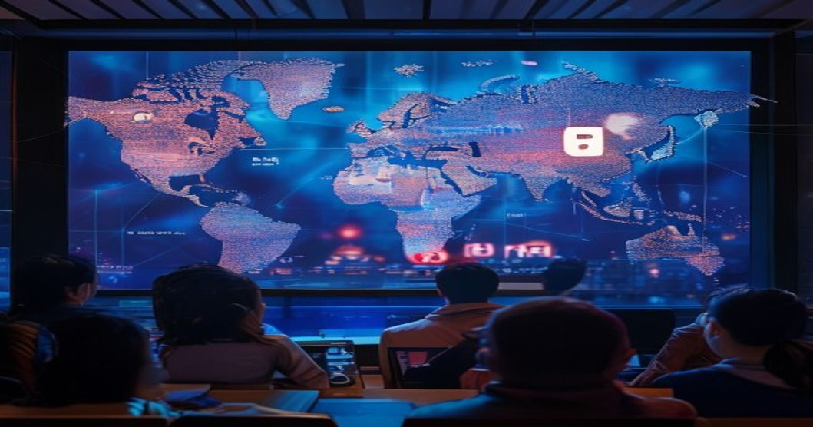
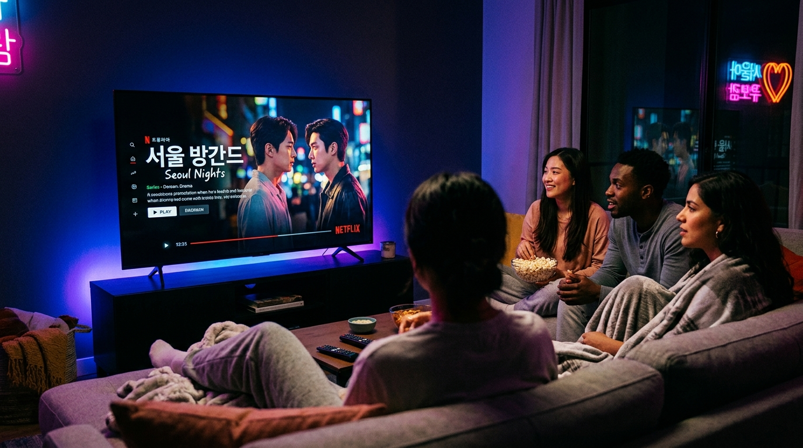

오징어 게임이 쏘아 올린 신호탄 이후, K-드라마는 단순한 한류 콘텐츠를 넘어 글로벌 OTT의 핵심 콘텐츠 전략이 됐습니다. 2026년에도 한국 드라마는 넷플릭스, 디즈니+, 애플TV+ 차트 상위권을 꾸준히 점령하고 있어요. 왜 한국 드라마가 이토록 강한지, 올해는 어떤 흐름이 이어지는지 짚어볼게요.

## K-드라마가 세계에서 통하는 구조적 이유

### 장르 혼합의 대담함 — 장벽이 없는 장르 실험

로맨스 속에 스릴러를 집어넣고, 좀비물에 조선 시대 배경을 얹습니다. 한국 드라마는 장르 문법을 가장 과감하게 뒤섞는 나라로 자리잡았어요. 이 혼종성이 전통적인 할리우드 장르물에 익숙한 시청자들에게 신선한 자극을 줍니다.

### 16부작 완결 구조의 편의성

미국 드라마처럼 시즌이 수십 개 이어지지 않습니다. 대부분 12~16부작으로 깔끔하게 마무리되는 구조 덕분에 몰아보기(binge-watching)에 최적화됐어요. 시작하면 끝을 볼 수 있다는 확신이 시청 진입 장벽을 낮춥니다.

### 정서적 과잉의 미학 — '감정 쿼터백' 전략

K-드라마의 감정선은 서구 콘텐츠보다 훨씬 과감하게 올라갑니다. 극적인 오해, 운명적 재회, 눈물 쏟는 장면들이 알고리즘 시대에 '반응하기 좋은 콘텐츠'의 특성과 정확히 맞아떨어져요. 소셜미디어에서 반응이 터지는 장면을 의도적으로 만드는 제작 방식이 정착됐습니다.

## 2026년 K-드라마의 새로운 흐름

### 웹툰 원작의 전성시대 — IP 전쟁의 심화

네이버웹툰, 카카오웹툰 IP를 두고 국내외 제작사들의 경쟁이 치열합니다. 이미 팬덤이 형성된 웹툰 원작은 초기 시청자 확보와 해외 마케팅에서 압도적으로 유리해요. 2026년에도 웹툰 원작 드라마가 OTT 흥행작의 절반 이상을 차지할 것으로 예상됩니다.

### AI 제작 보조와 후반 작업 혁신

AI 기반 VFX, 자동 더빙 품질 향상, 다국어 자막 실시간 생성이 K-드라마의 글로벌 배급 속도를 더욱 끌어올렸습니다. 방영 직후 20개 언어 자막이 동시에 나오는 것이 가능해진 덕분에 글로벌 시청자와의 시간 격차가 사라졌어요.

### 남성 향 장르물의 부상 — 로맨스 일변도에서 탈피

2026년에는 느와르, 범죄 스릴러, 무협 액션 장르 드라마가 두드러집니다. 그동안 K-드라마의 주 소비층이 여성 시청자였다면, 이제는 남성 시청자와 글로벌 남성 팬덤을 겨냥한 전략적 제작이 늘고 있어요.

## 글로벌 흥행을 만드는 제작 현장의 변화

### 해외 배우 캐스팅과 공동 제작의 확대

순수 한국 드라마에서 벗어나 할리우드 배우, 일본·중국 배우를 주연에 넣는 시도가 늘고 있습니다. 문화적 진입 장벽을 낮추는 동시에 해당 국가 마케팅 비용을 절감하는 효과가 있어요.

### OTT 오리지널 제작비의 상향 평준화

넷플릭스 오리지널 K-드라마 한 회당 제작비가 미국 프리미엄 드라마 수준에 근접했습니다. 스크린을 채우는 세트, 의상, CG 품질이 눈에 띄게 높아졌고, 이것이 '비주얼 경쟁력'으로 직결됩니다.

### 팬덤 참여형 마케팅의 진화

드라마 OST 청음 이벤트, 팬미팅 연계 배급, 글로벌 팬 투표 결과가 결말에 반영되는 실험까지 — 시청자를 콘텐츠 제작 과정에 끌어들이는 마케팅이 충성도 높은 팬덤을 만들고 있어요.

## K-드라마 산업의 앞으로 — 과제와 전망

### 넷플릭스 의존도 탈피가 관건

현재 K-드라마 글로벌 흥행의 상당 부분이 넷플릭스 알고리즘에 의존합니다. 넷플릭스의 한국 오리지널 투자가 줄거나 플랫폼 영향력이 약화될 경우를 대비해 멀티 플랫폼 전략이 필요해요.

### 창작 고갈 우려 — 웹툰 IP 소진 이후 시나리오

현재 가장 인기 있는 웹툰 IP들이 2~3년 내에 대부분 드라마화될 것으로 예상됩니다. 그 이후를 위한 오리지널 시나리오 발굴과 신인 작가 육성이 산업의 지속 가능성을 좌우할 거예요.

[2026년 AI 에이전트 기술 트렌드](/posts/latest-tech/)에서 다룬 콘텐츠 자동화 기술이 드라마 기획·마케팅에도 본격 도입되고 있어, K-드라마 산업의 변화 속도는 앞으로 더 빨라질 전망입니다.

#K드라마 #넷플릭스한국 #한류2026 #드라마추천 #연예트렌드 #OTT #웹툰원작드라마
