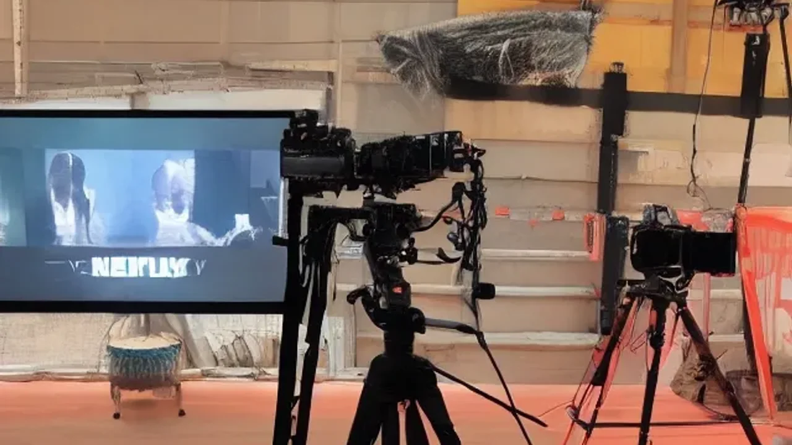

---
title: "기안84 기안장 넷플릭스 3가지 성공 요인"
date: 2026-06-05T14:38:00+09:00
slug: ki-an84-netflix-variety-2026
tags: ["기안84 기안장", "연예이슈"]
categories: ["연예이슈"]
series: ["연예이슈"]
description: "기안84 기안장의 넷플릭스 예능 성공 요인을 날카롭게 분석했습니다. 글로벌 플랫폼으로 무대를 옮긴 K-웹 예능의 흥행 공식과 독자가 얻을 트렌드 인사이트를 확인하세요."
draft: false
cover:
  image: "ki-an84-netflix-variety-2026-thumb.webp"
  alt: "기안84 기안장 넷플릭스 3가지 성공 요인 썸네일"
  relative: true
  hiddenInSingle: true
---

넷플릭스가 글로벌 자본을 투입해 제작한 예능 프로그램이 공개되자마자 전 세계 시청자들의 눈길을 사로잡고 있습니다. 예측 불가능한 매력을 지닌 기안84 기안장은 기존 민박 형태의 예능 공식에서 완전히 탈피해 날것 그대로의 재미를 선사하는 중입니다. 플랫폼의 장벽이 허물어진 현재, 대중이 왜 이 독특한 콘텐츠에 열광하는지 흥행의 본질을 날카롭게 파헤쳐 보겠습니다.

## 넷플릭스 무대로 진출한 기안84 기안장의 파격적인 실험

### 지상파 울타리를 넘어선 날것 그대로의 매력
과거 지상파 방송 환경은 엄격한 심의 규정과 대중성을 고려한 편집 룰이 존재했습니다. 출연자의 돌발 행동이나 정제되지 않은 언행은 가차 없이 편집실에서 잘려 나가기 일쑤였습니다. 하지만 이번 작품은 다릅니다. 기안84 기안장이라는 독창적인 공간 안에서 출연자는 그 어떤 제약도 받지 않는 것처럼 움직입니다. 땀을 뻘뻘 흘리며 손님을 맞이하고, 격식 없는 대화를 나누는 과정이 여과 없이 화면에 담깁니다. 시청자들은 연출된 가짜 상황이 아닌, 진짜 사람의 냄새가 나는 순간에 격한 공감을 보냅니다. 웹툰 작가 시절부터 이어져 온 작가 특유의 엉뚱한 시선이 방송용 카메라 앞에서 위축되지 않고 온전히 발현되는 배경입니다.

### 글로벌 OTT 자본과 K-웹 예능 감성의 기묘한 결합
거대 자본의 유입은 단순히 화려한 세트장을 짓는 데 그치지 않았습니다. 촬영 장비의 스케일이 커졌고 편집의 호흡은 한층 세련되어졌습니다. 유튜브에서 흔히 보던 거친 자막과 속도감 있는 컷 편집이 초고화질 카메라마저 만나면서 묘한 시너지를 발생시킵니다. 제작진은 출연자의 개성을 억누르지 않으면서도, 글로벌 시청자가 이해하기 쉽도록 보편적인 감정선을 정교하게 엮어냈습니다. 자본은 풍부하지만 감성은 철저히 로컬의 마이너한 감수성을 유지하는 밸런스가 매력적입니다.

## 대환장 기안장이 기존 리얼리티 예능과 차별화되는 지점

### 효리네 민박의 힐링 감성을 정면으로 거부하는 가식 없는 소통
그동안 안방극장을 채웠던 숙박 예능들은 대부분 그림 같은 풍경 속에서 차를 마시며 위로를 건네는 방식이었습니다. 잘 정돈된 이불과 정갈한 조식은 보기엔 좋지만, 현실의 삶과는 다소 동떨어진 판타지에 가까웠습니다. 반면 이번 기안84 기안장 예능은 웰컴 드링크 대신 얼음물을 대충 건네고, 손님과 주인이 서슴없이 바닥에 누워 이야기를 나눕니다. 완벽하게 준비된 서비스 대신, 조금은 허술하지만 진심 어린 환대가 존재합니다. 세련된 힐링에 피로감을 느끼던 현대인들에게 이러한 투박함은 오히려 신선한 자극으로 다가옵니다.

### 각본 없는 돌발 상황이 주는 고도의 몰입감과 리얼리티
대본의 존재 여부를 의심케 하는 에피소드들이 매회 터져 나옵니다. 숙박객이 도착했는데 주인이 낮잠을 자고 있거나, 요리 도중 예상치 못한 실수를 연발하는 장면들이 대표적입니다. 

> "기존 예능이 잘 짜인 한 편의 시트콤이라면, 이 프로그램은 언제 터질지 모르는 시한폭탄을 보는 것 같다"

커뮤니티의 한 시청자가 남긴 평처럼, 각본이 개입할 틈이 없는 돌발 상황들이 연속됩니다. 예측이 불가능하다는 점은 몰입감을 최고조로 끌어올리는 일등 공신입니다. 

[관련 글 보기](/posts/entertainment/)

## 웹 예능의 메인스트림 장악이 가져온 빛과 그림자

### 연예계 창작자들에게 열린 무한한 표현의 자유
과거에는 몇몇 스타 PD들이 방송사의 권력을 쥐고 콘텐츠 트렌드를 좌지우지했습니다. 이제는 참신한 아이디어와 확고한 캐릭터만 있다면 누구나 글로벌 무대의 주인공이 될 수 있는 길이 열렸습니다. 형식과 분량의 제한이 사라지면서 크리에이터들은 자신만의 색깔을 온전히 드러내는 실험적인 시도를 멈추지 않습니다. 방송 판도가 기성 미디어에서 뉴미디어 플랫폼으로 완전히 이동했음을 증명하는 현상입니다.

### 자극적인 편집과 시청 층 양극화라는 새로운 과제
자유도가 높아진 만큼 그에 따르는 부작용도 존재합니다. 조회수와 화제성을 잡기 위해 간혹 편집이 자극적인 방향으로 흐르거나, 특정 출연자의 행동을 과장되게 부각하는 경향이 나타납니다. 전통적인 미디어의 정제된 방송에 익숙한 중장년층 독자들에게는 다소 산만하거나 불편하게 다가올 여지가 있습니다. 플랫폼의 확장 속도에 발맞추어 콘텐츠의 질적 수준을 유지하기 위한 창작자들의 자정 노력이 요구되는 지점입니다.

## 플랫폼 대격변 시대를 살아가는 시청자를 위한 감상 가이드

### 기안84 기안장 서사에 숨겨진 현대인의 결핍 읽어내기
대중이 이 프로그램에 열광하는 심리적 기저에는 완벽함을 강요하는 사회에 대한 피로감이 깔려 있습니다. SNS 속 가짜 행복과 과시용 일상에 지친 이들이, 방송에서 보여주는 날것의 틈새와 허점을 보며 묘한 해방감을 맛보는 셈입니다. 단순한 킬링타임용 오락물로 소비하기보다, 인물들이 빚어내는 관계의 가공 없는 순간들을 관찰하면 콘텐츠가 가진 진짜 매력을 발견하게 됩니다.

### 유튜브와 OTT를 넘나드는 크로스오버 콘텐츠 소비 팁
단순히 본편만 시청하는 시대는 지나갔습니다. 출연진들의 개인 유튜브 채널에 올라오는 비하인드 스토리나, 촬영 종료 후의 후기 영상을 함께 교차해서 관람할 때 재미는 배가됩니다. 메인 스트리밍 플랫폼의 거대한 서사와 스낵 컬처 특유의 가벼운 소통 방식을 넘나들며 소비하는 유연한 태도가 트렌디한 시청 경험을 완성해 줍니다. 화면 속 세계와 현실의 경계가 무너진 지금, 기안84 기안장은 우리가 콘텐츠를 소비하는 방식 자체를 새롭게 정의하고 있습니다.

#기안84기안장 #넷플릭스예능 #웹예능트렌드 #K콘텐츠 #리얼리티예능 #기안84 #대환장기안장 #OTT트렌드 #엔터테인먼트분석