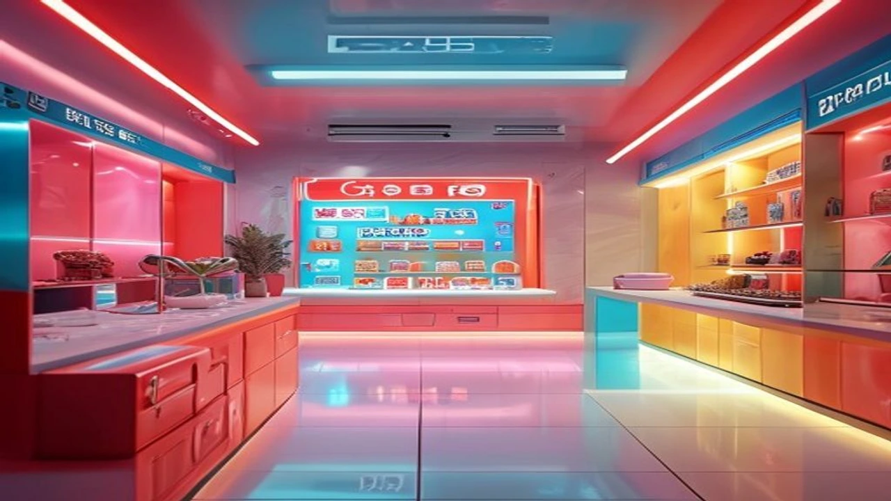
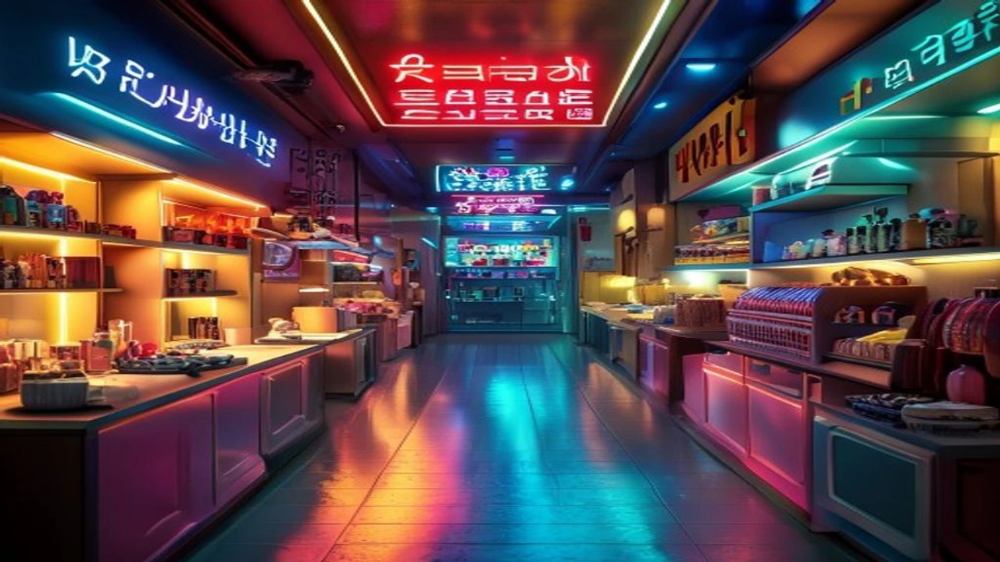

디즈니+의 메가 히트작이 지상파 안방극장에 전격 상륙하면서 시청자들의 발걸음을 브라운관 앞으로 불러 모으고 있습니다. OTT 플랫폼의 장벽에 가려 이 명작을 놓쳤던 이들에게 이번 **킬러들의 쇼핑몰 MBC** 여름 특선 편성은 가뭄의 단비 같은 기회입니다. 파격적인 편성 배경부터 원작과의 차이점까지 핵심적인 관전 포인트를 명확하게 짚어봅니다.

## 킬러들의 쇼핑몰 MBC 파격 편성 배경과 방송 정보

### 디즈니+ 독점작이 MBC 금토드라마로 온 진짜 이유
글로벌 OTT 플랫폼의 독점 오리지널 콘텐츠가 지상파 프라임 타임에 정규 편성된 것은 이례적인 사건입니다. MBC는 매년 여름 시즌마다 시청률 침체기를 극복하기 위해 강력한 한 방을 가진 콘텐츠를 물색해 왔으며, 검증된 화제성을 가진 디즈니+의 명작을 전면에 내세웠습니다. 디즈니+ 역시 가입자 정체기를 돌파하기 위해 대중적 인지도가 높은 지상파 플랫폼을 홍보의 장으로 활용하는 윈윈(Win-Win) 전략을 취했습니다. 백상예술대상 등 주요 시상식을 휩쓸며 작품성을 인정받은 만큼, 지상파 시청자층까지 든든한 아군으로 흡수하겠다는 계산이 깔려 있습니다.

### 킬러들의 쇼핑몰 MBC 방송 시간 및 몇부작 편성 정보
이번 여름 특선 드라마는 기존 금토드라마 스케줄을 그대로 이어받아 매주 금요일과 토요일 밤 9시 50분에 안방극장을 찾아갑니다. 원작 오리지널 시리즈가 총 8부작으로 제작되었기 때문에, MBC에서도 압축적이면서도 빠른 전개를 위해 4주간 총 8부작으로 특별 편성했습니다. 주말 예능 직후 이어지는 프라임 타임 배치인 만큼, 직장인들과 주말 시청자들의 본방 사수 욕구를 강하게 자극하는 시간대입니다.

### 본방 사수 전 꼭 알아야 할 시청 등급과 편집 차이점
가장 주목할 부분은 잔혹한 액션 시퀀스의 편집 수위입니다. 디즈니+에서는 청소년 관람불가 등급으로 고어하고 강렬한 칼부림과 총격전이 여과 없이 노출되었지만, 지상파 MBC에서는 15세 이상 관람가 등급에 맞춰 재편집되었습니다. 지나치게 가학적이거나 피가 낭자한 장면은 블러 처리되거나 앵글을 다르게 잡은 심의 준수 버전으로 방영됩니다. 다만 제작진은 드라마 특유의 속도감과 액션의 타격감을 해치지 않는 선에서 정교한 편집을 거쳤다고 밝혀 기존 팬들도 색다른 재미를 느낄 수 있습니다.

[관련 글 보기](/posts/entertainment/)

## 한눈에 보는 킬러들의 쇼핑몰 인물관계도 및 핵심 등장인물

### 정진만(이동욱)과 정지안(김혜준) 중심의 미스터리 관계도
이야기의 거대한 축은 의문의 자살을 선택한 삼촌 정진만과 그가 남긴 유산을 얼떨결에 떠안은 조카 정지안의 서사로 흘러갑니다. 겉으로는 평범한 농업용 창고를 운영하는 줄 알았던 삼촌이 사실은 거대한 무기 밀매 사이트의 운영자였다는 사실이 밝혀지며 극이 시작됩니다. 조카 지안은 삼촌이 죽자마자 사방에서 몰려드는 전문 킬러들의 표적이 되며, 삼촌이 과거에 자신에게 가르쳤던 생존 기술들을 하나씩 각성해 나갑니다. 과거 회상 속 진만의 냉철한 훈련 방식과 현재 지안의 생존 투쟁이 교차 편집되는 구조가 극의 몰입도를 극대화합니다.

### 역대급 빌런 이성조(서현우)와 베일에 싸인 인물들 소생 정리
이 드라마의 서스펜스를 책임지는 핵심 인물은 냉혈한 스나이퍼 이성조입니다. 서현우 배우가 열연한 이성조는 사투리를 쓰며 능청스럽게 행동하지만, 목표물을 겨눌 때는 일말의 자비도 없는 잔인함을 보여주는 입체적인 악역입니다. 여기에 지안의 무에타이 스승이자 진만의 든든한 조력자인 파신(김민), 그리고 쇼핑몰의 해커이자 의뭉스러운 태도를 취하는 배정민(박지빈) 등 각기 다른 목적을 가진 인물들이 얽히고설키며 매회 반전을 거듭합니다. 누구도 쉽게 믿을 수 없는 고도의 심리전이 관전 포인트입니다.

### 무기 쇼핑몰 '머더헬프' 등급별 코드로 이해하는 킬러들의 규칙
작품을 완벽하게 이해하기 위해서는 진만이 구축한 무기 판매 사이트 '머더헬프'의 회원 등급 코드를 알아야 합니다. 이 규칙은 킬러들의 세계를 지배하는 절대적인 법과 같습니다.
- **코드 레드 (Code Red):** 살인청부업자, 스나이퍼 등 공격형 킬러들에게 부여되는 등급
- **코드 브론즈 (Code Bronze):** 스파이, 정보원 등 브로커나 정보 수집 전문가들의 등급
- **코드 실버 (Code Silver):** 무기 유통, 시체 처리, 의료 지원 등 후방 보급을 담당하는 크루
- **코드 골드 (Code Gold):** 쇼핑몰의 운영자와 그 가족에게 부여되는 절대 보호 등급

> "지안아, 잘 들어. 모든 선택에는 대가가 따르고, 머더헬프의 규칙은 목숨을 걸고 지켜야 하는 거야." - 극 중 정진만의 대사

## 웹툰 원작 '살인자의 쇼핑몰'과의 차이점 및 결말 비교

### 원작 설정 vs 드라마 각색의 신의 한 수 3가지
강지영 작가의 인기 소설 '살인자의 쇼핑몰'을 바탕으로 한 이 작품은 웹툰을 거쳐 영상화되면서 대대적인 설정 변화를 겪었습니다. 첫째로 삼촌 정진만의 비주얼과 전사가 대폭 업그레이드되었습니다. 원작의 뚱뚱하고 대머리인 동네 아저씨 설정에서, 이동욱 배우가 연기하는 전직 용병 출신의 완벽한 옴므파탈 캐릭터로 탈바꿈했습니다. 둘째로 액션의 스케일이 소형 무기 중심에서 밀리터리급 대규모 화력전으로 확장되었습니다. 셋째로 원작보다 조연 캐릭터들의 서사를 촘촘하게 메워 드라마 특유의 긴장감 넘치는 앙상블을 완성해 냈습니다.

### 원작 결말을 통해 예측해보는 시즌1 최종화의 반전
소설과 웹툰을 접한 원작 팬들이 가장 궁금해하는 대목은 역시 결말의 일치 여부입니다. 원작에서는 지안이 킬러들의 무차별적인 공격을 모두 막아내고 당당한 쇼핑몰의 2대 주인으로 거듭나는 과정을 그립니다. 특히 모두가 죽었다고 믿었던 삼촌 정진만이 결정적인 순간에 살아 돌아오는 거대한 반전이 존재합니다. 드라마 버전 역시 이러한 원작의 핵심 줄기를 충실히 따라가면서도, 영상 매체만의 극적인 장치를 더해 시청자들에게 짜릿한 카타르시스를 선사하도록 설계되었습니다.

### 원작 팬들이 열광하는 드라마만의 숨은 디테일
드라마는 텍스트로만 존재하던 무기들의 시각적 구현에 엄청난 공을 들였습니다. 벽면이 통째로 열리며 드러나는 지하 거대 창고의 비주얼은 물론이고, 자율주행 드론 무기나 특수 방탄 실드 같은 첨단 장비들이 대거 등장합니다. 원작 속 짧게 언급 지나갔던 진만의 용병 시절 과거 이야기를 별도의 에피소드로 길게 할애하여 서사의 개연성을 확보한 점도 원작 마니아층이 입을 모아 극찬하는 요소입니다.

## 킬러들의 쇼핑몰 MBC 첫 방송 직접 본 실시간 관전 후기

### 영화 같은 연출과 지상파 화면으로 본 액션 스케일 체감
큰 텔레비전 화면으로 마주한 첫 방송의 몰입감은 기대 이상이었습니다. OTT 특유의 시네마틱한 색감과 고품질 사운드가 지상파 HD 방송망을 통해서도 뭉개짐 없이 선명하게 구현되었습니다. 특히 1화 초반부, 지안의 집을 향해 날아드는 스나이퍼의 총탄과 이를 피하기 위해 냉장고 뒤로 숨는 액션 시퀀스의 사운드 디자인은 안방을 순식간에 영화관으로 만들 정도로 압도적인 타격감을 선사했습니다.

### 첫 방송 직후 폭발한 네티즌 및 커뮤니티 실시간 반응
방송이 끝나자마자 주요 연예 커뮤니티와 SNS는 관련 글로 도배되었습니다. 디즈니+ 결제를 망설이다가 이제야 작품을 접한 시청자들은 "왜 이제야 지상파에 틀어줬냐", "이동욱 액션 미쳤다"라며 뜨거운 호평을 쏟아내고 있습니다.
- " 주말 밤에 볼 만한 제대로 된 장르물이 나왔다"
- " 15세 등급인데도 액션의 쫄깃함이 그대로 살아있어서 몰입 시청했다"
- " 다음 주까지 어떻게 기다리나, 당장 디즈니+ 결제하러 간다"

### 정주행을 고민하는 분들을 위한 솔직한 장단점 요약
정통 액션 스릴러를 선호하는 시청자에게는 최고의 선택지가 될 것입니다. 쾌감을 주는 밀리터리 액션과 삼촌의 죽음을 둘러싼 추리 요소가 톱니바퀴처럼 맞물려 지루할 틈을 주지 않습니다. 다만 과거와 현재를 수시로 오가는 비선형적 교차 편집 구조를 취하고 있어, 중간부터 시청하거나 집중하지 않으면 타임라인을 놓치기 쉽다는 아쉬움도 존재합니다. 그럼에도 불구하고 잘 짜인 웰메이드 한국형 장르물의 진수를 맛보고 싶다면 이번 MBC 특선 방영은 무조건 본방 사수해야 할 가치가 있습니다.

**함께 읽으면 좋은 글**
- [뉴진스 다니엘 4인 복귀, 330억 소송 진짜 전말](/posts/entertainment/newjeans-4-member-return-danielle-lawsuit-2026/)
- [빅뱅 20주년 신곡 BiiiG 컴백 3가지 포인트](/posts/entertainment/bigbang-20th-anniversary-biiig-comeback-2026/)

#킬러들의쇼핑몰MBC #킬러들의쇼핑몰인물관계도 #킬러들의쇼핑몰몇부작 #이동욱드라마 #김혜준 #살인자의쇼핑몰 #MBC금토드라마 #디즈니플러스추천