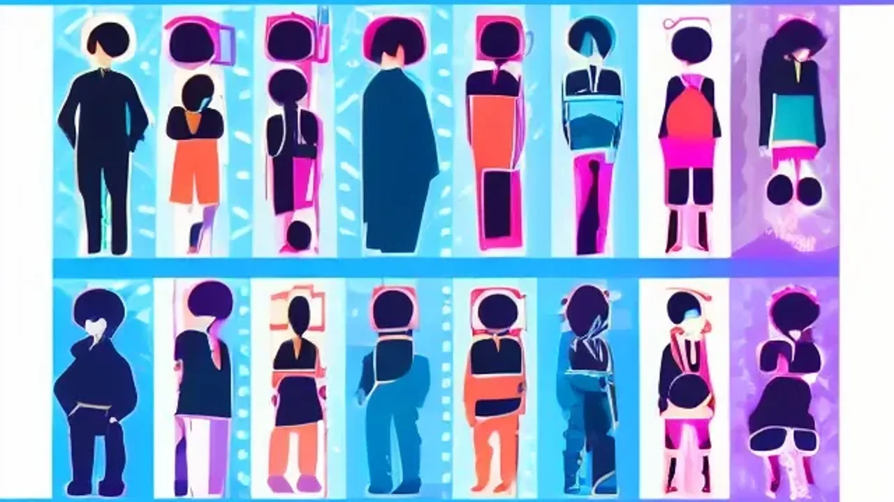

최근 방송에서 공개된 **김신영 다이어트**와 갑작스러운 요요 고백이 수많은 다이어터들 사이에서 뜨거운 감자로 떠올랐습니다. 13년 동안이나 44kg이라는 경이로운 몸무게를 사수한 자기관리 이면에는 우리가 미처 보지 못했던 숨은 고충과 호르몬의 배신이 숨어 있었습니다. 감량 성공 신화의 아이콘이 전하는 생생한 고백을 통해, 요요라는 덫을 피하고 평생 써먹을 수 있는 현실적인 체중 관리 설계도를 공개합니다.

## 김신영 다이어트 44kg 감량 성공 비결과 13년 유지 장단점

### 88kg에서 44kg으로 체중 감량에 성공한 핵심 식단과 운동법
실제 그녀가 방송에서 밝힌 루틴을 보면 눈물이 날 정도로 지독합니다. 매일 아침 공복 상태에서 실내 자전거 페달을 1시간씩 밟았고, 하루 세 끼를 오직 닭가슴살, 현미밥, 두부, 달걀로만 채우며 염분을 극도로 제한했습니다. 엘리베이터 대신 무조건 계단을 오르는 생활 밀착형 강박이 체지방을 빠르게 걷어내는 기폭제 역할을 했습니다. 확실히 단기간에 체형을 완전히 뜯어고치는 데에는 이만한 정공법이 없습니다.

### 13년 장기 유지 과정에서 나타난 신체적 장점과 심리적 한계
체중을 무려 13년간 묶어두면서 고혈압 위험 수치가 정상으로 돌아왔고, 만성 피로와 관절 통증이 씻은 듯이 사라진 것은 명확한 수확입니다. 반면 정신적 대가는 혹독했습니다. 십수 년 동안 "단 1kg이라도 찌면 대중에게 외면받을지 모른다"라는 강박증에 시달렸으며, 지인들과의 식사 자리가 즐거움이 아닌 공포로 다가오는 정서적 고립을 자초해야 했습니다.

### 일반인 다이어트와 연예인 유지 방식의 현실적인 차이점 분석
연예인의 몸은 곧 직업적 생명줄이기에 일반인의 동기부여와 체급 자체가 다릅니다. 고가의 맞춤형 식단 큐레이션이나 스케줄을 조율해 주는 매니지먼트의 지원을 받는 환경과, 당장 내일 야근과 회식이 잡히는 직장인의 삶은 출발선부터 다를 수밖에 없습니다. 무작정 연예인 식단을 복사해서 내 삶에 붙여넣기 하면 뼈가 녹아내리는 부작용을 먼저 마주하게 됩니다.

## 갑작스러운 6주 요요 현상의 진짜 원인과 경험담

### 철저했던 그녀가 단 6주 만에 요요를 겪게 된 결정적 계기
그토록 견고해 보였던 44kg의 성벽이 무너진 것은 최근 몰아친 과로와 면역력 붕괴 때문이었습니다. 뇌가 극심한 스트레스를 감지하자 몸을 보호하기 위해 코르티솔 호르몬을 뿜어냈고, 이는 곧 고열량 음식을 미친 듯이 갈구하는 보상 심리로 이어졌습니다. 13년간 억눌려 있던 식욕 억제 기전이 단 6주 만에 빗장이 풀리며 체중이 수직 상승하는 요요의 쓴맛을 보게 되었습니다.

### 몸의 경고 신호와 요요가 찾아왔을 때의 멘탈 무너짐 극복 과정
체중계 바늘이 통제 불능으로 치솟을 때 밀려오는 자괴감은 겪어본 사람만 압니다. 그녀 역시 공든 탑이 무너졌다는 공포에 휩싸였지만, 이번에는 굶어서 빼는 악순환을 거부했습니다. "지금 내 몸이 살려고 비명을 지르는구나"라며 상황을 덤덤히 받아들였고, 숫자가 아닌 망가진 생체 리듬을 복구하는 데 집중하며 멘탈을 사수했습니다.

> "체중계 위 숫자는 내 삶의 성적표가 아니다. 일시적인 반등에 죄책감을 느끼기보다 내 몸이 보내는 SOS 신호에 귀를 기울여야 한다."

### 방송에서 솔직하게 고백한 "살찌고 호감이다"라는 대중 반응의 의미
과거라면 "자기관리 실패"라는 비난이 쏟아졌겠지만, 이번에는 시청자들의 반응이 반전이었습니다. 앙상하게 마른 모습보다 약간 살이 붙어 찌질함 없이 생기 도는 지금이 훨씬 건강해 보인다는 응원이 지배적입니다. 이는 뼈마름만을 정답으로 여기던 미적 기준이 건강함(Wellness)으로 이동하고 있음을 보여주는 신호탄입니다.

[관련 글 보기](/posts/entertainment/)

## 요요를 극복하는 건강한 체중 관리 튜토리얼

### 급격한 체중 변화를 막는 무탄수화물 식단 탈출 3단계
요요의 늪에서 탈출하려면 몸이 "나 지금 굶고 있어"라고 착각하게 만드는 초저칼로리 극단주의 식단부터 당장 쓰레기통에 버려야 합니다. 

- **1단계 (당류 차단):** 액상과당과 정제 밀가루를 끊어내되, 현미밥이나 고구마 같은 복합 탄수화물을 매끼 주먹 크기만큼 반드시 넣어주어 대사를 깨웁니다.
- **2단계 (단백질 밸런스):** 자기 체중 1kg당 1.2g 수준의 닭가슴살이나 생선을 챙기며, 식이섬유가 풍부한 쌈 채소를 평소의 두 배로 늘려 포만감 신호를 뇌에 보냅니다.
- **3단계 (일반식 연착륙):** 자극적인 배달 음식을 피하고, 일반 가정식을 평소 먹던 양의 70% 수준으로 조절해 먹는 즐거움과 체중 유지의 균형을 맞춥니다.

### 기초대사량을 무너뜨리지 않는 현실적인 치팅데이 설정법
무작정 굶으면 몸은 에너지를 쓰지 않는 '절전 모드'로 들어가, 결국 조금만 먹어도 살이 찌는 똥망 체질로 변합니다. 이를 막기 위한 치팅데이는 고삐 풀린 폭식의 날이 아닙니다. 일주일에 단 하루, 평소 섭취량보다 딱 20%만 더 먹되 떡볶이나 치킨 대신 싱싱한 연어 사시미나 아보카도 같은 양질의 지방을 넣어주어 멈춰버린 대사 엔진을 돌려야 합니다.

### 스트레스성 폭식을 예방하는 일상 속 멘탈 케어 루틴
가짜 허기가 밀려와 배달 앱을 켜고 싶을 때는 즉각적으로 몸의 궤도를 틀어야 합니다. 단 15분만 밖으로 나가 빠른 걸음으로 산책을 하거나 미지근한 물 한 잔을 마시면, 뇌의 가짜 배고픔 신호가 마법처럼 가라앉습니다. 뇌를 속이는 이 사소한 습관이 호르몬성 폭식 메커니즘을 끊어내는 가장 강력한 무기입니다.

## 지속 가능한 다이어트를 위한 전문가 제안 및 핵심 요약

### 극단적 감량 vs 지속 가능한 유지 중 무엇이 더 중요한가
체중 감량의 최종 승자는 얼마나 빨리 뺐느냐가 아니라, 그 몸을 몇 년 동안 부작용 없이 내 것으로 만들었냐로 갈립니다. 단기간에 뼈를 깎아 만든 몸매는 작은 스트레스에도 모래성처럼 주저앉습니다. 비만 전문의들이 입을 모아 "평생 할 수 없는 식단과 운동은 시작도 하지 말라"고 경고하는 이유가 여기에 있습니다. 속도가 느리더라도 일상을 해치지 않는 선이 정답입니다.

### 김신영 사례로 본 요요 없이 평생 가는 건강 관리 핵심 요약
인간의 몸은 숫자가 찍히는 기계가 아닙니다. 컨디션과 나이에 따라 체중은 언제든 출렁일 수 있으며, 요요는 게을러서가 아니라 몸이 살아남으려 발버둥 치는 지극히 자연스러운 생리 현상입니다. 실패했다는 낙인에 갇혀 다이어트를 통째로 포기하지만 않는다면, 일시적인 체중 증가는 언제든 다시 제자리로 돌려놓을 수 있는 일기예보일 뿐입니다.

#김신영다이어트 #연예인다이어트 #요요현상 #체중유지 #다이어트식단 #멘탈관리 #체중감량 #건강관리 #지속가능한다이어트