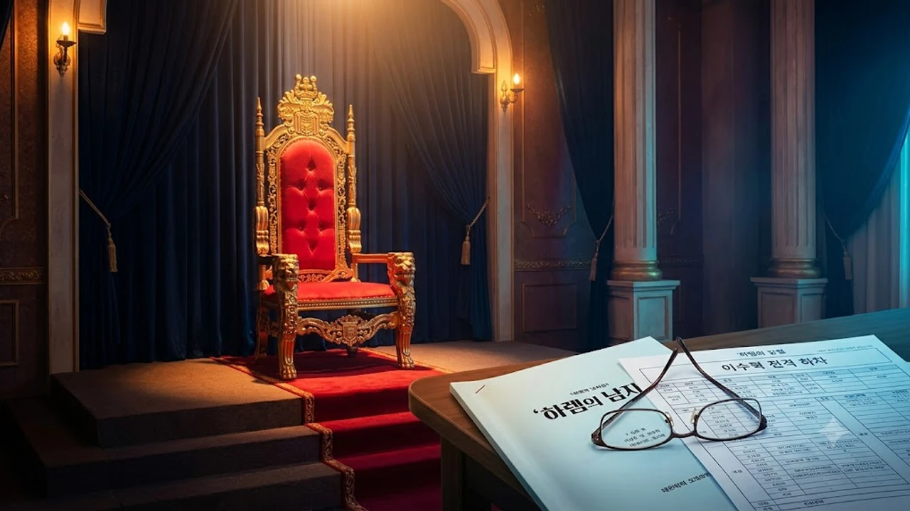

기다리던 조합이 이렇게 엎어질 줄 누가 알았을까. 배우 수지와 이수혁의 만남으로 제작 초기부터 폭발적인 화제를 모았던 로맨스 판타지 대작에서 **이수혁 하차** 소식이 전격 전해지며 드라마 판이 발칵 뒤집혔어. 수지의 첫 황제 연기 도전작이자 역대급 남주 라인업으로 기대를 모았던 '하렘의 남자들' 캐스팅 판도에 제대로 비상이 걸린 셈이지.

## 이수혁 '하렘의 남자들' 하차 발표와 실시간 반응

### 2026년 8월 19일 공식 발표 내용 요약
소속사 측은 차기작 일정 조율 과정에서 불가피하게 하차를 결정했다고 밝혔어. 이미 올해 상반기부터 굵직한 프로젝트 촬영을 연달아 끝마친 상태에서, 하반기 추가 편성 및 해외 프로모션 일정과 '하렘의 남자들'의 대규모 사전제작 일정이 끝내 겹쳐버린 거지. 

> "제작진과 오랜 시간 심도 있게 일정을 논의했으나, 최종적으로 함께하지 못하게 됐다."

공식 입장은 정중하고 깔끔했지만, 캐스팅 확정 직전까지 갔던 팬들의 아쉬움은 쉽게 가라앉지 않고 있어.

### 수지·신승호·덱스 라인업과의 호흡 불발 배경
이번 작품은 라인업 구성 단계부터 SNS에서 뜨거운 반응을 이끌어냈어. 타리움 제국의 여황제 라트릴 역의 **수지**를 필두로, 묵직한 카리스마의 **신승호**, 그리고 대세 행보를 이어가는 **덱스**까지 합류한다는 소식이 돌며 비주얼 끝판왕 드라마로 꼽혔거든. 

여기에 퇴폐미와 냉철한 귀족미를 맡아줄 핵심 축이 바로 이수혁이었는데, 그 연결고리가 끊어지면서 전체적인 앙상블 조합도 전면 수정이 불가피해졌어.

### 캐스팅 무산 소식에 쏟아진 글로벌 팬덤의 반응
소식이 전해지자마자 X(옛 트위터)와 국내 주요 커뮤니티는 그야말로 난리가 났어. "이 캐스팅 보려고 1년을 기다렸는데 이게 말이 됨?", "수지랑 이수혁 냉미남·냉미녀 텐션 보고 싶었는데 눈물 난다" 같은 반응이 줄을 이었지. 

국내외 OTT 팬덤 사이에서도 황제 수지와 후궁 이수혁의 스틸컷 가상 합성을 공유하던 반응이 일제히 탄식으로 바뀌었어. 더 많은 연예계 속보와 비하인드가 궁금하다면 [연예이슈 전체 글 보기](/posts/entertainment/)에서 최신 흐름을 확인할 수 있어.

## 공식 입장 '스케줄 이슈'의 진짜 배경 분석

### 넷플릭스 '그랜드 갤럭시 호텔'·'딜러' 촬영 완료 및 공개 일정
스케줄 문제가 단순한 핑계가 아닌 물리적 한계였던 이유는 이수혁의 쉼 없는 열일 행보에 있어. 이미 올해 넷플릭스 오리지널 시리즈 **'그랜드 갤럭시 호텔'**과 범죄 액션물 **'딜러'**의 촬영을 꽉 채워 마친 상태거든. 

문제는 이 작품들의 후반 작업과 하반기 글로벌 릴리즈 홍보 프로모션이 줄줄이 잡혀 있다는 점이야. 해외 팬미팅과 제작발표회 참석만으로도 캘린더가 꽉 차 있는 상황이었지.

### 2026년 하반기 겹치기 일정 및 차기작 조율 문제
게다가 드라마 제작 현장은 늘 변수가 넘쳐나. 다른 주연 배우들과의 스케줄 조율, 로케이션 촬영 일정, 특수 세트장 대관 등이 맞물리면서 '하렘의 남자들'의 크랭크인 시점이 뒤로 밀렸어. 

이러다 보니 이수혁이 기존에 먼저 확정해 둔 글로벌 패션위크 앰버서더 활동 및 연말 OTT 차기작 사전 리딩 일정과 정면으로 충돌해 버린 거야. 결국 어느 한쪽에 피해를 주지 않으려면 조기 결단을 내릴 수밖에 없었던 셈이지.

### 사전제작 로맨스 판타지 드라마의 촬영 강도와 조율 한계
로판(로맨스 판타지) 장르는 특수 의상 피팅, CG 블루스크린 촬영, 고난도 액션 및 승마 연습 등 일반 현대극보다 사전 준비 기간이 훨씬 길어져. 

- **정교한 가발 및 시대극 복식 분장**: 하루 촬영 준비만 3시간 이상 소요
- **CG 특수효과 연출**: 배우 간 동선 조율을 위한 리허설 시간 대폭 증가
- **해외 로케이션 분량**: 빡빡한 일정 속 단독 출국 및 복귀 불가

이런 빡빡한 제작 환경에서 타이트한 이중 스케줄을 소화하는 건 배우 본인에게도, 현장 스태프에게도 무리수였다는 분석이 지배적이야.

## 원작 싱크로율 1순위였던 이수혁의 빈자리 비교

### 웹소설 원작 속 '후궁' 캐릭터 특성과 이수혁의 이미지 매칭
네이버 인기 웹소설 원작 '하렘의 남자들'에서 이수혁이 물망에 올랐던 배역은 차갑고 냉철하지만 속내를 알 수 없는 귀족 출신의 핵심 후궁 역할이었어. 날카로운 턱선, 독보적인 중저음 보이스, 뱀파이어를 연상시키는 창백한 비주얼까지 캐릭터 그 자체였지. 원작 팬들이 가상 캐스팅 1위로 꼽았던 이유가 명확했던 배역이야.

### 네이버 웹소설 가상 캐스팅 1위가 남긴 아쉬움
네이버 시리즈 광고 영상 시절부터 이수혁은 로판 남주의 인간화라는 찬사를 받아왔잖아? 그때의 짧은 영상 클립 하나로 수천만 뷰를 찍었던 전력이 있기에 이번 정식 시리즈 하차는 뼈아플 수밖에 없어. 

원작 팬들이 텍스트로 상상하던 귀족적 퇴폐미를 온전히 실사화할 수 있는 몇 안 되는 독보적 마스크였기 때문에 대체자를 찾기가 더 까다로워졌지.

### 드라마 '하렘의 남자들' 제작 일정 및 방영 계획
제작진은 캐스팅 공백에도 불구하고 2026년 가을 크랭크인을 목표로 속도를 내고 있어. 내년 글로벌 OTT 동시 편성을 목표로 두고 있기 때문에 편성이 밀리면 전체 판권 계약과 투자 일정에 차질이 생기거든. 

결국 제작사는 아쉬움을 뒤로하고 남은 배역들의 재정비와 메인 후궁 캐스팅을 원점에서 빠르게 재가동하기 시작했어.

## 공석이 된 주연 후궁 자리, 대체 캐스팅 전망

### 제작진이 고려 중인 대체 남배우 후보군 유형
업계에 따르면 제작진은 이수혁 특유의 묵직한 카리스마를 대체할 30대 초중반 장신 남배우들을 물색 중이야. 

- **서늘한 흑발 냉미남상**: 넷플릭스나 디즈니+ 등 OTT 시리즈 경험이 풍부한 연기파 배우
- **원작과의 비주얼 매치**: 185cm 이상의 피지컬과 사극·시대극 발성이 검증된 인물
- **수지와의 그림체 조화**: 과하게 튀지 않으면서 황제-후궁 간의 텐션을 살릴 수 있는 마스크

이런 엄격한 조건 속에서 현재 복수의 라이징 스타 및 한류 인지도를 갖춘 배우들의 소속사와 긴급 미팅이 오가고 있어.

### 수지 원톱 체제와 남은 캐스팅 라인업의 케미 변화
이번 하차로 인해 드라마의 중심축은 더욱 단단하게 **수지 원톱 체제**로 굳어질 전망이야. 수지가 이끄는 라트릴 황제의 정치적 성장과 군림이 더 큰 비중을 차지하게 될 테고, 이미 합류가 유력한 신승호와 덱스가 각기 다른 매력의 호위무사·상단 거두 캐릭터로서 극의 밸런스를 든든하게 받쳐줄 것으로 보여.

### 2027년 공개를 앞둔 '하렘의 남자들' 향후 제작 관전 포인트
비록 황금 조합으로 불리던 이수혁의 합류는 무산됐지만, 여전히 '하렘의 남자들'은 2027년을 뒤흔들 초대형 텐트폴 기대작이야. 과연 이수혁의 빈자리를 꿰차고 수지와 숨 막히는 로판 텐션을 완성할 새로운 주인공은 누가 될까? 

제작진의 신속한 대체 캐스팅 발표가 드라마의 흥행 성패를 가를 첫 번째 시험대가 될 거야.

#이수혁 #이수혁하차 #하렘의남자들 #수지 #하렘의남자들캐스팅 #덱스 #신승호 #웹소설원작드라마 #로판드라마