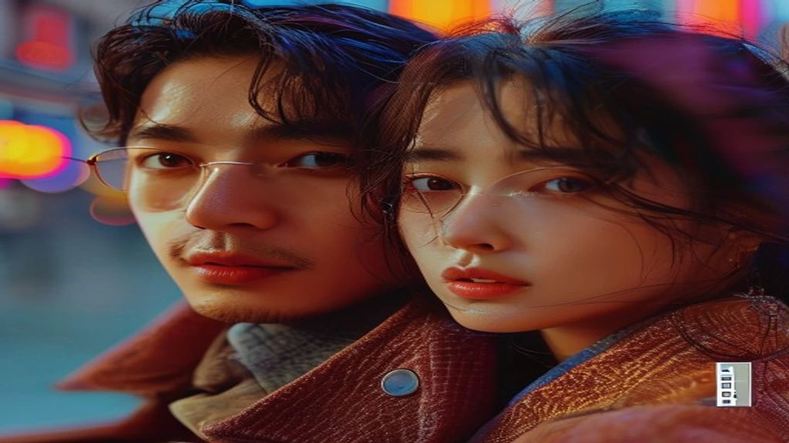
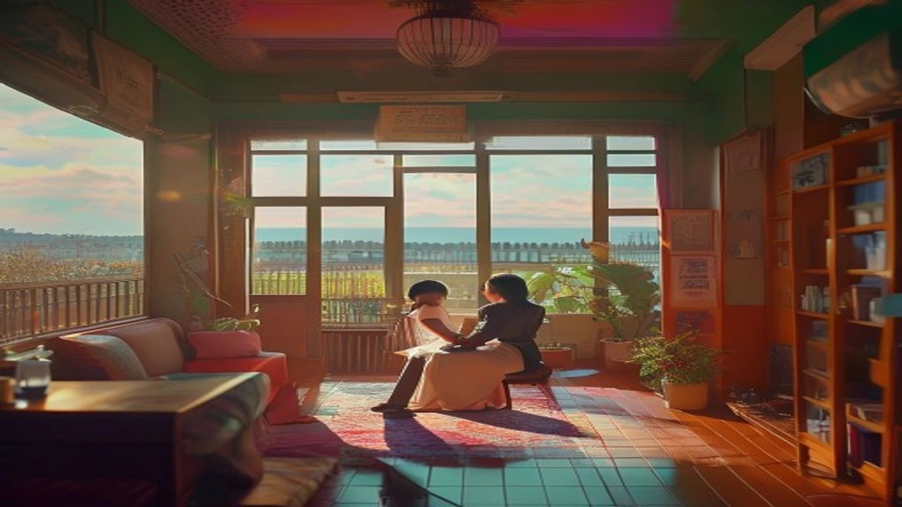

어제 예능 보다가 진짜 소름 돋아서 소리 지를 뻔했잖아. 주말 안방극장을 뒤흔든 **미우새 김정은**의 등장은 그야말로 추억 돋는 역대급 명장면의 연속이었어. 최고 시청률 50%를 넘겼던 국민 드라마의 주역이 나와서 비하인드를 털어놓는데, 솔직히 말해줄게 이거 안 본 사람은 있어도 한 번만 본 사람은 없을걸?

## 22년 만에 소환된 '파리의 연인' 역대급 결말 논란

### 시청률 57.6% 신화와 '시나리오 엔딩'의 충격
이게 벌써 22년 전 일이라는 게 믿겨? 2004년 당시 SBS 드라마 *파리의 연인*은 최종회 시청률 **57.6%**라는 어마무시한 기록을 세운 국민 드라마였어. 길거리마다 "애기야 가자", "이 안에 너 있다" 같은 명대사가 쉴 새 없이 흘러나왔고, 온 동네 사람들이 파리의 연인 보려고 주말 밤마다 TV 앞으로 모여들었지. 그런데 그 대망의 마지막 회에서 모든 스토리가 여주인공 한기주의 '시나리오 속 꿈'이었다는 사실이 밝혀졌을 때, 진짜 대한민국 전체가 집단 멘붕에 빠졌었잖아. "이게 말이 됨?" 하면서 TV 리모컨 던진 사람 한둘이 아니었을걸.

### 미우새 김정은이 밝힌 당시 시청자 분노 체감담
배우 김정은도 어제 방송에서 당시의 타오르던 여론을 고스란히 고백했어. 드라마가 끝나고 나니까 팬들의 사랑이 순식간에 배신감과 분노로 바뀌어서 온갖 항의가 쏟아졌대. 길을 가다가 만난 시민들이 "왜 결말을 그따위로 냈냐", "우리를 속인 거냐"라며 진심으로 화를 냈다는 거야. 배우 입장에서는 작가가 써준 대본대로 열심히 연기했을 뿐인데, 졸지에 전국적인 '대국민 사기극'의 주범 취급을 당했으니 얼마나 황당하고 당황스러웠겠어. 

### 종영 후 20년 넘게 따라다닌 배우들의 속사정
강산이 두 번 바뀌는 세월 동안 매번 인터뷰나 방송에 나올 때마다 이 황당 결말에 대한 질문이 빠지지 않았대. 솔직히 배우들로서도 영광스러운 인생작인데, 늘 마지막엔 '허무한 엔딩'이라는 꼬리표가 붙어서 따라다니니까 마음 한구석이 씁쓸했을 거야. 대중의 뇌리에 너무 세게 박힌 탓에, 아무리 다른 좋은 작품을 해도 결국 "근데 파리의 연인은 왜 그랬어요?"라는 질문으로 돌아오는 무한 루프에 갇혔던 셈이지.

## 미우새 본방송에서 드러난 사과의 진짜 이유 3가지

### 예능적 위트와 주말 안방극장 화제성 견인
그렇다면 김정은은 왜 하필 지금 이 시점에 고개를 숙였을까? 첫 번째 이유는 아주 명확해. 바로 주말 예능의 재미와 화제성을 극대화하기 위한 **예능적 센스**야. 어차피 전 국민이 다 아는 아킬레스건 같은 소재라면, 차라리 먼저 유쾌하게 터트려서 시청자들의 웃음을 유발하는 게 백번 나으니까. 

> "그때 결말 때문에 많은 분들이 상처받고 화내셨던 거 잘 알고 있습니다. 22년이 지난 지금에서야 진심으로 사과드립니다!" 

라며 호탕하게 웃는 모습에 스튜디오는 그야말로 뒤집어졌고, 덕분에 방송 직후 실시간 검색어와 SNS 반응을 올킬했지.

### 함께 출연한 이동건과의 20년 만의 서사 완성
두 번째 진짜 이유는 스튜디오에 함께 있던 서브 남주, **이동건과의 재회** 덕분이야. "내 안에 너 있다"라는 희대의 명대사를 남겼던 이동건이 눈앞에 있으니 자연스럽게 그때 그 시절 삼각관계 서사가 완성된 거지. 드라마 속에서 기주와 수혁, 그리고 태영의 얽히고설킨 감정선이 결국 '꿈'이라는 한마디로 정리되면서 빛이 바랬던 부분이 있었잖아. 이번 만남을 통해 그 시절을 함께 통과한 동료와 마주하며 시청자들에게 일종의 'A/S'를 해준 셈이야.

### 세월이 흘러 웃으며 말할 수 있는 '레전드 작품'에 대한 예우
말 다 했지, 이제는 20년도 더 지난 추억이잖아. 당시에는 엄청난 비판의 대상이었던 엔딩마저도, 지금에 와서는 하나의 유쾌한 밈(Meme)이자 추억거리로 소비될 수 있는 짬에서 나오는 바이브가 생긴 거야. 작품에 대한 깊은 애정이 있으니까 가능한 사과인 거지. 혹시 요즘 연예계의 다른 핫한 비하인드나 사연이 궁금하다면 [연예이슈 전체 글 보기](/posts/entertainment/)를 통해서 요즘 트렌드를 한번 싹 훑어보는 것도 추천할게.

## 박신양 깜짝 통화와 이동건 재회 비하인드 스토리

### 예능에서 보기 힘든 박신양의 목소리 출연이 준 신선함
어제 방송의 진짜 하이라이트는 따로 있었어. 바로 파리의 연인 신드롬의 중심이었던 한기주, 배우 **박신양과의 깜짝 영상통화**였지! 요즘 연기 활동보다 미술 작가로서 갤러리 활동에 집중하면서 방송에서 도통 얼굴을 보기 힘들었던 박신양이 스크린에 등장하자마자 나도 모르게 소리 질렀다니까. 세월이 흘렀어도 특유의 지적이고 덤덤한 목소리로 김정은, 이동건과 인사를 나누는 모습은 진짜 소름 그 자체였어.

### "애기야 가자" 명대사 재현의 명과 암
방송에서 신동엽과 모벤져스 어머님들이 가만히 있을 리가 없지. 당장 그 유명한 대사들을 시켰단 말이야. 김정은과 이동건이 쑥스러워하면서도 2026년 버전으로 대사를 치는데, 솔직히 손발이 살짝 오글거리면서도 가슴이 웅장해지더라. 물론 "언제적 대사냐"라며 촌스럽게 느끼는 사람도 있겠지만, 원조 맛집이 말아주는 명대사는 세월이 흘러도 고유의 맛이 확실히 살아있었어.

### 3040 시청층의 향수를 자극한 추억 소환 트렌드의 힘
요즘 예능 트렌드를 보면 90년대 말부터 2000년대 초반의 감성을 자극하는 소환 콘텐츠가 진짜 잘 먹히는 것 같아. 먹고살기 팍팍한 현재를 살아가다가, 일요일 밤에 불쑥 찾아온 옛날 드라마 주인공들의 투샷을 보면서 청춘이었던 그때 그 시절을 추억하는 거지. 단순한 가십을 넘어서 시청자들의 마음을 몽글몽글하게 만드는 엄청난 흡입력이 있었어.

## 실시간 반응으로 보는 향후 방송가 '추억 소환' 전망

### 시청자가 다시 보고 싶어 하는 2000년대 레전드 드라마 Top 3
네티즌들은 벌써부터 난리가 났어. 파리의 연인 팀이 뭉친 걸 보니까 다른 레전드 드라마들도 보고 싶다는 의견이 폭발하는 중이야.
* **내 이름은 김삼순:** 현빈과 김선아의 조합을 다시 예능에서 보고 싶다는 요청이 쇄도 중이야. 최근 [손예진 현빈 가족 여행, 진짜 소름 돋는 패션 정보 완전 정리](/posts/entertainment/son-ye-jin-hyun-bin-family-trip-2026/) 글이 화제가 될 만큼 현빈에 대한 대중의 관심이 여전히 뜨거우니까 더 그렇겠지?
* **미안하다 사랑한다:** 소지섭과 임수정의 밥 먹을래 나랑 살래 조합도 단골 소환 요청작이야.
* **풀하우스:** 비와 송혜교의 아기자기한 케미를 기억하는 팬들이 정말 많아.

### 과거 논란 가십을 웰메이드 예능 소재로 바꾼 미우새의 연출 공식
미우새가 참 영리한 게 뭐냐면, 자칫 자극적이고 불편할 수 있는 '과거 결말 논란'이라는 부정적 키워드를 유쾌한 해프닝과 감동적인 재회의 장으로 세련되게 세탁해 낸다는 점이야. 억지로 감동을 쥐어짜는 게 아니라, 당사자들이 쿨하게 인정하고 사과하는 포맷을 취하니까 보는 시청자들도 부담 없이 웃으면서 몰입할 수 있었던 거지.

### 다시 보기(VOD) 및 유튜브 클립 역주행 합류하는 방법
이번 미우새 방송 여파로 지금 각종 OTT 플랫폼과 유튜브에서는 *파리의 연인* 요약본 클립 조회수가 폭발적으로 치솟고 있어. 풀버전을 다 보기 지루하다면 유튜브에 '파리의 연인 10분 요약'이나 'SBS 오라클' 채널을 검색해 봐. 어제 방송된 미우새 하이라이트 영상이랑 같이 비교하면서 보면 재미가 진짜 두 배가 될 테니까 이번 주말에 꼭 챙겨보길 바랄게!

#미우새김정은 #파리의연인결말 #김정은박신양 #이동건미우새 #파리의연인엔딩 #미운우리새끼김정은 #레전드드라마비하인드 #추억의드라마