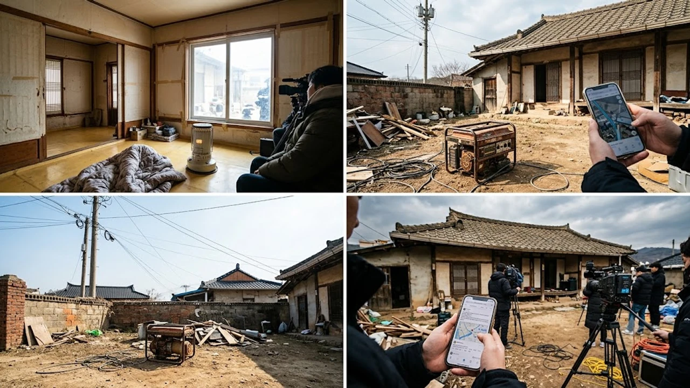

MBC 간판 예능에 배우 김민이 등장하자마자 각종 커뮤니티가 발칵 뒤집혔어. **나혼산 김민 구옥** 라이프가 전파를 타자마자 낭만 가득한 레트로 감성이라는 찬사와 함께 현실성 없는 설정 아니냐는 구옥 인테리어 논란이 동시에 터져 나온 거지. 화면에 비친 그 고즈넉한 일상이 진짜배기 라이프스타일인지, 아니면 잘 짜인 방송용 연출인지 팩트 위주로 낱낱이 짚어볼게.

## 방송 직후 불붙은 구옥 연출 의혹의 실체

> "저 연식의 오래된 단독주택인데 곰팡이 흔적도 없고 웃풍도 안 든다고? 솔직히 말해줄게, 시골집 한 번이라도 살아본 사람은 바로 안다."

방송 직후 실시간 댓글 창과 각종 대형 커뮤니티를 달군 핵심 반응이야. 시청자들의 의구심은 단순히 억측에서 나온 게 아니었어.

### 낭만과 현실의 괴리감이 만든 위화감
오래된 주택 특유의 세월감이 묻어나는 외관과 달리 실내 환경이 지나치게 완벽했다는 점이 불씨를 당겼어. 바닥 균열이나 벽면 단열재 처리 흔적 없이 깔끔하게 떨어지는 조명과 감각적인 가구 배치는 흡사 세트장을 방불케 했거든. 실제로 구옥을 고쳐 사는 사람들은 샷시 교체나 외풍 차단 작업 없이 저런 쾌적함이 유지되긴 어렵다고 꼬집었지.

### 생활 흔적의 부재와 인위적인 소품 배치
선반 위에 가지런히 놓인 소품들과 먼지 한 톨 없는 목재 창틀, 그리고 실거주 공간이라기엔 너무나 단출한 주방 식기류가 도마 위에 올랐어. 매일 밥을 해 먹고 잠을 자는 공간이라면 필연적으로 드러날 수밖에 없는 자잘한 살림살이가 싹 감춰져 있었거든. 감성적인 브이로그 분위기를 연출하기 위해 촬영 직전 급조된 스타일링을 거친 게 아니냐는 지적이 쏟아진 이유야.

### 리얼리티 예능의 진정성 시험대
나 혼자 산다가 오랜 시간 사랑받은 비결은 연예인의 민낯과 날것 그대로의 일상이었어. 하지만 몇 년간 지나치게 화려한 인테리어나 협찬 의혹이 잦아지면서 시청자 피로도가 누적된 상태였지. 김민의 에피소드 역시 이런 불신 속에서 더 날카로운 검증의 잣대를 마주하게 된 셈이야.

## 시청자들이 꼽은 결정적 위화감 3가지

이게 말이 됨? 방송을 본 사람들이 그냥 넘어가지 못하고 꼬집어낸 결정적인 장면들은 꽤 구체적이야.

### 난방과 단열의 미스터리
목조 프레임과 얇은 단판 유리창 구조를 그대로 살렸음에도 출연자가 얇은 실내복 차림으로 여유롭게 생활하는 모습이 포착됐어. 오래된 목조 주택은 보일러를 온종일 가동해도 바닥만 뜨겁고 공기는 차가운 냉골 현상이 흔하거든. 단열재 보강 공사 내역에 대한 언급 없이 온기 가득한 분위기만 잡히다 보니 현실감이 뚝 떨어졌다는 반응이 지배적이야.

### 세월을 빗겨간 벽체와 배관 상태
수십 년 된 노후 주택에서 흔히 겪는 수압 저하, 배수관 악취, 벽체 균열 같은 고질적 문제가 화면 안에서는 전혀 찾아볼 수 없었어. 수도꼭지를 틀자마자 시원하게 쏟아지는 물줄기와 얼룩 하나 없는 싱크대 하부장은 기본 설비 공사가 대대적으로 들어가지 않고는 불가능한 수준이었지. 집의 낡은 멋만 취하고 현실적인 하자는 교묘히 가렸다는 비판을 피하기 힘든 대목이야.

### 일상이라기엔 어색한 연출 동선
아침에 일어나 커피를 내리고 마당을 거니는 일련의 과정이 지나치게 정형화되어 있었어. 카메라 앵글을 의식한 듯한 시선 처리와 부자연스러운 동선 이동은 관찰 예능 특유의 생동감을 반감시켰지. 요즘 방송가 전반의 화제작 흐름이 궁금하다면 [연예이슈 전체 글 보기](/posts/entertainment/)를 통해서도 확인해볼 수 있지만, 시청자들의 눈높이는 이미 전문가 수준으로 올라와 있어.

## 방송용 콘셉트인가 진짜 취향인가

그렇다면 이번 이슈는 제작진의 철저한 기획일까, 아니면 김민 개인의 독특한 미적 감각일까? 업계 안팎의 시각은 반반으로 갈리고 있어.

### 오랜 시간 쌓아온 독자적인 취향
김민은 이전부터 개인 SNS와 인터뷰를 통해 아날로그 감성과 빈티지 가구에 대한 깊은 애정을 꾸준히 드러내 왔어. 유행을 좇아 급조된 콘셉트가 아니라, 본인이 발품을 팔아 수집한 고가구와 소품들로 공간을 채워나가는 과정 자체를 즐기는 인물이라는 거지. 실제 지인들의 증언에 따르면 평소에도 현대적인 편의성보다는 공간이 주는 고유의 정취를 훨씬 아끼는 편이라고 해.

### 제작진의 과도한 프레임 씌우기
문제는 방송사가 이를 다루는 방식에 있었어. 인물의 자연스러운 취향을 담백하게 보여주기보다는, '도심 속 자연인', '세속을 벗어난 구옥 라이프'라는 극적인 프레임을 과하게 씌우려다 사달이 난 거지. 제작진의 의욕이 앞서 리얼한 생활 소음이나 사소한 불편함들을 편집 단계에서 걷어내다 보니 오히려 인위적인 냄새가 짙어졌다는 분석이야.

## 논란을 넘어 본 구옥 라이프의 현실적인 한계

구옥 인테리어가 선사하는 특유의 따스한 색감과 고즈넉한 정취는 누구나 한 번쯤 꿈꾸는 로망이야. 하지만 미디어에 비치는 환상 뒤편에는 만만찮은 유지 보수 비용과 노동력이 도사리고 있어.

- **끝없는 보수 공사의 굴레**: 방수, 배관, 전기 증설 등 기초 공사에 들어가는 비용만 해도 신축 아파트 리모델링을 훌쩍 뛰어넘는 경우가 허다해.
- **혹독한 계절 변화**: 여름철 해충과의 전쟁, 겨울철 동파 위험과 살인적인 난방비는 감성 하나만으로 버티기엔 너무 가혹한 현실이지.
- **철저한 유지 관리의 필수성**: 목재 뒤틀림 방지 작업부터 주기적인 틈새 방풍 처리까지, 손이 가지 않는 곳이 하나도 없어.

결국 브라운관 너머로 전해지는 낭만을 온전히 누리기 위해서는 겉보기의 아름다움보다 뼈대를 지탱하는 기본 설비와 방한 대책이 선행되어야 해. 낡은 공간을 멋스럽게 가꾸는 것도 좋지만, 매서운 외풍을 막아줄 실용적인 월동 장구류와 온열 기기 준비 없이는 낭만도 그저 고통이 될 뿐이야.

[외풍차단 방풍비닐 쿠팡에서 보기](https://www.coupang.com/np/search?q=%EC%99%B8%ED%92%8D%EC%B0%A8%EB%8B%A8+%EB%B0%A9%ED%92%8D%EB%B9%84%EB%8B%98&sourceType=affiliate&trackingCode=AF8691300)

#나혼자산다 #김민 #구옥인테리어 #나혼산김민 #단독주택리모델링 #구옥살이 #연예인이슈 #방송뒷이야기