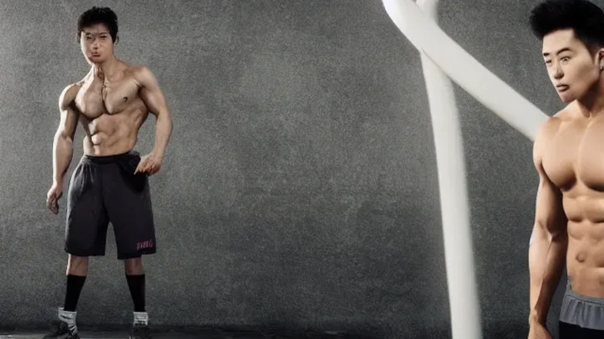
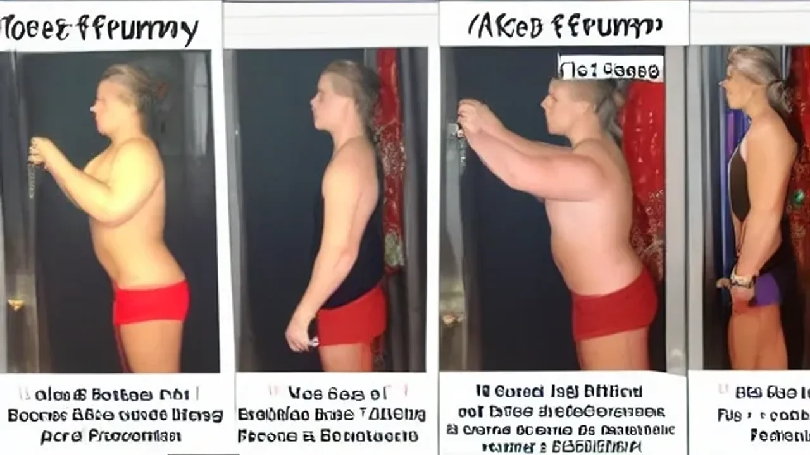

대세 트로트 가수 박서진이 최근 방송을 통해 **박서진 11kg 증량** 사실을 솔직하게 고백하며 대중의 뜨거운 관심을 모으고 있습니다. 급격한 체중 변화로 인해 비주얼 위기를 겪고 있다는 그의 유쾌하면서도 절박한 고민은 주말 안방극장을 제대로 강타했습니다. 살림남 방송에서 공개된 그의 솔직한 외모 심경과 올림픽 영웅 황영조와의 특별한 다이어트 도전기까지 핵심만 모아 전해드립니다.

## 박서진 11kg 증량 및 비주얼 위기 고백 배경

### 살림남 첫 출연 대비 73kg 달성
KBS2 예능 프로그램 '살림하는 남자들 시즌2(살림남)'에 처음 등장했을 당시 박서진은 날렵한 턱선과 호리호리한 체구로 소년미를 풍겼습니다. 그러나 최근 녹화 현장에서 측정한 그의 몸무게는 무려 73kg을 기록하며 프로그램 합류 초기와 비교해 확연히 달라진 체격을 보였습니다. 새벽까지 이어지는 빡빡한 녹화 스케줄과 불규칙한 야식 습관이 겹치면서 단기간에 살이 오른 결과입니다.

### "1억 들인 얼굴인데" 성형 전 얼굴 보인다는 악플 충격
> "얼굴에 들인 돈이 얼마인데, 살이 찌니까 예전 성형하기 전 얼굴이 자꾸 보인다는 댓글이 달려서 큰 충격을 받았습니다."

박서진은 방송에서 평소 쿨하게 인정해 온 성형 수술 이력을 언급하며 씁쓸한 마음을 토로했습니다. 무명 시절을 지나며 외모 가꾸기에 총 1억 원에 달하는 비용을 투자했으나, 체중이 늘어나자 과거의 이목구비가 다시 드러난다는 네티즌들의 날카로운 피드백에 심리적 압박감을 느꼈다고 털어놓았습니다.

### 팬들이 바라본 박서진의 최근 외모 변화 체감
공연 현장과 본방송을 모니터링하는 팬들 사이에서도 최근 그의 비주얼 변화는 단연 화두였습니다. 무대 의상이 이전보다 타이트해 보인다는 지적과 함께, 트레이드 마크였던 날카로운 브이라인이 다소 둥글어졌다는 평이 지배적입니다. 무대 위 퍼포먼스를 할 때 숨이 전보다 빨리 찬다는 본인의 고백도 팬들의 걱정을 자아냈습니다.

## 네티즌 반응 분석: 응원 vs 냉정한 외모 평판

### "통통해서 귀엽다" 찐팬들의 옹호 여론
박서진의 두터운 팬덤인 '닻별'을 중심으로 한 팬들은 오히려 현재의 통통해진 모습을 반기는 분위기입니다. 과거 지나치게 마른 체형일 때보다 얼굴색이 좋아졌고 건강해 보인다는 의견이 많습니다. 살이 찌면서 볼살이 통통해져 한층 더 친근하고 인간적인 매력이 느껴진다는 긍정적인 댓글이 커뮤니티를 채우고 있습니다.

### "관리해야 할 때" 냉정한 대중 네티즌의 시선 비교
반면 일반 대중과 일부 커뮤니티 이용자들의 시선은 조금 더 냉정합니다. 트로트 가수는 무대 위에서의 비주얼도 상품성의 일부인 만큼, 급격한 체중 증가는 프로페셔널한 자기 관리가 부족해 보일 수 있다는 지적입니다. 특히 카메라 화면에 부하게 나오는 현상을 막기 위해서라도 조속한 감량이 필요하다는 뼈아픈 조언이 이어졌습니다.

### 역대 트로트 가수들의 증량 및 감량 사례와의 비교
트로트 스타들의 고무줄 몸무게 논란은 이번이 처음이 아닙니다. 앞서 다른 동료 트로트 가수들도 공백기 동안 급격히 살이 오르거나 부기 관리에 애를 먹다가 컴백 직전 폭풍 감량에 성공하며 화제를 모은 바 있습니다. 활동량이 워낙 많고 이동 거리가 긴 트로트 장르 특성상, 한 번 체력 균형이 깨지면 쉽게 증량으로 이어지는 경향이 있음을 과거 사례들이 증명합니다.

[관련 글 보기](/posts/entertainment/)

## 올림픽 영웅 황영조 소환! 살림남 다이어트 프로젝트

### 마라톤 금메달리스트 황영조가 지적한 박서진의 잘못된 러닝 자세
비주얼 회복을 위해 박서진은 1992년 바르셀로나 올림픽 마라톤 금메달의 주역 황영조 감독을 찾아갔습니다. 황영조 감독은 박서진의 뛰는 모습을 단 몇 분간 관찰한 뒤 곧바로 문제점을 포착했습니다. 상체가 과도하게 흔들리고 발바닥 전체가 지면에 쿵쿵 닿는 잘못된 러닝 자세 때문에 에너지가 쉽게 고갈되고 관절에 무리가 가고 있다는 매서운 분석이 내려졌습니다.

### 황영조가 전수한 중장년·초보자 맞춤형 유산소 심폐 훈련법
황영조 감독은 초보자인 박서진을 위해 호흡법부터 기초 체력 다지기까지 맞춤형 특훈을 실시했습니다. 코로 깊게 들이마시고 입으로 짧게 뱉는 마라톤식 호흡 루틴을 전수하며 심폐 능력을 극대화하는 비법을 공개했습니다. 시청자들이 집 앞 공원에서 곧바로 실천할 수 있는 올바른 발 디딤 동작과 시선 처리 방식은 유용한 정보로 다가왔습니다.

### 동생 효정이와 함께하는 생애 첫 3km 완주 미션 코스
이번 다이어트 프로젝트에는 박서진의 티격태격 케미를 자랑하는 동생 효정이도 함께 동참해 재미를 더했습니다. 황영조 감독이 제시한 최종 미션은 '남매 동반 3km 완주'였습니다. 저질 체력으로 유명한 두 남매가 서로를 밀고 끌어주며 한계에 도전하는 과정은 감동과 폭소를 동시에 유발하며 주말 안방극장을 사로잡았습니다.

## 단기간 체중 감량을 위한 박서진 식단 및 운동 장단점

### 급격한 유산소 러닝 다이어트의 장점과 관절 부상 위험성
황영조 감독에게 전수받은 고강도 러닝은 체지방을 빠르게 태우고 심폐 기능을 향상하는 데 탁월한 효과를 발휘합니다. 단기간 체중 감량이 절실한 연예인에게 이보다 확실한 유산소 운동은 없습니다. 다만 평소 운동량이 없던 상태에서 갑자기 딱딱한 아스팔트를 달릴 경우, 무릎 연골 and 아킬레스건에 염증을 유발할 수 있으므로 보호대 착용과 충분한 스트레칭이 동반되어야 합니다.

### 트로트 스케줄을 병행할 수 있는 연예인 식단 관리의 현실적 한계
* **장점:** 닭가슴살과 샐러드 위주의 철저한 칼로리 제한은 빠른 체중 감량을 보장함
* **단점:** 지방 행사가 많고 밤늦게 일정이 끝나는 트로트 가수 특성상 도시락을 상시 지참하기 어렵고 영양 불균형 초래 위험 존재

바쁜 일정을 소화하면서 식단을 완벽히 유지하기란 불가능에 가깝습니다. 극단적인 굶기는 무대 위 가창력 저하와 목소리 떨림 현상으로 이어질 수 있어 정교한 영양 배분이 요구됩니다.

### 일반인이 따라 하기 좋은 박서진 식 다이어트 루틴의 지속 가능성 평가
박서진 남매의 다이어트 도전은 완벽한 헬스장 루틴 대신 일상 속 러닝과 가족 간의 유대감을 활용했다는 점에서 일반인들에게 높은 지속 가능성을 보여줍니다. 혼자 하는 지루한 운동에서 벗어나 가족이나 친구와 함께 목표 거리를 설정하고 달리는 방식은 슬럼프를 극복하기에 아주 유용한 전략으로 평가됩니다.

#박서진 #박서진11kg증량 #살림남박서진 #박서진다이어트 #황영조마라톤 #연예인다이어트 #박서진성형 #박서진몸무게 #트로트가수근황