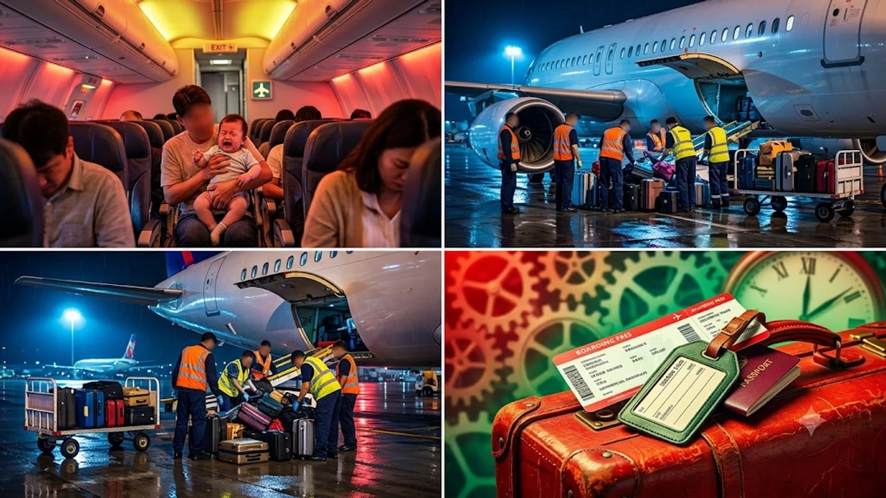

최근 온라인 커뮤니티와 SNS를 뜨겁게 달군 **박수홍 괌 비행기 지연** 사건의 전말을 솔직하게 파헤쳐볼게. 가족 여행길에서 벌어진 뜻밖의 '하기 번복' 해프닝 때문에 여객기 출발이 1시간 넘게 늦어지면서 승객 피해와 항공 에티켓 논란이 일파만파 번졌거든. 도대체 비행기 안에서 무슨 일이 있었길래 비행기 출발까지 멈춰 선 건지 핵심 팩트만 짚어줄게.

## 박수홍 괌행 항공편 지연 사태의 전말과 핵심 쟁점

### 인천발 괌행 KE415편 70분 지연 출발 상황 타임라인
사건은 지난 8월 26일 오전, 인천국제공항을 떠나 괌으로 향할 예정이던 여객기 안에서 벌어졌어. 탑승 수속을 마치고 활주로로 이동을 준비하던 시점에 박수홍 가족이 탑승 취소 의사를 밝히면서 상황이 꼬이기 시작했지. 정시 출발을 기다리던 수백 명의 승객들은 영문도 모른 채 기내에서 꼼짝없이 70분 넘게 대기해야만 했어.

### 기내 탑승 후 하기 요청과 재탑승 번복이 일어난 구체적 경위
비행기에 탄 직후 어린 자녀가 극심한 불안 증세를 보이며 심하게 울기 시작하자, 박수홍 측은 주변 승객들에게 피해를 줄까 염려해 승무원에게 **"비행기에서 내리겠다(자발적 하기)"**고 요청했어. 승무원들은 절차에 따라 하기 준비를 진행했는데, 잠시 후 아이가 진정세를 보이자 "다시 그냥 타고 가겠다"며 결정을 번복해 버린 거야.

> "내린다고 했다가 다시 탄다고 하면 그냥 앉아있으면 끝나는 거 아니야?"

이렇게 생각했다면 비행기 시스템을 전혀 모르는 소리야. 항공편은 한 번 내리겠다고 말을 뱉는 순간, 승객 한 사람의 변심으로 상황을 되돌릴 수 없는 엄격한 보안 매뉴얼이 작동하거든.

### 현장 목격담과 기내 승객 반응으로 본 당시 분위기
기내에 함께 타고 있던 승객들의 증언에 따르면, 출발 지연 안내 방송이 연달아 나오면서 휴가 일정이 꼬인 승객들의 불만이 극에 달했다고 해. 아이가 우는 것 자체는 이해할 수 있지만, 섣부른 하기 결정과 번복 때문에 기내 전체가 큰 혼란에 빠졌다는 점에서 현장 분위기는 꽤나 냉랭했어. 연예인 가족이라 더 눈길을 끌 수밖에 없던 상황에서 [손예진 현빈 가족 여행, 진짜 소름 돋는 패션 정보 완전 정리](/posts/entertainment/son-ye-jin-hyun-bin-family-trip-2026/) 같은 훈훈한 가족 이슈와는 전혀 다른 양상의 민폐 논란으로 번진 셈이지.

## 비행기 출발이 1시간 이상 늦어진 진짜 이유 3가지

### 이유 1: 항공 보안법에 따른 승객-위탁수하물 일치 규정
비행기에서 승객이 자발적으로 내릴 경우, **'승객이 타지 않은 짐은 비행기에 실을 수 없다'**는 국제 항공 보안법(Positive Passenger Baggage Matching)이 즉시 발동해. 테러나 폭발물 위협을 방지하기 위한 절대적인 규정이라 예외가 없거든. 승객이 내린다고 선언한 순간, 화물칸에 실린 짐을 전부 뒤져서 해당 승객의 캐리어를 무조건 꺼내야 해.

### 이유 2: 화물칸 재개방 및 위탁 수하물 하역·재적재 소요 시간
수백 개의 캐리어가 테트리스처럼 꽉 채워진 대형 화물칸 문을 다시 열고 특정 짐을 찾는 작업은 절대 5분, 10분 만에 끝나지 않아. 
- 화물칸 개방 및 지상 조업 인력 긴급 투입
- 수하물 바코드 전수 스캔 및 타깃 수하물 색출
- 번복 결정 후 수하물 재적재 및 무게 중심(Balance) 재계산

이 일련의 과정만으로도 최소 40분에서 1시간 가까운 물리적 시간이 그대로 날아갈 수밖에 없는 구조야.

### 이유 3: 하기 승객 발생 시 진행되는 기내 보안 재검색 절차
하기 요청 승객이 머물렀던 좌석 주변에 폭발물이나 위험 물품이 유기되지 않았는지 확인하는 기내 보안 수색도 필수 절차야. 보안 요원과 승무원이 좌석 시트, 선반 내부를 일일이 확인하고 기장에게 최종 안전 보고를 올린 뒤에야 이륙 허가가 떨어져. 말 한마디로 시작된 나비효과가 공항 전체 시스템을 멈춰 세운 셈이지.

## 박수홍의 공식 입장문과 사과 발표 내용 분석

### "항공 절차 무지에서 비롯된 일" 자필 사과문 핵심 요약
논란이 걷잡을 수 없이 커지자 박수홍은 즉각 공식 입장문을 내고 고개를 숙였어. 사과문의 핵심 내용은 명확했지.
- 비행기에서 내리는 과정이 이렇게 복잡하고 다른 승객에게 막대한 지연 피해를 주는지 미처 몰랐다는 점
- 본인의 미숙한 판단으로 인해 소중한 시간과 일정을 빼앗긴 탑승객 전원에게 진심으로 사죄한다는 점
- 향후 항공 안전 및 기내 매뉴얼을 철저히 숙지하겠다는 다짐

### 아이 울음 대처 과정에서의 미숙함 인정과 고개 숙인 이유
박수홍은 "아이가 너무 심하게 울어 주변 분들께 방해가 될까 봐 당황한 나머지 섣부르게 내리겠다고 했다"며 부모로서의 조급함을 인정했어. 하지만 배려하려던 행동이 결과적으로 전체 승객에게 1시간 이상의 출발 지연이라는 더 큰 민폐를 끼쳤다는 점에 대해 변명 없이 본인의 책임을 온전히 받아들였어.

### 온라인 커뮤니티 및 여론의 엇갈린 반응과 비판 여론
여론은 팽팽하게 갈리고 있어. 한쪽에서는 "우는 아이 때문에 당황해서 그런 건데 즉각 인정하고 사과했으니 됐다"며 초보 부모의 마음에 공감하는 목소리를 내고 있어. 반면 다른 쪽에서는 "성인이고 수없이 비행기를 타봤을 텐데 하기 번복이 민폐라는 걸 몰랐다는 건 무책임하다", "연결편 환승 승객이라도 있었으면 어쩔 뻔했냐"는 날 선 비판을 쏟아내고 있지.

## 영유아 동반 항공기 탑승 시 반드시 알아야 할 대처 가이드

### 이륙 직전 자발적 하기 시 발생하는 법적·절차적 불이익
비행기 문이 닫힌 이후의 자발적 하기는 단순 변심으로 처리되지 않아. 정당한 사유(응급 환자 발생 등)가 아닌 개인 사정으로 하기를 강행하거나 번복해 운항에 심각한 차질을 빚을 경우, 항공사로부터 지연 손해배상 청구를 당하거나 공항 경찰대의 조사를 받을 수도 있어. 비행기 문이 닫히기 전에 신중하게 판단해야 하는 이유야.

### 영유아 기내 불안 및 울음 완화를 위한 사전 준비 팁
아이와 함께 비행기에 오를 때는 기압 변화와 낯선 환경에 철저히 대비해야 해.
- **이착륙 시 침 삼키기:** 기압 차로 인한 귀 통증(이통)을 막기 위해 젖병, 빨대컵, 사탕 등을 미리 준비해 이착륙 때 먹이기
- **새로운 장난감·영상 세팅:** 기내에서 처음 꺼내주는 장난감이나 오프라인 저장 영상으로 시선 집중시키기
- **탑승 전 에너지 소모:** 공항 내 키즈존을 활용해 탑승 직전 충분히 활동하게 한 뒤 수면 유도하기

### 다른 승객 피해를 최소화하는 기내 에티켓과 승무원 협조 요령
아이가 울기 시작할 때 무작정 당황해서 무리한 요구를 하기보다는, 즉시 승무원에게 도움을 요청해 갤리(승무원 준비 공간) 쪽에서 아이를 달래거나 진정시킬 수 있는 여건을 찾는 게 훨씬 현명해. 주변 승객들에게 미리 양해를 구하고 작은 간식이나 귀마개를 건네는 배려도 불필요한 마찰을 줄이는 검증된 방법이지.

[영유아 기내 필수템 롤리팝 사탕 쿠팡에서 보기](https://www.coupang.com/np/search?q=%EC%98%81%EC%9C%A0%EC%95%84+%EA%B8%B0%EB%82%B4+%EC%82%AC%ED%83%95&sourceType=affiliate&trackingCode=AF8691300)

#박수홍 #박수홍괌비행기 #비행기지연사태 #자발적하기 #항공보안법 #괌비행기지연 #기내에티켓 #연예인이슈 #비행기민폐논란