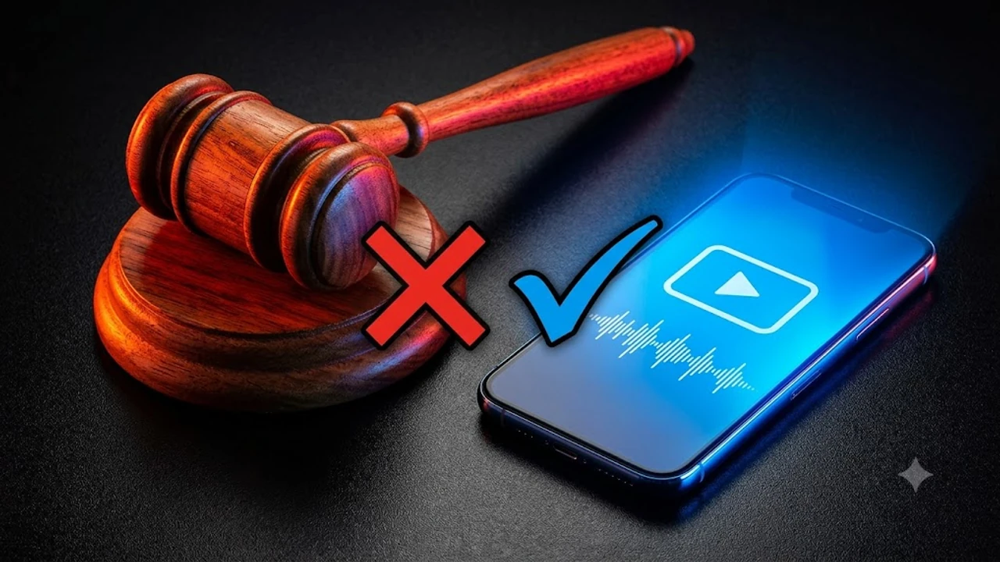

유튜버 위라클 박위가 올린 영상 하나로 주말 내내 온라인 커뮤니티가 발칵 뒤집혔어. 바로 **박위 KTX 논란** 이야기인데, 이동약자 리프트 이용 중 겪은 아찔한 낙상 사고를 두고 휠체어 안전 문제와 현장 직원 대처 방식에 거센 공방이 터졌지. 단순한 안전사고 고발이 왜 순식간에 역풍으로 이어졌는지 그 내막을 낱낱이 짚어볼게.

## 박위 KTX 리프트 낙상 사고, 무슨 일이 있었나

### 유튜브 공개 직후 불거진 직원 과실 공방
박위는 본인 유튜브 채널에 KTX 열차에 탑승하려다 휠체어 리프트에서 뒤로 넘어가는 충격적인 사고 영상을 올렸어. 
영상 속에서 당시 승하차를 돕던 역무원의 대처를 꼬집으며 아찔했던 현장 상황을 가감 없이 전달했지. 
영상이 올라오자마자 팬들과 대중은 "코레일 안전 관리에 심각한 구멍이 뚫렸다"며 분통을 터뜨렸어.

### 승강기 낙상 장면과 현장 대처의 엇갈린 시선
공개된 CCTV 속 모습은 그야말로 아슬아슬했어.
- 리프트 발판의 경사 각도
- 전동 휠체어의 무게를 감당하는 지지 방식
- 뒤로 기울어지는 순간의 제동 조치

영상이 공개된 직후 여론은 위험천만한 환경에 무방비로 노출된 피해자의 억울함에 깊이 공감했지.

## 여론 반전의 계기, 네티즌 지적이 쏟아진 이유

### 코레일 직원의 발 위치와 안전 조치 해석 차이
하지만 영상을 프레임 단위로 뜯어본 네티즌들이 나오면서 흐름이 180도 뒤집혔어. 
직원이 방관한 게 아니라, 휠체어가 완전히 뒤로 꺾여 넘어지는 참사를 막으려고 본인 발을 바퀴 뒤쪽에 쑤셔 넣어 몸으로 지탱하고 있었다는 게 포착된 거야. 
이 사실이 알려지자마자 온라인 커뮤니티 분위기는 순식간에 차갑게 식어버렸어.

> "자기도 다칠 각오로 몸을 던져 막아선 직원을 가해자처럼 편집해 몰아세운 것 아니냐"

### 돕던 손길을 향한 성급한 비판이라는 반응
사고를 막으려던 실무자의 발버둥이 고스란히 찍혔는데도, 일방적인 과실로 몰아간 편집 태도가 강한 비판을 샀어. 
선의로 현장을 돕던 근무자가 억울하게 마녀사냥을 당할 뻔했다는 분노가 번진 셈이지. 
실시간으로 쏟아지는 연예계 쟁점이 궁금하다면 [연예이슈 전체 글 보기](/posts/entertainment/)에서 흐름을 확인해봐.

## 박위 측의 영상 삭제와 공식 사과문 내용

### 논란 확산 직후 신속했던 영상 비공개 전환
비판 여론이 걷잡을 수 없이 번지자 박위 측은 곧바로 문제의 영상을 내리고 커뮤니티 게시판에 고개 숙인 사과문을 올렸어. 
사고 당시 느꼈던 극심한 공포와 당혹감 때문에 직원의 구조 의도를 미처 다 헤아리지 못했다며, 자신의 섣부른 판단을 인정했지. 
현장에서 애써준 직원을 향한 미안함도 솔직하게 털어놓았어.

### 오해에 대한 인정과 남겨진 대중의 시선
사과문 발표 이후 대중의 반응은 여전히 팽팽하게 맞서고 있어.
- "실수를 빠르게 인정하고 머리 숙였으니 지나친 비난은 멈추자"는 목소리
- "파급력이 막강한 대형 유튜버가 일반 직원의 인생을 망칠 뻔했다"는 싸늘한 시선

인플루언서가 휘두르는 카메라와 파급력이 얼마나 무거운 책임감을 요구하는지 다시금 보여준 셈이야.

## 이동권 안전과 상호 존중, 앞으로 남은 과제

### 교통약자 이동 지원 매뉴얼의 보완점
감정적인 탓하기로 끝낼 게 아니라 짚고 넘어가야 할 구조적 현실이 있어. 
낡은 철도 인프라와 기계식 리프트의 기술적 한계는 언제든 또 다른 사고를 부를 수 있는 뇌관이야.
- 노후화된 이동식 휠체어 리프트 규격 전면 점검
- 돌발 전도 사고에 대비한 현장 보조 인력의 전문 안전 실습 강화
- 휠체어 무게와 경사를 버티는 충격 흡수 안전장치 마련

### 안전사고 발생 시 책임 공방을 넘어설 해법
현장에서 땀 흘리는 직원과 이동약자 모두가 다치지 않는 시스템을 다져야 해. 
비난과 옹호로 갈라져 싸우기보다 낡은 장비를 바꾸고 매뉴얼을 촘촘히 엮는 게 진짜 해결책이지. 
평소 외출 시 바퀴 미끄럼 방지와 낙상을 예방하고 싶다면 [휠체어 안전용품 쿠팡에서 보기](https://www.coupang.com/np/search?q=%ED%9C%A0%EC%B2%B4%EC%96%B4+%EC%95%88%EC%A0%84%EC%9A%A9%ED%92%88&sourceType=affiliate&trackingCode=AF8691300)를 둘러봐.

#박위 #위라클 #KTX낙상사고 #박위CCTV #코레일리프트 #박위사과문 #교통약자이동권 #철도안전