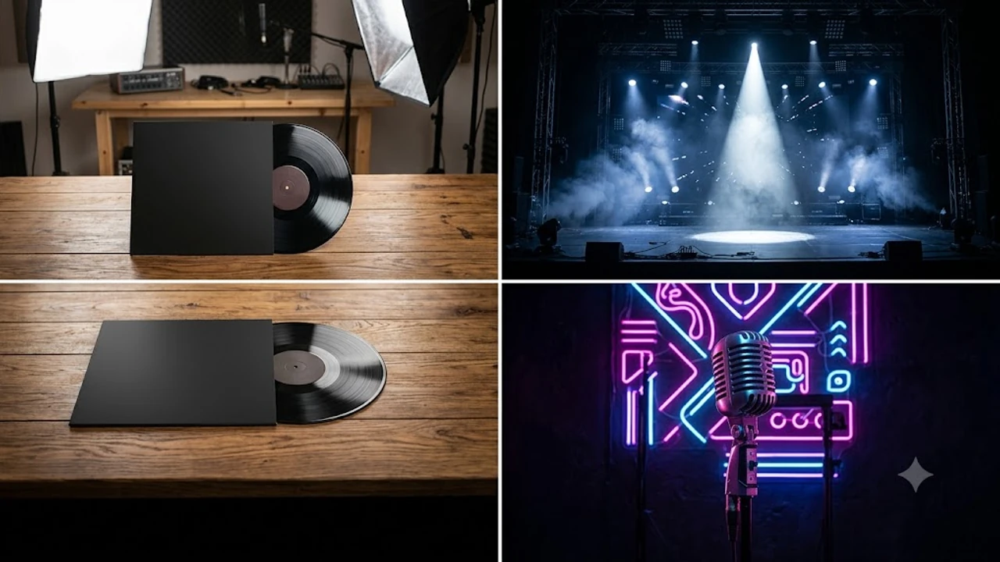

세븐틴의 막내 디노가 마침내 제대로 일을 냈다. 2026년 8월 3일, 디노의 부캐릭터인 피철인이 첫 번째 미니 앨범 '吉BOARD(길보드)'를 들고 가요계에 전격 출사표를 던졌다. 세븐틴 디노 피철인 신보 발매 소식에 K-POP 팬덤은 물론이고 레트로 음악을 좋아하는 사람들까지 온통 난리가 난 상태다.

## 세븐틴 세계관 속 '피철인'의 정체와 솔로 데뷔 배경

### 세븐틴 자체 콘텐츠에서 시작된 legendary 캐릭터
원래 피철인은 세븐틴의 자체 콘텐츠인 '고잉 세븐틴' 등에서 디노가 선보였던 레트로 감성 가득한 부캐다. 촌스러우면서도 묘한 중독성을 자랑하던 이 캐릭터가 진짜 정식 음원 앨범까지 내게 될 줄은 그 누구도 예상하지 못했다. 팬들 사이에서 장난처럼 소비되던 유머 코드가 진짜 기획으로 완성된 순간이다.

### 장난을 넘어 정식 음원 시장으로 직행한 이유
솔직히 말해서 단순한 일회성 이벤트성 캐릭터로 끝낼 수도 있었다. 하지만 디노는 부캐 뒤에 숨은 본인의 또 다른 음악적 욕망을 진짜 플레이어로 표현하고 싶었던 거다. 퍼포먼스와 완벽한 아이돌 모습에 가려져 있던 8090년대 레트로 감성과 솔로 아티스트로서의 넘치는 에너지, 이걸 피철인이라는 페르소나로 완벽하게 녹여냈다.

### 기존 K-POP 부캐들과 확실히 갈리는 독보적 페르소나
마미손이나 부석순 같은 성공적인 선례가 있지만 피철인은 결이 완전히 다르다. 대놓고 코믹함만 밀어붙이는 게 아니라, 레트로 감성 속에 진짜 진정성 있는 음악성을 꾹꾹 눌러 담았다. 겉모습은 딱 웃음기를 품고 있는데 노래를 들으면 소름이 돋을 정도로 고퀄리티라는 게 이 부캐의 진짜 무기다.

## 미니 1집 '吉BOARD(길보드)' 곡 분석과 이문세 피처링

### 레트로와 현대적 감각의 미친 조합
이번 미니 1집 '吉BOARD(길보드)'는 이름부터 감이 오듯 8090년대 길거리 테이프 상점과 길보드 차트를 대놓고 오마주했다. 시티팝부터 뉴잭스윙, 감성 발라드까지 수록곡 전체가 레트로 사운드로 가득 차 있다. 올드팝 특유의 감성을 요즘 Z세대가 듣기 좋게 리듬감을 확 살려 편곡했다.

### 대선배 이문세와의 컬래버레이션 신화
이번 앨범의 최고 하이라이트는 선공개곡 '아프지 않은 이별은 없다'에 가요계의 대전설 이문세가 피처링으로 참여했다는 점이다. 이 조합을 들었을 때 "이게 말이 됨?" 하고 의심한 사람이 한둘이 아니었을 거다. 두 사람이 만들어내는 아날로그 감성의 보컬 합은 듣는 순간 소름을 유발한다. [영케이 YOUNGEST 컴백! 진짜 주목할 핵심 3가지](/posts/entertainment/young-k-youngest-comeback-album-analysis-2026/) 글에서도 다뤘듯 최근 K-POP 신에서 레트로와 정통 보컬의 만남이 주는 울림은 진짜 역대급이다.

### 차트 진입과 폭발적인 초반 대중 반응
8월 3일 정오 앨범이 공개되자마자 주요 음원 사이트 실시간 차트에 상위권으로 진입했다. 팬덤 스밍 화력은 물론이고, 이문세와의 협업 소식에 궁금해서 찾아들은 일반 리스너들의 긍정적인 후기가 커뮤니티마다 쏟아지는 중이다.

> "웃기려고 시작했다가 노래가 너무 좋아서 눈물 흘리는 중", "디노 보컬 스펙트럼이 이렇게 넓은 줄 몰랐다" 같은 반응이 실시간으로 잇따르고 있다.

## 단독 공연 타이틀 및 티켓팅 핵심 정보

### 첫 단독 콘서트 개최 장소와 날짜
앨범 발매와 함께 팬들을 더 미치게 만든 건 바로 단독 공연 소식이다. 피철인이라는 이름으로 펼쳐지는 이번 단독 콘서트는 앨범 콘셉트에 맞춰 아늑하면서도 열기 넘치는 라이브 홀에서 진행된다.

- **공연 일정**: 2026년 8월 하순 예정
- **공연 장소**: 서울 내 주요 라이브 홀
- **티켓 오픈**: 팬클럽 선예매 후 일반 예매 진행

### 티켓팅 전쟁에서 살아남는 실전 전략
세븐틴 팬덤 캐럿의 화력에 피철인 부캐에 호기심을 느낀 일반 관객까지 몰릴 예정이라 티켓팅 난이도는 극상이다. 예매 사이트 사전 본인인증은 기본이고, 서버시계 켜두고 정각 0.1초 전 클릭하는 순발력이 필수다. 취소표가 나오는 자정 무렵 취켓팅을 노리는 것도 하나의 전략이다.

### 무대에서만 볼 수 있는 피철인의 특별 관전 포인트
이번 콘서트에서는 앨범 수록곡 전곡 라이브는 기본이고, 고잉 세븐틴 세계관과 연계된 피철인의 재치 있는 멘트와 특유의 퍼포먼스가 대거 준비되어 있다. 디노가 아닌 '피철인'으로서 팬들과 주고받을 만담 레벨의 입담이 관람 포인트다.

## '피철인' 활동이 디노와 세븐틴에게 가져올 파장

### 디노의 싱어송라이터 역량과 솔로 아티스트로서의 재발견
그동안 세븐틴 안에서 메인 댄서로서의 압도적인 퍼포먼스가 주로 조명됐다면, 이번 피철인 프로젝트는 디노의 보컬, 프로듀싱, 콘셉트 기획력을 입증하는 완벽한 계기가 됐다. 막내의 화려한 홀로서기가 본체의 음악적 스펙트럼을 단번에 몇 단계 끌어올렸다.

### 세븐틴 그룹 브랜드에 주입되는 새로운 에너지
세븐틴은 유닛 활동과 부캐 활용을 가장 똑똑하게 잘하는 그룹이다. 부석순에 이어 피철인까지 대성공을 거두면서, 팀 전체의 대중적 친근함과 브랜드 가치는 또 한 번 폭발적인 시너지를 얻게 됐다. 멤버 개개인의 역량이 그룹을 얼마나 단단하게 만드는지 보여주는 정석적인 사례다.

### 2026년 하반기 디노의 거침없는 행보
8월 피철인 솔로 앨범과 단독 공연을 시작으로 각종 예능, 음악 방송, 라이브 콘텐츠 출연이 빽빽하게 예정되어 있다. 2026년 하반기 연예계는 피철인의 레트로 열풍이 꽤나 길게 이어질 것으로 보인다. 본체 디노와 부캐 피철인의 아슬아슬한 이중생활을 직관하는 재미가 쏠쏠할 거다.

**함께 읽으면 좋은 글**
- [배우 하영 증조부 친일 논란 하루 만에 번복한 2가지 이유](/posts/entertainment/actress-hayoung-great-grandfather-pro-japanese-controversy-2026/)
- [놀면 뭐하니?' 유재석의 숏폼 드라마 시즌2 제작](/posts/entertainment/entertainment-issue-20260801/)

#세븐틴 #디노 #피철인 #길보드 #이문세 #세븐틴디노 #KPOP부캐 #2026연예이슈 #피철인콘서트