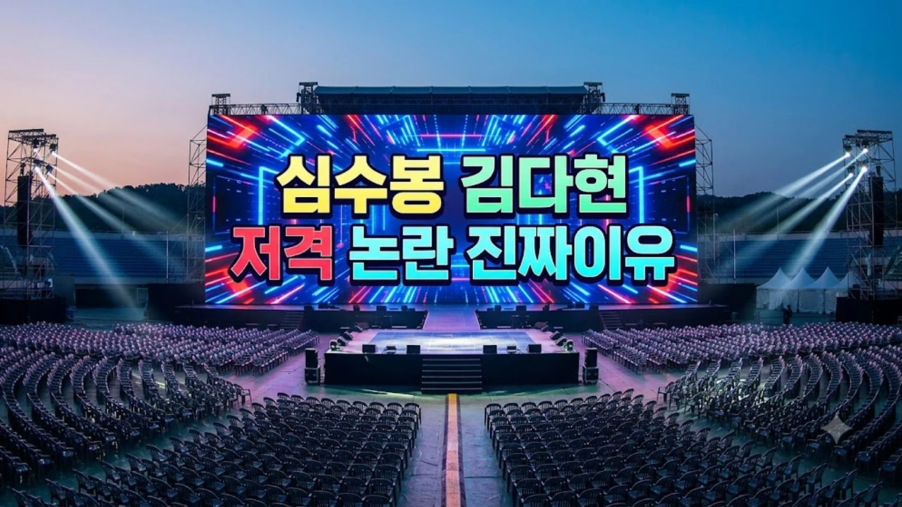

가요계 대선배의 훈계일까, 아니면 선을 세게 넘은 공개 망신주기일까? 최근 트로트 축제 현장에서 터진 **심수봉 김다현** 두 사람 사이의 발언 사태는 온라인 커뮤니티와 SNS를 순식간에 흔들어놨어. 무대 위에서 마이크를 잡고 직전 출연자인 후배를 콕 집어 던진 직설적인 한마디가 일파만파 번지면서 팬덤 갈등으로까지 번진 상태야.

## 심수봉 김다현 공개 저격 발언의 전말과 발단

### 트로트 축제 현장에서 발생한 돌발 발언
사건은 수많은 관객이 모인 야외 페스티벌 무대에서 벌어졌어. 초청 가수로 오른 심수봉이 마이크를 잡고 노래 중간 멘트를 하던 중, 직전 순서였던 김다현의 이름을 직접 꺼냈지. 가창 스타일과 무대 애티튜드를 두고 관객들 앞에서 직격탄을 날렸는데, 현장에 있던 관객석 전체가 순식간에 찬물을 끼얹은 듯 얼어붙었어.

### 관객과 네티즌 반응이 급속도로 악화된 배경
현장 직캠 영상이 숏폼 플랫폼을 타고 퍼지자마자 비판 여론이 들끓었어. 무대 뒤 대기실에서 조용히 건넬 수 있는 조언을 굳이 티켓을 사서 온 관객들 앞에서 꺼내 망신을 줘야 했냐는 반응이 지배적이었지. 프로페셔널한 공연 자리에서 사적인 훈계를 쏟아낸 것 자체가 무대 에티켓을 깬 행동이라는 지적이 쏟아졌어.

### 54세 나이 차 대선배와 미성년 후배 구도의 파장
이번 일에 대중이 더 크게 분노한 지점은 둘 사이의 권력 구도야. 심수봉은 반세기 넘게 가요계를 지켜온 거목이지만, 김다현은 이제 막 커리어를 쌓아가는 미성년자 아티스트잖아. 반세기를 훌쩍 넘는 연차 차이 속에서 나온 공개 지적은 조언이라기보다 일방적인 위계 행사로 보일 수밖에 없었어.

## 심수봉 측 공식 입장문과 김다현 부친 사과 통화

### "상식 벗어났다" 심수봉의 이례적 자필 사과문 요점
논란이 걷잡을 수 없이 커지자 심수봉 측은 자필 사과문을 올리며 진화에 나섰어. 의도가 어찌 되었든 공공장소에서 후배에게 상처를 입힌 언행은 명백한 실책이었음을 인정했지. 원로 가수가 공개적으로 자신의 실수를 시인하고 머리를 숙이는 일 자체가 가요계에서는 보기 드문 광경이야.

> "후배를 아끼는 마음이 앞서 무대 위라는 자리의 무게를 잊었습니다. 상처받았을 김다현 양과 팬분들께 진심으로 머리 숙여 사과합니다."

### 소속사의 직접 유선 사과와 대면 면담 제안
입장문 표명과 함께 소속사 실무진은 김다현의 부친인 김봉곤 훈장 측에 곧바로 전화를 걸어 사과의 뜻을 전했어. 조만간 자리를 마련해 직접 만나 오해를 풀자는 제안도 건넸지. 김다현 측도 사과를 받아들이며 상황을 차분하게 정리하려는 태도를 보였어.

### 당일 컨디션 난조 해명이 불러온 엇갈린 대중 반응
다만 해명문 속에 들어간 야외 공연 피로도나 음향 상태 언급에 대해서는 여론이 곱지 않았어. 몸 상태가 안 좋아 실언했을 거라는 옹호도 일부 있었지만, 수십 년 경력의 베테랑이 컨디션 핑계로 후배를 깎아내린 행동을 덮으려 한다는 싸늘한 반응이 적지 않았지. 가요계 숨은 이야기와 다른 화젯거리가 궁금하다면 [연예이슈 전체 글 보기](/posts/entertainment/)를 참고해 봐.

## 논란 이후 번진 2차 가해와 가요계 선후배 문화 재조명

### 김다현을 향한 무분별한 악플과 외모·가창력 조롱 실태
정작 선배의 발언 이후 가장 큰 피해를 입은 건 김다현이었어. 일부 네티즌들이 선배의 지적을 방패막이 삼아 김다현의 SNS에 악성 댓글을 쏟아붓기 시작한 거지. 실력 검증을 빌미로 시작된 비난은 순식간에 외모 조롱과 인격 모독으로 번졌어.

- 인스타그램 및 유튜브 댓글창을 향한 좌표 찍기성 악플 세례
- 확인되지 않은 무대 뒷이야기를 사실인 양 날조한 가짜뉴스
- 성장기 청소년 아티스트를 향한 인신공격성 외모 비하

### 무대 위 훈계는 조언인가 무례인가: 업계 비판 시각
가요계 관계자들 사이에서도 이번 일을 계기로 구태의연한 도제식 문화를 버려야 한다는 목소리가 커지고 있어. 무대는 가수가 관객에게 최고의 공연을 보여주는 곳이지, 선배가 후배 군기를 잡거나 가르치는 훈육실이 아니라는 뜻이야. 아무리 그럴듯한 명분을 붙여도 관객 앞에서의 직설적인 질타는 힘의 우위를 앞세운 결례에 불과하다는 뼈아픈 평가가 잇따르고 있어.

### 소속사 차원의 악플러 법적 대응 가능성
사태가 심각해지자 김다현 소속사 역시 선처 없는 법적 조치를 예고했어. 선배와의 오해는 대화로 풀더라도, 이 틈을 타 악의적으로 허위 사실을 퍼뜨리고 모욕적인 글을 남기는 네티즌들은 그냥 넘어가지 않겠다는 입장이야. 전문 법무법인을 통해 증거 자료를 실시간으로 수집하고 있어.

## 트로트 세대교체 속 선후배 갈등 이슈가 남긴 숙제

### 급변하는 오디션 트로트 시장 속 세대 간 가치관 충돌
이번 갈등은 오디션 열풍 이후 빠르게 물갈이된 트로트 시장의 현실을 고스란히 드러냈어. 오랜 시간 무명 생활과 업계 관행을 겪으며 올라온 베테랑들과, 어린 나이에 서바이벌 프로를 통해 정상에 오른 신세대 스타들 사이의 간극이 수면 위로 터져 나온 셈이야.

### 공개적인 직언 문화가 연예계 리스크로 작용하는 이유
예전에는 '선배의 따끔한 사랑의 매'라며 대충 넘어갔을 일도 지금은 스마트폰 카메라와 SNS 알고리즘을 통해 몇 초 만에 전 국민에게 퍼져. 공과 사를 가리지 못한 무대 위 돌발 발언은 결국 본인의 명성까지 갉아먹는 치명적인 부메랑으로 돌아올 수밖에 없어.

### 논란 수습 이후 두 가수의 향후 활동 전망
두 사람은 예정된 방송과 행사 일정을 그대로 소화하며 정면 돌파를 선택했어. 심수봉은 이번 실수를 발판 삼아 무대와 음악 자체에 더욱 집중하겠다는 뜻을 굳혔고, 김다현도 쏟아지는 노이즈를 털어내고 신곡 준비에 매진하고 있어. 서로를 존중하는 성숙한 소통이 없으면 오랜 명성도 하루아침에 흔들릴 수 있다는 명확한 숙제를 남겼어.

[트로트 무대 음향 장비 쿠팡에서 보기](https://www.coupang.com/np/search?q=%ED%8A%B8%EB%A1%9C%ED%8A%B8+%EC%9D%8C%ED%96%A5%EC%9E%A5%EB%B9%84&sourceType=affiliate&trackingCode=AF8691300)

#심수봉 #김다현 #심수봉김다현 #트로트논란 #심수봉사과 #가요계이슈 #트로트축제 #김봉곤훈장