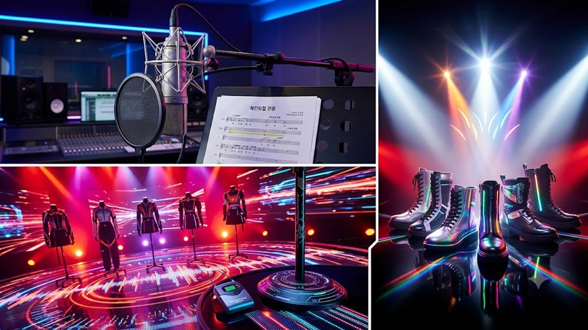

에스파 이후 무려 6년 만에 SM엔터테인먼트가 베일을 벗긴 차기 주자 소식에 K-POP 팬덤이 술렁이고 있어. 바로 오늘 공개된 **SM 신인 걸그룹 디어스** 비주얼 티저와 프로필 떡밥 때문인데, 보컬 명가 특유의 쫀쫀한 기본기에 트렌디한 감각까지 꽉 채워 나와서 첫날부터 체감 화제성이 장난 아니야.

## 베일 벗은 디어스 멤버 프로필과 핵심 포지션

### 보컬 명가 혈통 잇는 메인보컬의 탄탄한 발성
연습생 월말평가 때부터 알음알음 입소문 타던 보컬 자원이 메인보컬 마이크를 잡았어. 중저음 톤의 밀도가 워낙 묵직한 데다 진성과 가성을 매끄럽게 오가는 고음 테크닉이 안정적이라 첫 소절부터 귀를 확 사로잡지. 고난도 안무를 소화하면서도 음정이 흔들리지 않는 훈련량이 그대로 묻어나.

### 무대 중심 잡는 비주얼 센터와 퍼포먼스 라인
센터 포지션은 화려한 이목구비뿐 아니라 무대 위 시선 처리와 박자 쪼개기가 압권이야.
- **절도 있는 완급 조절**: 빠른 비트 속에서도 동작의 끝을 깔끔하게 맺는 춤선
- **카메라 장악력**: 킬링 파트마다 시선을 정확히 꽂아 넣는 몰입감
- **군무 밸런스**: 5인 대형에서 중심축 역할을 빈틈없이 수행하는 무게감

### 글로벌 무대 겨냥한 외국어 소통 역량
다국적 멤버 조합 덕분에 언어 장벽 없이 해외 프로모션을 바로 소화할 수 있는 세팅을 끝냈어. 영어와 일본어를 원어민 수준으로 구사하는 멤버들이 포진해 있어서 북미 쇼케이스나 현지 인터뷰에서도 통역 없이 팬들과 즉각적인 교감을 나눌 수 있지.

## 에스파 이후 넥스트 레벨을 증명할 음악 색채

### 네오함과 멜로디 훅을 결합한 비트 구조
단순히 귀를 때리는 강렬한 드럼 비트에 머물지 않고 몽환적인 신스 패드 위에 날렵한 베이스라인을 깔아 세련미를 끌어올렸어. 실험적인 전자음 텍스처를 과감하게 배치하면서도 대중적인 후렴구 멜로디를 살려 귀에 착 감겨. 소속사 선배들의 성공 발자취를 돌아보면 그룹 색채를 뚜렷하게 잡고 가는 전략은 늘 유효했지. 소녀시대 출신 배우의 묵직한 도전을 다룬 [임윤아 언내추럴 확정 원작 넘을까](/posts/entertainment/yoona-unnatural-korean-remake-casting-2026/) 사례처럼, 독보적인 정체성을 확립한 팀은 시장에서 오래 살아남는 법이야.

### 보컬 레이어링이 완성한 앙상블
단순히 파트를 잘게 쪼개는 대신 후렴구마다 3단 코러스 화음을 촘촘하게 쌓아 올렸어.
> "첫 타이틀곡의 정체성을 한 번에 각인시키고자 화음 녹음 세션에만 수십 시간을 쏟아부었다"

작곡진 인터뷰 내용처럼 개성 강한 음색들이 겹겹이 포개지면서 독특한 울림을 만들어내.

### 직캠 알고리즘 탈 만한 포인트 안무
손목 스냅과 골반 무빙을 정교하게 엮은 포인트 안무가 확실해. 숏폼 플랫폼 맞춤형 챌린지 구간이 직관적이라 데뷔 무대 직캠이 풀리면 자연스럽게 알고리즘을 탈 수밖에 없는 구조를 짰어.

## 감정과 연결에 집중한 새로운 세계관

### 현실 밀착형 미장센과 유기적 스토리텔링
에스파가 아바타와 가상 공간을 구축했다면, 디어스는 현실 속 결핍과 정서적 연결을 미장센으로 풀어내. 뮤직비디오 곳곳에 복선과 상징적인 오브제를 배치해 팬들이 자발적으로 해석본을 올리고 토론하게끔 유도하는 전략이 돋보여.

### 팬 참여 유도하는 인터랙티브 떡밥
티징 프로모션 단계부터 팬들이 공식 사이트의 히든 코드를 입력해야 새 티저가 해금되는 방식을 썼어. 콘텐츠를 일방적으로 소비하는 수준을 넘어 팬덤 스스로 단서를 추적하게 만들어 데뷔 전부터 끈끈한 몰입감을 형성했지.

### 온·오프라인 융합 브랜딩
- **숏폼 선공개**: 인스타그램 릴스와 틱톡을 통한 포인트 사운드 챌린지
- **아트워크 패키징**: 실물 소장 욕구를 자극하는 감각적인 앨범 그래픽
- **체험형 팝업 스토어**: 세계관 속 공간을 오프라인에 그대로 구현한 전시

## 5세대 걸그룹 판도를 뒤흔들 시장 파급력

### 음원 차트 진입과 글로벌 스트리밍 지표
음원 공개 첫날 멜론 TOP100 상위권 진입과 스포티파이 글로벌 데일리 차트 안착이 점쳐지고 있어. 글로벌 음원 유통망과 대형 팬덤의 화력이 초반부터 집중될 테니까. 팀의 체제를 바꾸며 새로운 모멘텀을 만드는 흐름은 [더보이즈 9인 재편 진짜 이유 3가지](/posts/entertainment/the-boyz-9-member-reorganization-truth-2026/) 이슈에서도 보듯 케이팝 씬의 핵심 관전 포인트인데, 대형 기획사의 정규 신인 론칭은 파급력의 규모 자체가 달라.

### 패션·뷰티 업계의 발 빠른 협업 러브콜
아직 정식 데뷔 무대에 오르기도 전인데 글로벌 뷰티 브랜드와 스트리트 패션 하우스 쪽에서 협찬 타진이 이어지고 있어. 비율 좋은 피지컬과 신선한 마스크를 동시에 갖춰 Z세대 타깃 브랜드들이 일찌감치 앰버서더 카드로 점찍는 모양새야.

### 사운드 디테일을 온전히 즐기기 위한 준비
이번 데뷔 앨범은 공간 음향 믹싱과 화음 레이어가 워낙 정교해서 디테일한 음색을 제대로 느끼려면 성능 좋은 헤드폰이나 이어폰을 갖추고 듣는 편이 훨씬 유리해.

[무선 노이즈캔슬링 블루투스 헤드폰 쿠팡에서 보기](https://www.coupang.com/np/search?q=%EB%AC%B4%EC%84%A0%EB%85%B8%EC%9D%B4%EC%A6%88%EC%BA%94%EC%8A%AC%EB%A7%81%ED%97%A4%EB%93%9C%ED%8F%B0&sourceType=affiliate&trackingCode=AF8691300)

#SM신인걸그룹 #디어스 #Dearus #디어스프로필 #SM차기걸그룹 #5세대걸그룹 #케이팝신인