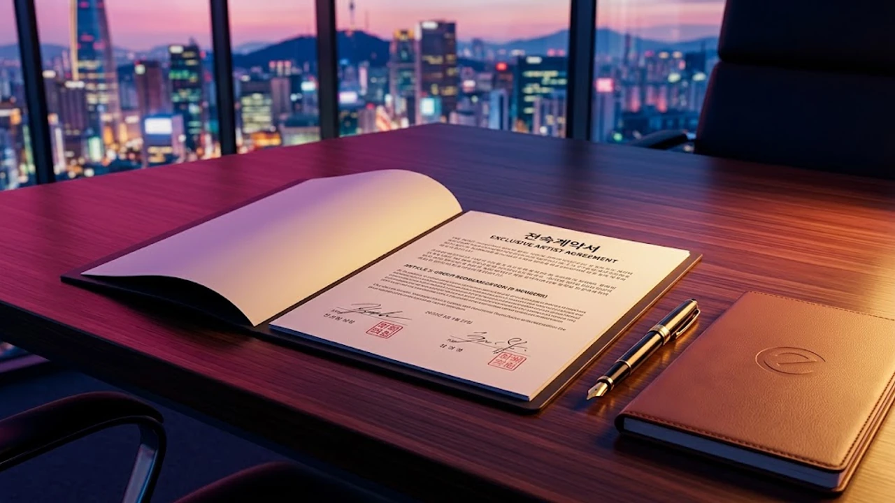

더보이즈 팬덤 사이에서 요즘 가장 뜨거운 감자는 단연 9인 체제 전환 소식이야. 새 기획사로 둥지를 틀며 전원 재계약 대신 일부 멤버의 홀로서기가 겹치자 커뮤니티가 발칵 뒤집혔거든. 그룹의 존속과 개별 아티스트 행보 사이에서 벌어진 물밑 조율을 핵심만 짚어봤어.

## 더보이즈 9인 체제 공식화와 새 둥지 이적 배경

### 전속계약 만료 후 9인 멤버의 선택
표준계약서 만료 시점이 다가오면서 업계 안팎에선 전원 잔류냐 단체 이적이냐를 두고 설왕설래가 이어졌어. 결과적으로 멤버 전원이 아닌 9명이 한 번에 새 기획사로 자리를 옮기는 파격 선택을 내렸지. 일부 멤버가 솔로 및 연기 전문 매니지먼트로 흩어지는 방식을 택하면서, 남은 멤버들은 '팀의 결속력 유지'를 최우선 가치로 내걸고 뭉친 셈이야.

### 소속사 이적 과정에서 드러난 팀 유지 조건
이적 협상 테이블에서 가장 치열하게 오간 조항은 팀 활동의 우선권 보장이었어. 이전부터 다인원 구조에서 발생하던 일정 조율 난항을 직접 겪어봤기 때문이지. 
> "팀 이름을 지키기 위해선 전원이 묶이는 것보다, 활동에 전념할 수 있는 이들이 안정적으로 뭉치는 편이 현실적이다."

업계 관계자들 사이에서 이런 현실론이 힘을 얻으면서 9인 체제 굳히기가 급물살을 탔어.

### 기존 활동 곡 지식재산권 협의 결과
아이돌 팀이 소속사를 통째로 옮길 때 최대 걸림돌은 팀명 상표권이야. 이번 합의 과정에선 전 소속사와의 분쟁을 피하고자 음원 발매 지분과 상표권 사용에 관한 완충안을 채택했어. 덕분에 과거 발매한 대표 타이틀 무대와 지식재산권을 큰 탈 없이 무대에서 선보일 수 있게 됐지.

## 멤버 개별 활동과 완전체 병행 시스템 전격 분석

### 연기·솔로 중심 개별 기획사 계약 구조 비교
타사로 적을 옮긴 멤버들은 음반 위주 일정보단 드라마 오디션과 개인 브랜딩에 집중하는 모양새야. 최근 솔로로 독자 노선을 탄 타 아이돌 케이스, 이를테면 [성한빈 솔로 데뷔, 진짜 통할까?](/posts/entertainment/sung-han-bin-solo-debut-analysis-2026/) 분석 사례처럼 개인의 잠재력을 극대화하려는 전략적 포지셔닝이지. 9인 멤버는 팀 활동 전담 계약을 맺음으로써 본진의 무대 완성도를 유지하는 데 온 힘을 쏟고 있어.

### 그룹 전담 레이블 체제가 갖는 차별화된 강점
새 둥지는 더보이즈 중심 기획사라 봐도 무방할 만큼 리소스를 집중 투입하고 있어. 의사결정 단계가 복잡했던 과거와 달리 컴백 주기나 콘셉트 결정 속도가 확실히 빨라졌지. 
- **기획 승인 기간 단축**: 앨범 제작 회의에서 실행까지 걸리는 시간 대폭 축소
- **전담 퍼포먼스 팀 배정**: 메인 댄서 라인의 안무 메이킹 자율권 보장
- **해외 프로모션 독점 지원**: 권역별 투어 기획의 직접 주도

### 팬덤이 체감할 스케줄 조율 및 활동 주기 변화
인원이 줄어든 만큼 보컬 파트 분배와 무대 동선 효율성은 전보다 훨씬 명확해졌어. 이전에는 11명의 개인 스케줄을 맞추느라 컴백 공백기가 길어졌다면, 이제는 고정된 9인을 축으로 앨범 발매 텀을 6개월 안쪽으로 당길 여력이 생긴 거야.

## 9인 재편 속 숨겨진 음반 및 글로벌 투어 계획

### 하반기 컴백 타이틀 콘셉트 변화 전망
이번 개편을 거치며 음악적 색채도 한층 성숙해진 톤을 잡았어. 소년미를 앞세우던 초기 서사에서 벗어나 힙합 비트 기반의 다크한 무드로 무게중심을 옮기는 중이지. 보컬 라인의 고음 파트와 래퍼 라인의 딕션이 빈틈없이 맞물려 곡의 몰입감을 끌어올렸어.

### 해외 팬미팅 및 월드투어 추진 타임라인
국내 활동 직후 이어질 해외 투어 일정표도 촘촘해. 일본 5개 도시 아레나 투어를 시작으로 북미와 동남아 주요 거점 도시를 순회하는 로드맵이 이미 짜였어. 현지 팬덤의 결속력을 테스트하는 첫 번째 시험대가 될 전망이야.

### 음원 차트 및 글로벌 스트리밍 영향력 예측
국내 음원 차트 실시간 진입 여부도 관전 포인트야. 팬덤 스트리밍 화력뿐 아니라 해외 스포티파이 월간 청취자 수 추이가 9인 체제의 흥행 성패를 가를 객관적 지표로 작용할 테니까.

## 팬덤 반응과 장기적 아티스트 지속가능성 평가

### 9인 지지 팬덤의 주요 반응과 커뮤니티 여론
갑작스러운 인원 변동에 초기엔 아쉬움 섞인 목소리가 컸지만, 지금은 팀 존속을 택한 9인을 향한 지지세가 결집하는 분위기야. "팀이 공중분해되지 않고 무대를 지켜준 것만으로도 고맙다"는 현실적 응원이 지배적이지.

### 다인원 아이돌 분리 매니지먼트의 구조적 한계와 극복 과제
독자 노선을 걷는 멤버들과의 완전체 협업은 여전히 숙제로 남아있어. 그룹 음반 피처링이나 연말 특별 무대 참여 같은 유연한 방식이 가동되지 않는다면, 완전체라는 상징성은 점차 흐려질 수밖에 없어.

### 더보이즈 2막이 K-POP 업계에 던진 이적 모델 시사점
7년 징크스를 넘어 팀 브랜드를 유지한 채 단체 이적을 성공시킨 이번 사례는 가요계 전반에 새로운 이정표를 남겼어. 무작정 흩어지는 해체 대신 뜻이 맞는 멤버들끼리 팀을 재정비해 2막을 여는 실리적 생존 모델을 입증했기 때문이지.

[더보이즈 공식 앨범 및 응원봉 기획전 확인하기](https://www.coupang.com/np/search?q=%EB%8D%94%EB%B3%B4%EC%9D%B4%EC%8A%88&sourceType=affiliate&trackingCode=AF8691300)

#더보이즈 #THEBOYZ #더보이즈9인 #더보이즈이적 #아이돌재계약 #세븐에잇레코즈 #더보이즈컴백 #케이팝트렌드