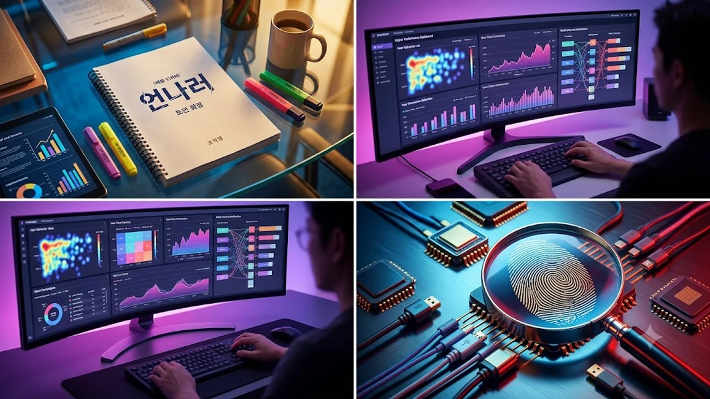

드디어 올 게 왔어. 일드 역사상 손꼽히는 명작으로 불리는 작품이 한국에서 다시 태어난다는 소식에 드라마 커뮤니티가 발칵 뒤집혔거든. 그 주인공 자리에 배우 임윤아 언내추럴 캐스팅 소식이 확정되면서 팬들 사이에서 기대와 걱정이 동시에 터져 나오는 중이야.


## 일본 레전드 수사물 '언내추럴' 한국판 제작 확정

### 미스미 미코토 역 임윤아 캐스팅이 갖는 상징성
주인공 미스미 미코토는 억울한 죽음 뒤에 숨은 진실을 끝까지 파헤치는 부검의야. 임윤아가 맡게 될 이 역할은 단순한 정의감만으로 움직이는 흔한 수사관이 아니라, 어린 시절 겪은 거대한 비극을 가슴에 묻고 묵묵히 법의학에 매진하는 인물이지. 냉철하면서도 인간에 대한 따뜻한 시선을 잃지 않아야 해서 웬만한 연기 내공 없이는 소화하기 어려운 캐릭터로 꼽혀.

### 일본 TBS 원작이 아시아 전역에서 남긴 독보적 위상
2018년 일본 TBS에서 방영된 원작은 노기 아키코 각본과 이시하라 사토미의 열연이 맞물려 현지는 물론 한국에서도 엄청난 마니아층을 모았어. 자```markdown
## 디지털 퍼포먼스 마케팅 데이터 파이프라인 개요

현대 퍼포먼스 마케팅의 성패는 수집되는 데이터의 정합성과 파이프라인의 안정성에 달려 있습니다. 단순히 광고 관리자 화면의 수치만을 확인하는 단계를 넘어 웹과 앱 전반의 유저 행동 이벤트를 정밀하게 추적하는 체계가 필수적입니다.

* **서드파티 쿠키 제한 대응**: 브라우저 정책 변화에 맞춰 서버사이드 트래킹(Server-side GTM) 및 Conversions API 연동 필수화
* **전환 신호 표준화**: 페이지뷰, 리드 제출, 상담 신청, 장바구니 담기 등 핵심 퍼널별 이벤트 명칭 일원화
* **데이터 정합성 검증**: 중복 이벤트 전송 방지 및 세션 기반 데이터 무결성 주기적 모니터링

## 검색 엔진 및 생성형 검색(GEO) 최적화 전략

기존의 키워드 중심 SEO에서 AI 기반 답변 엔진(GEO: Generative Engine Optimization)을 고려한 구조화 데이터 최적화로 영역이 확장되고 있습니다. 크롤러가 사이트 구조와 콘텐츠 의도를 명확히 해석할 수 있도록 설계해야 합니다.

* **Schema.org 마크업 적용**: LocalBusiness, FAQPage, Article 스키마를 활용한 풍부한 검색 결과(Rich Snippet) 유도
* **엔티티 기반 콘텐츠 구조화**: 단순 키워드 반복 지양, 주제와 관련된 상위/하위 개념의 체계적 서술
* **기술적 SEO 유지관리**: 코어 웹 바이탈(LCP, CLS, INP) 개선 및 모바일 렌더링 속도 최적화

## 퍼널 단계별 전환율 극대화 프레임워크

유입된 트래픽을 실제 전환으로 연결하기 위해서는 랜딩 페이지 내 사용자 경험과 이탈 지점 분석이 유기적으로 연결되어야 합니다. 마이크로 전환을 설계하여 병목 구간을 빠르게 진단합니다.

1. **상위 퍼널(인지/탐색)**: 직관적인 헤드카피와 신뢰 지표(후기, 누적 수치, 인증 내역) 배치
2. **중위 퍼널(고려/비교)**: 서비스 특장점 시각화, FAQ 섹션을 통한 잠재적 불안 요소 제거
3. **하위 퍼널(행동/전환)**: 입력 폼 간소화, CTA 버튼의 시각적 강조 및 모바일 입력 최적화

## 자동화 워크플로우를 통한 리포팅 효율화

반복적인 수작업 리포팅을 제거하고 성과 이상치를 즉각 감지하기 위해 자동화된 데이터 수집 및 알림 환경을 구축합니다.

* **데이터 추출 자동화**: 광고 매체 API와 웹로그 데이터를 n8n 등 워크플로우 도구로 정기 연동
* **실시간 이상 감지**: 특정 캠페인의 CPA 급증이나 CVR 급락 발생 시 메신저 자동 웹훅 알림 전송
* **시각화 대시보드 단일화**: Looker Studio를 연계한 주요 KPI 일간/주간 자동 갱신 체계 구축