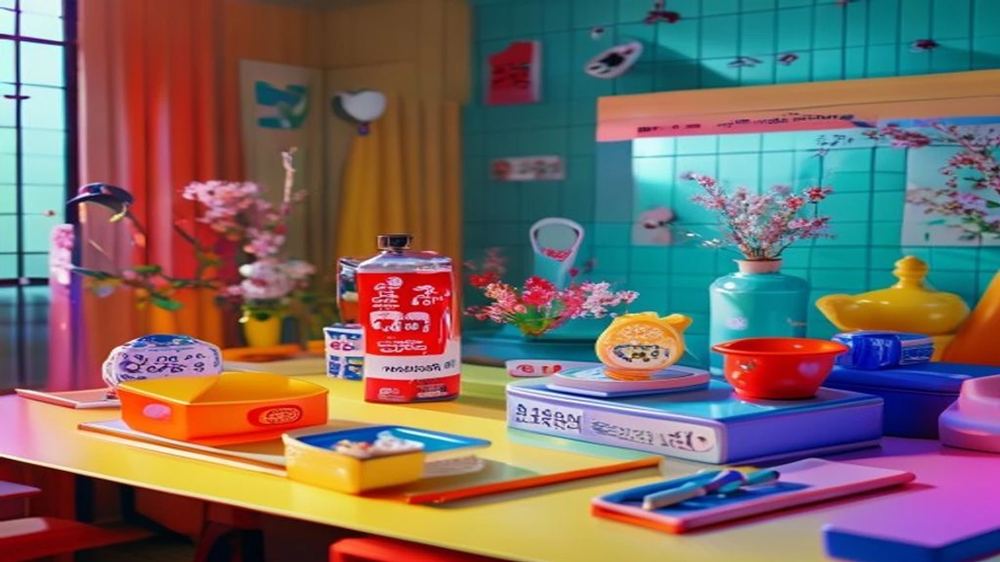

2026년 7월 27일, 팬들이 그토록 기다리던 DAY6 영케이의 솔로 정규 2집 《YOUNGEST》가 마침내 베일을 벗었어. 이번 앨범은 **영케이 YOUNGEST**라는 타이틀에 걸맞게 그가 가진 음악적 자산을 쏟아부은 역대급 명반이라 할 수 있지. 올여름 가요계에 진짜 대형 폭탄이 떨어진 셈인데, 대체 이번 신보에 어떤 독보적인 매력이 담겼는지 핵심만 딱 짚어줄게.

## 영케이 정규 2집 YOUNGEST 발매와 주요 성과

### 2026년 7월 27일 신보 발매의 의미
솔로 아티스트로서 영케이가 돌아온 건 진짜 반가운 소식이야. 이번 정규 2집은 그동안 쌓아온 음악적 내공을 유감없이 발휘한 결정판이라 봐도 무방해. 앨범명 《YOUNGEST》부터 느껴지는 강렬한 에너지와 디테일한 프로듀싱이 인상적인데, 리스너들 사이에서는 벌써부터 "믿고 듣는 영케이"라는 찬사가 쏟아지는 중이지.

### 음원 차트 및 글로벌 팬덤 초기 반응
발매 직후 주요 음원 차트 상위권에 속속 진입하면서 무서운 상승세를 보여주고 있어. 국내외 팬덤의 반응은 그야말로 폭발적이야. 각종 SNS와 커뮤니티에서는 타이틀곡 가사 분석부터 멜로디 라인에 대한 호평이 자자한데, 글로벌 K팝 팬들까지 합세하면서 실시간 트렌드를 싹 쓸어버렸어.

### 싱어송라이터로서 한층 깊어진 트랙리스트 구성
이번 앨범 트랙리스트를 보면 작사, 작곡에 참여한 영케이의 지분이 어마어마해. 전곡이 하나의 완벽한 서사처럼 연결되어 있어서 앨범 전체를 통으로 들어야 진가를 느낄 수 있어. 단순히 노래를 잘 부르는 것에 그치지 않고, 곡마다 담긴 감정선이 깊어져서 듣는 내내 소름이 돋을 정도라니까.

## 솔로 아티스트 영케이의 음악적 세계관 비교

### DAY6 그룹 활동과 솔로 앨범의 스펙트럼 차이
데이식스 안에서의 영케이가 강렬한 밴드 사운드의 중심축이었다면, 솔로 영케이는 훨씬 보컬 고유의 색깔에 집중하는 모습을 보여줘. 그룹의 색깔을 잃지 않으면서도 온전히 혼자만의 목소리로 무대를 채우는 능력은 진짜 말 다 했지. 이번 신보를 들으면 그룹 활동 때와는 또 다른 반전 매력을 확실히 느낄 수 있어.

### 이전 솔로 음반 대비 발전된 작사·작곡 참여도
전작들과 비교했을 때 사운드의 완성도나 메시지의 깊이가 완전히 다른 차원이야. 솔직히 말해서 연예계 이슈를 볼 때마다 [손예진 현빈 가족 여행, 진짜 소름 돋는 패션 정보 완전 정리](/posts/entertainment/son-ye-jin-hyun-bin-family-trip-2026/)처럼 화려한 스타성도 눈에 띄지만, 영케이처럼 오롯이 아티스트 본인의 실력으로 증명하는 케이스는 또 색다른 감동을 주잖아? 본인이 직접 경험하고 느낀 감정들을 가사에 섬세하게 녹여내서 가슴에 팍 와닿는 구절이 정말 많아.

> "청춘의 한가운데서 써 내려간 영케이만의 솔직한 솔로 서사"

### 보컬 톤과 밴드 사운드의 완성도 높은 결합
풍성한 악기 세션 위로 얹어지는 영케이의 음색은 진짜 독보적이야. 진성과 가성을 자유롭게 오가는 보컬 테크닉은 기본이고, 곡의 분위기에 따라 완급 조절을 하는 감정선이 완벽에 가까워. 락 사운드부터 팝적인 감성까지 다채롭게 넘나들어서 지루할 틈이 전혀 없어.

## 타이틀곡 및 트랙별 핵심 감상 포인트 3가지

### 1. 한층 넓어진 음악적 장르와 멜로디라인
첫 번째 관전 포인트는 기존 틀을 깨부수고 도전한 장르적 스펙트럼이야. 캐치한 플럭 사운드와 리드미컬한 기타 리프가 어우러져 한 번 들으면 귀에 착 감기는 중독성을 자랑해. 멜로디의 전개가 예측 불가능하면서도 기승전결이 확실해서 듣는 재미가 쏠쏠해.

### 2. 진정성이 돋보이는 영케이표 메시지 분석
두 번째는 가사에 담긴 청춘과 삶에 대한 고민이야. 위로와 공감을 전하는 영케이 특유의 노랫말은 이번에도 빛을 발하고 있어. 거창한 수식어 없이도 마음을 울리는 단어 조합들이 많아서 가사집을 따로 읽어보는 것도 강추해.

### 3. 라이브 무대 및 방송 활동 관전 포인트
세 번째는 단연 무대 위에서의 라이브 퍼포먼스지. 핸드마이크를 잡고 에너지 넘치게 무대를 누비는 영케이의 실물 라이브는 음원 그 이상을 보여주니까 말이야. 무대 매너와 탄탄한 성량이 어우러져 보면서도 탄성이 절로 나올 수밖에 없어.

## 팬들과 대중이 신보를 200% 즐기는 가이드

### 음원 스트리밍 및 공식 뮤직비디오 감상 팁
이번 뮤직비디오는 감각적인 영상미와 감성적인 스토리라인이 일품이야. 시각적 요소와 음악이 딱 맞아떨어져서 스토리를 추측하며 보는 재미가 있어. 뮤직비디오 속 숨겨진 오마주나 메시지들을 찾아내면서 감상하면 더 깊게 몰입할 수 있지.

### 향후 방송 출연 및 음악 방송 활동 스케줄
이번 컴백을 기점으로 다양한 예능 프로그램과 음악 방송 출연이 예정되어 있어. 라디오 DJ 경험도 풍부한 만큼 각종 콘텐츠에서 보여줄 화려한 입담도 완전 기대되는 부분이야. 혹시 다른 핫한 엔터 소식이 궁금하다면 [연예이슈 전체 글 보기](/posts/entertainment/)를 통해서 최신 트렌드를 확인해보는 것도 좋아.

### 실물 앨범 구성품과 시각적 콘셉트 요약
* **포토북 패키지:** 아티스트의 다채로운 콘셉트 화보가 풍성하게 수록됨
* **포토카드 및 특전:** 팬들의 소장 욕구를 자극하는 미공개 셀카 카드 포함
* **디자인 콘셉트:** Y2K 감성과 현대적인 모던함이 자연스럽게 결합된 아트워크

실물 앨범 패키지 디테일도 엄청 신경 쓴 게 딱 보여. 앨범 콘셉트 아트워크부터 포토북에 담긴 비주얼까지 완성도가 높아서 소장 가치는 충분하다고 봐. 올여름을 뜨겁게 달굴 영케이의 신보와 함께 특별한 감성을 한껏 느껴보길 바라!

#영케이 #YOUNGEST #영케이컴백 #DAY6영케이 #영케이정규2집 #DAY6 #Kpop신곡 #영케이타이틀곡 #음원차트 #영케이라이브